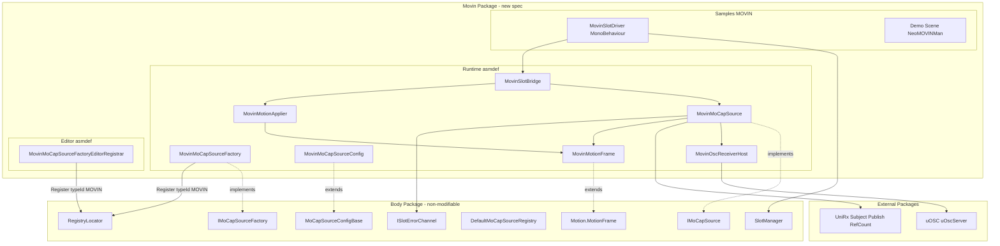
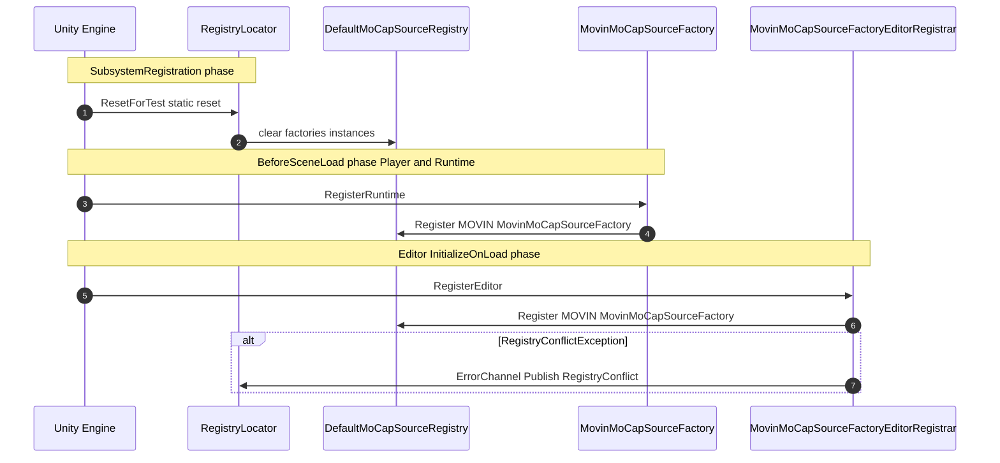
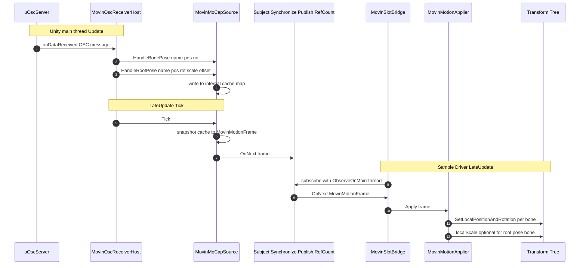
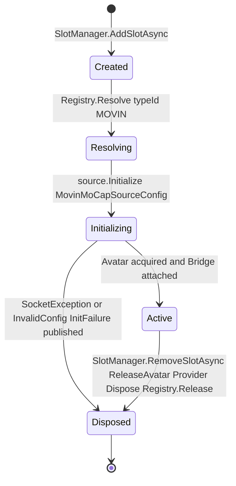

# Design Document

## Overview

**Purpose**: 本 spec は MOVIN Studio から VMC 互換 OSC over UDP で送出されるモーションデータを、Unity の **Generic リグ Transform ツリー** に対して name 一致で直接書き込むランタイムを、本体パッケージ `jp.co.unvgi.realtimeavatarcontroller` を一切改変せずに新規外部 UPM パッケージ `jp.co.unvgi.realtimeavatarcontroller.movin` として提供する。

**Users**: VTuber 配信者・モーションアクター・統合開発者が、SlotSettings の `MoCapSourceDescriptor.SourceTypeId="MOVIN"` を選択するだけで MOVIN Studio (デフォルトポート 11235) からのライブモーションを `NeoMOVINMan` のような非 Humanoid キャラクタに適用できる。

**Impact**: 既存 typeId="VMC" (EVMC4U / Humanoid 経路) と並行稼動する形で `IMoCapSourceRegistry` に MOVIN typeId が追加される。本体パッケージ・既存 VMC 実装は無改変。

### Goals

- 本体非改変の制約下で `IMoCapSource` / `IMoCapSourceFactory` / `MoCapSourceConfigBase` 拡張点を介して MOVIN を統合する。
- Source → MotionFrame → Applier の 3 要素を本パッケージ内で完結させる (Humanoid 経路に依存しない)。
- `manifest.json` に本パッケージを追加するだけで typeId="MOVIN" が `RegistryLocator.MoCapSourceRegistry` に自動登録される (Runtime / Editor 二経路)。
- 既存 typeId="VMC" Slot との同一プロセス・同一シーン並行稼動。
- `Samples~/MOVIN` で 1 シーン再生による MOVIN Studio → Unity の動作確認を可能にする。

### Non-Goals

- Humanoid リターゲット経路 (`HumanoidMotionApplier` / `HumanoidMotionFrame`) のサポート。
- 本体 `mocap-vmc` 実装 (typeId="VMC") の流用・差し替え・改変。
- 表情 (Blend) / カメラ / HMD / Controller / Tracker 系 OSC アドレスの処理。
- MOVIN Studio 送信側の設定自動化。
- VRM 0.x / 1.x ベースの Humanoid アバター対応。
- `com.hidano.uosc` の `bindAddress` 公開要求や本体への upstream 機能追加。

## Boundary Commitments

### This Spec Owns

- 新規 UPM パッケージ `jp.co.unvgi.realtimeavatarcontroller.movin` の構造一式 (`package.json` / Runtime asmdef / Editor asmdef / Tests asmdef / `Samples~/MOVIN`)。
- `MovinMoCapSource` (Pure C# クラス, `IMoCapSource` 実装) と内部 `MovinOscReceiverHost` (MonoBehaviour) の実装。
- `MovinMoCapSourceFactory` (`IMoCapSourceFactory` 実装) と Runtime / Editor 二経路の属性ベース自己登録。
- `MovinMoCapSourceConfig` (`MoCapSourceConfigBase` 派生 ScriptableObject)。
- `MovinMotionFrame` (本パッケージ独自 `Motion.MotionFrame` 派生具象, SkeletonType=Generic)。
- `MovinMotionApplier` (本パッケージ独自 API, 本体 `IMotionApplier` 非実装)。
- Sample `Samples~/MOVIN/Runtime/MovinSlotDriver.cs` (MOVIN 専用 Pipeline 駆動 MonoBehaviour) およびデモシーン。
- 本パッケージスコープの EditMode / PlayMode テスト一式。

### Out of Boundary

- 本体パッケージ `jp.co.unvgi.realtimeavatarcontroller` の任意ファイル改変 (拡張点経由のみ参照する)。
- 本体 `MotionFrame` 階層 (`Core.MotionFrame` / `Motion.MotionFrame` / `Generic` / `Humanoid`) の改変。
- 本体 `HumanoidMotionApplier` / `MotionCache` / `IMotionApplier` への新メソッド追加。
- typeId="VMC" Factory / Source / Config の差し替え。
- 本体 Sample (`Samples~/UI`) への MOVIN 関連コード追加。
- `com.hidano.uosc` への新機能追加要求。
- 本パッケージとは無関係な OSC アドレス (Blend / Cam / HMD / Tracker) の処理。

### Allowed Dependencies

- 本体パッケージ asmdef (name 参照): `RealtimeAvatarController.Core`, `RealtimeAvatarController.Motion`。
- 外部パッケージ: `com.hidano.uosc` (asmdef name `uOSC.Runtime`)。
- UniRx (asmdef name `UniRx`)。
- UnityEngine / UnityEditor (Editor asmdef のみ)。
- 本体型のうち参照可能なもの: `IMoCapSource`, `IMoCapSourceFactory`, `MoCapSourceConfigBase`, `MoCapSourceDescriptor`, `MotionFrame` (Core), `MotionFrame` (Motion), `SkeletonType`, `RegistryLocator`, `RegistryConflictException`, `SlotError`, `SlotErrorCategory`, `ISlotErrorChannel`, `SlotManager.TryGetSlotResources` (Sample のみ)。
- 参照禁止: `RealtimeAvatarController.MoCap.VMC` 名前空間の任意の型 (要件 11-6)、`HumanoidMotionFrame`, `HumanoidMotionApplier`, `EVMC4U.*`, `EVMC4USharedReceiver`。

### Revalidation Triggers

- 本体 `IMoCapSource` / `IMoCapSourceFactory` / `MoCapSourceConfigBase` / `MoCapSourceDescriptor` / `RegistryLocator` の API シグネチャ変更。
- 本体 `Motion.MotionFrame` のコンストラクタシグネチャまたは `Timestamp` 仕様変更。
- 本体 `SlotErrorCategory` 列挙の renumber / rename / 削除 (`VmcReceive` / `InitFailure` / `RegistryConflict` を参照)。
- 本体 `SlotManager.TryGetSlotResources` の戻り値仕様変更 (Sample 駆動が依存)。
- `com.hidano.uosc` メジャーバージョンアップ (`uOscServer.onDataReceived` のスレッドモデル / `port` プロパティ / `StartServer` `StopServer` 仕様変更)。
- VMC プロトコル v2.x 上位拡張で `/VMC/Ext/Root/Pos` 引数長の互換性が破綻した場合。
- 本パッケージ MOVIN typeId 文字列 (`"MOVIN"`) の変更。
- 本体側に汎用 `GenericMotionPipeline` / 非 Humanoid 用 `IMotionApplier` 拡張点が追加された場合 (`MovinSlotBridge` の本体 Pipeline 移行可否を再評価, D-4 参照)。

## Design Decisions (Confirmed)

設計レビュー (`/kiro:validate-design mocap-movin`) で挙がった 4 つのオープン質問について、以下の方針で確定する。これらは MVP 期間中の動作仕様として固定し、変更時は本 spec の Revalidation を伴う。

### D-1: `MovinMoCapSourceConfig.bindAddress` は情報フィールド扱い (Q1 帰結)

- **決定**: `com.hidano.uosc` 1.0.0 の `uOscServer` は `bindAddress` を公開していないため、`MovinMoCapSourceConfig.bindAddress` は **情報フィールド** として保持し、実際の bind は全インターフェース (`0.0.0.0`) に対して行う。
- **要件整合**: 要件 4-2 の「bindAddress を保持」は満たすが「bindAddress を実 bind に反映」までは保証しない。要件 4-2 のテキストは現行設計の制約に整合する形で解釈する。
- **UX 対応**: Inspector に `[Tooltip]` を付与して「uOSC 1.0.0 では参照のみ。実 bind は全インターフェース。」と明記する (D-5 参照)。
- **将来**: `com.hidano.uosc` メジャーバージョンアップで `bindAddress` が公開された際に再評価 (Revalidation Triggers に既登録)。

### D-2: `SlotErrorCategory.VmcReceive` を OSC 系受信エラー全般として意味拡張 (Q2 帰結)

- **決定**: 本体パッケージ非改変制約下で新規 `SlotErrorCategory` 列挙値の追加が不可能なため、`VmcReceive` を「OSC/VMC 系受信エラー全般 (MOVIN typeId 含む)」として運用する。
- **運用周知**: 本パッケージ `README.md` に「`SlotErrorCategory.VmcReceive` は MOVIN typeId からも発行される」を明記。`SlotError.SlotId` フィールドに **`MovinMoCapSourceFactory.MovinSourceTypeId` ("MOVIN") を含めて発行** することで監視側が typeId を識別可能にする (Error Strategy 節で詳細)。
- **将来**: 本体側で `OscReceive` 等の専用カテゴリが追加された場合は本 spec の Revalidation Trigger として再評価する (Revalidation Triggers に既登録)。

### D-3: 並行稼働 Sample (`SlotManagerBehaviour` + MOVIN Driver 同居) は MVP 範囲外 (Q3 帰結)

- **決定**: MVP では MOVIN 専用 Driver の単独運用 Sample (`Samples~/MOVIN/Scenes/MOVINSampleScene.unity`) のみ提供する。要件 14-4 (port 独立な並行稼動保証) は OSC port が異なれば技術的に保証されるため、Sample レベルでの demo 提供は必須でない。
- **将来**: VMC + MOVIN 並行稼働 Demo の追加は Future Work として `CHANGELOG.md` に記録する。

### D-4: `MovinSlotBridge` は Runtime asmdef に `public sealed class` で配置 (Q4 帰結)

- **決定**: `MovinSlotBridge` は `Runtime/MovinSlotBridge.cs` に `public sealed class` として配置する。本体の Pipeline (`MotionCache` 等) は Humanoid 前提のため使用せず、本 spec が独自 Pipeline を Runtime API として公開する。
- **理由**: 要件 1-6 (manifest 追加だけで MOVIN typeId が動作)・要件 9-2 (Bridge 提供責務)・要件 11-1 (Runtime 名前空間) が「本パッケージ Runtime 内の API 提供」を要求しているため。Sample 限定にすると import しないユーザーが Pipeline を自前実装する必要があり利便性が低下する。
- **API 安定性**: `MovinSlotBridge` のコンストラクタ / `Dispose` シグネチャは MVP 期間中 freeze する。本体側に汎用 `GenericMotionPipeline` 等が将来追加された際の追随は本パッケージのメジャーバージョンアップで対応する (Revalidation Triggers に追加)。

## Architecture

### Existing Architecture Analysis

本体パッケージは以下の拡張点を完成形で公開している:

- **typeId による登録経路**: `RegistryLocator.MoCapSourceRegistry.Register(typeId, factory)` で文字列 typeId をキーに Factory を登録。
- **Descriptor ベース解決**: `MoCapSourceDescriptor { SourceTypeId, Config }` を `Resolve()` に渡すと参照カウント付きで `IMoCapSource` インスタンスが返る。
- **属性ベース自己登録パターン**: `[RuntimeInitializeOnLoadMethod(BeforeSceneLoad)]` (Runtime) + `[InitializeOnLoadMethod]` (Editor) の二経路が `RegistryLocator` の docstring サンプルで規定。
- **SubsystemRegistration での先行リセット**: `RegistryLocator.ResetForTest()` が Domain Reload OFF 環境でも `BeforeSceneLoad` より前に実行されるため、Factory 側で二重登録回避を追加実装する必要が無い。
- **エラー通知経路**: `RegistryLocator.ErrorChannel.Publish(SlotError(...))` で `SlotErrorCategory` を伝える。`VmcReceive` カテゴリは「OSC/VMC 系受信エラー全般」として意味拡張する (要件 10-5)。
- **Slot 結線**: `SlotManager.AddSlotAsync(SlotSettings)` で内部的に `Resolve` → `Initialize(config)` → Avatar 取得 → `Active` 遷移。Sample 側は `TryGetSlotResources(slotId, out source, out avatar)` で結線する。

本 spec はこのパターンを完全にミラーし、`mocap-vmc` 実装 (Runtime + Editor の二ファイル分離 / EVMC4USharedReceiver / Subject.Synchronize().Publish().RefCount() の Hot Observable) を**コードレベルで共有せず**にデザインパターンレベルで踏襲する (要件 11-6)。

### Architecture Pattern & Boundary Map



**Architecture Integration**:

- **Selected pattern**: Adapter + Self-Registering Factory + Pure C# Source with internal MonoBehaviour Host。本体 `mocap-vmc` のレイアウトを名称・ファイル分割の両方で踏襲する。
- **Domain/feature boundaries**: Source/Frame/Applier/Host を本パッケージ内に閉じる。本体側は `IMoCapSource` 契約と `RegistryLocator` 経由の登録だけが boundary 接点。Sample から本体 `SlotManager` へは `TryGetSlotResources` のみ依存。
- **Existing patterns preserved**:
  - `[RuntimeInitializeOnLoadMethod(BeforeSceneLoad)]` + Editor 別ファイル `[InitializeOnLoadMethod]` 二経路自己登録。
  - `Subject.Synchronize().Publish().RefCount()` Hot Observable 化 (本体 `EVMC4UMoCapSource` と同形)。
  - `[RuntimeInitializeOnLoadMethod(SubsystemRegistration)]` での共有ホスト static リセット。
  - Tick 内例外を try/catch して `ISlotErrorChannel.Publish` で集約 (`OnError` 不発行)。
- **New components rationale**:
  - `MovinOscReceiverHost`: uOSC `uOscServer` を抱える内部 MonoBehaviour。`uOscServer.autoStart=false` + `StopServer/StartServer` で明示的 bind/unbind。
  - `MovinMotionFrame`: Generic 直書き向け bone Transform 辞書 + Root pose を保持するイミュータブル具象。
  - `MovinMotionApplier`: name 一致テーブル + boneClass フィルタ + `SetLocalPositionAndRotation` 直書き。
  - `MovinSlotBridge`: Pure C# Pipeline (購読 → snapshot → Applier 駆動)。Sample MonoBehaviour と Runtime API を分離。
- **Steering compliance**: 本リポジトリには `.kiro/steering/` ディレクトリが存在しないため、CLAUDE.md の制約 (本体 Unity 6000.3.10f1 / 本体パッケージ非改変 / 既存 VMC 実装の構成踏襲) と requirements.md の制約に整合させる。

### Technology Stack

| Layer | Choice / Version | Role in Feature | Notes |
|-------|------------------|-----------------|-------|
| Runtime / Unity | Unity 6000.3.10f1 (`unity="6000.3"`) | パッケージ実行環境 | 本体パッケージと同バージョン固定。 |
| Network / OSC | `com.hidano.uosc` 1.0.0 | UDP/OSC バインドおよび受信パース。`uOscServer` を Host MonoBehaviour に AddComponent。`onDataReceived` がメインスレッド発火 (uOSC 内部 Update→Dequeue) する仕様を前提とする。 | 本体パッケージとも共通。`bindAddress` は非公開のため `MovinMoCapSourceConfig.bindAddress` は情報フィールド扱い。 |
| Reactive | UniRx 7.1.0 | `Subject<MotionFrame>.Synchronize().Publish().RefCount()` で Hot Observable 化。Sample 駆動側で `.ObserveOnMainThread()` 同期。 | 本体パッケージ EVMC4UMoCapSource と同形。 |
| Async / 補助 | UniTask 2.5.10 | Sample 駆動側の必要最小限。Runtime 本体は UniTask に依存しない (`SlotManager.AddSlotAsync` の呼び出しは Sample MonoBehaviour 範囲)。 | Runtime asmdef は UniTask を直接参照しない。 |
| Editor 統合 | UnityEditor (asmdef Editor 限定) | `[InitializeOnLoadMethod]` での Editor 起動時 typeId="MOVIN" 登録のみ。Custom Inspector は提供しない (本体 Sample `SlotSettingsEditor` が `GetRegisteredTypeIds()` で MOVIN を動的列挙する)。 | Editor asmdef `RealtimeAvatarController.MoCap.Movin.Editor`。 |

## File Structure Plan

### Directory Structure

```
RealtimeAvatarController/Packages/com.hidano.realtimeavatarcontroller.movin/
├── package.json                                # Package manifest (jp.co.unvgi.realtimeavatarcontroller.movin)
├── README.md                                   # 利用手順, MOVIN Studio 設定, port=11235, Sample import
├── CHANGELOG.md
├── Runtime/
│   ├── RealtimeAvatarController.MoCap.Movin.asmdef
│   ├── AssemblyInfo.cs                         # InternalsVisibleTo("...Tests.EditMode"/"...Tests.PlayMode")
│   ├── MovinMoCapSource.cs                     # IMoCapSource 実装 (Pure C#)
│   ├── MovinMoCapSourceFactory.cs              # IMoCapSourceFactory 実装 + Runtime 自己登録
│   ├── MovinMoCapSourceConfig.cs               # MoCapSourceConfigBase 派生 SO
│   ├── MovinMotionFrame.cs                     # Motion.MotionFrame 派生 (SkeletonType=Generic)
│   ├── MovinMotionApplier.cs                   # Generic Transform 直接書き込み
│   ├── MovinSlotBridge.cs                      # Source/Applier 結線 (Pure C# Pipeline)
│   ├── MovinOscReceiverHost.cs                 # uOscServer ホスト用内部 MonoBehaviour
│   └── MovinBoneTable.cs                       # Avatar 階層から name->Transform 辞書を構築 (Applier 補助)
├── Editor/
│   ├── RealtimeAvatarController.MoCap.Movin.Editor.asmdef
│   └── MovinMoCapSourceFactoryEditorRegistrar.cs  # Editor 起動時 typeId=MOVIN 登録 (本体 VMC と同形)
├── Tests/
│   ├── EditMode/
│   │   ├── RealtimeAvatarController.MoCap.Movin.Tests.EditMode.asmdef
│   │   ├── MovinMoCapSourceConfigTests.cs       # キャスト成功 / 不一致 ArgumentException
│   │   ├── MovinMoCapSourceFactoryTests.cs      # Create / 不正 Config / typeId 自己登録結果
│   │   └── MovinSelfRegistrationTests.cs        # GetRegisteredTypeIds に "MOVIN"
│   └── PlayMode/
│       ├── RealtimeAvatarController.MoCap.Movin.Tests.PlayMode.asmdef
│       ├── MovinMotionApplierTests.cs           # name 一致テーブル / SetLocalPositionAndRotation
│       ├── MovinBoneClassFilterTests.cs         # boneClass プレフィックスフィルタ
│       └── MovinSourceObservableTests.cs        # MotionStream 発行 (テストハーネス注入)
└── Samples~/
    └── MOVIN/
        ├── Runtime/
        │   ├── MovinSlotDriver.cs               # Sample 用 MonoBehaviour (SlotManager + Bridge を駆動)
        │   └── MovinSampleSlotSettings.asset    # SlotSettings (typeId="MOVIN")
        ├── Configs/
        │   └── MovinMoCapSourceConfig.asset     # port=11235 既定
        ├── Scenes/
        │   └── MOVINSampleScene.unity           # NeoMOVINMan + Driver
        └── Prefabs/
            └── NeoMOVINMan_Unity.prefab         # 既存サンプル prefab を Samples 配下にコピー
```

### Modified Files

- なし。本体パッケージ `Packages/com.hidano.realtimeavatarcontroller/**` および既存 `Assets/MOVIN/**` への変更は行わない。`Assets/MOVIN/**` の prefab/scene は Samples~ にコピーまたは新規作成する。

## System Flows

### Self-Registration Flow (Runtime / Editor)



主要決定: SubsystemRegistration 先行リセットにより Runtime 経路の二重登録例外は通常発生しない。Editor 経路は Domain Reload 後に呼ばれる場合があり、競合時は握り潰さず `RegistryLocator.ErrorChannel` に `SlotErrorCategory.RegistryConflict` を発行する (要件 6-3 / 6-4)。

### Receive → Frame Emit → Apply Flow



主要決定:
- 受信→キャッシュ書込はメインスレッド (uOSC 内部 Dequeue 経由)。スレッド境界は uOSC が解消済み (要件 10-1)。
- LateUpdate Tick で 1 OSC バッチ → 1 `MovinMotionFrame` に統合 (要件 10-2 / 10-3)。
- Tick 内例外は try/catch で捕捉し `RegistryLocator.ErrorChannel.Publish(SlotError(_, VmcReceive, ex, ...))` に集約。`Subject.OnError` は呼ばない (要件 10-4 / 10-5)。
- Bridge は `MotionStream.Subscribe` + 手動キャストで `MovinMotionFrame` を取り出す (`MotionCache` は `Core.MotionFrame` 受信時に runtime 型キャストが必要なため、Bridge に直接実装する方が簡潔)。

### Slot Lifecycle Flow



主要決定: `Source.Dispose` は本体 `MoCapSourceRegistry.Release` 経由でのみ発火 (Bridge / Driver は直接 `Dispose` しない、要件 9-4)。

## Requirements Traceability

| Requirement | Summary | Components | Interfaces | Flows |
|-------------|---------|------------|------------|-------|
| 1.1 | 新規 UPM パッケージ作成 | パッケージルート (`com.hidano.realtimeavatarcontroller.movin/`) | `package.json` | — |
| 1.2 | 本体非改変 | 全コンポーネント | 本体型は参照のみ | — |
| 1.3 | `package.json` の `name`/`unity`/`dependencies` | `package.json` | UPM 仕様 | — |
| 1.4 | Runtime asmdef name 参照 | `RealtimeAvatarController.MoCap.Movin.asmdef` | asmdef | — |
| 1.5 | スコープ外変更の分離 | プロジェクト運用 | — | — |
| 1.6 | manifest 追加だけで自己登録完了 | `MovinMoCapSourceFactory` + Editor Registrar | `[RuntimeInitializeOnLoadMethod]` / `[InitializeOnLoadMethod]` | Self-Registration |
| 2.1 | MOVIN 専用 MotionFrame, 継承元採用 | `MovinMotionFrame` (Motion.MotionFrame 派生) | `MotionFrame` | — |
| 2.2 | bone 名キーで pos/rot/scale 保持, immutable | `MovinMotionFrame` | `IReadOnlyDictionary<string, MovinBonePose>` | — |
| 2.3 | MOVIN 専用 Applier 提供 | `MovinMotionApplier` | API: `SetAvatar`/`Apply`/`Dispose` | Receive → Apply |
| 2.4 | Applier は Humanoid 系を参照しない | `MovinMotionApplier` | — | — |
| 2.5 | `MotionStream` の具象は MovinMotionFrame | `MovinMoCapSource` | `IObservable<MotionFrame>` | Receive → Apply |
| 2.6 | Humanoid 名前型への参照禁止 | Runtime asmdef 全体 | — | — |
| 3.1 | `MovinMoCapSource : IMoCapSource, IDisposable` | `MovinMoCapSource` | `IMoCapSource` | — |
| 3.2 | `SourceType` = "MOVIN" | `MovinMoCapSource` | プロパティ | — |
| 3.3 | Initialize で Config キャスト + ArgumentException | `MovinMoCapSource` | `Initialize(MoCapSourceConfigBase)` | Lifecycle |
| 3.4 | uOSC バインドと OSC 購読 | `MovinOscReceiverHost` | uOSC `uOscServer` | Receive |
| 3.5 | Tick で snapshot → OnNext | `MovinMoCapSource` | `Subject.OnNext` | Receive → Apply |
| 3.6 | OnError 不発行 | `MovinMoCapSource` | UniRx Subject 契約 | — |
| 3.7 | Initialize 未完了時は空ストリーム | `MovinMoCapSource` | State machine | Lifecycle |
| 3.8 | Shutdown/Dispose 冪等 | `MovinMoCapSource` | `IDisposable` | Lifecycle |
| 3.9 | typeId="VMC" と並行稼動 | `MovinMoCapSource` (port 独立) | — | — |
| 3.10 | `prefix:boneName` をそのまま伝播 | `MovinMoCapSource` / `MovinMotionFrame` | string キー | Receive → Apply |
| 3.11 | v2.1 拡張 localScale 伝播 | `MovinMotionFrame.RootPose` | `Vector3?` | Receive → Apply |
| 4.1 | `MovinMoCapSourceConfig : MoCapSourceConfigBase` | `MovinMoCapSourceConfig` | `MoCapSourceConfigBase` | — |
| 4.2 | port/bindAddress/rootBoneName/boneClass フィールド | `MovinMoCapSourceConfig` | public フィールド | — |
| 4.3 | `[CreateAssetMenu]` | `MovinMoCapSourceConfig` | Unity 属性 | — |
| 4.4 | SO アセット + 動的生成 | `MovinMoCapSourceConfig` | `ScriptableObject.CreateInstance` | — |
| 4.5 | port 範囲 1..65535 + 範囲外で例外 | `MovinMoCapSource.Initialize` | `ArgumentOutOfRangeException` | Lifecycle |
| 4.6 | 拡張余地維持 | `MovinMoCapSourceConfig` | 設計余地 | — |
| 5.1 | `MovinMoCapSourceFactory : IMoCapSourceFactory` | `MovinMoCapSourceFactory` | `IMoCapSourceFactory` | — |
| 5.2 | `MovinSourceTypeId = "MOVIN"` 定数 | `MovinMoCapSourceFactory` | const string | — |
| 5.3 | Create で Config キャスト + ArgumentException | `MovinMoCapSourceFactory` | `Create(MoCapSourceConfigBase)` | — |
| 5.4 | Create が `MovinMoCapSource` を返す | `MovinMoCapSourceFactory` | — | — |
| 5.5 | Factory が参照キャッシュしない | `MovinMoCapSourceFactory` | — | — |
| 6.1 | Runtime 自己登録 | `MovinMoCapSourceFactory.RegisterRuntime` | `[RuntimeInitializeOnLoadMethod]` | Self-Registration |
| 6.2 | Editor 自己登録 | `MovinMoCapSourceFactoryEditorRegistrar` | `[InitializeOnLoadMethod]` | Self-Registration |
| 6.3 | Editor は別ファイル分離 | Editor asmdef 配下のファイル | — | — |
| 6.4 | RegistryConflictException 通知 | 両 Registrar | `ISlotErrorChannel.Publish` | Self-Registration |
| 6.5 | Domain Reload OFF 配慮 | `RegistryLocator.ResetForTest` (本体) | — | — |
| 6.6 | GetRegisteredTypeIds に "MOVIN" | 自己登録結果 | `IMoCapSourceRegistry` | Self-Registration |
| 7.1 | MotionFrame 階層継承 | `MovinMotionFrame` (Motion.MotionFrame 派生) | — | — |
| 7.2 | bone 名 → pos/rot/scale 構造 | `MovinMotionFrame.Bones` | `IReadOnlyDictionary` | — |
| 7.3 | RootPos 由来データの保持 | `MovinMotionFrame.RootPose` | optional struct | Receive → Apply |
| 7.4 | タイムスタンプ Adapter 打刻 | `MovinMotionFrame.Timestamp` | `Stopwatch` 経由 (Motion.MotionFrame 契約) | — |
| 7.5 | 1 フレーム外部 mutate 不可 | `MovinMotionFrame` (immutable, snapshot コピー) | — | — |
| 7.6 | 空フレーム抑制 | `MovinMoCapSource.Tick` | 早期 return | Receive → Apply |
| 8.1 | Applier 提供 | `MovinMotionApplier` | API: `Apply(MovinMotionFrame)` | Receive → Apply |
| 8.2 | name 一致テーブル構築 | `MovinBoneTable` (Applier 補助) | API: `Build(Transform root, ...)` | — |
| 8.3 | rootBoneName 起点採用 | `MovinBoneTable` | — | — |
| 8.4 | boneClass フィルタ | `MovinBoneTable.TryBuild` | — | — |
| 8.5 | SetLocalPositionAndRotation + scale | `MovinMotionApplier.Apply` | Unity Transform API | Receive → Apply |
| 8.6 | 未一致 bone はスキップ | `MovinMotionApplier.Apply` | — | — |
| 8.7 | localScale は対象 bone Transform に書き込み (Avatar root ではない) | `MovinMotionApplier.Apply` | — | — |
| 8.8 | Dispose 提供 | `MovinMotionApplier` | `IDisposable` | Lifecycle |
| 8.9 | Avatar 破棄時はスキップ | `MovinMotionApplier.Apply` | null チェック | — |
| 9.1 | Registry が `MovinMoCapSourceFactory` 経由で Source を返す | `MovinMoCapSourceFactory.Create` | — | Self-Registration / Lifecycle |
| 9.2 | Sample/Bridge 提供 | `MovinSlotBridge` + `MovinSlotDriver` (Sample) | API + MonoBehaviour | Receive → Apply |
| 9.3 | ObserveOnMainThread + Apply | `MovinSlotBridge` | UniRx | Receive → Apply |
| 9.4 | RemoveSlot 時に購読解除 / Bridge.Dispose / Source は本体 Registry に委ねる | `MovinSlotBridge` / `MovinSlotDriver` | `IDisposable` | Lifecycle |
| 9.5 | 同一 Config 共有時は 1 Source 1 UDP | 本体 `DefaultMoCapSourceRegistry` (参照共有) + `MovinMoCapSource` | — | — |
| 9.6 | VMC と並行稼動 | port 独立 + typeId 独立 | — | — |
| 9.7 | 駆動コンポーネント初期化失敗通知 | `MovinSlotDriver` | `ISlotErrorChannel.Publish` (`InitFailure`) | Lifecycle |
| 10.1 | uOSC のメインスレッド発火モデル前提 | `MovinOscReceiverHost` | uOSC `onDataReceived` | Receive → Apply |
| 10.2 | 受信ハンドラはキャッシュ書込のみ | `MovinMoCapSource.HandleBonePose` 等 | 内部 Dictionary | Receive → Apply |
| 10.3 | LateUpdate Tick で snapshot OnNext | `MovinOscReceiverHost.LateUpdate` → `MovinMoCapSource.Tick` | Subject.OnNext | Receive → Apply |
| 10.4 | OnError 不発行 | `MovinMoCapSource` | UniRx 契約 | — |
| 10.5 | 例外を `VmcReceive` カテゴリで集約 | `MovinMoCapSource.PublishError` | `ISlotErrorChannel.Publish` | — |
| 10.6 | Bind 失敗は呼出元へ伝播 | `MovinOscReceiverHost.ApplyReceiverSettings` / `MovinMoCapSource.Initialize` | `SocketException` 伝播 | Lifecycle |
| 10.7 | Debug.LogError 抑制は `DefaultSlotErrorChannel` に委ねる | `MovinMoCapSource.PublishError` | — | — |
| 10.8 | マルチキャスト Observable | `MovinMoCapSource._stream` | `Publish().RefCount()` | — |
| 11.1 | 名前空間 / asmdef name | Runtime asmdef | `RealtimeAvatarController.MoCap.Movin` | — |
| 11.2 | Runtime asmdef 参照集合 | `RealtimeAvatarController.MoCap.Movin.asmdef` | — | — |
| 11.3 | Editor asmdef 設定 | `RealtimeAvatarController.MoCap.Movin.Editor.asmdef` | — | — |
| 11.4 | Tests asmdef 双方向制約 | EditMode/PlayMode asmdef | — | — |
| 11.5 | 本体 asmdef を破壊しない | プロジェクト運用 | — | — |
| 11.6 | VMC 名前空間に型参照しない | Runtime asmdef 全体 | — | — |
| 12.1 | Sample デモシーン | `Samples~/MOVIN/Scenes/MOVINSampleScene.unity` | — | — |
| 12.2 | Sample SlotSettings asset | `Samples~/MOVIN/Runtime/MovinSampleSlotSettings.asset` | — | — |
| 12.3 | `package.json` `samples` セクション | `package.json` | UPM | — |
| 12.4 | 公開 API のみ利用 | Sample 全体 | — | — |
| 12.5 | README 整備 | `README.md` | — | — |
| 13.1 | EditMode / PlayMode 二系統 | Tests asmdef 2 個 | — | — |
| 13.2 | EditMode テスト範囲 | Tests/EditMode 配下 | — | — |
| 13.3 | PlayMode テスト範囲 | Tests/PlayMode 配下 | — | — |
| 13.4 | PlayMode で Observable 検証 | `MovinSourceObservableTests` | テストハーネス | — |
| 13.5 | `RegistryLocator.ResetForTest` 呼び出し | テスト Setup/TearDown | — | — |
| 13.6 | カバレッジ目標は初期版で未設定 | Tests | — | — |
| 14.1 | typeId="VMC" 上書きしない | `MovinMoCapSourceFactory` (typeId="MOVIN") | — | — |
| 14.2 | VMC と独立稼動 | port / Source / 状態 すべて独立 | — | — |
| 14.3 | 同 port 衝突時は bind 例外伝播 | `MovinOscReceiverHost.ApplyReceiverSettings` | `SocketException` | Lifecycle |
| 14.4 | mocap-vmc 非改変で並行 | パッケージ境界 | — | — |
| 14.5 | VMC v2.0/2.1/2.5/2.7 引数長許容 | `MovinOscReceiverHost.HandleRootPose` | OSC 引数長検査 | Receive → Apply |

## Components and Interfaces

### Component Summary

| Component | Domain/Layer | Intent | Req Coverage | Key Dependencies (P0/P1) | Contracts |
|-----------|--------------|--------|--------------|--------------------------|-----------|
| `MovinMoCapSource` | Runtime / MoCap Source | MOVIN OSC を受信して `MovinMotionFrame` を `MotionStream` に発行する `IMoCapSource` 実装 | 2.5, 2.6, 3.1–3.11, 7.6, 10.2–10.8 | `MovinOscReceiverHost` (P0), `MovinMotionFrame` (P0), `RegistryLocator.ErrorChannel` (P0), UniRx (P0) | Service, State |
| `MovinOscReceiverHost` | Runtime / OSC Host | uOSC `uOscServer` をホストし、OSC 受信ハンドラと LateUpdate Tick を `MovinMoCapSource` に橋渡しする内部 MonoBehaviour | 3.4, 10.1, 10.3, 10.6, 14.3 | `com.hidano.uosc` `uOscServer` (P0), `MovinMoCapSource` (P0) | Service, State |
| `MovinMoCapSourceFactory` | Runtime / Factory | typeId="MOVIN" で `MovinMoCapSource` を生成。Runtime 起動時に Registry に自己登録 | 1.6, 5.1–5.5, 6.1, 6.4, 6.6, 9.1, 14.1 | `IMoCapSourceFactory` (P0), `RegistryLocator` (P0) | Service |
| `MovinMoCapSourceFactoryEditorRegistrar` | Editor | Editor 起動時に typeId="MOVIN" を登録 (Inspector 候補列挙対応) | 6.2, 6.3, 6.4 | `RegistryLocator` (P0), `MovinMoCapSourceFactory` (P0) | Service |
| `MovinMoCapSourceConfig` | Runtime / Config | port / bindAddress / rootBoneName / boneClass を保持する SO | 4.1–4.6 | `MoCapSourceConfigBase` (P0) | State |
| `MovinMotionFrame` | Runtime / Domain | bone 名キーの transform 値を保持する immutable `MotionFrame` 派生 | 2.1, 2.2, 2.5, 7.1–7.5, 3.10, 3.11 | `Motion.MotionFrame` (P0) | State |
| `MovinMotionApplier` | Runtime / Applier | name 一致 + boneClass フィルタで Generic Transform に直接書き込む | 2.3, 2.4, 8.1, 8.5–8.9 | `MovinMotionFrame` (P0), `MovinBoneTable` (P0) | Service |
| `MovinBoneTable` | Runtime / Applier 補助 | Avatar 階層から `Dictionary<string, Transform>` を構築し、`rootBoneName` / `boneClass` を解釈する | 8.2, 8.3, 8.4 | UnityEngine.Transform (P0) | Service |
| `MovinSlotBridge` | Runtime / Bridge | Source 購読 → MainThread 同期 → Applier 駆動の Pure C# Pipeline | 9.2, 9.3, 9.4 | `MovinMoCapSource` (P0), `MovinMotionApplier` (P0), UniRx (P0) | Service |
| `MovinSlotDriver` (Sample) | Sample MonoBehaviour | `SlotManager` と `MovinSlotBridge` を結線するデモ用 MonoBehaviour | 9.2, 9.4, 9.7, 12.1, 12.2 | `SlotManager.TryGetSlotResources` (P0), `MovinSlotBridge` (P0), `RegistryLocator.ErrorChannel` (P1) | Service |

---

### Runtime / MoCap Source

#### `MovinMoCapSource`

| Field | Detail |
|-------|--------|
| Intent | MOVIN OSC 受信を購読し `MovinMotionFrame` をマルチキャスト Observable に発行する |
| Requirements | 2.5, 2.6, 3.1, 3.2, 3.3, 3.4, 3.5, 3.6, 3.7, 3.8, 3.9, 3.10, 3.11, 7.6, 10.2, 10.3, 10.4, 10.5, 10.6, 10.7, 10.8 |

**Responsibilities & Constraints**

- 受信ワーカースレッドへ直接アクセスしない (uOSC が `onDataReceived` をメインスレッドで発火させる)。
- Initialize は Uninitialized 状態でのみ受け付け、それ以外では `InvalidOperationException`。Config は `MovinMoCapSourceConfig` 必須。port 範囲 1..65535 (要件 4.5)。
- 内部キャッシュ Dictionary に bone 名 → 最新 pose を蓄積し、Tick で `MovinMotionFrame` に snapshot 化して `Subject.OnNext`。
- 例外発生時は `RegistryLocator.ErrorChannel.Publish(SlotError(MovinMoCapSourceFactory.MovinSourceTypeId, VmcReceive, ex, UtcNow))` で集約 (要件 10-5, D-2)。`OnError` は呼ばない。
- Shutdown/Dispose は冪等。`Subject` は `OnCompleted` + `Dispose`。`MovinOscReceiverHost` を `Destroy` し、再 Initialize は不可 (Disposed 状態固定)。
- Humanoid 関連型を一切参照しない (要件 2-6)。

**Dependencies**

- Inbound: `MovinMoCapSourceFactory.Create` — 生成 (P0)
- Outbound: `MovinOscReceiverHost` — uOSC ホスティング (P0); `MovinMotionFrame` — emit 型 (P0); UniRx Subject (P0); `RegistryLocator.ErrorChannel` (P0)
- External: `com.hidano.uosc` (P0)

**Contracts**: Service [x] / API [ ] / Event [x] / Batch [ ] / State [x]

##### Service Interface

```csharp
namespace RealtimeAvatarController.MoCap.Movin
{
    public sealed class MovinMoCapSource : IMoCapSource, IDisposable
    {
        // SourceType
        // Always returns "MOVIN".
        public string SourceType { get; }

        // MotionStream
        // Hot Observable backed by Subject<MotionFrame>.Synchronize().Publish().RefCount().
        // Emits MovinMotionFrame at LateUpdate Tick when internal cache is dirty.
        // Never emits OnError.
        public IObservable<MotionFrame> MotionStream { get; }

        // Initialize
        // Casts config to MovinMoCapSourceConfig. Validates port range (1..65535).
        // Spawns MovinOscReceiverHost (DontDestroyOnLoad MonoBehaviour) and starts uOscServer.
        // Throws ArgumentException if config type mismatch (message contains actual type name).
        // Throws ArgumentOutOfRangeException if port out of range.
        // Propagates SocketException from uOSC bind failures.
        // Throws InvalidOperationException if called twice.
        public void Initialize(MoCapSourceConfigBase config);

        // Shutdown
        // Stops uOSC server, destroys host, completes and disposes the subject.
        // Idempotent (calling twice is a no-op). The instance is terminal after Shutdown:
        // re-Initialize is not supported. To restart receiving, callers must obtain a new
        // instance via MovinMoCapSourceFactory.Create (this matches the registry's
        // Release -> new-Resolve contract).
        public void Shutdown();

        public void Dispose(); // == Shutdown
    }

    // Internal interface used by MovinOscReceiverHost to push messages and Tick.
    internal interface IMovinReceiverAdapter
    {
        void HandleBonePose(string boneName, Vector3 localPos, Quaternion localRot);
        void HandleRootPose(
            string boneName,
            Vector3 localPos,
            Quaternion localRot,
            Vector3? localScale,
            Vector3? localOffset);
        void Tick();
        void HandleTickException(Exception exception);
    }
}
```

- Preconditions: `Initialize` は Uninitialized 状態でメインスレッド呼び出し前提。
- Postconditions: Running 状態に遷移。`MotionStream` は購読受付可能。
- Invariants: `OnError` は発行しない。Disposed 後は emit 停止。

##### Event Contract

- 発行イベント: `IObservable<MotionFrame>` (具象 `MovinMotionFrame`)。
- 配信保証: At-least-once on dirty (Tick で内容変化があった場合のみ emit)。順序は Tick 順 (Unity LateUpdate 順序)。
- マルチキャスト: `Publish().RefCount()` により複数購読者間で 1 ストリームを共有。

##### State Management

- 状態列挙: `Uninitialized → Running → Disposed` の単方向遷移。`Disposed` は **terminal** で、再 `Initialize` は不可 (`InvalidOperationException`)。
- ライフサイクル契約: 本 Source インスタンスを再利用しない設計とする。理由は本体 `DefaultMoCapSourceRegistry` が `Resolve` ごとに参照カウントを増やし、`Release` で参照カウント 0 に達すると `Dispose` を呼んで Source を破棄する契約 (要件 9-5) であり、再使用が必要な場合は Registry が新規 Source を `Factory.Create` で生成する。よって `Disposed → Initialize` の経路は本 Source 側で塞ぐことで Registry 契約と整合させる。
- 内部キャッシュ: `Dictionary<string, MovinBonePose>` (bones), nullable `MovinRootPose`。Tick で immutable な `MovinMotionFrame` に snapshot コピー。
- 並行性: 受信ハンドラとTickが同一メインスレッドで動作するためロック不要。`Subject.Synchronize()` は将来のスレッド境界変更時の安全網。

**Implementation Notes**

- 統合: 本体 EVMC4U 実装 (`EVMC4UMoCapSource`) と同形のパターン (Subject + Synchronize + Publish + RefCount, Tick 内 try/catch + ErrorChannel 通知, Dispose の冪等化) を踏襲する。コードは共有しない。
- 検証: 空フレーム抑制は **「内部 bones Dictionary が空のときのみ suppress」** に簡素化する (要件 7-6)。値ハッシュ近似による dirty 判定は採用しない (YAGNI; ハッシュ衝突時のフレーム drop リスクとデバッグ困難性を避けるため)。Bones に少なくとも 1 件登録された時点で以降は毎 Tick emit する。
- リスク: 受信が 1 度でも到達した後は静止状態でも emit され続ける。Apply 側は同じ値の上書きで no-op に近い挙動となるため許容範囲。負荷が問題化した場合は将来再評価する。

---

#### `MovinOscReceiverHost`

| Field | Detail |
|-------|--------|
| Intent | uOSC `uOscServer` を抱える内部 MonoBehaviour。OSC 受信ハンドラを `MovinMoCapSource` (`IMovinReceiverAdapter`) にディスパッチし、LateUpdate で Tick を呼ぶ |
| Requirements | 3.4, 10.1, 10.3, 10.6, 14.3, 14.5 |

**Responsibilities & Constraints**

- DontDestroyOnLoad GameObject を 1 つホストする (1 Source = 1 Host)。
- 生成時に `uOscServer.autoStart=false` にして、`ApplyReceiverSettings(port)` で `StopServer()` → `port=` → `StartServer()` を呼んで明示的にバインド (本体 `EVMC4USharedReceiver.ApplyReceiverSettings` と同形)。
- `uOscServer.onDataReceived` に購読し、メインスレッド上で `/VMC/Ext/Bone/Pos` `/VMC/Ext/Root/Pos` を解釈して `IMovinReceiverAdapter` の対応メソッドを呼ぶ。それ以外のアドレスは無視。
- v2.0 (8 引数) / v2.1 (11 引数) / 14 引数版いずれの `Root/Pos` も解釈し、欠損引数は `null` を渡す。
- LateUpdate で adapter.Tick() を呼び、try/catch で `adapter.HandleTickException(ex)` に委譲。
- `[RuntimeInitializeOnLoadMethod(SubsystemRegistration)]` で static 参照を null にリセット (Domain Reload OFF 配慮、本体パターン踏襲)。

**Dependencies**

- Inbound: `MovinMoCapSource.Initialize` (P0)
- Outbound: `IMovinReceiverAdapter` (= `MovinMoCapSource`) (P0); UnityEngine MonoBehaviour (P0)
- External: `com.hidano.uosc` `uOscServer` (P0)

**Contracts**: Service [x] / API [ ] / Event [ ] / Batch [ ] / State [x]

##### Service Interface

```csharp
namespace RealtimeAvatarController.MoCap.Movin
{
    internal sealed class MovinOscReceiverHost : MonoBehaviour
    {
        // Factory
        // Creates a DontDestroyOnLoad GameObject with uOscServer + Host attached.
        // Subscribes the adapter to LateUpdate Tick and OSC dispatch.
        public static MovinOscReceiverHost Create(IMovinReceiverAdapter adapter);

        // ApplyReceiverSettings
        // StopServer -> set port -> StartServer (explicit re-bind).
        // SocketException is propagated to the caller (MovinMoCapSource.Initialize).
        public void ApplyReceiverSettings(int port);

        // Shutdown
        // Detach OSC handlers, StopServer, Destroy hosting GameObject.
        public void Shutdown();
    }
}
```

- Preconditions: `Create` はメインスレッド呼び出し。adapter は non-null。
- Postconditions: GameObject が生存し、`onDataReceived` 購読 + LateUpdate Tick 駆動が有効。
- Invariants: 1 Host = 1 Adapter。Shutdown 後の再使用は不可。

**Implementation Notes**

- 統合: 本体 `EVMC4USharedReceiver` のシングルトン形式を**取らず**、Source 1 個に Host 1 個を従属させる単純化を行う (research.md Decision 参照)。
- 検証: `[RuntimeInitializeOnLoadMethod(SubsystemRegistration)]` で `static` 参照を null クリアし、Domain Reload OFF 環境で持ち越しを防ぐ。
- リスク: 同一 port を別 Slot/別 Config が要求した場合は 2 個目の Host で `SocketException` が発生し `MovinMoCapSource.Initialize` が伝播する。本体 `SlotManager.AddSlotAsync` 側で `InitFailure` カテゴリで通知される (要件 14-3)。

---

### Runtime / Factory & Registration

#### `MovinMoCapSourceFactory`

| Field | Detail |
|-------|--------|
| Intent | typeId="MOVIN" に対する `IMoCapSourceFactory`。Runtime 起動時に自己登録 |
| Requirements | 1.6, 5.1, 5.2, 5.3, 5.4, 5.5, 6.1, 6.4, 6.6, 9.1, 14.1 |

**Responsibilities & Constraints**

- `Create(MoCapSourceConfigBase config)` は `config` を `MovinMoCapSourceConfig` にキャスト。失敗時は実型名を含む `ArgumentException` (要件 5-3)。
- 成功時は `new MovinMoCapSource(errorChannel: RegistryLocator.ErrorChannel)` を返す (本体 VMC Factory と同形。Source 内部の `SlotError.SlotId` は D-2 に従い `MovinSourceTypeId` を埋め込む)。
- `[RuntimeInitializeOnLoadMethod(BeforeSceneLoad)]` の `RegisterRuntime()` 静的メソッドで `RegistryLocator.MoCapSourceRegistry.Register(MovinSourceTypeId, new MovinMoCapSourceFactory())` を呼ぶ。
- `RegistryConflictException` 発生時は握り潰さず `RegistryLocator.ErrorChannel.Publish(new SlotError(MovinSourceTypeId, SlotErrorCategory.RegistryConflict, ex, DateTime.UtcNow))` で通知 (D-2)。
- 参照キャッシュは行わない (本体 Registry の参照共有を妨げない、要件 5-5)。

**Dependencies**

- Inbound: Unity 起動時 attribute scan (P0)
- Outbound: `MovinMoCapSource` 生成 (P0); `RegistryLocator` (P0)
- External: なし

**Contracts**: Service [x] / API [ ] / Event [ ] / Batch [ ] / State [ ]

##### Service Interface

```csharp
namespace RealtimeAvatarController.MoCap.Movin
{
    public sealed class MovinMoCapSourceFactory : IMoCapSourceFactory
    {
        public const string MovinSourceTypeId = "MOVIN";

        // Create
        // Casts config to MovinMoCapSourceConfig. Throws ArgumentException with the actual type name on mismatch.
        // Returns a new MovinMoCapSource (slotId is empty and assigned later by SlotManager).
        public IMoCapSource Create(MoCapSourceConfigBase config);

        // RegisterRuntime
        // Player and runtime self-registration. Catches RegistryConflictException
        // and forwards it to RegistryLocator.ErrorChannel as RegistryConflict.
        [RuntimeInitializeOnLoadMethod(RuntimeInitializeLoadType.BeforeSceneLoad)]
        private static void RegisterRuntime();
    }
}
```

**Implementation Notes**

- 統合: 本体 `VMCMoCapSourceFactory` の構造を完全に踏襲。コードは共有しない (異なる namespace / typeId / Config 型)。
- 検証: EditMode テスト `MovinSelfRegistrationTests` で `RegistryLocator.MoCapSourceRegistry.GetRegisteredTypeIds()` に "MOVIN" が含まれることを確認 (要件 6-6)。
- リスク: `BeforeSceneLoad` タイミングは `SubsystemRegistration` の後に動作するので、`RegistryLocator.ResetForTest` 先行リセット → Factory 登録の順序は本体保証。

---

#### `MovinMoCapSourceFactoryEditorRegistrar`

| Field | Detail |
|-------|--------|
| Intent | Editor 起動時 (Inspector / EditMode テスト / Preview) に typeId="MOVIN" を Registry に登録する |
| Requirements | 6.2, 6.3, 6.4 |

**Responsibilities & Constraints**

- Editor asmdef 配下にのみ存在 (`#if UNITY_EDITOR` 条件 + Editor プラットフォーム限定 asmdef)。
- `[InitializeOnLoadMethod]` の `RegisterEditor()` で `RegistryLocator.MoCapSourceRegistry.Register(MovinMoCapSourceFactory.MovinSourceTypeId, new MovinMoCapSourceFactory())` を呼ぶ。
- `RegistryConflictException` 発生時は ErrorChannel に通知。
- 物理ファイルとして Runtime 経路と分離 (本体 `VmcMoCapSourceFactoryEditorRegistrar.cs` と同形、要件 6-3)。

**Dependencies**

- Inbound: Unity Editor InitializeOnLoad (P0)
- Outbound: `RegistryLocator` (P0); `MovinMoCapSourceFactory` (P0)

**Contracts**: Service [x]

**Implementation Notes**

- 統合: 本体 `VmcMoCapSourceFactoryEditorRegistrar` と完全に同形。
- 検証: EditMode テストで Editor 起動時に typeId が登録済みであることを確認。
- リスク: Domain Reload 時に Runtime 自己登録より先に Editor 登録が走る場合があるが、`RegistryConflictException` は ErrorChannel 通知でハンドルされる。

---

### Runtime / Config

#### `MovinMoCapSourceConfig`

| Field | Detail |
|-------|--------|
| Intent | MOVIN 受信パラメータを保持する SO。SO アセット編集 + 動的生成の両対応 |
| Requirements | 4.1, 4.2, 4.3, 4.4, 4.5, 4.6, 8.3, 8.4 |

**Responsibilities & Constraints**

- `[CreateAssetMenu(menuName = "RealtimeAvatarController/MoCap/MOVIN Config", fileName = "MovinMoCapSourceConfig")]` を付与。
- public フィールド: `port` (`int`, 既定 11235, `[Range(1, 65535)]`), `bindAddress` (`string`, 既定 ""), `rootBoneName` (`string`, 既定 ""), `boneClass` (`string`, 既定 "")。
- `bindAddress` には D-1 に従い `[Tooltip("uOSC 1.0.0 では参照のみで実 bind には反映されません。実バインドは全インターフェース (0.0.0.0) です。将来 uOSC で公開された際の拡張用フィールド。")]` を付与する。
- 範囲外 port の検証は `MovinMoCapSource.Initialize` で実施 (`ArgumentOutOfRangeException` を返す、要件 4-5)。
- `MovinMoCapSource.Initialize` 時に `bindAddress` が非空 (空文字列 / null 以外) の場合、Initialize 経路で `Debug.LogWarning("[MovinMoCapSource] bindAddress '{0}' is informational only in uOSC 1.0.0. Server binds to all interfaces.", bindAddress)` を **1 回だけ** 出力する (D-1, Major M-1 帰結)。警告抑制状態は Source インスタンス毎に保持。
- 拡張プロパティ追加余地を保つため `class` (sealed しない)。

**Dependencies**

- Inbound: `MoCapSourceDescriptor.Config` 参照 (P0); `MovinMoCapSource.Initialize` キャスト (P0)
- Outbound: なし
- External: なし

**Contracts**: Service [ ] / API [ ] / Event [ ] / Batch [ ] / State [x]

##### State Management

- 永続化: SO アセット (Project ビュー)。動的生成 `ScriptableObject.CreateInstance<MovinMoCapSourceConfig>()` も許容。
- 一貫性: フィールドは Inspector / コードから書き換え可能 (Initialize 後の変更は反映されない)。
- 並行性: 単一スレッド前提 (Unity SO の通常運用)。

**Implementation Notes**

- 統合: 本体 `VMCMoCapSourceConfig` と類似しつつ追加フィールド (`rootBoneName` / `boneClass`) を保持。bindAddress は uOSC API 制約で情報フィールド扱いとし、Tooltip + Initialize 警告 + README で利用者に明示する (D-1)。
- 検証: EditMode テスト `MovinMoCapSourceConfigTests` でキャスト成功 / 不一致 ArgumentException を検証。bindAddress 非空時の警告ログは PlayMode `MovinSourceObservableTests` 系で `LogAssert.Expect` 確認。
- リスク: bindAddress が機能しない仕様への期待ずれは Tooltip + Initialize 時警告 + README の三層で抑制する。

---

### Runtime / Domain (Frame)

#### `MovinMotionFrame`

| Field | Detail |
|-------|--------|
| Intent | bone 名キーで pose を保持する immutable な `Motion.MotionFrame` 派生具象 |
| Requirements | 2.1, 2.2, 2.5, 7.1, 7.2, 7.3, 7.4, 7.5, 3.10, 3.11 |

**Responsibilities & Constraints**

- `Motion.MotionFrame` を直接継承 (`Timestamp` は基底、`SkeletonType` を override して `SkeletonType.Generic` を返す、要件 7-1)。
- `Bones`: `IReadOnlyDictionary<string, MovinBonePose>` (bone 名 → 親ローカル position / rotation / optional scale)。本フレームは送信側 prefix:boneName 形式の文字列を加工せず保持する (要件 3-10)。
- `RootPose`: `MovinRootPose?` (nullable struct)。`/VMC/Ext/Root/Pos` で送られた boneName + 引数を保持。`localScale` / `localOffset` は v2.1 拡張対応で nullable (要件 3-11 / 7-3)。
- コンストラクタで Dictionary を `IReadOnlyDictionary` として保持 (内部参照固定、外部から mutate されない前提で MoCapSource が snapshot コピーを渡す責務を持つ、要件 7-5)。
- Humanoid 関連型を一切参照しない (要件 2-6)。

**Dependencies**

- Inbound: `MovinMoCapSource.Tick` (P0); `MovinMotionApplier.Apply` (P0); `MovinSlotBridge` (P0)
- Outbound: `Motion.MotionFrame` (P0)
- External: UnityEngine.Vector3, Quaternion (P0)

**Contracts**: Service [ ] / State [x]

##### Type Definitions

```csharp
namespace RealtimeAvatarController.MoCap.Movin
{
    using System.Collections.Generic;
    using UnityEngine;
    using RealtimeAvatarController.Motion;

    public readonly struct MovinBonePose
    {
        public readonly Vector3 LocalPosition;
        public readonly Quaternion LocalRotation;
        public readonly Vector3? LocalScale; // null when not provided

        public MovinBonePose(Vector3 pos, Quaternion rot, Vector3? scale);
    }

    public readonly struct MovinRootPose
    {
        public readonly string BoneName;
        public readonly Vector3 LocalPosition;
        public readonly Quaternion LocalRotation;
        public readonly Vector3? LocalScale;  // v2.1 extension
        public readonly Vector3? LocalOffset; // v2.1 extension

        public MovinRootPose(
            string boneName,
            Vector3 pos,
            Quaternion rot,
            Vector3? scale,
            Vector3? offset);
    }

    public sealed class MovinMotionFrame : MotionFrame
    {
        public override SkeletonType SkeletonType => SkeletonType.Generic;
        public IReadOnlyDictionary<string, MovinBonePose> Bones { get; }
        public MovinRootPose? RootPose { get; }

        public MovinMotionFrame(
            double timestamp,
            IReadOnlyDictionary<string, MovinBonePose> bones,
            MovinRootPose? rootPose)
            : base(timestamp);
    }
}
```

##### State Management

- 永続化: なし (in-memory frame)。
- 一貫性: フィールドは readonly。Dictionary は `MovinMoCapSource.Tick` 側で都度 new し、共有しない (snapshot)。

**Implementation Notes**

- 統合: `Motion.MotionFrame` の `Timestamp` は `Stopwatch.GetTimestamp() / Stopwatch.Frequency` で打刻 (Source 側責務、要件 7-4)。
- 検証: EditMode テスト不要 (immutable struct)。PlayMode で Applier が正しく適用することを確認。
- リスク: Dictionary 内部表現の選択 (struct 配列 vs Dictionary) は実装段階で性能評価可能。MVP では Dictionary。

---

### Runtime / Applier

#### `MovinMotionApplier`

| Field | Detail |
|-------|--------|
| Intent | `MovinMotionFrame` を Avatar の Generic Transform ツリーへ name 一致で直接書き込む |
| Requirements | 2.3, 2.4, 8.1, 8.5, 8.6, 8.7, 8.8, 8.9 |

**Responsibilities & Constraints**

- `SetAvatar(GameObject avatarRoot, string rootBoneName, string boneClass)` で `MovinBoneTable.TryBuild` を呼び成功時のみ name 一致辞書を内部に保持 (要件 8-1, 8-2, 8-3, 8-4)。失敗時は実 rootBoneName / boneClass を含むメッセージで `InvalidOperationException` をスローする。
- `Apply(MovinMotionFrame frame)`: 各 bone について name 一致 lookup + `SetLocalPositionAndRotation` 書き込み + `localScale` 任意適用 (要件 8-5)。未一致 bone は黙ってスキップ (要件 8-6)。
- RootPose は `frame.RootPose.Value.BoneName` で resolve した Transform に対してのみ pos/rot/scale を書き込む (Avatar GameObject 自身ではない、要件 8-7)。
- Avatar が破棄された (Transform null) ボーンへの書き込みはスキップ (要件 8-9)。
- `IDisposable.Dispose` で内部 Dictionary を null クリア (要件 8-8)。
- 本体 `IMotionApplier` を実装しない (要件 2-4)。`HumanoidMotionFrame` への参照を持たない (要件 2-6)。

**Dependencies**

- Inbound: `MovinSlotBridge.OnFrame` (P0); `MovinSlotDriver` (Sample, P0)
- Outbound: `MovinMotionFrame` (P0); `MovinBoneTable` (P0)
- External: UnityEngine Transform (P0)

**Contracts**: Service [x]

##### Service Interface

```csharp
namespace RealtimeAvatarController.MoCap.Movin
{
    using System;
    using UnityEngine;

    public sealed class MovinMotionApplier : IDisposable
    {
        // SetAvatar
        // Builds an internal Dictionary<string, Transform> by traversing avatarRoot.
        // rootBoneName (optional) overrides the armature root selection.
        // boneClass (optional) restricts the included bones to those whose name starts with "{boneClass}:".
        // Throws InvalidOperationException if the armature root cannot be determined.
        public void SetAvatar(GameObject avatarRoot, string rootBoneName, string boneClass);

        // Apply
        // Iterates frame.Bones, looks up the Transform table, writes localPosition/rotation/scale.
        // For frame.RootPose, resolves the bone by RootPose.BoneName and applies pos/rot/scale to that bone only.
        // Bones not present in the table are skipped silently.
        // Throws no exceptions for missing bones; Transform.SetLocalPositionAndRotation calls only the resolved bones.
        public void Apply(MovinMotionFrame frame);

        public void Dispose();
    }
}
```

- Preconditions: `Apply` 呼び出し前に `SetAvatar` 完了。メインスレッド呼び出し。
- Postconditions: 一致した Transform に最新フレーム値が反映される。
- Invariants: 未一致 bone はスキップし例外スローしない。

**Implementation Notes**

- 統合: `Assets/MOVIN/Scripts/Core/MocapReceiver.cs` の armature 探索 / boneClass フィルタロジックを移植する (新コード、コピー流用)。本体 `HumanoidMotionApplier` は参照しない。
- 検証: PlayMode テスト `MovinMotionApplierTests` / `MovinBoneClassFilterTests` で Transform 値の変化を確認。
- リスク: 同名 bone が階層内に複数存在する場合、後勝ちで上書きされる (Sample の挙動を踏襲)。MVP では送信側 rig が一意名前提を README に明記。

---

#### `MovinBoneTable`

| Field | Detail |
|-------|--------|
| Intent | Avatar Transform ツリーから name 一致辞書を構築するユーティリティ |
| Requirements | 8.2, 8.3, 8.4 |

**Responsibilities & Constraints**

- `TryBuild(Transform avatarRoot, string rootBoneName, string boneClass, out Dictionary<string, Transform> table)` で armature ルート Transform を決定し、再帰探索で辞書を構築。成功時 `true`、armature 未検出時は `table = null` で `false`。
- `rootBoneName` 非空: 名前一致ノードを armature 根として採用。
- `rootBoneName` 空: 「Renderer を持たないが兄弟が Renderer を持つ」経験則で armature 候補を探す (Sample ロジック踏襲)。
- `boneClass` 非空: `{boneClass}:` プレフィックスで始まる名前のみ辞書に登録。
- `boneClass` 空: 全 Transform を辞書登録。
- 階層探索の実装は MOVIN サンプル `MocapReceiver.SearchArmature` / `Construct` を移植。

**Dependencies**

- Inbound: `MovinMotionApplier.SetAvatar` (P0)
- Outbound: UnityEngine Transform (P0)

**Contracts**: Service [x]

##### Service Interface

```csharp
namespace RealtimeAvatarController.MoCap.Movin
{
    using System.Collections.Generic;
    using UnityEngine;

    internal static class MovinBoneTable
    {
        // TryBuild
        // Returns true and a name->Transform dictionary on success.
        // Returns false with table = null when the armature cannot be located
        // (rootBoneName not found, or empty rootBoneName + heuristic search failed).
        // Caller (MovinMotionApplier.SetAvatar) is responsible for translating
        // the failure into an InvalidOperationException with a descriptive message.
        public static bool TryBuild(
            Transform avatarRoot,
            string rootBoneName,
            string boneClass,
            out Dictionary<string, Transform> table);
    }
}
```

**Implementation Notes**

- 統合: Sample 移植。
- 検証: PlayMode で `boneClass` 指定時のフィルタ結果を確認。
- リスク: 経験則による armature 探索は予期せぬ rig で失敗しうる。失敗時は `TryBuild` が `false` を返し、Applier (`SetAvatar`) が `InvalidOperationException` をスローする。

---

### Runtime / Bridge

#### `MovinSlotBridge`

| Field | Detail |
|-------|--------|
| Intent | `IMoCapSource.MotionStream` を `MovinMotionApplier` に結線する Pure C# Pipeline |
| Requirements | 9.2, 9.3, 9.4 |

**Responsibilities & Constraints**

- コンストラクタ `MovinSlotBridge(IMoCapSource source, MovinMotionApplier applier)` で source を `.ObserveOnMainThread()` 経由で購読し、`MovinMotionFrame` キャストに成功したフレームのみ `applier.Apply` を呼ぶ。
- `Dispose()` で購読解除。Source / Applier の Dispose は呼ばない (要件 9-4 / 本体 Registry 委譲)。
- 本体 `MotionCache` 等は使用せず、Bridge 内部で `Subject` 直購読 + 直接 `Apply` を行う (本体 Pipeline は Humanoid 前提のため使えない)。

**Dependencies**

- Inbound: `MovinSlotDriver` (Sample, P0)
- Outbound: `IMoCapSource.MotionStream` (P0); `MovinMotionApplier` (P0)
- External: UniRx (P0)

**Contracts**: Service [x]

##### Service Interface

```csharp
namespace RealtimeAvatarController.MoCap.Movin
{
    using System;
    using RealtimeAvatarController.Core;

    public sealed class MovinSlotBridge : IDisposable
    {
        // Constructor
        // Subscribes to source.MotionStream with ObserveOnMainThread.
        public MovinSlotBridge(IMoCapSource source, MovinMotionApplier applier);

        // Dispose
        // Unsubscribes only. Does not Dispose source or applier.
        public void Dispose();
    }
}
```

**Implementation Notes**

- 統合: Sample driver から複数 Slot 分の Bridge をマップで保持して結線する。
- 検証: PlayMode で `MovinMotionFrame` 注入 → Apply 実行を確認。
- リスク: ObserveOnMainThread キュー蓄積は Tick が LateUpdate 駆動なので低頻度。

---

### Sample / Driver

#### `MovinSlotDriver` (Sample MonoBehaviour)

| Field | Detail |
|-------|--------|
| Intent | デモシーンで `SlotManager` と `MovinSlotBridge` を結線する MonoBehaviour |
| Requirements | 9.2, 9.4, 9.7, 12.1, 12.2, 12.4 |

**Responsibilities & Constraints**

- Inspector で `SlotSettings[]` の初期 Slot 群と `Transform` (アバターのルート) を受け取る。
- Awake で `SlotManager` を生成 (本体 `SlotManagerBehaviour` と同形だが MOVIN 用 Pipeline)。
- `SlotManager.OnSlotStateChanged` を購読し、`SlotState.Active` に到達した MOVIN typeId Slot に対して `TryGetSlotResources(slotId, out source, out avatar)` で Source/Avatar を取得 → `MovinMotionApplier.SetAvatar(avatar, config.rootBoneName, config.boneClass)` → `MovinSlotBridge` を生成。
- `SlotState.Disposed` 遷移で Bridge / Applier を Dispose (Source は本体 Registry が管理、要件 9-4)。
- 初期化失敗時は `RegistryLocator.ErrorChannel.Publish(SlotError(slotId, SlotErrorCategory.InitFailure, ex, UtcNow))` を発行 (要件 9-7)。
- 本体 `internal` 型に依存しない (要件 12-4)。

**Dependencies**

- Inbound: Unity scene (P0)
- Outbound: `SlotManager` (本体, P0); `MovinSlotBridge` (P0); `MovinMotionApplier` (P0); `RegistryLocator.ErrorChannel` (P1)
- External: UniRx (P0); UniTask (P1, `AddSlotAsync` の fire-and-forget 用)

**Contracts**: Service [x]

**Implementation Notes**

- 統合: 本体 `SlotManagerBehaviour` と並行存在させる構成も可だが、Sample では MOVIN 専用 Driver 単独運用を提示。本体 typeId="VMC" Slot を含めるサンプルは out-of-scope (要件 14-4 で並行稼動は保証するが、Sample で必須化はしない)。
- 検証: シーン再生で MOVIN Studio から受信 → アバターに適用されることを目視確認。
- リスク: SlotSettings の typeId が "MOVIN" 以外の場合は Bridge を生成しない (Driver 内で SourceType 確認)。

---

## Data Models

### Domain Model

- 集約ルート: `MovinMotionFrame` (immutable)。Tick ごとに新規生成され、過去フレームへの参照は保持しない。
- 値オブジェクト: `MovinBonePose` / `MovinRootPose` (readonly struct)。
- 不変条件:
  - `MovinMotionFrame.Bones` は non-null (空 Dictionary は許容、ただし発行は要件 7-6 で抑制)。
  - `MovinMotionFrame.Timestamp` は monotonic increasing (Stopwatch ベース、Source 側保証)。
  - `MovinRootPose.BoneName` は non-null / non-empty (送信側保証、欠損時は `RootPose=null`)。
- ドメインイベント: なし (UniRx Subject で `OnNext` 配信のみ)。

### Logical Data Model

- 構造関係:
  - `MovinMotionFrame 1 — 0..N MovinBonePose` (Bones Dictionary)
  - `MovinMotionFrame 1 — 0..1 MovinRootPose` (RootPose nullable)
- 自然キー: bone 名 (string)。階層内一意であることを送信側 rig が保証する前提。
- 参照整合性: `MovinRootPose.BoneName` は `Bones` に含まれる bone と独立 (RootPose は `Bones` の subset / superset / 別エントリのいずれもありうる)。Applier は両者を独立して name 一致 lookup する。

### Data Contracts & Integration

**Inbound OSC payload** (受信のみ、送信は無し):

| OSC Address | Args (v2.0) | Args (v2.1 ext) | Mapping |
|-------------|-------------|-----------------|---------|
| `/VMC/Ext/Bone/Pos` | `s` boneName, `f f f` localPos, `f f f f` localRot | (なし) | `MovinMotionFrame.Bones[boneName] = MovinBonePose(pos, rot, null)` |
| `/VMC/Ext/Root/Pos` | `s` boneName, `f f f` localPos, `f f f f` localRot | + `f f f` localScale, + `f f f` localOffset | `MovinMotionFrame.RootPose = MovinRootPose(boneName, pos, rot, scale?, offset?)` |
| その他 | — | — | 無視 |

- 引数長検査:
  - `Root/Pos`: 8 引数 (v2.0) / 11 引数 (v2.0+scale) / 14 引数 (v2.1 full) を許容 (要件 14-5)。欠損は `null`。
  - `Bone/Pos`: 8 引数固定。それ以外は無視。
- 文字列 boneName は受信したまま (`prefix:boneName` 形式) を保持 (要件 3-10)。
- シリアライゼーション: OSC over UDP (uOSC が parse)。

## Error Handling

### Error Strategy

- **Bind 失敗 (`SocketException`, `ArgumentOutOfRangeException`)**: `MovinMoCapSource.Initialize` から例外を伝播。本体 `SlotManager.AddSlotAsync` が捕捉し `SlotErrorCategory.InitFailure` を `ISlotErrorChannel` に発行 (要件 10-6 / 14-3)。
- **Config 型不一致 (`ArgumentException`)**: `MovinMoCapSourceFactory.Create` および `MovinMoCapSource.Initialize` が即時スロー。実型名をメッセージに含める (要件 3-3 / 5-3)。
- **受信中の OSC パース例外**: `MovinOscReceiverHost.HandleOscMessage` 内 try/catch → `IMovinReceiverAdapter.HandleTickException` へ委譲 → `MovinMoCapSource.PublishError(VmcReceive, ex)` で `ISlotErrorChannel` に通知 (要件 10-5)。`MotionStream` の `OnError` は呼ばない (要件 10-4)。
- **Tick 内例外 (snapshot / OnNext)**: 同上経路で `VmcReceive` カテゴリで通知 (要件 10-5)。
- **Registry 二重登録 (`RegistryConflictException`)**: Runtime / Editor 両 Registrar が握り潰さず `ISlotErrorChannel` に `RegistryConflict` 通知 (要件 6-4)。
- **未一致 bone**: 例外を出さずスキップ (要件 8-6)。
- **Avatar 破棄**: Transform null チェックでスキップ (要件 8-9)。
- **Sample Driver 初期化失敗 (Avatar 未取得 / armature 未検出)**: `RegistryLocator.ErrorChannel.Publish(SlotError(slotId, InitFailure, ex, ...))` で通知し、シーン全体の停止には至らせない (要件 9-7)。

#### `SlotError.SlotId` への typeId 埋込 (D-2 帰結)

本体非改変制約下で `SlotErrorCategory.VmcReceive` を OSC/VMC 系受信エラー全般として運用するため、監視側が VMC typeId と MOVIN typeId のエラーを区別できるよう、本パッケージから `ISlotErrorChannel.Publish` を呼ぶ際は `SlotError.SlotId` フィールドに **`MovinMoCapSourceFactory.MovinSourceTypeId` ("MOVIN") を必ず含める**。

- `MovinMoCapSource.PublishError` 内: `new SlotError(slotId: MovinMoCapSourceFactory.MovinSourceTypeId, category: SlotErrorCategory.VmcReceive, exception: ex, occurredAt: DateTime.UtcNow)` で発行。
- `MovinMoCapSourceFactory.RegisterRuntime` / `MovinMoCapSourceFactoryEditorRegistrar` の `RegistryConflict` 通知も同様に `SlotId = "MOVIN"`。
- Sample Driver が発行する `InitFailure` は実 `slotId` (SlotSettings から取得) を渡す。
- README に「`SlotErrorCategory.VmcReceive` は本パッケージから MOVIN typeId のエラーとしても発行される。`SlotError.SlotId` フィールドで判別可能」と明記する。

> Note: 本体 `SlotError` の `SlotId` は本来「Slot 識別子」フィールドだが、Source 起動 / Registry 段階ではまだ Slot に紐付かないため、本パッケージは慣習的に typeId 文字列を載せる。本体側で `SourceTypeId` 専用フィールドが追加された場合は Revalidation の対象。

### Error Categories and Responses

| カテゴリ | 発生源 | 通知経路 | 受信者 | リカバリ |
|----------|--------|----------|--------|----------|
| `InitFailure` | port 範囲外 / SocketException / Avatar 解決失敗 | `SlotManager` / `MovinSlotDriver` → `ISlotErrorChannel` | UI / ログ / 監視 | 設定変更後に Slot 再追加 |
| `VmcReceive` | OSC パース失敗 / Tick 内例外 | `MovinMoCapSource.PublishError` | UI / ログ / 監視 | 自動回復 (ストリーム継続) |
| `RegistryConflict` | 同 typeId 二重登録 | Runtime / Editor Registrar | UI / ログ / 監視 | Domain Reload OFF 環境で発生時は基本無害 (本体側 Reset 先行) |
| `ApplyFailure` | (使用しない、本 spec 範囲外) | — | — | — |

### Monitoring

- `RegistryLocator.ErrorChannel` への発行を本体 `DefaultSlotErrorChannel` が `Debug.LogError` 抑制込みで処理 (本 spec で抑制ロジックを再実装しない、要件 10-7)。
- ログ出力先 / メトリクスは本体運用に従う。本 spec 独自の telemetry は導入しない。

## Testing Strategy

### Test Harness Setup

- Runtime asmdef `RealtimeAvatarController.MoCap.Movin` には `Runtime/AssemblyInfo.cs` を配置し以下を宣言する:

  ```csharp
  using System.Runtime.CompilerServices;

  [assembly: InternalsVisibleTo("RealtimeAvatarController.MoCap.Movin.Tests.EditMode")]
  [assembly: InternalsVisibleTo("RealtimeAvatarController.MoCap.Movin.Tests.PlayMode")]
  ```

  これにより PlayMode テスト (`MovinSourceObservableTests`) が `internal interface IMovinReceiverAdapter` 経由で擬似 OSC イベントを注入でき、EditMode テスト (`MovinSelfRegistrationTests`) が `internal sealed class MovinOscReceiverHost` の状態を検査できる (Major M-2 帰結)。
- テストアセンブリ命名は本体既存テスト (`...Tests.EditMode` / `...Tests.PlayMode`) と一貫させる。
- `RegistryLocator.ResetForTest()` を `[SetUp]` / `[TearDown]` で呼び、テスト間 Registry 独立性を保証する (要件 6-6)。

### Unit Tests (EditMode, ≥5 items)

1. `MovinMoCapSourceConfig` を `MoCapSourceConfigBase` 経由で `MovinMoCapSource.Initialize` に渡したとき、port 範囲内ならば例外なく Initialize が完了する (port 範囲外で `ArgumentOutOfRangeException`)。
2. `MovinMoCapSourceFactory.Create` が `MovinMoCapSourceConfig` を受け取り `MovinMoCapSource` を返すこと。`VMCMoCapSourceConfig` 等の異なる Config 型を渡すと `ArgumentException` (実型名がメッセージに含まれる)。
3. 属性ベース自己登録の結果として `RegistryLocator.MoCapSourceRegistry.GetRegisteredTypeIds()` に `"MOVIN"` が含まれること。
4. 同一 typeId="MOVIN" を二度 `Register` すると `RegistryConflictException` が発生し、Registrar が `ISlotErrorChannel` に `RegistryConflict` カテゴリで発行すること (`OverrideErrorChannel` でモックを差し込み確認)。
5. `MovinMoCapSource.Initialize` を二度呼び出すと `InvalidOperationException` がスローされ、Shutdown/Dispose は冪等で二重呼び出しても例外を出さないこと。さらに **`Shutdown → Initialize` 経路でも `InvalidOperationException` がスローされる** ことを確認する (terminal-Disposed 契約のロック、Critical Issue 1 帰結)。

### Integration / PlayMode Tests (≥4 items)

1. テスト用 GameObject (3 階層 Transform、`mixamorig:` プレフィックスを持つ複数 bone) を生成し `MovinMotionApplier.SetAvatar` で name 一致テーブルが構築されることを確認。
2. 任意の `MovinMotionFrame` (テスト用に直接生成) を `MovinMotionApplier.Apply` に渡し、対象 Transform の `localPosition` / `localRotation` / `localScale` (RootPose 含む) が想定値に変化することを確認。
3. `boneClass` を非空に設定して `Build` し、対象外プレフィックスの Transform が name 一致テーブルから除外されること、および `Apply` で値が書き換わらないことを確認。
4. `MovinMoCapSource` の Observable に対しテストハーネス (`IMovinReceiverAdapter` 経由で擬似イベントを注入) を駆動し、`Subscribe` 側が `MovinMotionFrame` を受信できることを確認 (実 OSC over UDP は任意)。
5. `RegistryLocator.ResetForTest()` を `[SetUp]` / `[TearDown]` で呼び、テスト間の Registry 状態独立性を確認。

### Performance / Load (informative, not required)

- 大規模 rig (>1000 Transform) で `MovinBoneTable.TryBuild` の所要時間を測定 (Initialize 時 1 回のみ実行のため許容)。
- Tick 1 回あたりの bone 適用件数 (典型 50–100 bone) で `Apply` の所要時間を測定。

## Optional Sections

### Performance & Scalability

- Tick 駆動は LateUpdate 1 回 / フレームに固定。OSC 受信頻度が 1 フレーム内で多数到来する場合でも、内部キャッシュ更新のみが行われ emit は 1 回 (要件 10-2 / 10-3)。
- name 一致テーブルは `SetAvatar` 時 1 回構築。`Apply` は Dictionary lookup のみで O(N_bone)。
- `Subject.Synchronize().Publish().RefCount()` のオーバーヘッドは本体 EVMC4UMoCapSource と同等。
- パフォーマンス目標: 60 FPS / 100 bone 規模で Apply が 1 ms 以内 (informative, MVP では未測定)。

### Migration Strategy

- 該当なし。新規パッケージ追加のため migration は不要。
- 既存 `Assets/MOVIN/` のサンプル prefab / scene は Samples~ にコピーする (元アセットは Asset 領域に残るが、本パッケージとしては利用しない)。

## Supporting References

- `research.md` — 採用パターン比較表、設計判断、主要リスク、引用ソース。
- 本体実装参考: `Packages/com.hidano.realtimeavatarcontroller/Runtime/MoCap/VMC/EVMC4UMoCapSource.cs` / `EVMC4USharedReceiver.cs` / `VMCMoCapSourceFactory.cs` / `Editor/MoCap/VMC/VmcMoCapSourceFactoryEditorRegistrar.cs` (パターン踏襲対象、コードは共有しない)。
- MOVIN サンプル移植元: `Assets/MOVIN/Scripts/Core/MocapReceiver.cs` / `VMCReceiver.cs`。
- 公式: <https://help.movin3d.com/movin-studio-usage-guide/live-streaming/streaming-mocap-data-into-unity>; <https://protocol.vmc.info/english.html>。
