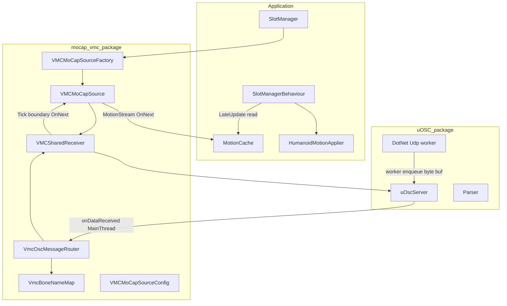
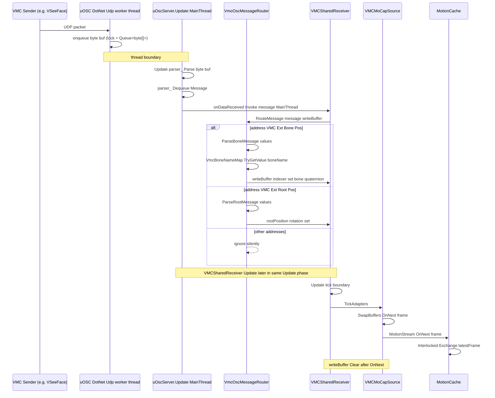
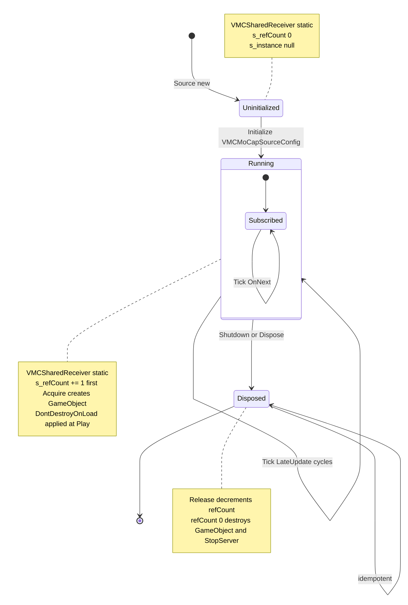
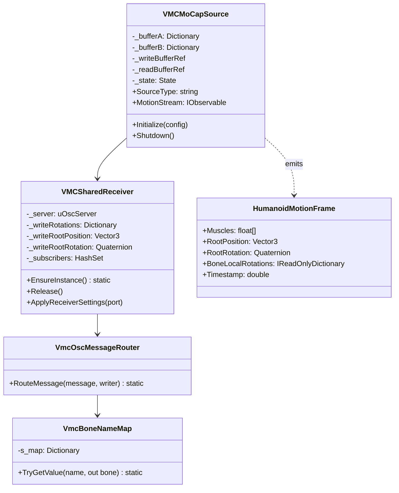
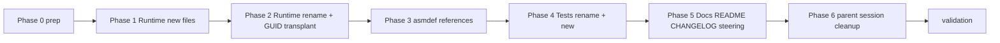

# Design Document — mocap-vmc-native

## Overview

**Purpose**: 本機能は EVMC4U 依存を完全撤廃した自前 VMC OSC 受信実装を `com.hidano.realtimeavatarcontroller.mocap-vmc` パッケージ利用者へ提供する。 利用者の手元準備は「uOSC を導入する」 のみに縮約される。

**Users**: VRM アバターを Unity 上で VSeeFace / VMagicMirror / VirtualMotionCapture 等の VMC 送信アプリと連携させたい開発者および利用者プロジェクト。 既存 `VMCMoCapSourceConfig.asset` / `SlotSettings_VMC_Slot1.asset` 経由で VMC source を構成しているプロジェクトは無改修で新実装に移行できる。

**Impact**: 本 Spec は EVMC4U 依存撤廃という breaking change を内部実装に対してのみ実施し、 上位 Slot / Registry / Motion Pipeline から見た公開契約 (`IMoCapSource` / `MoCapSourceConfigBase` / `HumanoidMotionFrame` / typeId `"VMC"`) は不変に保つ。 利用者の `Assets/EVMC4U/` インポート / `EVMC4U.asmdef` 自作 / `evmc4u.patch git apply` の 3 工程はすべて不要となる。

### Goals

- `com.hidano.realtimeavatarcontroller.mocap-vmc` パッケージから EVMC4U 依存 (asmdef references / `using EVMC4U;` / `Assets/EVMC4U/` 配下クラス参照) を完全撤廃する。
- uOSC `uOscServer.onDataReceived` を直接購読し、 `/VMC/Ext/Bone/Pos` および `/VMC/Ext/Root/Pos` (各 8 引数) を自前パースする。
- `IMoCapSource` 公開契約 (`SourceType == "VMC"` / `MotionStream` 形状 / `HumanoidMotionFrame` 構造 / Factory 自己登録) を不変に維持する。
- アプリケーション層 (uOSC `Message` 受領後 〜 `MotionStream` OnNext 直前まで) の Tick あたり追加 managed allocation を 0 byte (起動時固定バッファ確保および `HumanoidMotionFrame` インスタンス生成を除く) に保つ。
- 既存サンプルアセット (`VMCMoCapSourceConfig_Shared.asset` GUID `5c4569b4a17944fba4667acebe26c25f`) を unmodified 維持し、 既存利用者プロジェクトの参照解決を破壊しない。

### Non-Goals

- VMC Sender (送信側) 実装。
- VMC v2.1 拡張 (BlendShape / Camera / Light / Tracker Status 等) のサポート。 Root の 14 引数版は先頭 8 引数のみ解釈し残余無視。
- `_shared/contracts.md` の `IMoCapSource` / `MoCapSourceConfigBase` / `HumanoidMotionFrame` 定義の変更。
- VRM 1.x 完全互換検証 (VRM 0.x 主対象)。
- 上流 EVMC4U / uOSC への PR や fork。
- 動的アセンブリ読込機構 (`Assembly.LoadFrom` / `Assembly.Load(byte[])` 等)。
- `HumanoidMotionApplier` / `MotionCache` の改修 (本 Spec は受信側のみを対象とする)。

## Boundary Commitments

### This Spec Owns

- **VMC OSC 受信エンジン本体**: uOSC `uOscServer` を直接購読する `VMCSharedReceiver` (MonoBehaviour、 共有 / refCount 管理)。
- **VMC OSC メッセージのパース**: `/VMC/Ext/Bone/Pos` / `/VMC/Ext/Root/Pos` の 8 引数構造を自前で解釈する `VmcOscMessageRouter` (内部 dispatch ロジック)。
- **VMC bone 名 → `HumanBodyBones` 静的マッピング**: `VmcBoneNameMap` (起動時 1 回 `Enum.GetValues` で構築)。
- **`IMoCapSource` 実装本体**: `VMCMoCapSource` (旧 `EVMC4UMoCapSource` のリネーム + 内部実装書換)。
- **アプリケーション層 alloc 0 ホットパス**: ダブルバッファリング戦略による snapshot Dictionary 再利用。
- **EVMC4U 依存撤廃の完了**: Runtime / Editor / Tests の各 asmdef references から `"EVMC4U"` 削除、 `using EVMC4U;` 全削除、 `Assets/EVMC4U/` および `evmc4u.patch` の disposition。
- **既存テストの整理**: 削除 / リネーム + GUID 移植 / 新規追加の方針確定と実行。
- **README / CHANGELOG / steering 整合性**: パッケージ README 全面改訂、 CHANGELOG breaking-change 記載、 `.kiro/steering/structure.md` 更新。

### Out of Boundary

- `HumanoidMotionApplier` / `MotionCache` / `SlotManager` / `RegistryLocator` の改修。
- `_shared/contracts.md` の API 形状変更。
- `VMCMoCapSourceConfig` / `VMCMoCapSourceFactory` のクラス名変更 (typeId 不変・ GUID 不変要件)。
- `com.hidano.uosc` パッケージへの fork / PR / 機能追加 (生 byte buffer expose、 bind 失敗 event 等)。
- VMC v2.1 拡張サポート (後続 Spec へ繰越)。
- 上流 EVMC4U プロジェクトへの貢献。

### Allowed Dependencies

- **Upstream specs**:
  - `mocap-vmc` (typeId `"VMC"` / `HumanoidMotionFrame` 形状 / 共有 receiver パターン / `ISlotErrorChannel` 連携の継承)
  - `mocap-vmc-package-split` (パッケージ配置 / asmdef 名 / `VMCMoCapSourceConfig_Shared.asset` GUID 不変性の継承)
  - `slot-core` (`IMoCapSource` / `MoCapSourceConfigBase` / `IMoCapSourceFactory` / `IMoCapSourceRegistry` / `RegistryLocator` / `ISlotErrorChannel`)
  - `motion-pipeline` (`HumanoidMotionFrame` / `MotionFrame`)
- **External libraries**:
  - `com.hidano.uosc@f7a52f0c524d` (`uOscServer` / `Message` / `Parser` / `DotNet/Udp`) — version pin 維持
  - `UniRx` (Subject / IObservable)
- **Constraints**:
  - 依存方向は `mocap-vmc → core (slot-core / motion-pipeline) → uOSC` の一方向。
  - `mocap-vmc` から `core` への逆参照は禁止。

### Revalidation Triggers

以下のいずれかが変更された場合、 本 Spec の依存箇所を再検証する。

- `HumanoidMotionApplier.Apply` / `ApplyInternal` の `BoneLocalRotations` 消費パターン変更 (frame をまたいで dict 参照保持するように変更されたら、 ダブルバッファ戦略を毎 Tick 新規 Dictionary に retreat する必要)。
- `MotionCache._latestFrame` の retain ライフサイクル変更 (現在は次 OnNext で atomic 置換)。
- uOSC `uOscServer` の `onDataReceived` MainThread 発火保証の変更 (worker thread 通知への変更等)。
- uOSC `DotNet/Udp.StartServer` の bind 失敗挙動変更 (現在は `Debug.LogError` + `state_ = Stop` で握り潰し)。
- uOSC `Parser.ParseData` の `object[]` + boxing API 変更 (生 byte buffer expose 等)。
- VMC 公式仕様 (`https://protocol.vmc.info/`) の bone 名規約変更 (PascalCase 不変前提)。
- `_shared/contracts.md` の `IMoCapSource` / `HumanoidMotionFrame` 形状変更。

## Architecture

### Existing Architecture Analysis

現行 `mocap-vmc` パッケージは `EVMC4USharedReceiver` (MonoBehaviour、 共有・参照カウント) が `Assets/EVMC4U/ExternalReceiver` (要 patch) を `AddComponent` で抱え込み、 `LateUpdate` で `ExternalReceiver.GetBoneRotationsView()` を読み出して `EVMC4UMoCapSource` の `Tick()` を駆動する。 本 Spec は `ExternalReceiver` 依存を取り除き、 `uOscServer` を `EVMC4USharedReceiver` (リネーム後 `VMCSharedReceiver`) が直接抱え込んで `onDataReceived` を購読する構造へ置換する。 既存の refCount lifecycle、 `DontDestroyOnLoad`、 `SubsystemRegistration` static reset、 Factory 自己登録経路は同一パターンを踏襲する。

### Architecture Pattern & Boundary Map

**Selected pattern**: Adapter + Shared Receiver + Direct OSC Subscription
- Adapter (`VMCMoCapSource`): `IMoCapSource` 契約への適合層、 `MotionStream` 発行口を所有。
- Shared Receiver (`VMCSharedReceiver`): プロセスワイド単一の `uOscServer` ホスト、 refCount 管理、 OSC handler 集約、 Tick 境界提供。
- Direct OSC Subscription: `VMCSharedReceiver` が `uOscServer.onDataReceived` を購読し、 `VmcOscMessageRouter` (内部 helper) で address dispatch。



**Architecture Integration**:
- **Selected pattern**: Adapter (per-Slot) + Shared Receiver (process-wide singleton via refCount) + Direct OSC subscription。 既存 `mocap-vmc` design.md と同型構造を維持し、 `ExternalReceiver` ノードを `uOscServer + VmcOscMessageRouter` に置換した形。
- **Domain/feature boundaries**: 受信エンジン (`VMCSharedReceiver`) は VMC source 専用、 `IMoCapSource` 契約への適合は `VMCMoCapSource` が担当。 OSC dispatch ロジックは `VmcOscMessageRouter` (`internal` static helper) に分離してテスト性を確保。
- **Existing patterns preserved**: refCount lifecycle、 `DontDestroyOnLoad`、 `[RuntimeInitializeOnLoadMethod(SubsystemRegistration)]` static reset、 `[RuntimeInitializeOnLoadMethod(BeforeSceneLoad)]` Factory 自己登録、 Editor `[InitializeOnLoadMethod]` 別ファイル自己登録 (`VmcMoCapSourceFactoryEditorRegistrar.cs`)。
- **New components rationale**:
  - `VmcOscMessageRouter` (新): OSC address dispatch + 8 引数構造解釈をテスト可能な `internal static` 関数群として分離。
  - `VmcBoneNameMap` (新): `Enum.GetValues` ベースの static readonly 辞書。 起動時 1 回構築。
- **Steering compliance**: `.kiro/steering/structure.md` の依存方向 (mocap-vmc → core) を維持。 EVMC4U 依存撤廃により利用者準備は uOSC 1 ライブラリのみに縮約 (steering を本 Spec で更新)。

### Technology Stack

| Layer | Choice / Version | Role in Feature | Notes |
|-------|------------------|-----------------|-------|
| Backend / Services | C# 9.0 (Unity 6000.3.10f1) | `IMoCapSource` 実装、 OSC dispatch、 bone マッピング | sealed class、 strong typing、 `using` 式 |
| Messaging / Events | UniRx `Subject<MotionFrame>` + `.Synchronize().Publish().RefCount()` | `MotionStream` 発行口 | 既存パターン継承 |
| Infrastructure / Runtime | uOSC `com.hidano.uosc@f7a52f0c524d` (`uOscServer` / `Parser` / `DotNet.Udp`) | OSC UDP 受信エンジン | version pin、 fork 不可 |
| Infrastructure / Runtime | Unity 6000.3.10f1 (`HumanBodyBones` / `Quaternion` / `Vector3` / `MonoBehaviour` / `RuntimeInitializeOnLoadMethod`) | Unity 標準 API | Unity の API 互換性に依存 |
| Data / Storage | `VMCMoCapSourceConfig` (`ScriptableObject`) | `bindAddress` / `port` 設定 | 既存 GUID `cde228149495a254fb637362afe25ac4` 不変 |

詳細な依存調査 (uOSC `Parser.ParseData` の structural alloc 数値、 `DotNet/Udp.StartServer` の bind 失敗挙動) は `research.md` R-A / R-G を参照。

## File Structure Plan

### Directory Structure

```
RealtimeAvatarController/Packages/com.hidano.realtimeavatarcontroller.mocap-vmc/
├── Runtime/
│   ├── VMCMoCapSource.cs                  # 旧 EVMC4UMoCapSource.cs リネーム + 内部書換 (GUID 移植)
│   ├── VMCSharedReceiver.cs               # 旧 EVMC4USharedReceiver.cs リネーム + uOSC 直接購読化 (GUID 移植)
│   ├── VmcOscMessageRouter.cs             # 新規: OSC address dispatch + 8 引数構造解釈 (internal static)
│   ├── VmcBoneNameMap.cs                  # 新規: Enum.GetValues ベース静的 bone 名辞書 (internal static)
│   ├── VMCMoCapSourceFactory.cs           # 既存: Create() 戻り値の型のみ更新 (GUID 不変)
│   ├── VMCMoCapSourceConfig.cs            # 既存: 不変 (GUID 不変)
│   ├── AssemblyInfo.cs                    # 既存: InternalsVisibleTo 不変 (GUID 不変)
│   └── RealtimeAvatarController.MoCap.VMC.asmdef  # references から "EVMC4U" 削除 (GUID 不変)
├── Editor/
│   ├── VmcMoCapSourceFactoryEditorRegistrar.cs    # 既存: 不変
│   └── RealtimeAvatarController.MoCap.VMC.Editor.asmdef  # 既存: 不変
├── Tests/
│   ├── EditMode/
│   │   ├── VMCMoCapSourceTests.cs         # 旧 EVMC4UMoCapSourceTests.cs リネーム + 書換 (GUID 移植)
│   │   ├── VMCSharedReceiverTests.cs      # 新規 (旧 EVMC4USharedReceiverTests.cs は削除、 GUID 移植せず)
│   │   ├── VmcOscMessageRouterTests.cs    # 新規: OSC パース / dispatch 単体検証
│   │   ├── VmcBoneNameMapTests.cs         # 新規: bone 名 ↔ HumanBodyBones マッピング完全性検証
│   │   ├── VmcConfigCastTests.cs          # 既存: 不変 (GUID 不変)
│   │   ├── VmcFactoryRegistrationTests.cs # 既存: 不変 (GUID 不変)
│   │   └── RealtimeAvatarController.MoCap.VMC.Tests.EditMode.asmdef  # references から "EVMC4U" 削除
│   └── PlayMode/
│       ├── VMCMoCapSourceIntegrationTests.cs      # 旧 EVMC4UMoCapSourceIntegrationTests.cs リネーム + uOscClient ループバック化 (GUID 移植)
│       ├── VMCMoCapSourceSharingTests.cs           # 旧 EVMC4UMoCapSourceSharingTests.cs リネーム + 書換 (GUID 移植)
│       ├── SampleSceneSmokeTests.cs                # 既存: 不変 (GUID 不変)
│       └── RealtimeAvatarController.MoCap.VMC.Tests.PlayMode.asmdef  # references から "EVMC4U" 削除
├── Samples~/VMC/
│   └── Data/VMCMoCapSourceConfig_Shared.asset      # 既存: 不変 (GUID 5c4569b4a17944fba4667acebe26c25f)
├── README.md                              # 全面改訂 (R-12.1)
├── CHANGELOG.md                           # breaking change 記載 (R-12.2)
├── THIRD_PARTY_NOTICES.md                 # 新規: uOSC / VMC プロトコル / EVMC4U inspiration credit
└── package.json                           # uOSC 依存維持、 EVMC4U 依存無し
```

### Modified Files (関連リポジトリ)

- `RealtimeAvatarController/Assets/EVMC4U/` — **全削除** (親セッションタスク、 子 Agent 不可)。 同梱 third-party credit は `THIRD_PARTY_NOTICES.md` へ転記済み。
- `.kiro/specs/mocap-vmc/evmc4u.patch` — 冒頭に **OBSOLETE (2026-05-09)** マーカ + 説明文を追記、 ファイル本体は削除しない (履歴保存)。
- `.kiro/specs/mocap-vmc/handover-7.2.md` — patch 関連記述に OBSOLETE マーカ追記 (handover 整合性)。
- `.kiro/steering/structure.md` — VMC パッケージ説明を「EVMC4U 連携」 から 「自前実装 (uOSC のみ依存)」 へ更新。

### File-level Migration Plan

#### Rename + GUID 移植 (旧 `.cs` GUID を新 `.cs` `.meta` へ転記)

| 旧ファイル (Path) | 旧 GUID | 新ファイル (Path) | 新 GUID (継承) |
|---|---|---|---|
| `Runtime/EVMC4UMoCapSource.cs` | `42ced34567d8f9012ab345678901cdef` | `Runtime/VMCMoCapSource.cs` | `42ced34567d8f9012ab345678901cdef` |
| `Runtime/EVMC4USharedReceiver.cs` | `58052dfd9ff9ad04cae524187979f918` | `Runtime/VMCSharedReceiver.cs` | `58052dfd9ff9ad04cae524187979f918` |
| `Tests/EditMode/EVMC4UMoCapSourceTests.cs` | `964bca5178c164b4e8d31bde1a9235b2` | `Tests/EditMode/VMCMoCapSourceTests.cs` | `964bca5178c164b4e8d31bde1a9235b2` |
| `Tests/PlayMode/EVMC4UMoCapSourceIntegrationTests.cs` | `9184bfd5f018a534393e68abc0c0dc3b` | `Tests/PlayMode/VMCMoCapSourceIntegrationTests.cs` | `9184bfd5f018a534393e68abc0c0dc3b` |
| `Tests/PlayMode/EVMC4UMoCapSourceSharingTests.cs` | `53c1e6a7f8b94e2cb6d5a89e0c1f2345` | `Tests/PlayMode/VMCMoCapSourceSharingTests.cs` | `53c1e6a7f8b94e2cb6d5a89e0c1f2345` |

#### 削除 (GUID 移植せず)

| 旧ファイル (Path) | 削除理由 |
|---|---|
| `Tests/EditMode/EVMC4USharedReceiverTests.cs` (GUID `40aec12345b6d7890ef123456789abcd`) | 検証対象 (`ExternalReceiver` 直依存の refCount / Subscribe 経路) が抜本的に変わるため、 history 継承不要 (R-9.2 / N-H2)。 新規 `VMCSharedReceiverTests.cs` をランダム新規 GUID で作成する。 |
| `Tests/EditMode/ExternalReceiverPatchTests.cs` (GUID `f93a895d350f296458644f533015827c`) | `evmc4u.patch` 検証対象が消滅するため不要 (R-9.1)。 |

#### 新規追加 (ランダム 32 桁 hex GUID)

| 新ファイル (Path) | 用途 |
|---|---|
| `Runtime/VmcOscMessageRouter.cs` | OSC address dispatch + 8 引数構造解釈 (internal static) |
| `Runtime/VmcBoneNameMap.cs` | Enum.GetValues ベース静的 bone 名辞書 (internal static) |
| `Tests/EditMode/VMCSharedReceiverTests.cs` | refCount / DontDestroyOnLoad / SubsystemRegistration リセット / 重複 Acquire 検証 |
| `Tests/EditMode/VmcOscMessageRouterTests.cs` | OSC パース正常系・異常系・未知アドレス・未知 bone 検証 |
| `Tests/EditMode/VmcBoneNameMapTests.cs` | 全 bone 名 → HumanBodyBones 完全マッピング検証 |
| `THIRD_PARTY_NOTICES.md` | uOSC / VMC / EVMC4U inspiration credit |

> 新規ファイルの `.meta` GUID は CLAUDE.md 「Unity .meta GUID」 セクションに従い、 PowerShell `[guid]::NewGuid().ToString('N')` 等でランダム生成し、 既存 GUID コピーや連続パターン (`a1b2c3...`) を使用しない。

## System Flows

### Data Flow: OSC packet 到達 → MotionStream OnNext



**Key Decisions**:
- uOSC worker thread は byte buf の enqueue のみ。 dispatch / parse は MainThread `uOscServer.Update` で完結 (R-B 構造的保証)。
- `VmcOscMessageRouter.RouteMessage` は static 関数で副作用を `writeBuffer` への書込に限定。 テスト性を確保。
- `VMCSharedReceiver.Update` は uOscServer の同 GameObject の Update より後に走る (AddComponent 順)。 当該フレームの全 OSC メッセージ処理完了後に Tick 境界を起動する (Decision B)。

### Lifecycle: Acquire / Release / SubsystemRegistration reset



**Key Decisions**:
- `[RuntimeInitializeOnLoadMethod(SubsystemRegistration)]` で `s_instance = null; s_refCount = 0;` を実行 (Domain Reload OFF 対応)。 GameObject 参照には触れない (Unity が破棄済み前提、 二重破棄回避)。
- Edit Mode (Play 中ではない) で `EnsureInstance` が呼ばれた場合、 `DontDestroyOnLoad` は適用しない (Play 中のみ)。 `HideFlags` は適用しない (現行 `EVMC4USharedReceiver` の挙動を維持) — Edit Mode で hierarchy に `[VMC Shared Receiver]` GameObject が一時的に出るが、 `Release` で `DestroyImmediate` で除去される。

## Requirements Traceability

| Requirement | Summary | Components | Interfaces | Flows |
|-------------|---------|------------|------------|-------|
| 1.1 | uOscServer 1 個生成 / onDataReceived 購読 | VMCSharedReceiver | UnityAction OnOscMessage | Lifecycle |
| 1.2 | port / autoStart=false / StartServer | VMCSharedReceiver | ApplyReceiverSettings(int) | Lifecycle |
| 1.3 | address dispatch | VmcOscMessageRouter | RouteMessage(Message, IBoneWriter) | Data Flow |
| 1.4 | 未知アドレス無視 | VmcOscMessageRouter | RouteMessage 内 default case | Data Flow |
| 1.5 | MainThread 完結 | VMCSharedReceiver, VmcOscMessageRouter | uOSC 構造保証に依存 | Data Flow |
| 1.6 | Shutdown / Dispose で StopServer + 解除 | VMCSharedReceiver | ApplyReceiverSettings teardown / Release | Lifecycle |
| 1.7 | EVMC4U 名前空間ゼロ参照 | 全 Runtime / Editor / Tests | asmdef references / using 削除 | — |
| 2.1 | Bone Pos 8 引数解釈 | VmcOscMessageRouter | ParseBoneMessage(Message) | Data Flow |
| 2.2 | Root Pos 8 引数解釈 | VmcOscMessageRouter | ParseRootMessage(Message) | Data Flow |
| 2.3 | Bone Quaternion を internal Dict へ書込 | VmcOscMessageRouter, VMCSharedReceiver | writeBuffer indexer | Data Flow |
| 2.4 | Root Position / Rotation 内部フィールド書込 | VMCSharedReceiver | rootPosition / rootRotation field | Data Flow |
| 2.5 | Bone pos 引数破棄 | VmcOscMessageRouter | ParseBoneMessage 内 read-only | — |
| 2.6 | 14 引数 Root を 8 引数で truncate | VmcOscMessageRouter | ParseRootMessage 引数長判定 | Data Flow |
| 2.7 | values copy なし | VmcOscMessageRouter | values index access のみ | — |
| 3.1 | 標準 bone 名 → HumanBodyBones マッピング | VmcBoneNameMap | static readonly Dictionary | — |
| 3.2 | LastBone 除外 | VmcBoneNameMap | cctor フィルタ | — |
| 3.3 | 未知 bone 黙殺 | VmcOscMessageRouter | TryGetValue false → no-op | Data Flow |
| 3.4 | 1 回の TryGetValue 完結 | VmcBoneNameMap, VmcOscMessageRouter | string Split / ToLower 不使用 | — |
| 3.5 | 静的読み取り専用 | VmcBoneNameMap | static readonly | — |
| 3.6 | mapping 引用元明示 | THIRD_PARTY_NOTICES.md | inspiration credit | — |
| 4.1 | 静的辞書 refCount + 共有 GO 1 個 | VMCSharedReceiver | EnsureInstance / Release | Lifecycle |
| 4.2 | DontDestroyOnLoad | VMCSharedReceiver | CreateInstance 内 | Lifecycle |
| 4.3 | refCount 0 で Destroy + StopServer | VMCSharedReceiver | Release | Lifecycle |
| 4.4 | SubsystemRegistration で static reset | VMCSharedReceiver | ResetStaticsOnSubsystemRegistration | Lifecycle |
| 4.5 | Edit Mode で隠蔽 (現状維持) | VMCSharedReceiver | DontDestroyOnLoad のみ Play 限定 | — |
| 4.6 | refCount 振る舞い踏襲 | VMCSharedReceiver | EnsureInstance / Release | Lifecycle |
| 5.1 | SourceType "VMC" | VMCMoCapSource | IMoCapSource.SourceType | — |
| 5.2 | MotionStream HumanoidMotionFrame 形状不変 | VMCMoCapSource | MotionStream | Data Flow |
| 5.3 | Factory BeforeSceneLoad 自己登録 | VMCMoCapSourceFactory | RegisterRuntime | — |
| 5.4 | Factory Editor 自己登録 | VmcMoCapSourceFactoryEditorRegistrar | RegisterEditor | — |
| 5.5 | BoneLocalRotations snapshot | VMCMoCapSource | TickAdapters → OnNext | Data Flow |
| 5.6 | Muscles = Array.Empty<float>() | VMCMoCapSource | TickAdapters → frame ctor | — |
| 5.7 | Stopwatch ベース timestamp | VMCMoCapSource | TickAdapters | — |
| 5.8 | 空 dict で OnNext 抑制 | VMCMoCapSource | TickAdapters dirty 判定 | — |
| 5.9 | Config bindAddress / port 不変 | VMCMoCapSourceConfig | (既存) | — |
| 6.1 | Sample asset GUID 不変 | VMCMoCapSourceConfig_Shared.asset | .meta 維持 | — |
| 6.2 | Config / Factory / AssemblyInfo GUID 不変 | (既存) | .meta 維持 | — |
| 6.3 | Runtime クラスリネーム時 GUID 移植 | VMCMoCapSource / VMCSharedReceiver | .meta 編集 | Migration |
| 6.4 | Sample 開閉で MissingReference なし | (検証) | validation | — |
| 6.5 | 新規ファイル GUID 乱数 | VmcOscMessageRouter / VmcBoneNameMap / 新規テスト | .meta 編集 | Migration |
| 7.1 | Runtime asmdef references から EVMC4U 削除 | RealtimeAvatarController.MoCap.VMC.asmdef | references | — |
| 7.2 | Editor asmdef references から EVMC4U 削除 | RealtimeAvatarController.MoCap.VMC.Editor.asmdef | references | — |
| 7.3 | Tests asmdef references から EVMC4U 削除 | Tests asmdef × 2 | references | — |
| 7.4 | using EVMC4U 全消去 | 全 .cs | using 削除 | — |
| 7.5 | Assets/EVMC4U なしでも動作 | (検証) | validation | — |
| 7.6 | 利用者作業の不要化を README で改訂 (R-12.1 集約) | README.md | — | — |
| 7.7 | EVMC4U inspiration credit 明記 | THIRD_PARTY_NOTICES.md / README / CHANGELOG / コードコメント | — | — |
| 8.1 | EVMC4UMoCapSource → VMCMoCapSource | VMCMoCapSource | — | Migration |
| 8.2 | EVMC4USharedReceiver → VMCSharedReceiver | VMCSharedReceiver | — | Migration |
| 8.3 | リネーム時 GUID 移植 | (R-6.3 と同) | .meta 編集 | Migration |
| 8.4 | [MovedFrom] 不要 | (Decision E / R-C) | — | — |
| 8.5 | public API シグネチャ不変 | VMCMoCapSource | IMoCapSource | — |
| 8.6 | Receiver プロパティ削除 / internal 化 | VMCSharedReceiver | (削除) | — |
| 8.7 | public 型に EVMC4U 含まない | (全 Runtime) | — | — |
| 9.1 | ExternalReceiverPatchTests 削除 | (削除リスト) | — | Migration |
| 9.2 | EVMC4USharedReceiverTests 削除 + VMCSharedReceiverTests 新規 | (移行プラン) | — | Migration |
| 9.3 | Integration テスト書換 | VMCMoCapSourceIntegrationTests | uOscClient ループバック | Test Strategy |
| 9.4 | 既存テストのリネーム + 不変性検証 | Tests 各種 | — | Migration |
| 9.5 | 新規 EditMode 正常系テスト | VmcOscMessageRouterTests / VmcBoneNameMapTests | — | Test Strategy |
| 9.6 | 新規 EditMode 異常系テスト | VmcOscMessageRouterTests | — | Test Strategy |
| 9.7 | internal 注入 API + InternalsVisibleTo | VMCSharedReceiver / VMCMoCapSource | InjectBoneRotationForTest 等 | — |
| 9.8 | Tests asmdef refs から EVMC4U 撤廃 | Tests asmdef | references | — |
| 10.1 | Tick あたり追加 alloc 限定 | VMCMoCapSource | ダブルバッファ | — |
| 10.2 | OSC ハンドラ内 new なし | VmcOscMessageRouter | values 直読 | — |
| 10.3 | TryGetValue 1 回完結 | VmcBoneNameMap | Dictionary lookup | — |
| 10.4 | ダブルバッファリング | VMCMoCapSource | bufferA / bufferB swap | Data Flow |
| 10.5 | アプリ層 Tick 0 byte target | VMCMoCapSource | (validation) | — |
| 10.6 | uOSC values 直読 boxing 受容 | VmcOscMessageRouter | (Decision A) | — |
| 11.1 | OnError 発行禁止 | VMCMoCapSource | Subject 経路 | Error Handling |
| 11.2 | パース例外を捨てて継続 | VmcOscMessageRouter | try/catch 局所化 | Error Handling |
| 11.3 | ErrorChannel.Publish 経由通知 | VMCMoCapSource / VMCSharedReceiver | ISlotErrorChannel | Error Handling |
| 11.4 | port bind 失敗を Initialize から throw | VMCSharedReceiver / VMCMoCapSource | (Decision C) isRunning 判定経路 | Error Handling |
| 11.5 | Shutdown / Dispose 冪等 | VMCMoCapSource | Shutdown | Lifecycle |
| 11.6 | 受信タイムアウト不実装 | — | — | — |
| 11.7 | 二重 Initialize で InvalidOperationException | VMCMoCapSource | Initialize state machine | Lifecycle |
| 12.1 | README 全面改訂 | README.md | — | — |
| 12.2 | CHANGELOG 記載 | CHANGELOG.md | — | — |
| 12.3 | Repo root README / core README 更新 | README.md | — | — |
| 12.4 | steering/structure.md 更新 | structure.md | — | — |
| 12.5 | evmc4u.patch OBSOLETE マーキング | evmc4u.patch | — | Migration |
| 12.6 | Assets/EVMC4U/ 削除 (親セッション) | (削除) | — | Migration |
| 12.7 | Sample asset GUID 検証 | (validation) | — | — |
| 12.8 | research items を design で resolve | design.md / research.md | — | — |

## Components and Interfaces

| Component | Domain/Layer | Intent | Req Coverage | Key Dependencies (P0/P1) | Contracts |
|-----------|--------------|--------|--------------|--------------------------|-----------|
| VMCMoCapSource | mocap-vmc Runtime | IMoCapSource Adapter (per-Slot)、 MotionStream 発行口、 ダブルバッファ swap + OnNext | 1.5, 5.1-5.9, 10.1, 10.4-10.6, 11.1, 11.5, 11.7 | VMCSharedReceiver (P0), ISlotErrorChannel (P0), UniRx Subject (P0) | Service, State |
| VMCSharedReceiver | mocap-vmc Runtime | プロセスワイド単一 uOscServer ホスト、 refCount lifecycle、 OSC handler 集約、 Tick 境界提供 | 1.1, 1.2, 1.5, 1.6, 4.1-4.6, 8.2, 8.6, 11.3, 11.4 | uOscServer (P0), VmcOscMessageRouter (P0) | Service, State |
| VmcOscMessageRouter | mocap-vmc Runtime (internal static) | OSC address dispatch + 8 引数構造解釈 + writeBuffer 書込 | 1.3, 1.4, 2.1-2.7, 3.3, 3.4, 10.2, 10.3, 11.2 | VmcBoneNameMap (P0), uOSC Message (P0) | Service |
| VmcBoneNameMap | mocap-vmc Runtime (internal static) | bone 名 → HumanBodyBones 静的辞書 (起動時 1 回 Enum.GetValues 構築) | 3.1-3.5 | UnityEngine HumanBodyBones (P0) | State (read-only) |
| VMCMoCapSourceFactory | mocap-vmc Runtime | IMoCapSourceFactory 実装、 BeforeSceneLoad 自己登録、 typeId "VMC" | 5.3 | VMCMoCapSource (P0), RegistryLocator (P0) | Service |
| VMCMoCapSourceConfig | mocap-vmc Runtime | port / bindAddress 設定 SO (既存・不変) | 5.9, 6.2 | (none new) | State |
| VmcMoCapSourceFactoryEditorRegistrar | mocap-vmc Editor | InitializeOnLoadMethod 自己登録 (既存・不変) | 5.4 | VMCMoCapSourceFactory (P0), RegistryLocator (P0) | Service |

### Runtime / Adapter Layer

#### VMCMoCapSource

| Field | Detail |
|-------|--------|
| Intent | Slot 1 個に紐づく `IMoCapSource` Adapter。 ダブルバッファ swap + `MotionStream` OnNext を発行する |
| Requirements | 1.5, 5.1, 5.2, 5.5, 5.6, 5.7, 5.8, 5.9, 8.1, 8.5, 8.7, 10.1, 10.4, 10.5, 10.6, 11.1, 11.5, 11.7 |

**Responsibilities & Constraints**
- Slot ごとに 1 インスタンス、 `VMCMoCapSourceFactory.Create()` が生成。
- `VMCSharedReceiver` を `Acquire`/`Release` で取得・解放。
- ダブルバッファリングを所有 (`Dictionary<HumanBodyBones, Quaternion> _bufferA`, `_bufferB`、 初期容量 64)。 `_writeBuffer` / `_readBuffer` ポインタで管理。
- `VMCSharedReceiver` の Tick 境界 callback (`IVmcMoCapAdapter.Tick`) で swap → OnNext を実行。
- アプリ層 Tick あたり alloc は `HumanoidMotionFrame` インスタンスのみ (BoneLocalRotations は dict 再利用、 Muscles は `Array.Empty<float>()`)。
- 状態機械: `Uninitialized` → `Running` → `Disposed`。 二重 Initialize は `InvalidOperationException`。

**Dependencies**
- Inbound: `VMCMoCapSourceFactory.Create()` — Slot ごと生成 (P0)
- Inbound: `MotionCache.SetSource(IMoCapSource)` — MotionStream 購読 (P0)
- Outbound: `VMCSharedReceiver.Acquire/Release/Subscribe/Unsubscribe` — 共有受信エンジン取得 (P0)
- Outbound: `ISlotErrorChannel.Publish` — Tick 内例外通知 (P0)
- External: UniRx `Subject<MotionFrame>` / `.Synchronize().Publish().RefCount()` (P0)

**Contracts**: Service [x] / State [x]

##### Service Interface

```csharp
namespace RealtimeAvatarController.MoCap.VMC
{
    public sealed class VMCMoCapSource : IMoCapSource, IDisposable, IVmcMoCapAdapter
    {
        // IMoCapSource
        public string SourceType { get; }                         // returns "VMC"
        public IObservable<MotionFrame> MotionStream { get; }
        public void Initialize(MoCapSourceConfigBase config);     // expects VMCMoCapSourceConfig
        public void Shutdown();                                    // idempotent
        public void Dispose();                                     // delegates to Shutdown

        // Test seam (internal)
        internal enum State { Uninitialized, Running, Disposed }
        internal State CurrentState { get; }
        internal void InjectBoneRotationForTest(HumanBodyBones bone, Quaternion rotation);
        internal void InjectRootForTest(Vector3 position, Quaternion rotation);
        internal void ForceTickForTest();
    }

    internal interface IVmcMoCapAdapter
    {
        void Tick();                                               // Called by VMCSharedReceiver Update
        void HandleTickException(Exception exception);
    }
}
```

- **Preconditions**:
  - `Initialize` の `config` は `VMCMoCapSourceConfig` 派生型かつ `port ∈ [1025, 65535]`。
  - `Initialize` は `Uninitialized` 状態でのみ呼出可能。 二重呼出は `InvalidOperationException`。
- **Postconditions**:
  - `Initialize` 成功後、 `MotionStream` が Hot Observable として活性化。
  - `Initialize` 失敗 (`SocketException` 相当 = `InvalidOperationException` with bind 失敗詳細) 時、 状態は `Uninitialized` のまま。
  - `Shutdown` / `Dispose` 後は `MotionStream` に OnCompleted が流れ、 以降の OnNext は発生しない。
- **Invariants**:
  - `MotionStream` は OnError を発行しない。 すべての Tick 内例外は `ISlotErrorChannel.Publish` 経由通知。
  - `BoneLocalRotations` は同 frame 内消費前提でダブルバッファ参照を渡す (Decision A / E)。

##### State Management

- **State model**: `_state ∈ { Uninitialized, Running, Disposed }`、 単方向遷移。
- **Persistence & consistency**: ダブルバッファ `_bufferA`, `_bufferB` はインスタンス生成時 (`Initialize` ではなくコンストラクタ) に確保、 capacity 64。 swap は MainThread (`VMCSharedReceiver.Update`) で実行されるためロック不要。
- **Concurrency strategy**: `Subject` は `.Synchronize()` で wrap、 OSC handler 経路は MainThread 構造保証 (R-B)。 ロックは uOSC layer が自前管理。

**Implementation Notes**
- Integration: `VMCMoCapSourceFactory.Create()` が `slotId` / `errorChannel` を渡してコンストラクタ呼出。 `Initialize(config)` で `VMCSharedReceiver.Acquire` → `ApplyReceiverSettings(port)` → `Subscribe(this)` の順に呼出。
- Validation: 二重 Initialize / 不正 config 型 / port 範囲外を `Initialize` 内で早期検出。 bind 失敗は `VMCSharedReceiver.ApplyReceiverSettings` 内で `_server.isRunning == false` を判定し `InvalidOperationException` を伝播 (Decision C)。
- Risks: ダブルバッファ swap 順序の取違いで dict 破壊のリスク。 PlayMode test で 「次 Tick 後に旧 buffer が clear されること」 を assert (test seam `ForceTickForTest`)。

#### VMCSharedReceiver

| Field | Detail |
|-------|--------|
| Intent | プロセスワイド単一の `uOscServer` ホスト。 refCount lifecycle 管理、 `onDataReceived` 購読、 OSC dispatch を `VmcOscMessageRouter` に委譲、 Tick 境界 (`Update` 末尾) で adapter 群を駆動 |
| Requirements | 1.1, 1.2, 1.5, 1.6, 4.1, 4.2, 4.3, 4.4, 4.5, 4.6, 8.2, 8.6, 11.3, 11.4 |

**Responsibilities & Constraints**
- 静的辞書ベースのプロセスワイド singleton (現行 `EVMC4USharedReceiver` と同型)。 `EnsureInstance` が refCount をインクリメントし、 0→1 遷移で GameObject + uOscServer + receiver 自身を `AddComponent`。
- `uOscServer.autoStart = false` を強制、 `ApplyReceiverSettings(int port)` で `port` 設定 + `StartServer()` + `isRunning` 判定 (bind 失敗検出)。
- `onDataReceived` UnityEvent に `OnOscMessage` ハンドラを購読。 ハンドラは `VmcOscMessageRouter.RouteMessage` に委譲。
- `Update()` 末尾で adapter 群の `Tick()` を呼出 (uOscServer.Update が同 GameObject 上で先に走る前提に依存)。
- `Release()` で refCount をデクリメント、 0 到達で GameObject 破棄 + StopServer。
- `[RuntimeInitializeOnLoadMethod(SubsystemRegistration)]` で `s_instance = null; s_refCount = 0;` (Domain Reload OFF 対応)。
- 旧 `Receiver` プロパティ (`ExternalReceiver` を expose) は **削除** (R-8.6)。 テスト経路は internal 注入 API (`InjectBoneRotationForTest`、 `InjectRootForTest`) と `[InternalsVisibleTo]` で対応。

**Dependencies**
- Inbound: `VMCMoCapSource.Initialize` — `EnsureInstance` + `ApplyReceiverSettings` + `Subscribe(this)` (P0)
- Inbound: `VMCMoCapSource.Shutdown` — `Unsubscribe(this)` + `Release` (P0)
- Outbound: `uOscServer.StartServer / StopServer / port / autoStart / onDataReceived / isRunning` (P0)
- Outbound: `VmcOscMessageRouter.RouteMessage` — OSC dispatch (P0)
- External: Unity `MonoBehaviour.Update` / `DontDestroyOnLoad` / `RuntimeInitializeOnLoadMethod` (P0)

**Contracts**: Service [x] / State [x]

##### Service Interface

```csharp
namespace RealtimeAvatarController.MoCap.VMC
{
    internal interface IVmcMoCapAdapter
    {
        void Tick();
        void HandleTickException(Exception exception);
    }

    internal interface IVmcBoneRotationWriter
    {
        void WriteBoneRotation(HumanBodyBones bone, Quaternion rotation);
        void WriteRoot(Vector3 position, Quaternion rotation);
    }

    public sealed class VMCSharedReceiver : MonoBehaviour, IVmcBoneRotationWriter
    {
        public static VMCSharedReceiver EnsureInstance();
        public void Release();
        public void ApplyReceiverSettings(int port); // throws InvalidOperationException on bind failure

        internal void Subscribe(IVmcMoCapAdapter adapter);
        internal void Unsubscribe(IVmcMoCapAdapter adapter);

        // For VMCMoCapSource Tick 経路: writeBuffer 引渡し
        internal Dictionary<HumanBodyBones, Quaternion> ReadAndClearWriteBuffer(out Vector3 rootPos, out Quaternion rootRot);

        // Test seams
        public static void ResetForTest();
        public static VMCSharedReceiver InstanceForTest { get; }
        public static int RefCountStaticForTest { get; }

        // IVmcBoneRotationWriter (called by VmcOscMessageRouter)
        void IVmcBoneRotationWriter.WriteBoneRotation(HumanBodyBones bone, Quaternion rotation);
        void IVmcBoneRotationWriter.WriteRoot(Vector3 position, Quaternion rotation);
    }
}
```

- **Preconditions**:
  - `EnsureInstance` は MainThread から呼出。
  - `ApplyReceiverSettings` は `_server` が初期化済みの状態で呼出 (= `EnsureInstance` 後)。
- **Postconditions**:
  - `ApplyReceiverSettings(port)` 成功後、 `_server.isRunning == true`。 失敗時 `InvalidOperationException` 伝播。
  - `Release()` で refCount 0 到達後、 `s_instance == null`、 GameObject 破棄、 `_server.StopServer()` 完了。
- **Invariants**:
  - `s_refCount` は `EnsureInstance` / `Release` の呼出順序を厳格に守る限り常に非負。

##### State Management

- **State model**: 静的 `s_instance: VMCSharedReceiver?`、 `s_refCount: int`。 GameObject 配下に `uOscServer` および `VMCSharedReceiver` MonoBehaviour を抱える。 receiver instance フィールドに以下を保持:
  - `_server: uOscServer` (AddComponent で取得)
  - `_writeRotations: Dictionary<HumanBodyBones, Quaternion>` (受信書込側 = adapter 共通)
  - `_writeRootPosition: Vector3` / `_writeRootRotation: Quaternion`
  - `_subscribers: HashSet<IVmcMoCapAdapter>`
- **Persistence**: 静的辞書はプロセス寿命。 `[RuntimeInitializeOnLoadMethod(SubsystemRegistration)]` で reset。
- **Concurrency**: `_writeRotations` 等への書込は MainThread (uOSC `onDataReceived` 構造保証)。 ロック不要。

**Implementation Notes**
- Integration: receiver の writeBuffer 自体は VMCSharedReceiver が所有。 各 `VMCMoCapSource` adapter は Tick 境界で `ReadAndClearWriteBuffer` を呼んで現状を copy → 自身の readBuffer に取込 → swap → OnNext。 (代替案: writeBuffer を adapter ごとに分離する設計だが、 共有 receiver は OSC 受信を 1 回しか走らせないため共有 writeBuffer が自然。 複数 Slot で別 Config (= 別 port) の場合は `EnsureInstance` 経由でそもそも別 receiver が立つので衝突しない。)
- Bind failure detection: `ApplyReceiverSettings` 内 `_server.StartServer()` 直後 `if (!_server.isRunning) throw new InvalidOperationException(...)` (Decision C)。
- Validation: refCount overflow / negative reset を `Release` 内で防御 (`s_refCount <= 0 ? return`)。
- Risks: `Update()` 実行順序が uOscServer.Update 後である前提に依存。 同 GameObject 上で `AddComponent` した順序通りに `Update` が呼ばれる Unity の保証に基づく。

##### Sub-mechanism: writeBuffer 共有とダブルバッファの分離設計

```
VMCSharedReceiver (single instance)
  ├─ _writeRotations: Dictionary<HumanBodyBones, Quaternion>     (OSC handler 直接書込)
  ├─ _writeRootPosition: Vector3
  ├─ _writeRootRotation: Quaternion
  └─ _subscribers: HashSet<IVmcMoCapAdapter>

VMCMoCapSource (per-Slot adapter, owned by Factory)
  ├─ _bufferA: Dictionary<HumanBodyBones, Quaternion>            (片方が _readBuffer、 もう片方が次 Tick 用)
  ├─ _bufferB: Dictionary<HumanBodyBones, Quaternion>
  ├─ _readBufferRef: ref to A or B
  └─ _writeBufferRef: ref to A or B (= 次 Tick 用、 直前 OnNext 後に Clear 済み)
```

**Tick 処理の流れ** (`VMCSharedReceiver.Update` の末尾で adapter ごとに走る):

1. `VMCSharedReceiver._writeRotations` には当該 frame の Update 中に到着した OSC bone 値が累積している。
2. adapter (`VMCMoCapSource`) は自身の `_writeBufferRef` (= 起動時 alloc 済み Dictionary) に対して `Clear()` してから `_writeRotations` の全 entries をコピー (`foreach` で kv loop)。
3. swap: `(_readBufferRef, _writeBufferRef) = (_writeBufferRef, _readBufferRef)`。 これで新 `_readBufferRef` は最新の bone データ。
4. `OnNext(new HumanoidMotionFrame(timestamp, Array.Empty<float>(), rootPos, rootRot, _readBufferRef))`。
5. `MotionCache._latestFrame := frame` (Interlocked.Exchange) で旧 frame は GC eligible。
6. 次 Tick で同じ adapter の `_writeBufferRef` (= 旧 `_readBufferRef`) を Clear → コピー → swap...

**注**: 共有 `_writeRotations` は当該 frame 内の最新 OSC データを保持する read-only source として扱う。 adapter は自身の `_bufferA/_bufferB` で受け取った snapshot を所有する。 共有 `_writeRotations` を adapter 数分コピーする alloc は 「`_bufferX.Clear()` は capacity を保ったまま entries のみ消去」 + 「`foreach` + indexer set」 で alloc 0。

実装 detail として alloc 0 を満たすには:
- adapter の `_bufferA/_bufferB` は capacity 64 (humanoid bone 数 + 余裕) で `new Dictionary<HumanBodyBones, Quaternion>(64)` を **コンストラクタで事前確保**。 Dictionary は capacity を保ちつつ Clear するので、 entries の追加で再ハッシュ無し。
- 受信書込側 `VMCSharedReceiver._writeRotations` も同様 capacity 64 で事前確保。
- adapter の Tick 内 copy ループは `foreach (var kv in _writeRotations) _writeBufferRef[kv.Key] = kv.Value;` で alloc 0 (Dictionary enumerator は struct)。

> **Note (前 Tick 後 _writeRotations の状態)**: 共有 `_writeRotations` は次 OSC メッセージ到着まで前 Tick の値を保持し続けてよい (上書きで反映)。 前 Tick 値が次 frame でも有効として送信されない bone は前回値を維持する (VMC 仕様準拠 — VSeeFace 等は変化があった bone のみ送出する場合がある)。

### Routing Layer (internal)

#### VmcOscMessageRouter

| Field | Detail |
|-------|--------|
| Intent | OSC `Message` を受け取り、 address により dispatch して `IVmcBoneRotationWriter` へ書込む static helper |
| Requirements | 1.3, 1.4, 2.1, 2.2, 2.3, 2.4, 2.5, 2.6, 2.7, 3.3, 3.4, 10.2, 10.3, 11.2 |

**Responsibilities & Constraints**
- 純粋関数 (`internal static`)、 副作用は writer 経由のみ。
- OSC address dispatch は `string` 比較 (`==` ordinal)、 unknown は no-op。
- 8 引数構造解釈: `values[0]` (string boneName/rootName)、 `values[1..3]` (float pos)、 `values[4..7]` (float rot)。
- 引数長不足・型不一致は try/catch せずに 「if 長さ判定」 で早期 return (例外スロー禁止、 `VMCMoCapSource` への伝播経路は呼出元 `VMCSharedReceiver.OnOscMessage` の try/catch で集約)。
- bone 名検索は `VmcBoneNameMap.TryGetValue` 1 回完結、 文字列加工なし。

**Dependencies**
- Inbound: `VMCSharedReceiver.OnOscMessage(uOSC.Message)` (P0)
- Outbound: `VmcBoneNameMap.TryGetValue(string, out HumanBodyBones)` (P0)
- Outbound: `IVmcBoneRotationWriter.WriteBoneRotation` / `WriteRoot` (P0)
- External: uOSC `Message`, `UnityEngine.Quaternion`, `UnityEngine.Vector3` (P0)

**Contracts**: Service [x]

##### Service Interface

```csharp
namespace RealtimeAvatarController.MoCap.VMC
{
    internal static class VmcOscMessageRouter
    {
        // Address constants
        public const string AddressBonePos = "/VMC/Ext/Bone/Pos";
        public const string AddressRootPos = "/VMC/Ext/Root/Pos";

        public static void RouteMessage(in uOSC.Message message, IVmcBoneRotationWriter writer);

        // Test seams
        internal static bool TryParseBoneMessage(in uOSC.Message message,
            out HumanBodyBones bone, out Quaternion rotation);
        internal static bool TryParseRootMessage(in uOSC.Message message,
            out Vector3 position, out Quaternion rotation);
    }
}
```

- **Preconditions**: `message.address` および `message.values` は uOSC `Parser` 経由で正規化済み。
- **Postconditions**:
  - 成功時: 該当アドレスに対する 1 回の writer 呼出が発生。
  - 失敗時 (引数長不足 / 型不一致 / 未知 bone / 未知 address): writer 呼出なし、 例外なし。

##### Address Dispatch Table

| OSC Address | 解釈 | 引数構造 | 動作 |
|---|---|---|---|
| `/VMC/Ext/Bone/Pos` | Bone Local Rotation | `[s, f, f, f, f, f, f, f]` (boneName, posX, posY, posZ, rotX, rotY, rotZ, rotW) | bone name → `HumanBodyBones` 解決後、 `WriteBoneRotation`。 pos は破棄 (R-2.5) |
| `/VMC/Ext/Root/Pos` | Root Position + Rotation | `[s, f, f, f, f, f, f, f, ...]` (rootName, posX, posY, posZ, rotX, rotY, rotZ, rotW, [scale × 6 (v2.1)]) | 先頭 8 引数のみ解釈、 残余無視 (R-2.6)。 `WriteRoot` |
| `/VMC/Ext/Blend/Val` | BlendShape value | — | 黙殺 (out of scope) |
| `/VMC/Ext/Blend/Apply` | BlendShape apply | — | 黙殺 |
| `/VMC/Ext/Cam` | Camera | — | 黙殺 |
| `/VMC/Ext/Light` | Light | — | 黙殺 |
| `/VMC/Ext/Hmd/Pos` | Tracker (HMD) | — | 黙殺 |
| `/VMC/Ext/Con/Pos` | Tracker (Controller) | — | 黙殺 |
| `/VMC/Ext/Tra/Pos` | Tracker (Generic) | — | 黙殺 |
| `/VMC/Ext/Setting/*` | Setting | — | 黙殺 |
| `/VMC/Ext/OK` | Loaded notify | — | 黙殺 |
| `/VMC/Ext/T` | Time | — | 黙殺 |
| `/VMC/Ext/VRM` | VRM model info | — | 黙殺 |
| `/VMC/Ext/Root/T` | Root with bundle time | — | 黙殺 (bundle 経路は uOSC parser で展開済み) |
| その他 (`/VMC/Ext/...` 等) | 未知拡張 | — | 黙殺 |

> dispatch table は `string ==` 比較で if/else または `switch` ステートメントで実装する。 `Dictionary<string, Action>` を使うと delegate alloc が発生するため不採用。

**Implementation Notes**
- Integration: `VMCSharedReceiver.OnOscMessage(uOSC.Message message)` から `RouteMessage(in message, this)` を直接呼出。
- Validation:
  - `values.Length < 8` で early return (引数長不足、 R-9.6)。
  - `values[0] is not string` / `values[i] is not float (i ∈ [1..7])` で早期 return (型不一致、 R-9.6)。
  - `VmcBoneNameMap.TryGetValue` false で early return (未知 bone、 R-3.3)。
- Risks: VMC 拡張で 8 引数版以外の `/VMC/Ext/Bone/Pos` が将来出現した場合、 早期 return で安全側に倒れる (黙殺 = no-op)。

### Mapping Layer (internal)

#### VmcBoneNameMap

| Field | Detail |
|-------|--------|
| Intent | bone 名 (PascalCase) → `HumanBodyBones` 静的辞書。 起動時 1 回 `Enum.GetValues(typeof(HumanBodyBones))` で構築 |
| Requirements | 3.1, 3.2, 3.3, 3.4, 3.5 |

**Responsibilities & Constraints**
- `static readonly Dictionary<string, HumanBodyBones>`、 cctor で `Enum.GetValues` をループして構築。
- `HumanBodyBones.LastBone` は除外 (R-3.2)。
- 文字列比較は `StringComparer.Ordinal` (case-sensitive、 R-3.4 / R-H)。
- `TryGetValue(string, out HumanBodyBones)` を public な静的 API として提供。

**Dependencies**
- Outbound: `UnityEngine.HumanBodyBones` enum (P0)
- External: BCL `System.Enum`, `System.Collections.Generic.Dictionary`, `System.StringComparer.Ordinal` (P0)

**Contracts**: State [x]

##### Service Interface

```csharp
namespace RealtimeAvatarController.MoCap.VMC
{
    internal static class VmcBoneNameMap
    {
        public static bool TryGetValue(string boneName, out HumanBodyBones bone);

        // Test seam: enumerate all entries
        internal static IEnumerable<KeyValuePair<string, HumanBodyBones>> EnumerateForTest();
    }
}
```

- **Preconditions**: `boneName` は non-null。 null は false 返却 (例外スローしない)。
- **Postconditions**: 成功時 `out bone` に対応 enum 値、 失敗時 `default(HumanBodyBones)` (= `Hips` の整数値 0、 ただし呼出側は false 戻り値で判定する)。
- **Invariants**: 辞書内容は cctor 後不変、 entries 数は `HumanBodyBones` enum メンバ数 - 1 (LastBone 除外)。 Unity 6000.3.10f1 では 56 - 1 = 55 entries。

##### State Management

```csharp
private static readonly Dictionary<string, HumanBodyBones> s_map = BuildMap();

private static Dictionary<string, HumanBodyBones> BuildMap()
{
    var values = (HumanBodyBones[])Enum.GetValues(typeof(HumanBodyBones));
    var dict = new Dictionary<string, HumanBodyBones>(values.Length, StringComparer.Ordinal);
    foreach (var b in values)
    {
        if (b == HumanBodyBones.LastBone) continue;
        dict[b.ToString()] = b;  // Enum.ToString は cctor 内 1 回のみ実行 (起動時 alloc)
    }
    return dict;
}
```

**Implementation Notes**
- Integration: `VmcOscMessageRouter.RouteMessage` から `TryGetValue(boneName, out var bone)` を 1 回呼出。
- Validation: cctor 内で entries 数を内部 assert (`Debug.Assert(dict.Count == 55)` 等は不要、 単体テスト `VmcBoneNameMapTests` で全 enum メンバ網羅を検証)。
- Risks: Unity が将来 `HumanBodyBones` に新 enum メンバを追加した場合、 cctor が自動追従 (= 機械的列挙のため)。 VMC 仕様サイドで送出されない新 enum 名は実際には到着しないので問題なし。

### Factory & Config Layer (existing, minimal changes)

#### VMCMoCapSourceFactory

| Field | Detail |
|-------|--------|
| Intent | typeId="VMC" の `IMoCapSourceFactory`。 `Create` の戻り値型のみ `EVMC4UMoCapSource` → `VMCMoCapSource` に更新 |
| Requirements | 5.3 |

(既存ファイル不変、 唯一の変更は `Create()` 内 `new EVMC4UMoCapSource(...)` を `new VMCMoCapSource(...)` に置換。 GUID 不変。)

#### VMCMoCapSourceConfig

| Field | Detail |
|-------|--------|
| Intent | port / bindAddress を保持する `MoCapSourceConfigBase` 派生 SO。 既存・不変 |
| Requirements | 5.9, 6.2 |

(完全不変、 GUID 不変。)

#### VmcMoCapSourceFactoryEditorRegistrar

| Field | Detail |
|-------|--------|
| Intent | Editor 起動時の typeId="VMC" 自己登録。 既存・不変 |
| Requirements | 5.4 |

(完全不変。)

## Data Models

### Domain Model

- **`VmcBoneRotationFrame`** (内部概念、 型は `Dictionary<HumanBodyBones, Quaternion>` で代用): 受信時点での全 bone 回転スナップショット。 immutability は同 frame 内消費前提 (Decision E) で保証。
- **`HumanoidMotionFrame`** (上位 spec 由来、 不変): `BoneLocalRotations: IReadOnlyDictionary<HumanBodyBones, Quaternion>` を保持。 本 Spec ではダブルバッファの片方を直接渡す。

### Logical Data Model



## Error Handling

### Error Strategy

- **OSC parse 例外**: `VmcOscMessageRouter.RouteMessage` 内では「 if 判定 + early return 」 で防御し、 例外をスローしない (R-11.2)。 `VMCSharedReceiver.OnOscMessage` の外側 try/catch で予期しない例外を捕捉し、 `IVmcMoCapAdapter.HandleTickException` 経由で `ISlotErrorChannel` に通知。
- **Tick 内例外**: `VMCMoCapSource.Tick` の try/catch で捕捉し、 `ISlotErrorChannel.Publish(SlotError(slotId, SlotErrorCategory.VmcReceive, ex, UtcNow))`。 `MotionStream.OnError` は呼ばない (R-11.1)。
- **Bind 失敗**: `VMCSharedReceiver.ApplyReceiverSettings` 内 `_server.StartServer()` 直後 `_server.isRunning == false` 判定で `InvalidOperationException` をスロー。 `VMCMoCapSource.Initialize` 経由で呼出元 (`SlotManager`) へ伝播し、 `SlotManager` 側 try/catch で `SlotErrorCategory.InitFailure` として `ISlotErrorChannel` 通知 (R-11.4 / Decision C)。
- **二重 Initialize**: `VMCMoCapSource.Initialize` 状態判定で `InvalidOperationException` (R-11.7)。
- **Shutdown / Dispose 二重呼出**: 状態 `Disposed` で early return (idempotent、 R-11.5)。

### Error Categories and Responses

- **User Errors / Configuration**:
  - `VMCMoCapSourceConfig` の `port` 範囲外 → `ArgumentOutOfRangeException` (`Initialize` 内、 R-9.6 と一貫)
  - 異 config 型 → `ArgumentException` (`Initialize` 内、 メッセージに実型名)
- **System Errors**:
  - port bind 失敗 (使用中 / 権限不足) → `InvalidOperationException` (Decision C)、 `SlotManager` 経路で `InitFailure` 通知
  - OSC パース内予期しない例外 (NullReferenceException 等) → `VmcReceive` カテゴリで通知、 ストリームは継続
- **Business Logic Errors**:
  - 未知 bone 名 / 未知 OSC アドレス → no-op、 通知も発生しない (仕様、 R-3.3 / R-1.4)

### Monitoring

- `ISlotErrorChannel` (`DefaultSlotErrorChannel`) を通じた `Debug.LogError` 抑制制御は core 側に集約。 本 Spec はそれに乗るのみ。
- uOSC `DotNet/Udp` 内の `Debug.LogError(e.ToString())` (bind 失敗時 / Send 失敗時) は uOSC が独自に出力するため、 本 Spec から抑制不可 (= 二重表示の可能性受容、 Decision C trade-off)。

## Testing Strategy

### Unit Tests (EditMode)

1. `VmcBoneNameMapTests`: `Enum.GetValues(typeof(HumanBodyBones))` の全 enum メンバ (LastBone 除く) が辞書に存在し、 同一 enum 値を返すこと (R-3.1)。 大小区別 (`hips` で false) を検証 (R-3.4 / R-H)。
2. `VmcOscMessageRouterTests`:
   - `/VMC/Ext/Bone/Pos` 8 引数で `WriteBoneRotation(bone, quat)` が 1 回呼ばれること (R-2.1, R-2.3)。
   - `/VMC/Ext/Root/Pos` 8 引数で `WriteRoot(pos, rot)` が 1 回呼ばれること (R-2.2, R-2.4)。
   - 14 引数 Root を先頭 8 引数で truncate して処理すること、 例外なし (R-2.6)。
   - 引数長 7 / 9 / 0 のメッセージで writer 呼出なし、 例外なし (R-9.6)。
   - 型不一致 (`values[0]` が float、 `values[1]` が string 等) で writer 呼出なし、 例外なし (R-9.6)。
   - 未知 bone (`Foo`) で writer 呼出なし (R-3.3)。
   - 未知アドレス (`/VMC/Ext/Blend/Val` 等 dispatch table の黙殺対象) で writer 呼出なし (R-1.4)。
3. `VMCMoCapSourceTests`:
   - `SourceType == "VMC"` (R-5.1)。
   - `Initialize` 二重呼出で `InvalidOperationException` (R-11.7)。
   - 異 config 型で `ArgumentException` (型名含む)。
   - port 範囲外で `ArgumentOutOfRangeException`。
   - `Dispose` 後の `Shutdown` 二重呼出で例外なし (R-11.5)。
   - `MotionStream` が `IObservable<MotionFrame>` 型で公開される。
4. `VMCSharedReceiverTests`:
   - `EnsureInstance` 初回で GameObject + uOscServer + receiver 自身が AddComponent される。
   - 重複 `EnsureInstance` で同一 instance、 refCount 増加。
   - `Release` で refCount 減、 0 到達で GameObject 破棄、 `s_instance == null`。
   - `[RuntimeInitializeOnLoadMethod(SubsystemRegistration)]` で static reset (リフレクションで private static method を直接呼出してテスト)。
   - `EnsureInstance` 後 `Release` 前に `ResetForTest` を呼んで GameObject が DestroyImmediate されること。

### Integration Tests (PlayMode)

1. `VMCMoCapSourceIntegrationTests`:
   - in-process uOSC `uOscClient` を作って `127.0.0.1:port` に既知 bone OSC packet を送出、 受信側 `VMCMoCapSource.MotionStream` を購読して `HumanoidMotionFrame.BoneLocalRotations` に反映されることを確認 (R-9.3)。
   - 55 bone 全送出フレームで全 bone が `BoneLocalRotations` に含まれること。
   - `MotionStream.OnError` が一度も呼ばれないこと (R-11.1)。
   - `Shutdown` 後 `OnCompleted` が発行されること。
   - ダブルバッファ swap 検証: ForceTickForTest を呼んで `_readBufferRef` が前 Tick 値、 `_writeBufferRef` が clear 済みであること。
2. `VMCMoCapSourceSharingTests`:
   - 同一 `VMCMoCapSourceConfig` で複数 Slot が refCount 経由で共有されること (R-4.6)。
   - 別 Config (別 port) で別 `VMCSharedReceiver` インスタンスが立つこと。
3. `SampleSceneSmokeTests`: 既存テスト維持、 sample asset 参照が破壊されていないこと検証 (R-12.7)。

### Performance Tests (validation)

- アプリ層 Tick あたり alloc 計測: Unity Profiler `GC.Allocated` を `_writeBufferRef` への copy + swap + `new HumanoidMotionFrame` 区間に限定して計測。 `HumanoidMotionFrame` 1 個分 (= 既知の不可避 alloc) 以外が 0 byte であることを確認 (R-10.5)。 計測区間境界は research.md R-A の説明に従う。
- IL2CPP / Mono 双方で計測。 IL2CPP では uOSC 由来の boxing が発生するが、 これは計測区間外 (R-10.6)。

### Test Seams (internal)

- `VMCMoCapSource.InjectBoneRotationForTest(HumanBodyBones, Quaternion)`: writeBuffer 直接書込でテスト経路を簡素化。
- `VMCMoCapSource.InjectRootForTest(Vector3, Quaternion)`: 同上。
- `VMCMoCapSource.ForceTickForTest()`: Tick 境界を強制発火して swap + OnNext を即時実行。
- `VMCSharedReceiver.ResetForTest()`: 静的 singleton 強制 reset。
- `VmcOscMessageRouter.TryParseBoneMessage` / `TryParseRootMessage`: パース成否を boolean で公開。
- `VmcBoneNameMap.EnumerateForTest()`: 全 entries 列挙。

`[InternalsVisibleTo("RealtimeAvatarController.MoCap.VMC.Tests.EditMode")]` および `RealtimeAvatarController.MoCap.VMC.Tests.PlayMode` を `AssemblyInfo.cs` で維持。

## Migration Strategy



### Phase 0: 前提整備

- `Runtime/AssemblyInfo.cs` の `[InternalsVisibleTo]` は不変 (現状で OK)。
- `package.json` を確認し、 EVMC4U 依存記述があれば削除 (現状なしのはず)。

### Phase 1: Runtime 新規ファイル追加

- `Runtime/VmcBoneNameMap.cs` (新規)。
- `Runtime/VmcOscMessageRouter.cs` (新規)。
- 両ファイルの `.meta` GUID は乱数生成、 `IVmcBoneRotationWriter` interface も `VmcOscMessageRouter.cs` 内 (or 別ファイル) で定義。

### Phase 2: Runtime クラスリネーム + GUID 移植

- `EVMC4UMoCapSource.cs` → `VMCMoCapSource.cs` (内容は uOSC 直接購読化に書換、 内部 `EVMC4USharedReceiver` 参照を `VMCSharedReceiver` に置換、 `using EVMC4U;` 削除)。
- `EVMC4USharedReceiver.cs` → `VMCSharedReceiver.cs` (内容は `ExternalReceiver` 抱え込みを uOSC 直接購読 + `VmcOscMessageRouter` 委譲に書換)。
- 各旧 `.cs.meta` の GUID を新ファイル `.meta` に転記。 旧 `.cs` および 旧 `.cs.meta` を削除。

### Phase 3: asmdef references から `EVMC4U` 削除

- `Runtime/RealtimeAvatarController.MoCap.VMC.asmdef` の `references` 配列から `"EVMC4U"` 削除。
- `Tests/EditMode/RealtimeAvatarController.MoCap.VMC.Tests.EditMode.asmdef` 同上。
- `Tests/PlayMode/RealtimeAvatarController.MoCap.VMC.Tests.PlayMode.asmdef` 同上。
- Editor asmdef は元から `EVMC4U` 参照なし (確認のみ)。

> **重要 (N-R3 対応)**: Phase 2 のソース書換と Phase 3 の asmdef 編集は **同一コミット** で実施する。 `Assets/EVMC4U/` ディレクトリが残存している間は asmdef references 削除のみ先行しても compile エラーは出ないが、 `using EVMC4U;` 削除と asmdef 削除をバラバラに進めると中間状態で compile が壊れる時間帯が生じる。

### Phase 4: Tests 整理

- 削除 (GUID 移植せず): `Tests/EditMode/EVMC4USharedReceiverTests.cs`、 `Tests/EditMode/ExternalReceiverPatchTests.cs`。 各 `.cs` および `.cs.meta` を削除。
- リネーム + GUID 移植:
  - `Tests/EditMode/EVMC4UMoCapSourceTests.cs` → `Tests/EditMode/VMCMoCapSourceTests.cs`
  - `Tests/PlayMode/EVMC4UMoCapSourceIntegrationTests.cs` → `Tests/PlayMode/VMCMoCapSourceIntegrationTests.cs`
  - `Tests/PlayMode/EVMC4UMoCapSourceSharingTests.cs` → `Tests/PlayMode/VMCMoCapSourceSharingTests.cs`
- 内容書換:
  - `using EVMC4U;` 削除、 `EVMC4USharedReceiver` 参照を `VMCSharedReceiver` に置換、 `EVMC4UMoCapSource` 参照を `VMCMoCapSource` に置換、 `Receiver` プロパティ経由のテスト経路を internal 注入 API (`InjectBoneRotationForTest` 等) に書換 (R-9.7)。
  - `IntegrationTests` は uOscClient 経路 (`127.0.0.1:port` ループバック) または internal 注入 API のいずれかで実 OSC 経路を再現。
- 新規追加 (ランダム GUID):
  - `Tests/EditMode/VMCSharedReceiverTests.cs`
  - `Tests/EditMode/VmcOscMessageRouterTests.cs`
  - `Tests/EditMode/VmcBoneNameMapTests.cs`
- 既存 `Tests/EditMode/VmcConfigCastTests.cs` / `Tests/EditMode/VmcFactoryRegistrationTests.cs` / `Tests/PlayMode/SampleSceneSmokeTests.cs` は不変 (using EVMC4U 削除のみ実施)。

### Phase 5: Documentation

- `README.md` を全面改訂 (R-12.1):
  - 利用者準備手順を「uOSC を導入する。」に縮約。
  - EVMC4U `.unitypackage` インポート / `EVMC4U.asmdef` 自作 / `evmc4u.patch git apply` の旧手順を全削除。
  - 「Credits」 セクションに EVMC4U inspiration credit (共有 receiver パターン / refCount lifecycle / SubsystemRegistration reset) を記載 (R-7.7)。
  - 「VMC v2.1 拡張は対象外」 を明記。
- `CHANGELOG.md` に breaking change エントリを追加 (R-12.2):
  - 「Internal: EVMC4U dependency removed in favor of native uOSC subscription. Public API (`IMoCapSource`, `MoCapSourceConfigBase`, `HumanoidMotionFrame`, typeId `VMC`) is unchanged.」
- `THIRD_PARTY_NOTICES.md` 新規作成 (R-7.7 / N-M1):
  - uOSC `com.hidano.uosc` (MIT) credit (`Library/PackageCache` 内の license を転記)。
  - VMC プロトコル仕様 (`https://protocol.vmc.info/`) への準拠表明。
  - EVMC4U (MIT) inspiration credit。
  - 旧 `Assets/EVMC4U/3rdpartylicenses(ExternalReceiverPack).txt` 内の uOSC / UniVRM credit を転記。
- リポジトリルート README または core README で VMC パッケージの利用者準備変更を反映 (R-12.3)。
- `.kiro/steering/structure.md` の VMC パッケージ説明を「自前実装による VMC 受信 (uOSC のみ依存)」 へ更新 (R-12.4)。

### Phase 6: 親セッション専用クリーンアップ (子 Agent 不可)

- `RealtimeAvatarController/Assets/EVMC4U/` 全体を `git rm -rf` で削除 (R-12.6 / N-M1)。
- `.kiro/specs/mocap-vmc/evmc4u.patch` 冒頭に OBSOLETE マーカ + 説明を追記 (R-12.5 / Decision F)。
- `.kiro/specs/mocap-vmc/handover-7.2.md` の patch 関連記述に OBSOLETE マーカ追記。
- Unity Editor 再起動 + `Library/ScriptAssemblies/` キャッシュ regenerate を validation で確認 (N-R1)。

### Validation

- **Compile A**: VMC パッケージ単体 (`com.hidano.realtimeavatarcontroller.mocap-vmc`) のみインストール、 uOSC 依存ありで compile 成功。 EVMC4U なしでコンパイルエラーが出ないこと。
- **Compile B**: VMC パッケージ + Sample import で compile 成功。 sample scene `VMCReceiveDemo.unity` を開いて `MissingReferenceException` / `The associated script can not be loaded` 系警告が出ないこと (R-6.4)。
- **Runtime C**: VMC sample scene を Play、 別プロセスで動かす VMC 送信側 (VirtualMotionCapture / VSeeFace 等) または同 Unity プロセス内 `uOscClient` を使ったループバック送信で実 OSC packet を流し、 アバターが正常に追従することを目視 / 自動テスト両面で確認。
- Unity Editor 再起動後の Console に `EVMC4U` 関連 warning / error が出ないこと (N-R1 mitigation)。

## Optional Sections

### Performance & Scalability

- アプリ層 Tick あたり追加 alloc 0 byte target (R-10.5、 計測スコープは uOSC `Message` 受領後 〜 `MotionStream` OnNext 直前まで)。
- 60Hz × 55 bone × VMC 送信 rate (60〜90Hz) = ~150 OSC msg/sec を 1 frame に集約して 60 OnNext/sec に正規化。
- ダブルバッファ swap で alloc を起動時のみに局限。 `HumanoidMotionFrame` インスタンス生成 (1 個 / Tick) は不可避だが、 これは class インスタンス 1 個分 (~80 byte) で許容範囲。
- IL2CPP 環境での uOSC 由来 boxing alloc (`new object[8]` + `float boxing × 7` + `bone name string` 等で ~280 byte / msg) は本 Spec 計測スコープ外 (R-10 スコープ境界、 R-10.6)。

### Security Considerations

- UDP `0.0.0.0` bind は外部ネットワークからの OSC packet 受信を許容する。 利用者プロジェクトが LAN 開放環境で稼働させる場合、 任意の OSC packet で bone rotation を上書きされるリスクがある。 README で「実運用時は `bindAddress = "127.0.0.1"` 等への制限を検討」 と注記 (本 Spec の現状実装では `bindAddress` フィールドは未使用 = 全 IF bind、 既存 `mocap-vmc` design.md L2 同等)。
- 不正 OSC packet (引数長不一致 / 型不一致 / 未知 address / 未知 bone) は `VmcOscMessageRouter` で全て無害化 (no-op)。 サービス継続性は維持される。

## Supporting References

- `research.md` — 各 Decision (A〜E) の根拠と alternatives 評価
- `dig-native.md` — pivot 後の自律意思決定 9 件 (Critical 4 / High 3 / Medium 2 / New Risks 4)
- `dig.md` — pivot 前の Reflection 化路線検討記録 (歴史的資料)
- `.kiro/specs/mocap-vmc/design.md` — 上位 Spec、 共有 receiver / refCount / typeId 不変条件の起源
- `.kiro/specs/mocap-vmc-package-split/design.md` — パッケージ配置 / asmdef / GUID 不変条件の起源
- VMC プロトコル仕様: `https://protocol.vmc.info/specification`
- Unity `HumanBodyBones`: `https://docs.unity3d.com/ScriptReference/HumanBodyBones.html`
- uOSC repository: 本リポジトリ内 `Library/PackageCache/com.hidano.uosc@f7a52f0c524d/`
