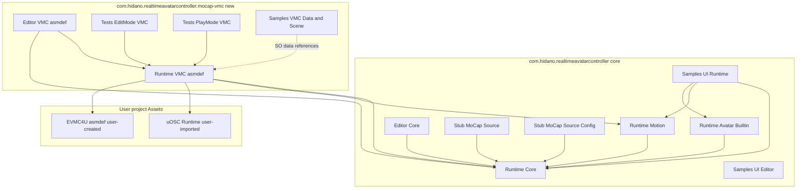
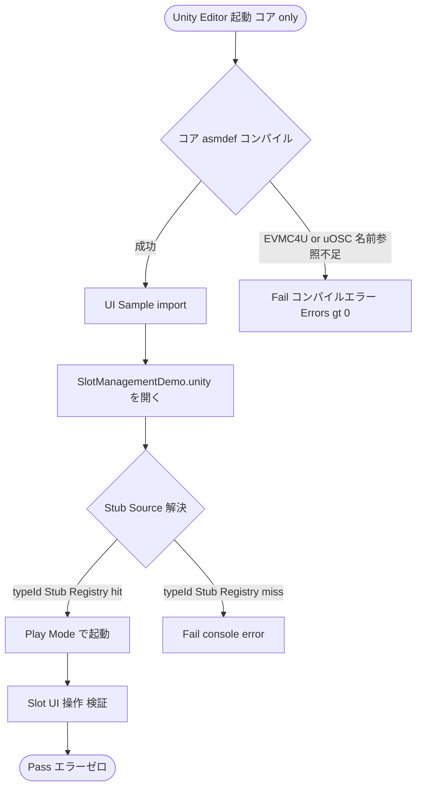
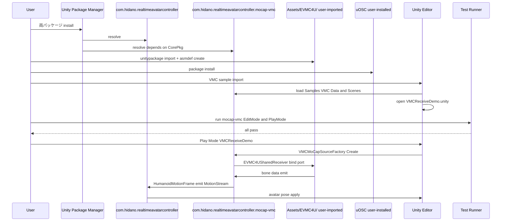
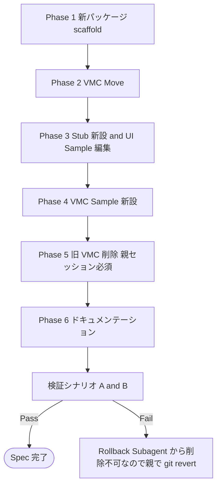

# Design Document — mocap-vmc-package-split

## Overview

**Purpose**: 本 Spec は、EVMC4U 依存を持つ VMC MoCap モジュールを現行コアパッケージ `com.hidano.realtimeavatarcontroller` から新規 UPM パッケージ `com.hidano.realtimeavatarcontroller.mocap-vmc` へ分離し、VMC を使わない利用者がコアパッケージのみで完結できる配布構造を実現する。

**Users**: (a) VMC を使わない MoCap ソース利用者 — コア単独で導入し、UI Sample を Stub MoCap Source 経由で評価できる。(b) VMC を使う利用者 — コア + 新パッケージ + EVMC4U + uOSC の組合せで従来 (コア同梱時) と同等の VMC 受信機能を享受できる。

**Impact**: コアパッケージから VMC 関連ソース・asmdef・Sample 資産・依存参照 (`EVMC4U` / `uOSC.Runtime`) を切り離す。アセンブリ名・GUID・namespace・typeId は据置のため、新パッケージ導入後の動作・参照は完全に保全される。コアパッケージ単独でのコンパイル独立性を新規に確立する。

### Goals

- コアパッケージのみを導入したプロジェクトが、EVMC4U / uOSC 未導入でもコンパイル / Player Build 成功する状態を恒常化する。
- 新パッケージ `com.hidano.realtimeavatarcontroller.mocap-vmc` を独立 UPM として配布し、`package.json` の `dependencies` でコアパッケージを固定バージョン参照する一方向依存構造を確立する。
- 既存 SO 参照 GUID (特に `VMCMoCapSourceConfig_Shared.asset` の `5c4569b4a17944fba4667acebe26c25f`) およびすべての asmdef GUID を破壊せず移動を完了する。
- UI Sample を Stub MoCap Source 経由で動作する provider-agnostic な構成へ再構成し、VMC 不在状態でも Slot UI 検証を完結できる状態にする。
- 新パッケージ Samples~/VMC に独立シーン `VMCReceiveDemo.unity` を新設し、VMC サンプル単体で受信デモが完結する状態にする。
- 検証シナリオ A (コア単独) と検証シナリオ B (両方導入 + EVMC4U/uOSC) の客観的合否基準を確立する。

### Non-Goals

- EVMC4U asmdef 名前参照を Reflection 化する変更 (option ⑤、別 spec)。
- 本家 EVMC4U リポジトリへの asmdef 追加 PR (option ④、プロジェクト外活動)。
- VMC 以外の新規 MoCap source 実装 (Mediapipe / Webカメラ / Sensor 等)。
- 既存 `mocap-vmc` Spec で確定済みの Adapter 内部仕様 (`HumanoidMotionFrame` 構造、属性ベース自己登録、共有 `ExternalReceiver` モデル) の変更。
- `IMoCapSource` / `IMoCapSourceFactory` / `IMoCapSourceRegistry` / `MoCapSourceConfigBase` の抽象 API 変更。
- VMC Sender (送信側) 実装。
- Stub MoCap Source 経由での Avatar Pose 動的描画 (空ストリーム emit 仕様確定済み)。

## Boundary Commitments

### This Spec Owns

- 新規 UPM パッケージ `com.hidano.realtimeavatarcontroller.mocap-vmc` の `package.json` / `Runtime` / `Editor` / `Tests/EditMode` / `Tests/PlayMode` / `Samples~/VMC` 配下の物理ファイル構造。
- 新パッケージ `package.json` の `name` / `displayName` / `version` / `unity` / `unityRelease` / `dependencies` / `samples` フィールド。
- コアパッケージ側 `Samples~/UI/Runtime/RealtimeAvatarController.Samples.UI.asmdef` の `references` から `RealtimeAvatarController.MoCap.VMC` 削除。
- コアパッケージ側 `Samples~/UI/Runtime/` への Stub MoCap Source / Stub MoCap Source Config 新設 (typeId="Stub", 空ストリーム emit)。
- コアパッケージ側 `Samples~/UI/Data/SlotSettings_Shared_Slot1.asset` および `_Slot2.asset` の `moCapSourceDescriptor.Config` 参照を Stub Config の新規 GUID に in-place 書き換え。
- 既存 `Samples~/UI/Data/VMCMoCapSourceConfig_Shared.asset` (GUID `5c4569b4a17944fba4667acebe26c25f`) の新パッケージ `Samples~/VMC/Data/` への GUID 据置移動。
- 新パッケージ `Samples~/VMC/Data/SlotSettings_VMC_Slot1.asset` および新規シーン `VMCReceiveDemo.unity` の新規追加。
- 両パッケージ README / CHANGELOG の更新。
- `.kiro/steering/structure.md` の新規作成 (パッケージ依存マップを含む最小スコープ)。
- 検証シナリオ A / B の合否基準の明文化。

### Out of Boundary

- EVMC4U / uOSC のライブラリ実装そのもの。利用者プロジェクト側で `Assets/EVMC4U/` への取り込みと EVMC4U 用 asmdef 作成を行う前提。
- Reflection 化による EVMC4U asmdef references 削除 (option ⑤、別 spec)。
- `IMoCapSource` 契約 (`SourceType` / `Initialize` / `MotionStream` / `Shutdown`) の改変。
- 既存テストの内部実装変更。テストは asmdef 名と GUID 据置で物理移動するのみ。
- Stub Source の固定ポーズ emit / ループ emit の実装 (将来別 spec 余地)。
- コアパッケージ Runtime / Editor の他 asmdef (`Core` / `Motion` / `Avatar.Builtin` / `Core.Editor`) の構造変更。
- `MoCapSourceRegistry` 内部実装変更。
- VMC Sender 機能。

### Allowed Dependencies

- **新パッケージ → コアパッケージ**: `package.json.dependencies` で `com.hidano.realtimeavatarcontroller` を固定バージョン参照する (一方向依存)。コア側から新パッケージへの逆依存は禁止。
- **新パッケージ Runtime asmdef → 利用者側 EVMC4U asmdef**: `references: ["EVMC4U"]` (利用者プロジェクトに `Assets/EVMC4U/` + 自作 asmdef がある前提)。
- **新パッケージ Runtime asmdef → uOSC**: `references: ["uOSC.Runtime"]` (利用者が `com.hidano.uosc` または `com.hecomi.uosc` を導入する前提)。
- **新パッケージ Runtime asmdef → UniRx**: `references: ["UniRx"]` (`MoCapSourceRegistry` 経由でコアと共有)。
- **コアパッケージ Samples~/UI Runtime asmdef → コア / Motion / Avatar.Builtin / UniRx / UniTask** のみ。`RealtimeAvatarController.MoCap.VMC` 参照は削除。

### Revalidation Triggers

- `IMoCapSource` / `IMoCapSourceFactory` / `MoCapSourceConfigBase` のシグネチャ変更。
- `MoCapSourceRegistry.Resolve` / `Release` の契約変更 (参照共有モデル)。
- typeId `"VMC"` または `"Stub"` の変更。
- 新パッケージ `package.json.dependencies` のコアバージョン指定変更。
- `EVMC4USharedReceiver` の static singleton 仕様変更。
- Domain Reload OFF 関連 (`SubsystemRegistration` 動作) の変更。

## Architecture

### Existing Architecture Analysis

現行アーキテクチャ (本 spec 着手前):

- **コアパッケージ** `com.hidano.realtimeavatarcontroller` 単一構成。
- 4 つの Runtime asmdef: `Core` (抽象 + Registry + Locator) / `Motion` (Pipeline + Cache + Applier) / `Avatar.Builtin` (Provider 内蔵実装) / **`MoCap.VMC` (EVMC4U 依存)**。
- 2 つの Editor asmdef: `Core.Editor` / **`MoCap.VMC.Editor`**。
- Tests asmdef は spec 名ベースのサブディレクトリ (`Tests/EditMode/{slot-core,motion-pipeline,avatar-provider-builtin,mocap-vmc}/` および PlayMode 同様)。
- **Sample**: `Samples~/UI/` のみ。`Samples~/UI/Runtime/RealtimeAvatarController.Samples.UI.asmdef` は `references` に `RealtimeAvatarController.MoCap.VMC` を持つ (asmdef references の唯一の VMC 参照ポイント)。
- Sample 内 SO データ: `Samples~/UI/Data/VMCMoCapSourceConfig_Shared.asset` (GUID `5c4569b4a17944fba4667acebe26c25f`) を `SlotSettings_Shared_Slot1/2.asset` の `moCapSourceDescriptor.Config` で参照。

問題点:
- VMC 関連が分離不可能な単一パッケージ構成のため、VMC を使わない利用者にも EVMC4U / uOSC の導入を強制している。
- EVMC4U が asmdef を含まない unitypackage として配布されるため、利用者は自作 asmdef を生成しないとコンパイルが通らない。

### Architecture Pattern & Boundary Map

選択パターン: **2-Package UPM Layered Composition** (Hybrid Option C 移行戦略)。



**Architecture Integration**:

- **Selected pattern**: 2-Package UPM Layered Composition with Strict One-Way Dependency。Hybrid 移行戦略 (Move + 新設 Stub + In-place 編集) で、既存 GUID 保全と UI Sample 独立化を同時達成。
- **Domain/feature boundaries**: コアは抽象 (Registry / Locator / Factory 契約) と汎用実装 (Motion Pipeline / Builtin Avatar Provider) のみ所有。新パッケージは VMC Adapter 実装 (`EVMC4UMoCapSource` / `EVMC4USharedReceiver` / `VMCMoCapSourceFactory` / `VMCMoCapSourceConfig`) を所有。Stub Source は UI Sample 検証用ダミーとしてコア側 Samples 内に存在 (UI Sample 専用、Runtime 配布対象外)。
- **Existing patterns preserved**: 属性ベース自己登録 (`[RuntimeInitializeOnLoadMethod]` / `[InitializeOnLoadMethod]` で `RegistryLocator.MoCapSourceRegistry` へ登録) / 参照共有モデル (Registry が Config 等価で同一 Adapter を返す) / typeId 識別 (`"VMC"`) / `Subject<MotionFrame>.Synchronize().Publish().RefCount()` のホット Observable 配信。
- **New components rationale**: Stub MoCap Source / StubMoCapSourceConfig — UI Sample が VMC 非依存で動作するためのダミー実装。Stub typeId="Stub"、空ストリーム emit。
- **Steering compliance**: パッケージ間依存の一方向性 (コア → 新パッケージ参照禁止)、`IMoCapSource` 契約の不変性 (Boundary First)、新規 GUID は `[guid]::NewGuid().ToString('N')` ランダム生成 (CLAUDE.md グローバル規則)。

### Technology Stack

| Layer | Choice / Version | Role in Feature | Notes |
|-------|------------------|-----------------|-------|
| Package Manager | Unity Package Manager (UPM) `Unity 6000.3.10f1` | 2 パッケージ間の依存解決と配布 | 新パッケージ `package.json.dependencies` でコア固定バージョン参照 |
| Runtime (新パッケージ) | C# 9 / .NET Standard 2.1 (Unity 6000.3) | VMC Adapter 実装 (据置) | 既存実装の物理移動のみ。Adapter 内部仕様変更なし |
| Reactive | UniRx 7.1.0 | `Subject<MotionFrame>` + `Synchronize().Publish().RefCount()` | コア・新パッケージ双方の `references` で維持 |
| OSC Receiver | uOSC `2.2.0` (例: `com.hecomi.uosc` / `com.hidano.uosc`) | `uOscServer` (`EVMC4USharedReceiver` 内で利用) | 利用者側導入。新パッケージ `references: ["uOSC.Runtime"]` |
| VMC Protocol | EVMC4U (gpsnmeajp/EasyVirtualMotionCaptureForUnity) | `ExternalReceiver` (`EVMC4USharedReceiver` 内で利用) | 利用者側 unitypackage 取込 + asmdef 自作 |
| Test Framework | Unity Test Framework `1.4.5` (NUnit) | EditMode / PlayMode テスト (据置) | テスト asmdef GUID と name は据置 |
| Steering / Spec Memory | `.kiro/steering/structure.md` (新規) | パッケージ依存マップのプロジェクトメモリ | 本 spec で新規作成 |

詳細な調査経緯・代替案比較は `research.md` を参照。

## File Structure Plan

### Directory Structure (本 spec 完了後)

```
RealtimeAvatarController/
├── Packages/
│   ├── com.hidano.realtimeavatarcontroller/                # コアパッケージ (既存)
│   │   ├── package.json                                    # MODIFIED: README/CHANGELOG/version 表記の追従
│   │   ├── README.md                                       # MODIFIED: VMC 分離記述追加
│   │   ├── CHANGELOG.md                                    # MODIFIED: VMC 分離変更記録
│   │   ├── Runtime/
│   │   │   ├── Core/                                       # UNCHANGED
│   │   │   ├── Motion/                                     # UNCHANGED
│   │   │   ├── Avatar/Builtin/                             # UNCHANGED
│   │   │   └── MoCap/                                      # DELETED: 旧 Runtime/MoCap/VMC/ 配下を完全削除
│   │   ├── Editor/
│   │   │   ├── Core/                                       # UNCHANGED
│   │   │   └── MoCap/                                      # DELETED: 旧 Editor/MoCap/VMC/ 配下を完全削除
│   │   ├── Tests/
│   │   │   ├── EditMode/{slot-core,motion-pipeline,avatar-provider-builtin}/  # UNCHANGED
│   │   │   ├── EditMode/mocap-vmc/                          # DELETED: 配下含めて削除
│   │   │   ├── PlayMode/{slot-core,motion-pipeline,avatar-provider-builtin}/  # UNCHANGED
│   │   │   └── PlayMode/mocap-vmc/                          # DELETED
│   │   └── Samples~/UI/
│   │       ├── Data/
│   │       │   ├── BuiltinAvatarProviderConfig_AvatarA.asset # UNCHANGED
│   │       │   ├── BuiltinAvatarProviderConfig_AvatarB.asset # UNCHANGED
│   │       │   ├── SlotSettings_Shared_Slot1.asset           # MODIFIED: Config 参照を StubConfig へ in-place 書換
│   │       │   ├── SlotSettings_Shared_Slot2.asset           # MODIFIED: 同上
│   │       │   ├── StubMoCapSourceConfig_Shared.asset        # NEW: Stub Config の SO 実体 + 新規 GUID
│   │       │   └── VMCMoCapSourceConfig_Shared.asset         # MOVED OUT (新パッケージ Samples~/VMC/Data/ へ)
│   │       ├── Editor/                                      # UNCHANGED
│   │       ├── Prefabs/                                      # UNCHANGED
│   │       ├── Runtime/
│   │       │   ├── RealtimeAvatarController.Samples.UI.asmdef # MODIFIED: references から VMC 削除
│   │       │   ├── StubMoCapSource.cs                         # NEW: 空ストリーム実装 + 自己登録
│   │       │   ├── StubMoCapSourceConfig.cs                   # NEW: MoCapSourceConfigBase 派生の空 SO
│   │       │   └── (既存 .cs UI ファイル群 UNCHANGED)
│   │       └── Scenes/SlotManagementDemo.unity              # UNCHANGED (Stub Config 経由で動作)
│   │
│   └── com.hidano.realtimeavatarcontroller.mocap-vmc/      # 新パッケージ (NEW)
│       ├── package.json                                    # NEW: name / displayName / version / dependencies / samples
│       ├── README.md                                       # NEW: 導入手順 / EVMC4U・uOSC 準備 / 既存 mocap-vmc spec 参照
│       ├── CHANGELOG.md                                    # NEW: 0.1.0 初回バージョン (移動内容要約)
│       ├── Runtime/                                        # MOVED: 旧 Runtime/MoCap/VMC/* (GUID 据置)
│       │   ├── RealtimeAvatarController.MoCap.VMC.asmdef
│       │   ├── AssemblyInfo.cs
│       │   ├── VMCMoCapSourceConfig.cs
│       │   ├── VMCMoCapSourceFactory.cs
│       │   ├── EVMC4UMoCapSource.cs
│       │   └── EVMC4USharedReceiver.cs
│       ├── Editor/                                         # MOVED: 旧 Editor/MoCap/VMC/* (GUID 据置)
│       │   ├── RealtimeAvatarController.MoCap.VMC.Editor.asmdef
│       │   └── VmcMoCapSourceFactoryEditorRegistrar.cs
│       ├── Tests/
│       │   ├── EditMode/                                   # MOVED: 旧 Tests/EditMode/mocap-vmc/* を平置きで配置
│       │   │   ├── RealtimeAvatarController.MoCap.VMC.Tests.EditMode.asmdef
│       │   │   ├── EVMC4USharedReceiverTests.cs
│       │   │   ├── EVMC4UMoCapSourceTests.cs
│       │   │   ├── ExternalReceiverPatchTests.cs
│       │   │   ├── VmcConfigCastTests.cs
│       │   │   └── VmcFactoryRegistrationTests.cs
│       │   └── PlayMode/                                   # MOVED: 旧 Tests/PlayMode/mocap-vmc/* を平置きで配置
│       │       ├── RealtimeAvatarController.MoCap.VMC.Tests.PlayMode.asmdef
│       │       ├── EVMC4UMoCapSourceIntegrationTests.cs
│       │       ├── EVMC4UMoCapSourceSharingTests.cs
│       │       └── SampleSceneSmokeTests.cs
│       └── Samples~/VMC/                                   # NEW
│           ├── Data/
│           │   ├── VMCMoCapSourceConfig_Shared.asset        # MOVED IN (GUID 5c4569b4a17944fba4667acebe26c25f 据置)
│           │   └── SlotSettings_VMC_Slot1.asset             # NEW: VMC Config 参照の新規 SO + 新規 GUID
│           └── Scenes/
│               └── VMCReceiveDemo.unity                    # NEW: VMC 受信デモシーン + 新規 GUID
│
└── ../.kiro/steering/
    └── structure.md                                        # NEW: パッケージ依存マップ (最小スコープ)
```

> 上記 `Tests/EditMode/{slot-core,motion-pipeline,avatar-provider-builtin}/` と Tests/PlayMode/ 同階層は本 spec で UNCHANGED。新パッケージ Tests は中間 `mocap-vmc/` ディレクトリを再現せず `Tests/EditMode/` 直下平置きとする (research.md 参照)。

### Modified Files (詳細)

- `Packages/com.hidano.realtimeavatarcontroller/Samples~/UI/Runtime/RealtimeAvatarController.Samples.UI.asmdef`
  - `references` 配列から `"RealtimeAvatarController.MoCap.VMC"` を削除。残存 references は `RealtimeAvatarController.Core` / `Motion` / `Avatar.Builtin` / `UniRx` / `UniTask`。
- `Packages/com.hidano.realtimeavatarcontroller/Samples~/UI/Data/SlotSettings_Shared_Slot1.asset`
  - `moCapSourceDescriptor.SourceTypeId`: `"VMC"` → `"Stub"`。
  - `moCapSourceDescriptor.Config.guid`: `5c4569b4a17944fba4667acebe26c25f` → 新規 Stub Config の GUID (生成後に確定)。
- `Packages/com.hidano.realtimeavatarcontroller/Samples~/UI/Data/SlotSettings_Shared_Slot2.asset`
  - 同上。
- `Packages/com.hidano.realtimeavatarcontroller/package.json`
  - `version` の更新方針は tasks フェーズで確定 (要件 1.6 に従い、コア側を 0.2.0 へバンプして本 spec の破壊的変更を反映する案を推奨)。
  - `samples` 配列はそのまま (UI Sample 1 件)。
- `Packages/com.hidano.realtimeavatarcontroller/README.md`
  - 「VMC 機能は別パッケージ `com.hidano.realtimeavatarcontroller.mocap-vmc` へ分離されました」記述追加 (移行手順リンク含む)。
- `Packages/com.hidano.realtimeavatarcontroller/CHANGELOG.md`
  - 新バージョン (例: `[0.2.0] - YYYY-MM-DD`) を追加し、`### Removed` で VMC 関連削除を、`### Changed` で UI Sample Stub 化を、`### Migration` で利用者向け導線を記述。

## System Flows

### 検証シナリオ A: コアパッケージ単独運用フロー (要件 7, 10.1, 10.3)



検証ポイント:
- コア asmdef のコンパイル時に `EVMC4U` / `uOSC.Runtime` / `RealtimeAvatarController.MoCap.VMC` の名前参照不足が起こらない (要件 7.1, 7.2)。
- `SlotManagementDemo.unity` を開いた時点で Console Errors == 0 (research.md Decision: 検証シナリオ A の合否基準)。
- typeId="Stub" が `MoCapSourceRegistry` に登録されており、`SlotSettings_Shared_Slot1/2` の Resolve が成功する (要件 5.5, 5.9)。

### 検証シナリオ B: 両パッケージ + EVMC4U/uOSC 導入時の VMC 受信デモフロー (要件 8, 10.2, 10.4)



検証ポイント:
- 新パッケージ `package.json.dependencies` の制約により、コアパッケージが事前に解決される (要件 1.7)。
- 利用者が EVMC4U asmdef および uOSC を準備した状態でのみコンパイル成功 (要件 8.1, 8.2)。
- `RealtimeAvatarController.MoCap.VMC.Tests.EditMode` および `Tests.PlayMode` の全テストが Test Runner / `Unity.exe -batchmode -runTests` で成功 (要件 4.4, 10.2)。
- `VMCReceiveDemo.unity` を Play Mode で起動すると、`VMCMoCapSourceFactory` が `EVMC4UMoCapSource` を生成し、`EVMC4USharedReceiver` が VMC データを受信、`HumanoidMotionFrame` が `MotionStream` 経由で Slot に適用される (要件 10.4)。

## Requirements Traceability

| Requirement | Summary | Components | Interfaces | Flows |
|-------------|---------|------------|------------|-------|
| 1.1 | 新パッケージのリポジトリ配置 | NewPackageManifest | package.json | — |
| 1.2 | name / displayName / unity / unityRelease 設定 | NewPackageManifest | package.json | — |
| 1.3 | dependencies にコア固定バージョン記述 | NewPackageManifest | package.json | — |
| 1.4 | samples エントリ登録 (Samples~/VMC) | NewPackageManifest | package.json | — |
| 1.5 | ディレクトリ構造 (Runtime/Editor/Tests/Samples~) | File Structure Plan | — | — |
| 1.6 | 初期バージョンとコア整合 (0.1.0 推奨) | NewPackageManifest | package.json | — |
| 1.7 | 新パッケージ単独導入時のコア未解決エラー | UPM Dependency Resolution | package.json | シナリオ B (Pre) |
| 2.1 | VMC Runtime ファイルの新パッケージ Runtime/ への移動 | VmcRuntimeAsmdef (MOVED) | RealtimeAvatarController.MoCap.VMC.asmdef | — |
| 2.2 | asmdef 名 / rootNamespace 据置 | VmcRuntimeAsmdef | asmdef name | — |
| 2.3 | references 据置 (Core/Motion/uOSC.Runtime/UniRx/EVMC4U) | VmcRuntimeAsmdef | asmdef references | — |
| 2.4 | .cs / asmdef / AssemblyInfo の .meta GUID 据置 | File Move (GUID Preserved) | meta files | — |
| 2.5 | namespace 維持 | Source Move | C# namespace | — |
| 2.6 | コア単独で VMC 名前参照ゼロを確認 | コア asmdef 構成 | asmdef references | シナリオ A |
| 2.7 | 旧 Runtime/MoCap/VMC/ ディレクトリ完全削除 | File Cleanup | filesystem | — |
| 3.1 | Editor 側 VMC ソースと asmdef の移動 | VmcEditorAsmdef (MOVED) | RealtimeAvatarController.MoCap.VMC.Editor.asmdef | — |
| 3.2 | Editor asmdef 名 / includePlatforms 据置 | VmcEditorAsmdef | asmdef | — |
| 3.3 | Editor asmdef references 据置 | VmcEditorAsmdef | asmdef references | — |
| 3.4 | コア単独で Editor コンパイル独立 | コア Editor 構成 | asmdef references | シナリオ A |
| 3.5 | 旧 Editor/MoCap/VMC/ 削除 | File Cleanup | filesystem | — |
| 4.1 | EditMode テストの移動 | VmcTestsEditAsmdef (MOVED) | RealtimeAvatarController.MoCap.VMC.Tests.EditMode.asmdef | — |
| 4.2 | PlayMode テストの移動 | VmcTestsPlayAsmdef (MOVED) | RealtimeAvatarController.MoCap.VMC.Tests.PlayMode.asmdef | — |
| 4.3 | テスト asmdef 名 / references 据置 | VmcTestsAsmdef | asmdef | — |
| 4.4 | 全テスト成功 (両方導入 + EVMC4U/uOSC) | Test Runner | NUnit / UTF | シナリオ B |
| 4.5 | 旧 Tests/{EditMode,PlayMode}/mocap-vmc/ 削除 | File Cleanup | filesystem | — |
| 4.6 | テスト .meta GUID 据置 | File Move | meta files | — |
| 5.1 | UI Sample asmdef references から VMC 削除 | UISampleAsmdef (MODIFIED) | asmdef references | シナリオ A |
| 5.2 | UI Sample コードから VMC namespace の `using` 削除 | UISampleSources | C# source | — |
| 5.3 | Stub MoCap Source / Stub Config の新設 | StubMoCapSource, StubMoCapSourceConfig | IMoCapSource, MoCapSourceConfigBase | — |
| 5.4 | Stub MotionStream の空ストリーム emit | StubMoCapSource | IObservable\<MotionFrame\> | シナリオ A |
| 5.5 | Stub の自己登録 (typeId="Stub") | StubMoCapSourceFactory | IMoCapSourceFactory | シナリオ A |
| 5.6 | SlotSettings_Shared_Slot1/2 の Config 参照を Stub に差替 | SO Asset Edit | YAML | シナリオ A |
| 5.7 | Stub Config の .meta GUID をランダム生成 | New GUID Generation | meta file | — |
| 5.8 | コア Sample から VMCMoCapSourceConfig_Shared.asset 削除 | File Move | filesystem | — |
| 5.9 | UI Sample が Stub Source 経由で動作 | SlotManagementDemo.unity | runtime | シナリオ A |
| 5.10 | 検証シナリオを README に明記 | Core Sample README | doc | — |
| 6.1 | 新パッケージ Samples~/VMC/ 新設 + samples 登録 | NewPackageManifest, VmcSamples | package.json | — |
| 6.2 | VMCMoCapSourceConfig_Shared.asset を新パッケージへ GUID 据置移動 | File Move | meta file | シナリオ B |
| 6.3 | 旧 UI サンプル相当の VMC 受信デモ最小構成 | VMCReceiveDemo Scene | runtime | シナリオ B |
| 6.4 | 統合デモで VMC 駆動再現 | Pipeline Integration | runtime | シナリオ B |
| 6.5 | EVMC4U / uOSC 準備手順を README に明記 | New Package README | doc | — |
| 6.6 | 新規 Scene の .meta GUID をランダム生成 | New GUID Generation | meta file | — |
| 7.1 | コア単独でコンパイルエラーゼロ | コア asmdef + 不在の VMC 参照 | asmdef references | シナリオ A |
| 7.2 | コア asmdef 全件で VMC/EVMC4U/uOSC 参照禁止 | All Core asmdefs | asmdef references | シナリオ A |
| 7.3 | UI Sample 起動で MissingReferenceException 等が出ない | SlotManagementDemo runtime | runtime | シナリオ A |
| 7.4 | VMC 関連参照を持つコア asmdef があれば不合格 | 検証手順 | asmdef references | シナリオ A |
| 7.5 | Player Build がコア単独で成功 | コア構成 | Unity Build | シナリオ A 拡張 |
| 8.1 | 両パッケージ + EVMC4U + uOSC でコンパイル成功 | VmcRuntimeAsmdef | asmdef references | シナリオ B |
| 8.2 | EVMC4U/uOSC 不在時に明示的な参照エラー | VmcRuntimeAsmdef | asmdef references | シナリオ B (Pre) |
| 8.3 | 新パッケージ README に EVMC4U/uOSC 準備手順 | New Package README | doc | — |
| 8.4 | 既存仕様 (typeId VMC, 属性ベース自己登録 等) 維持を README 明記 | New Package README | doc | — |
| 8.5 | references を ["EVMC4U"] のまま据置 (Reflection 化は別 spec) | VmcRuntimeAsmdef | asmdef references | — |
| 9.1 | コア README に VMC 分離記述追加 | Core README (MODIFIED) | doc | — |
| 9.2 | コア CHANGELOG に変更記録 | Core CHANGELOG (MODIFIED) | doc | — |
| 9.3 | 新パッケージ README 新設 | New Package README | doc | — |
| 9.4 | 新パッケージ CHANGELOG 新設 | New Package CHANGELOG | doc | — |
| 9.5 | .kiro/steering/structure.md 更新 (新規作成) | Steering Doc | doc | — |
| 9.6 | 他 steering ドキュメントの整合性確認 | Steering Audit | doc | — |
| 10.1 | 検証シナリオ A の手順確立 | Validation Procedure | runbook | シナリオ A |
| 10.2 | 検証シナリオ B の手順確立 | Validation Procedure | runbook | シナリオ B |
| 10.3 | UI Sample が Stub 経由で UI 検証 完結 | SlotManagementDemo runtime | runtime | シナリオ A |
| 10.4 | VMC サンプルで HumanoidMotionFrame 適用確認 | VMCReceiveDemo runtime | runtime | シナリオ B |
| 10.5 | 失敗時は未完了扱い | Validation Process | runbook | — |
| 10.6 | 検証手順を再現可能な形で記録 | Validation Procedure | runbook | — |

## Components and Interfaces

| Component | Domain/Layer | Intent | Req Coverage | Key Dependencies (P0/P1) | Contracts |
|-----------|--------------|--------|--------------|--------------------------|-----------|
| NewPackageManifest | Packaging | 新パッケージ `package.json` を定義し、コア固定バージョン依存・samples 登録を行う | 1.1, 1.2, 1.3, 1.4, 1.5, 1.6, 1.7 | UPM (P0), Core package version (P0) | State |
| VmcRuntimeAsmdef | Packaging / Runtime | VMC Runtime 一式を新パッケージ Runtime/ へ GUID 据置移動 | 2.1, 2.2, 2.3, 2.4, 2.5, 2.6, 2.7 | Core asmdef (P0), Motion asmdef (P0), uOSC.Runtime (P0), UniRx (P0), EVMC4U (P0) | State |
| VmcEditorAsmdef | Packaging / Editor | VMC Editor 自己登録を新パッケージ Editor/ へ GUID 据置移動 | 3.1, 3.2, 3.3, 3.4, 3.5 | VmcRuntimeAsmdef (P0), Core (P0) | State |
| VmcTestsEditAsmdef | Packaging / Tests | VMC EditMode テストを新パッケージ Tests/EditMode/ へ移動 | 4.1, 4.3, 4.4, 4.5, 4.6 | VmcRuntimeAsmdef (P0), NUnit (P0) | State |
| VmcTestsPlayAsmdef | Packaging / Tests | VMC PlayMode テストを新パッケージ Tests/PlayMode/ へ移動 | 4.2, 4.3, 4.4, 4.5, 4.6 | VmcRuntimeAsmdef (P0), UniTask (P0) | State |
| StubMoCapSource | Core / Samples (UI) | UI Sample 検証用ダミー実装 (空ストリーム emit) | 5.3, 5.4, 5.5, 5.9 | Core IMoCapSource (P0), UniRx (P0) | Service |
| StubMoCapSourceConfig | Core / Samples (UI) | Stub Source 用空 SO Config | 5.3, 5.5, 5.6, 5.7 | Core MoCapSourceConfigBase (P0) | State |
| StubMoCapSourceFactory | Core / Samples (UI) | Stub Source の自己登録 typeId="Stub" | 5.5 | Core IMoCapSourceFactory (P0), RegistryLocator (P0) | Service |
| UISampleAsmdef | Core / Samples (UI) | UI Sample asmdef references から VMC 削除 | 5.1, 5.2, 7.2 | Core (P0), Motion (P0), Avatar.Builtin (P0) | State |
| SlotSettingsSharedAssetEdit | Core / Samples (UI) | SlotSettings_Shared_Slot1/2 の Config 参照を Stub に差替 | 5.6, 5.8 | StubMoCapSourceConfig (P0) | State |
| VmcSamples | New Package / Samples | 新パッケージ Samples~/VMC (Data + Scene) | 6.1, 6.2, 6.3, 6.4, 6.6 | VMCMoCapSourceConfig (P0), Core SlotManager (P0) | State |
| CoreReadmeUpdate | Documentation | コア README に VMC 分離記述追加 | 9.1, 5.10 | — | — |
| CoreChangelogUpdate | Documentation | コア CHANGELOG 変更記録 | 9.2 | — | — |
| NewPackageReadme | Documentation | 新パッケージ README (導入手順 / 利用者準備手順) | 8.3, 8.4, 8.5, 9.3, 6.5 | — | — |
| NewPackageChangelog | Documentation | 新パッケージ CHANGELOG | 9.4 | — | — |
| SteeringStructureDoc | Documentation / Steering | `.kiro/steering/structure.md` 新規作成 (パッケージ依存マップ最小構成) | 9.5, 9.6 | — | — |
| ValidationProcedureA | Validation | コア単独運用の合否判定手順 | 10.1, 10.3, 10.5, 10.6, 7.5 | Unity Editor (P0) | — |
| ValidationProcedureB | Validation | 両パッケージ運用の合否判定手順 | 10.2, 10.4, 10.5, 10.6 | Unity Editor + Test Runner (P0) | — |

### Packaging / Runtime

#### NewPackageManifest

| Field | Detail |
|-------|--------|
| Intent | 新パッケージ `package.json` を定義し、コアパッケージへの固定バージョン依存と Samples~/VMC のサンプルエントリ登録を行う。 |
| Requirements | 1.1, 1.2, 1.3, 1.4, 1.5, 1.6, 1.7 |

**Responsibilities & Constraints**
- `name = "com.hidano.realtimeavatarcontroller.mocap-vmc"` 固定。
- `displayName` は VMC 用パッケージである旨を含む (例: `"Realtime Avatar Controller — MoCap VMC"`)。
- `unity = "6000.3"` / `unityRelease = "10f1"` (コアと一致)。
- `version = "0.1.0"` を初期値とし、コア側の `version` と同期する (research.md Decision 参照)。
- `dependencies` に `com.hidano.realtimeavatarcontroller` を **固定バージョン** で記述 (range 演算子 `^` `~` 不使用、Unity UPM の慣行に従う)。
- `dependencies` に EVMC4U / uOSC / UniRx は記述しない (利用者プロジェクト側 / コア経由で解決)。
- `samples` 配列に VMC サンプル 1 件 (`displayName: "VMC Sample"`, `description: "EVMC4U-based VMC receiver demo with shared receiver model."`, `path: "Samples~/VMC"`) を登録。
- `keywords` は `["avatar","mocap","vmc","vtuber","realtime"]` を維持。
- `author` / `license` はコアと同一。

**Dependencies**
- Outbound: コア `package.json.version` (P0) — 固定バージョン参照値の根拠。
- External: Unity Package Manager (P0) — `dependencies` 解決を担う。

**Contracts**: State [x]

##### State Management
- State model: `package.json` ファイル単一。
- Persistence & consistency: Git 管理。コア `version` の bump 時は新パッケージの `dependencies` も追従更新する運用を README に明記。
- Concurrency strategy: なし (単一ファイル編集)。

**Implementation Notes**
- Integration: Git リポジトリで両 `package.json` を同一コミットで更新する CHANGELOG 運用とリンクさせる。
- Validation: `manifest.json` で両パッケージを別々のパスから解決可能なことを Unity Editor で確認 (シナリオ B Pre)。
- Risks: 利用者がコアと新パッケージの version を不揃いで導入した場合の動作未保証 → README に「両者を揃えて導入する」旨を明記。

#### VmcRuntimeAsmdef

| Field | Detail |
|-------|--------|
| Intent | VMC Runtime 4 ファイル + asmdef + AssemblyInfo を新パッケージ Runtime/ へ GUID 据置で物理移動する。 |
| Requirements | 2.1, 2.2, 2.3, 2.4, 2.5, 2.6, 2.7 |

**Responsibilities & Constraints**
- 移動対象ファイル一覧 (.cs と対応 .meta):
  - `RealtimeAvatarController.MoCap.VMC.asmdef` (asmdef GUID `cd3d751103e4444099d4cb10ef372a29` を据置)
  - `AssemblyInfo.cs`
  - `VMCMoCapSourceConfig.cs`
  - `VMCMoCapSourceFactory.cs`
  - `EVMC4UMoCapSource.cs`
  - `EVMC4USharedReceiver.cs`
- asmdef 名: `RealtimeAvatarController.MoCap.VMC` (据置)。
- `rootNamespace`: `RealtimeAvatarController.MoCap.VMC` (据置)。
- `references`: `["RealtimeAvatarController.Core","RealtimeAvatarController.Motion","uOSC.Runtime","UniRx","EVMC4U"]` (据置)。
- `includePlatforms` 空 / `excludePlatforms` 空 (据置)。
- 移動先: `Packages/com.hidano.realtimeavatarcontroller.mocap-vmc/Runtime/`。
- 各 .meta ファイル内 `guid:` 値は変更禁止。
- C# namespace は `RealtimeAvatarController.MoCap.VMC` (据置)。

**Dependencies**
- Outbound:
  - `RealtimeAvatarController.Core` (P0) — `IMoCapSource` / `IMoCapSourceFactory` / `MoCapSourceConfigBase` / `RegistryLocator` 参照。
  - `RealtimeAvatarController.Motion` (P0) — `HumanoidMotionFrame` 発行先。
  - `UniRx` (P0) — `Subject<T>` / `IObservable<T>`。
- External:
  - `EVMC4U` (P0) — 利用者プロジェクト側で `Assets/EVMC4U/` + 自作 asmdef 必須。`ExternalReceiver` 参照。
  - `uOSC.Runtime` (P0) — `uOscServer` 参照。

**Contracts**: State [x]

##### State Management
- State model: ディレクトリ + ファイル群 + asmdef。
- Persistence & consistency: Git ファイル move + meta GUID 据置。`git mv` を使用し、コミット履歴で改名を追跡可能にする。
- Concurrency strategy: 親セッションでの一括移動 (Subagent から `git rm` 不可制約のため、削除を伴うステップは親セッションで実施)。

**Implementation Notes**
- Integration: 移動完了後に Unity Editor を再起動し、Library 再生成を許容する。Library 再生成中は Unity MCP 接続が一時的に切断される可能性あり。
- Validation: `Grep "RealtimeAvatarController.MoCap.VMC"` をコア側 asmdef + .cs で実行し、ヒットゼロ件を確認 (要件 2.6, 7.2)。
- Risks: meta GUID の意図しない変更 (Unity が新規 GUID を生成してしまうケース) → 移動はファイルシステム mv のみで行い、Unity Editor を閉じた状態で実施する。

#### VmcEditorAsmdef

| Field | Detail |
|-------|--------|
| Intent | VMC Editor 自己登録 (`VmcMoCapSourceFactoryEditorRegistrar`) と asmdef を新パッケージ Editor/ へ GUID 据置移動する。 |
| Requirements | 3.1, 3.2, 3.3, 3.4, 3.5 |

**Responsibilities & Constraints**
- 移動対象: `RealtimeAvatarController.MoCap.VMC.Editor.asmdef` + `VmcMoCapSourceFactoryEditorRegistrar.cs` + 各 .meta。
- asmdef 名: `RealtimeAvatarController.MoCap.VMC.Editor` (据置)。
- `includePlatforms`: `["Editor"]` (据置)。
- `references`: `["RealtimeAvatarController.MoCap.VMC","RealtimeAvatarController.Core"]` (据置)。

**Dependencies**
- Outbound: VmcRuntimeAsmdef (P0), Core (P0)。

**Contracts**: State [x]

##### State Management
- 同 VmcRuntimeAsmdef。

**Implementation Notes**
- Integration: Editor 自己登録 (`[InitializeOnLoadMethod]`) は新パッケージ Editor asmdef がロードされた瞬間に発火する。Unity Editor 再起動後の自己登録動作を Inspector ドロップダウンに `"VMC"` typeId が現れることで確認。
- Risks: なし (Runtime 同様 Move のみ)。

#### VmcTestsEditAsmdef / VmcTestsPlayAsmdef

| Field | Detail |
|-------|--------|
| Intent | VMC EditMode / PlayMode テストファイル + asmdef を新パッケージ Tests/EditMode/ または Tests/PlayMode/ 直下へ平置きで GUID 据置移動する。 |
| Requirements | 4.1, 4.2, 4.3, 4.4, 4.5, 4.6 |

**Responsibilities & Constraints**
- 移動対象 (EditMode):
  - `RealtimeAvatarController.MoCap.VMC.Tests.EditMode.asmdef`
  - `EVMC4USharedReceiverTests.cs`
  - `EVMC4UMoCapSourceTests.cs`
  - `ExternalReceiverPatchTests.cs`
  - `VmcConfigCastTests.cs`
  - `VmcFactoryRegistrationTests.cs`
- 移動対象 (PlayMode):
  - `RealtimeAvatarController.MoCap.VMC.Tests.PlayMode.asmdef`
  - `EVMC4UMoCapSourceIntegrationTests.cs`
  - `EVMC4UMoCapSourceSharingTests.cs`
  - `SampleSceneSmokeTests.cs`
- asmdef 名と GUID 据置。
- 中間ディレクトリ `mocap-vmc/` は再現せず、`Tests/EditMode/` および `Tests/PlayMode/` 直下に平置き (research.md 参照)。
- testables 設定の `manifest.json` 側更新は本 spec 範囲では不要 (新パッケージは独立して `testables` 配列に追加される必要はあるが、これは利用者側プロジェクトの構成、もしくは本リポジトリ内 `RealtimeAvatarController/Packages/manifest.json` を tasks フェーズで更新)。

**Dependencies**
- Outbound: VmcRuntimeAsmdef (P0)。

**Contracts**: State [x]

**Implementation Notes**
- Integration: テストランナーは asmdef 名で照合するため、ディレクトリ移動による影響なし。
- Validation: シナリオ B にて `Unity.exe -batchmode -runTests` で全テスト pass を確認。
- Risks: `manifest.json` の `testables` 配列に新パッケージ名を追加する必要がある場合あり (現行 `testables: ["com.hidano.realtimeavatarcontroller"]` のみ)。tasks フェーズで判断。

### Core / Samples (UI)

#### StubMoCapSource

| Field | Detail |
|-------|--------|
| Intent | UI Sample の検証用ダミー `IMoCapSource` 実装。空ストリーム emit。 |
| Requirements | 5.3, 5.4, 5.5, 5.9 |

**Responsibilities & Constraints**
- `SourceType => "Stub"` を返す。
- `Initialize(MoCapSourceConfigBase config)`: `config` を `StubMoCapSourceConfig` にキャスト (失敗時 `ArgumentException`)、状態を `Running` に遷移。`EVMC4UMoCapSource` のような外部受信は行わない。
- `MotionStream`: `Subject<MotionFrame>().Synchronize().Publish().RefCount()` を返す。OnNext は呼ばない (空ストリーム)。
- `Shutdown` / `Dispose`: 状態を `Disposed` に遷移、`_rawSubject.OnCompleted()` + `Dispose()`。
- 二重 Initialize / Shutdown はそれぞれ `InvalidOperationException` / 冪等扱い (`EVMC4UMoCapSource` の状態機械契約と一致)。
- メインスレッドからの呼び出し前提。

**Dependencies**
- Outbound: `RealtimeAvatarController.Core.IMoCapSource` (P0), `RealtimeAvatarController.Core.MotionFrame` (P0), `UniRx.Subject<T>` (P0), `RealtimeAvatarController.Core.MoCapSourceConfigBase` (P0)。

**Contracts**: Service [x]

##### Service Interface
```csharp
namespace RealtimeAvatarController.Samples.UI
{
    /// <summary>
    /// UI Sample 検証用ダミー MoCap Source。
    /// MotionStream は空ストリームとして振る舞い、OnNext は発行しない。
    /// SourceType は "Stub" を返し、Initialize/Shutdown のライフサイクルは
    /// EVMC4UMoCapSource と同等の状態機械を持つ。
    /// </summary>
    internal sealed class StubMoCapSource : RealtimeAvatarController.Core.IMoCapSource, System.IDisposable
    {
        public string SourceType { get; }                            // 戻り値 "Stub"
        public System.IObservable<RealtimeAvatarController.Core.MotionFrame> MotionStream { get; }
        public void Initialize(RealtimeAvatarController.Core.MoCapSourceConfigBase config);
        public void Shutdown();
        public void Dispose();                                       // == Shutdown
    }
}
```
- Preconditions: `config` is `StubMoCapSourceConfig`. `Initialize` は `Uninitialized` 状態でのみ呼べる。
- Postconditions: `Initialize` 後に `MotionStream` 購読可能。OnNext は永久に発火しない。`Shutdown` 後は `OnCompleted` を経て購読解除済み。
- Invariants: スレッドセーフネスは `Subject.Synchronize()` で保証。

**Implementation Notes**
- Integration: `StubMoCapSourceFactory` (下記) が `RegistryLocator.MoCapSourceRegistry.Register("Stub", new StubMoCapSourceFactory())` で自己登録する。
- Validation: シナリオ A で `SlotManagementDemo.unity` を Play Mode 起動後、`SlotManagerBehaviour` が `MotionCache.SetSource` で購読することを確認 (例外なし)。
- Risks: 利用者が Stub 経由で Avatar Pose の動作確認を期待する → README に「VMC 受信デモは新パッケージ Samples~/VMC を参照」と明記して回避。

#### StubMoCapSourceConfig

| Field | Detail |
|-------|--------|
| Intent | Stub Source 用の空 ScriptableObject Config。 |
| Requirements | 5.3, 5.5, 5.6, 5.7 |

**Responsibilities & Constraints**
- `MoCapSourceConfigBase` を継承する空クラス (フィールド無し)。
- `[CreateAssetMenu(menuName = "RealtimeAvatarController/Samples/Stub MoCap Source Config", fileName = "StubMoCapSourceConfig")]` を付与。
- 新規 `.asset` として `Samples~/UI/Data/StubMoCapSourceConfig_Shared.asset` を作成。
- `.meta` の GUID は **PowerShell `[guid]::NewGuid().ToString('N')` で乱数 32 桁 hex 生成**、既存 21 GUID と一致しないこと、相互シフトパターンを取らないことを Grep で確認 (CLAUDE.md グローバル規則)。

**Dependencies**
- Outbound: `RealtimeAvatarController.Core.MoCapSourceConfigBase` (P0)。

**Contracts**: State [x]

##### State Management
- State model: 単一 SO アセット。
- Persistence & consistency: Git 管理。

**Implementation Notes**
- Integration: SlotSettings_Shared_Slot1/2 から `moCapSourceDescriptor.Config` 経由で参照。
- Risks: 利用者が独自の Stub バリアントを派生したい場合、本 SO は `[CreateAssetMenu]` のみ提供し継承可能とする。

#### StubMoCapSourceFactory

| Field | Detail |
|-------|--------|
| Intent | Stub Source の自己登録 Factory (typeId="Stub")。 |
| Requirements | 5.5 |

**Responsibilities & Constraints**
- `IMoCapSourceFactory` を実装。
- `Create(MoCapSourceConfigBase config)`: `config` を `StubMoCapSourceConfig` にキャストし `StubMoCapSource` インスタンスを返す (キャスト失敗時 `ArgumentException`)。
- `[RuntimeInitializeOnLoadMethod(BeforeSceneLoad)]` で Player ビルド + Runtime 起動時に登録。
- `[InitializeOnLoadMethod]` で Editor 起動時に登録 (Editor サブパスを別ファイルに分離せず、`#if UNITY_EDITOR` ガード付きで同一クラス内に置く案を採用)。
- typeId 定数: `public const string StubSourceTypeId = "Stub"`。
- 登録衝突 (`RegistryConflictException`) は `RegistryLocator.ErrorChannel` へ `SlotErrorCategory.RegistryConflict` として通知 (`VMCMoCapSourceFactory` と同パターン)。

**Dependencies**
- Outbound: `RealtimeAvatarController.Core.IMoCapSourceFactory` (P0), `RealtimeAvatarController.Core.RegistryLocator` (P0)。

**Contracts**: Service [x]

##### Service Interface
```csharp
namespace RealtimeAvatarController.Samples.UI
{
    /// <summary>
    /// StubMoCapSource を生成・自己登録する Factory。
    /// typeId="Stub" として MoCapSourceRegistry に Runtime + Editor 両系で登録。
    /// </summary>
    internal sealed class StubMoCapSourceFactory : RealtimeAvatarController.Core.IMoCapSourceFactory
    {
        public const string StubSourceTypeId = "Stub";
        public RealtimeAvatarController.Core.IMoCapSource Create(
            RealtimeAvatarController.Core.MoCapSourceConfigBase config);
    }
}
```
- Preconditions: `config` is non-null and assignable to `StubMoCapSourceConfig`。
- Postconditions: `StubMoCapSource` インスタンスが返り、状態は `Uninitialized`。
- Invariants: typeId="Stub" は登録時の重複検知の対象。

**Implementation Notes**
- Integration: Editor / Runtime 双方の自己登録動作は `VMCMoCapSourceFactory` と同一パターン。`[UnityEditor.InitializeOnLoadMethod]` の Editor only 部分は `#if UNITY_EDITOR` で囲む。
- Validation: VmcFactoryRegistrationTests と同様の構成で StubFactoryRegistrationTests を新設するかは tasks フェーズで判断 (本 spec の検証要件は `MoCapSourceRegistry` に typeId="Stub" が解決できることのみ)。

#### UISampleAsmdef

| Field | Detail |
|-------|--------|
| Intent | UI Sample asmdef references から `RealtimeAvatarController.MoCap.VMC` を削除し、provider-agnostic 構成へ移行する。 |
| Requirements | 5.1, 5.2, 7.2 |

**Responsibilities & Constraints**
- `RealtimeAvatarController.Samples.UI.asmdef` の `references` から `"RealtimeAvatarController.MoCap.VMC"` 1 行を削除。
- 残存 references: `["RealtimeAvatarController.Core","RealtimeAvatarController.Motion","RealtimeAvatarController.Avatar.Builtin","UniRx","UniTask"]`。
- Samples~/UI/Runtime 配下の C# ソース内で `using RealtimeAvatarController.MoCap.VMC;` または同 namespace の型直接参照が無いことを Grep で確認 (現状ヒットゼロ件、変更不要)。

**Dependencies**
- Outbound: Core / Motion / Avatar.Builtin / UniRx / UniTask (P0)。

**Contracts**: State [x]

**Implementation Notes**
- Integration: asmdef 編集後に Unity Editor 再起動またはアセンブリ再コンパイルを実施。
- Validation: シナリオ A の Errors==0 で確認。

#### SlotSettingsSharedAssetEdit

| Field | Detail |
|-------|--------|
| Intent | `Samples~/UI/Data/SlotSettings_Shared_Slot1.asset` および `_Slot2.asset` の `moCapSourceDescriptor` を Stub に差し替える。 |
| Requirements | 5.6, 5.8 |

**Responsibilities & Constraints**
- 各 SlotSettings YAML の `moCapSourceDescriptor` ブロックを以下に変更:
  - `SourceTypeId: "VMC"` → `SourceTypeId: "Stub"`
  - `Config.guid: 5c4569b4a17944fba4667acebe26c25f` → 新規生成された Stub Config の GUID
  - `Config.fileID` / `Config.type` は元のまま (`fileID: 11400000` / `type: 2`)
- `VMCMoCapSourceConfig_Shared.asset` および `.meta` をコア側 Sample から削除 (新パッケージ Samples~/VMC/Data/ への移動と対)。
- 編集方法は **Unity Editor の Inspector で SlotSettings を開いて新 Stub Config asset をドラッグ&ドロップ** する手順を推奨 (Risk 1 mitigation, research.md 参照)。

**Dependencies**
- Outbound: StubMoCapSourceConfig (P0), 新規 Stub Config GUID (P0)。

**Contracts**: State [x]

**Implementation Notes**
- Integration: 編集後に Unity Editor で SlotSettings を再オープンし、Inspector に "Stub" typeId / Stub Config 名が表示されることを目視確認。
- Validation: シナリオ A で `SlotManagerBehaviour` が `AddSlotAsync(SlotSettings_Shared_Slot1)` を呼び、Slot が Active 遷移することを確認。
- Risks: YAML 直接編集による fileID 不整合 → Inspector 経由編集を推奨手順とする。

### New Package / Samples

#### VmcSamples

| Field | Detail |
|-------|--------|
| Intent | 新パッケージ Samples~/VMC/ を新設し、VMCMoCapSourceConfig_Shared.asset を GUID 据置で受け入れ、新規 Scene と SlotSettings を追加する。 |
| Requirements | 6.1, 6.2, 6.3, 6.4, 6.6 |

**Responsibilities & Constraints**
- `Samples~/VMC/Data/VMCMoCapSourceConfig_Shared.asset` を旧位置から GUID 据置 (`5c4569b4a17944fba4667acebe26c25f`) で受け入れ。
- `Samples~/VMC/Data/SlotSettings_VMC_Slot1.asset` を新規作成:
  - `slotId: "vmc-slot-01"`
  - `displayName: "VMC Slot 1"`
  - `avatarProviderDescriptor.ProviderTypeId: "Builtin"` + Config 参照は新パッケージ側に Builtin Avatar Config を置かないため `null` (利用者側で差し替え) または UI Sample 側 BuiltinAvatarProviderConfig_AvatarA.asset への相互参照可能性は spec 確定対象外として tasks フェーズで再検討。
  - `moCapSourceDescriptor.SourceTypeId: "VMC"` + `Config` 参照は移動した `VMCMoCapSourceConfig_Shared.asset`。
  - `.meta` GUID は新規ランダム生成。
- `Samples~/VMC/Scenes/VMCReceiveDemo.unity` を新規作成:
  - 最小構成: Camera + DirectionalLight + SlotManagerBehaviour (initialSlots に SlotSettings_VMC_Slot1 を割当) + 簡易 Pose 表示 UI (Optional, tasks フェーズ判断)。
  - `.meta` GUID は新規ランダム生成。

**Dependencies**
- Outbound: VmcRuntimeAsmdef (P0), Core SlotManager (P0), Motion Pipeline (P0), Avatar.Builtin (P1, AvatarProvider Config 共有時のみ)。

**Contracts**: State [x]

##### State Management
- State model: SO アセット 2 件 (移動 + 新規) + Scene 1 件 (新規)。
- Persistence & consistency: Git 管理。新規 GUID 4 件 (SlotSettings_VMC_Slot1.asset, SlotSettings_VMC_Slot1.asset.meta は同一概念 / .unity, .unity.meta は同一概念 / もし Avatar Provider Config を新設する場合は追加 1 件) は CLAUDE.md ルールで生成。

**Implementation Notes**
- Integration: 新規 Scene は EditMode で開けることと、Play Mode (シナリオ B) で起動できることを確認。
- Validation: シナリオ B で `VMCReceiveDemo.unity` を開き、EVMC4U + uOSC 準備済みの環境で VMC 受信が機能することを確認。
- Risks: AvatarProviderConfig をどこに置くか — UI Sample 側 (BuiltinAvatarProviderConfig_AvatarA.asset) を参照する設計だと、VMC サンプル単独インポート時に Avatar Provider Config が未解決になる。tasks フェーズで「新パッケージ側に Builtin AvatarProvider Config の写しを置く」または「VMC サンプルは UI Sample との併用を要求する」のいずれかを確定。

### Documentation

#### CoreReadmeUpdate / CoreChangelogUpdate / NewPackageReadme / NewPackageChangelog

| Field | Detail |
|-------|--------|
| Intent | 両パッケージ README / CHANGELOG を新構成に整合させる。 |
| Requirements | 9.1, 9.2, 9.3, 9.4, 5.10, 6.5, 8.3, 8.4, 8.5 |

**Responsibilities & Constraints**
- **コア README 追記内容**:
  - 「VMC 受信機能は別パッケージ `com.hidano.realtimeavatarcontroller.mocap-vmc` に分離されました」
  - 移行手順: 「VMC を使う場合は両パッケージを `manifest.json.dependencies` に追加し、利用者側で EVMC4U と uOSC を準備してください」リンクは新パッケージ README へ。
  - 「UI Sample は Stub MoCap Source 経由で動作し、Slot UI 検証が VMC 不要で完結します」(要件 5.10)。
- **コア CHANGELOG 追記内容** (`[0.2.0]` 等の新バージョン下):
  - `### Removed`: VMC Runtime / Editor / Tests / Sample Data を新パッケージへ移動。
  - `### Changed`: UI Sample asmdef の references から VMC 削除、SlotSettings の Config 参照を Stub に差替。
  - `### Added`: Stub MoCap Source / Stub MoCap Source Config 新設。
  - `### Migration`: 利用者向け案内 (新パッケージ追加導入の手順)。
- **新パッケージ README 内容**:
  - 導入手順 (`manifest.json` への両パッケージ追加方法)。
  - 利用者準備手順: (a) `Assets/EVMC4U/` への EVMC4U インポート、(b) EVMC4U 用 asmdef 自作手順 (本家 unitypackage に asmdef 含まれない理由含む)、(c) uOSC 導入手順、(d) コアパッケージとのバージョン整合確認。
  - 既存 `mocap-vmc` Spec 確定動作 (typeId="VMC" / 属性ベース自己登録 / 共有 ExternalReceiver / `HumanoidMotionFrame` 発行) は新パッケージで継承される旨。
  - 既知の制限: Reflection 化未実施 (option ⑤、別 spec で対応予定)、利用者側 asmdef 作成必要。
- **新パッケージ CHANGELOG 内容** (`[0.1.0] - YYYY-MM-DD`):
  - `### Added`: 初回バージョン。コアパッケージから移動したファイル群 (Runtime / Editor / Tests / Sample Data) の要約。
  - 動作確認済みバージョン表 (UniRx / uOSC / EVMC4U / Unity)。

**Implementation Notes**
- Integration: 両 README は相互リンクを持ち、ユーザーが片方からもう片方へ辿れる構造にする。
- Validation: README の手順に沿って新規プロジェクトに導入し、コンパイルが通ることを目視確認。

### Documentation / Steering

#### SteeringStructureDoc

| Field | Detail |
|-------|--------|
| Intent | `.kiro/steering/structure.md` を新規作成し、本 spec で確立したパッケージ依存マップをプロジェクトメモリ化する。 |
| Requirements | 9.5, 9.6 |

**Responsibilities & Constraints**
- 最小スコープ (research.md Decision)。
- 構成 (案):
  - `## Packages` 見出しで `Packages/` 配下のパッケージ一覧。
    - `com.hidano.realtimeavatarcontroller` (core) — 抽象 + Motion + Builtin Avatar Provider + UI Sample。
    - `com.hidano.realtimeavatarcontroller.mocap-vmc` — VMC Adapter 実装 + VMC Sample。
  - `## Dependency Direction` 見出しで一方向依存ルール (新 → コア)。
  - `## Sample Imports` 見出しで UI Sample / VMC Sample の併用パターン。
- 既存 `tech.md` / `product.md` 等が `.kiro/steering/` に存在しないため新規作成のみで完結 (現状 ディレクトリ空)。

**Implementation Notes**
- Integration: 後続 spec が steering を拡張する際に `structure.md` を追記する起点となる。
- Validation: ファイル新規作成のみ。
- Risks: 過剰な記述は YAGNI、最小スコープに留める。

### Validation

#### ValidationProcedureA / ValidationProcedureB

| Field | Detail |
|-------|--------|
| Intent | 検証シナリオ A (コア単独) と B (両方 + EVMC4U/uOSC) の手順とチェック項目を runbook 化する。 |
| Requirements | 10.1, 10.2, 10.3, 10.4, 10.5, 10.6, 7.5 |

**Responsibilities & Constraints**

**シナリオ A 手順**:
1. 新規 Unity プロジェクト (Unity 6000.3.10f1) を作成。
2. `Packages/manifest.json` の `dependencies` にコアパッケージのみ追加 (新パッケージ・EVMC4U・uOSC は **追加しない**)。`scopedRegistries` には UniRx/UniTask 用の OpenUPM のみ追加。
3. Unity Editor を開き、Console をクリア。
4. `Editor → Compile` ボタン (or 自動再コンパイル) でコンパイルを実行。**Errors == 0** を確認 (合否基準, research.md Decision)。
5. Package Manager で **UI Sample** をインポート。
6. `Assets/Samples/Realtime Avatar Controller/<version>/UI/Scenes/SlotManagementDemo.unity` を開く。Console の Errors == 0 を確認。
7. Play Mode を起動。`SlotManagementDemo` 上で Slot Add / Remove / Fallback 設定切替 / Error Simulation の 4 操作を実行。Console Errors == 0 を維持することを確認。
8. (Optional) Player Build (Standalone Mono) を実行。Build Errors == 0 / 警告のうち `MissingReferenceException` 系統のメッセージが出ないことを確認 (要件 7.5)。

**シナリオ B 手順**:
1. シナリオ A の環境に対し、新パッケージを `manifest.json.dependencies` に追加。
2. 利用者側で `Assets/EVMC4U/` に EVMC4U unitypackage を取り込み、`EVMC4U.asmdef` を `Assets/EVMC4U/` 直下に新規作成 (`name: "EVMC4U"`, `references: ["uOSC.Runtime"]`)。
3. uOSC を `manifest.json.dependencies` に追加 (例: `"com.hidano.uosc": "1.0.0"`)。
4. Unity Editor を再起動。`scopedRegistries` の `npm (hidano)` 含む UniRx/UniTask/uOSC 解決を確認。
5. Console をクリアし、Errors == 0 を確認。
6. `Window → General → Test Runner` を開き、`EditMode` および `PlayMode` の `RealtimeAvatarController.MoCap.VMC.Tests.*` を全件実行。**全 pass** を合否基準とする (要件 4.4, 10.2)。
7. または CLI: `"C:\Program Files\Unity\Hub\Editor\6000.3.10f1\Editor\Unity.exe" -batchmode -runTests -projectPath <path> -testPlatform EditMode -testResults <path/results.xml>` を実行 (PlayMode 同様)。
8. Package Manager で **VMC Sample** をインポート (新パッケージ側)。`Assets/Samples/Realtime Avatar Controller MoCap VMC/<version>/VMC/Scenes/VMCReceiveDemo.unity` を開き Errors == 0 を確認。
9. 外部 VMC 送信ソース (例: VirtualMotionCapture / VSeeFace) を起動し、Play Mode で `VMCReceiveDemo` を実行。`HumanoidMotionFrame` が `MotionStream` 経由で発行され、Avatar Pose が変化することを確認 (要件 10.4)。

**合否判定 (両シナリオ共通)**:
- 失敗時は本 Spec を未完了として扱い、原因特定後に再実施 (要件 10.5)。
- 検証手順は `.kiro/specs/mocap-vmc-package-split/validation.md` または README に記載 (要件 10.6, 形式は tasks フェーズで確定)。

**Dependencies**
- Outbound: Unity Editor (P0), Test Runner / batchmode CLI (P0), 外部 VMC 送信ソース (シナリオ B のみ, P1)。

**Contracts**: なし (runbook)。

**Implementation Notes**
- Integration: CI 化の余地は残るが本 spec のスコープ外。
- Validation: 手順自体の再現性を tasks フェーズ完了時に 1 回実行して検証。
- Risks: 利用者環境で VMC 送信ソースが用意できない場合、シナリオ B の手順 9 はスキップ可能とし、手順 6/7 のテスト全 pass のみで合否判定する代替路を README に記載。

## Data Models

本 spec は新規データモデル (新規エンティティ・新規スキーマ) を導入しない。既存 SO 構造の参照差し替えと、新規 Stub Config (空 SO) の追加のみ。

### Domain Model (関連既存モデルへの影響)

- `SlotSettings` (Core, 既存): `moCapSourceDescriptor` フィールドを保持する。本 spec では `SourceTypeId` の文字列値と `Config` の SO 参照 GUID のみを差し替える。
- `MoCapSourceDescriptor` (Core, 既存): `SourceTypeId: string` + `Config: MoCapSourceConfigBase` の値オブジェクト。本 spec での内部仕様変更なし。
- `StubMoCapSourceConfig` (新規, Samples): `MoCapSourceConfigBase` の継承空クラス。フィールド・不変条件なし。

### Data Contracts & Integration

**SO アセット差し替えマッピング (Hybrid Option C)**:

| Asset Path (旧) | Asset Path (新) | GUID 戦略 | 参照側更新 |
|-----------------|-----------------|-----------|-----------|
| `Samples~/UI/Data/VMCMoCapSourceConfig_Shared.asset` | `Samples~/VMC/Data/VMCMoCapSourceConfig_Shared.asset` (新パッケージ) | **据置** (`5c4569b4a17944fba4667acebe26c25f`) | 新パッケージ側で新規 SlotSettings_VMC_Slot1.asset から参照 |
| (旧無し) | `Samples~/UI/Data/StubMoCapSourceConfig_Shared.asset` (コア) | 新規ランダム生成 | コア側 SlotSettings_Shared_Slot1/2 から参照差替 |
| (旧無し) | `Samples~/VMC/Data/SlotSettings_VMC_Slot1.asset` (新パッケージ) | 新規ランダム生成 | VMCReceiveDemo.unity で initialSlots 設定 |
| (旧無し) | `Samples~/VMC/Scenes/VMCReceiveDemo.unity` (新パッケージ) | 新規ランダム生成 | — |

**SlotSettings YAML 差替パターン (例 Slot1)**:

```yaml
# 旧
moCapSourceDescriptor:
  SourceTypeId: VMC
  Config: {fileID: 11400000, guid: 5c4569b4a17944fba4667acebe26c25f, type: 2}

# 新
moCapSourceDescriptor:
  SourceTypeId: Stub
  Config: {fileID: 11400000, guid: <stub_config_new_guid>, type: 2}
```

`<stub_config_new_guid>` は `[guid]::NewGuid().ToString('N')` で生成し、既存 21 GUID と一致しないこと、相互シフトパターンを取らないことを Grep / 目視で確認。

## Error Handling

本 spec は既存 Adapter (`EVMC4UMoCapSource` / `EVMC4USharedReceiver`) の物理移動が中心であり、Adapter 内部のエラー戦略 (`IObserver.OnError` 不発行 / `ISlotErrorChannel` 集約) は据置で変更なし。

### Error Strategy (Stub MoCap Source)

- `StubMoCapSource.Initialize` の `config` キャスト失敗 → `ArgumentException` を呼び出し元へ伝播 (`EVMC4UMoCapSource` と同パターン)。
- `StubMoCapSource.Initialize` の二重呼び出し → `InvalidOperationException` を呼び出し元へ伝播。
- `StubMoCapSource.Shutdown` / `Dispose` の二重呼び出し → 冪等扱い (`EVMC4UMoCapSource` と同パターン)。
- `StubMoCapSource.MotionStream` は OnError を発行しない (`IMoCapSource` 契約)。

### Error Categories and Responses

**User Errors** (利用者の構成ミス):
- 新パッケージのみ導入してコア未導入 → UPM 解決エラー (要件 1.7、本 spec で意図的)。
- EVMC4U / uOSC 不在で新パッケージを導入 → コンパイルエラー (要件 8.2、本 spec で意図的)。
- SlotSettings の Config 参照が GUID 不整合 (旧 VMC GUID のままで Stub Config 未生成) → `MissingReferenceException` (検証シナリオ A で検出)。

**System Errors**:
- `RegistryConflictException` (Stub と VMC の typeId が衝突する想定外ケース) → `RegistryLocator.ErrorChannel` へ通知して握り潰さない (`VMCMoCapSourceFactory` と同パターン)。

**Business Logic Errors**: なし (本 spec はパッケージング変更のため業務ロジック追加なし)。

### Monitoring

- 検証シナリオ A / B の Console Errors == 0 を合否基準とする (research.md Decision)。
- 自動化はスコープ外。tasks フェーズで Unity batchmode CLI 経由の合否判定スクリプト化を検討する余地を残す。

## Testing Strategy

### Unit Tests (新規追加)

新規ユニットテストは最小限に留める。Stub Source / Stub Factory の動作確認は UI Sample 動作検証 (シナリオ A) で代替するが、最低限以下を検討:

1. `StubMoCapSourceFactoryRegistrationTests.cs` (Optional, tasks フェーズ判断): `RegistryLocator.MoCapSourceRegistry.Resolve(descriptor)` で typeId="Stub" が解決され `StubMoCapSource` が返ることを確認。
2. `StubMoCapSourceLifecycleTests.cs` (Optional): Initialize → MotionStream 購読 → Shutdown の状態遷移、空ストリーム emit (OnNext 不発行)、二重 Initialize で `InvalidOperationException` を確認。

> 既存 VMC 関連テスト (5 件 EditMode + 3 件 PlayMode) はそのまま新パッケージへ移動。テストロジック変更なし。

### Integration Tests

- 既存 `SampleSceneSmokeTests` (PlayMode) は新パッケージ側で動作。VMC Config + SlotManager.AddSlotAsync → EVMC4UMoCapSource 解決 → MotionStream 購読のフローを検証 (据置)。
- 新規追加は不要。シナリオ B で全テスト pass を要求。

### E2E/UI Tests

- シナリオ A (UI Sample 経由 Stub Source 検証) は手動 UI 操作テスト (Slot 追加・削除・Fallback 切替・Error Simulation の 4 操作)。
- シナリオ B (VMC サンプル経由 VMC 受信デモ) は外部 VMC 送信ソースを使った手動検証。CI 化はスコープ外。

### Performance/Load

本 spec はパッケージング変更のため、パフォーマンス影響なし。Adapter 内部仕様 (LateUpdate Tick, Subject.Synchronize) は据置。

## Migration Strategy



**Phase breakdown**:
- **Phase 1 — 新パッケージ scaffold**: 新パッケージのディレクトリ構造と `package.json` / `README.md` / `CHANGELOG.md` を作成。
- **Phase 2 — VMC Move**: 旧 `Runtime/MoCap/VMC/` / `Editor/MoCap/VMC/` / `Tests/EditMode/mocap-vmc/` / `Tests/PlayMode/mocap-vmc/` を新パッケージへ GUID 据置 move (Unity Editor 閉じた状態で `git mv`)。
- **Phase 3 — Stub 新設 and UI Sample 編集**: `StubMoCapSource.cs` / `StubMoCapSourceConfig.cs` / `StubMoCapSourceFactory.cs` を新設、`StubMoCapSourceConfig_Shared.asset` 生成 (新規 GUID)、UI Sample asmdef references から VMC 削除、SlotSettings_Shared_Slot1/2 の Config 参照を Stub に差替。
- **Phase 4 — VMC Sample 新設**: `VMCMoCapSourceConfig_Shared.asset` を新パッケージ Samples~/VMC/Data へ受け入れ、`SlotSettings_VMC_Slot1.asset` 新規作成、`VMCReceiveDemo.unity` 新規作成。
- **Phase 5 — 旧 VMC 削除 (親セッション必須)**: コア側 `Runtime/MoCap/VMC/` / `Editor/MoCap/VMC/` / `Tests/{EditMode,PlayMode}/mocap-vmc/` / `Samples~/UI/Data/VMCMoCapSourceConfig_Shared.asset(.meta)` を削除。Subagent からは `git rm` 不可制約のため **親セッションで実施** (MEMORY 制約)。
- **Phase 6 — ドキュメンテーション**: 両 README / CHANGELOG / `.kiro/steering/structure.md` を更新。
- **Validate — シナリオ A / B**: 上記 ValidationProcedureA / B を実施。

**Rollback triggers**:
- Phase 2 完了後に既存テスト全件 pass しない → Phase 1 まで `git revert`。
- Phase 3 後にコア単独でコンパイル失敗 → Phase 2 まで `git revert`。
- Phase 5 後に検証シナリオ A 失敗 → Phase 4 まで `git revert`。

**Validation checkpoints**:
- 各 Phase 完了後に Unity Editor を開き、Console Errors == 0 を確認。
- Phase 5 完了後に Grep `RealtimeAvatarController.MoCap.VMC` をコア側 asmdef + .cs に対して実行し、ヒットゼロ件を確認。

## Supporting References

- 既存実装の詳細仕様 (typeId="VMC", 共有 Receiver, 状態機械, 属性自己登録) は `Packages/com.hidano.realtimeavatarcontroller/Runtime/MoCap/VMC/` 配下のソース XML doc コメントに保持されており、本 spec で内部仕様変更なし。
- 詳細な discovery / 代替案比較 / リスク分析は [`research.md`](./research.md) を参照。
- gap-analysis レポート (Hybrid Option C 採用根拠 / 反映済み Open Issues): タスクオーケストレーション履歴に保持。
- CLAUDE.md グローバル規則 (Unity GUID 生成 / Subagent 削除制約): プロジェクトルート `CLAUDE.md` および `~/.claude/CLAUDE.md`。
