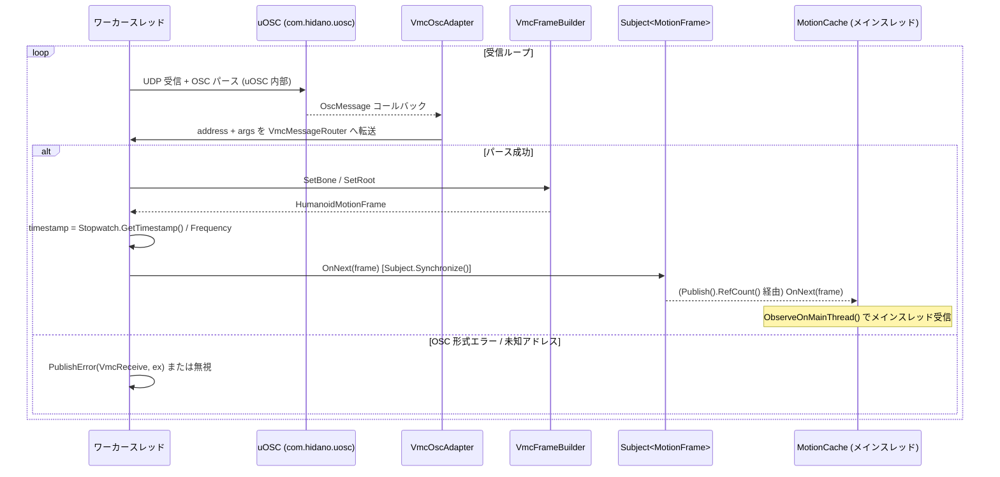
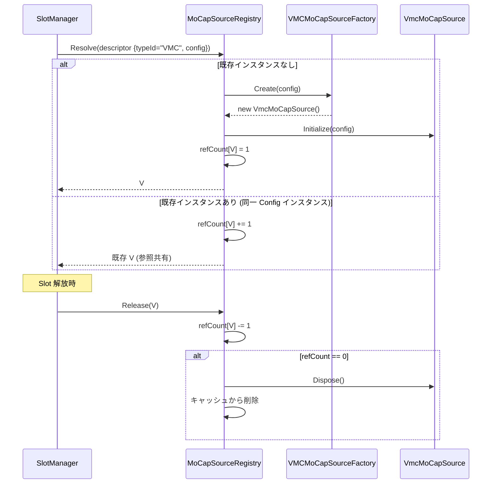
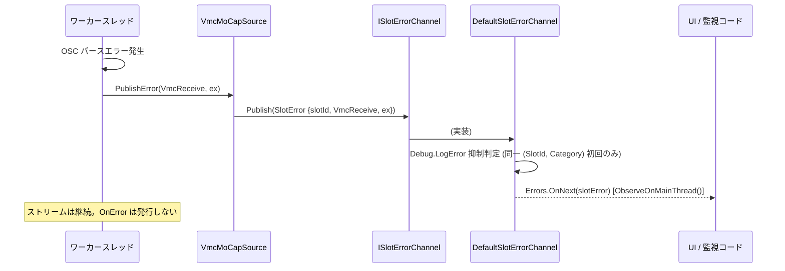

# mocap-vmc 設計ドキュメント

> **フェーズ**: design  
> **言語**: ja  
> **Wave**: Wave B (並列波) — `slot-core` design (Wave A) を先行参照して生成

---

## 1. 概要

### 責務範囲

`mocap-vmc` は VMC (バーチャルモーションキャプチャ) プロトコルに対応した MoCap ソース具象実装を提供する。

- **`VmcMoCapSource : IMoCapSource`** を定義し、OSC (Open Sound Control) 経由で VMC データを受信する
- 受信データを `motion-pipeline` が定義するモーションデータ中立表現 (`HumanoidMotionFrame`) へ変換し、UniRx `Subject<MotionFrame>` を通じて Push 型ストリームとして発行する
- `VMCMoCapSourceConfig : MoCapSourceConfigBase` および `VMCMoCapSourceFactory : IMoCapSourceFactory` を定義し、`MoCapSourceRegistry` へ `typeId="VMC"` で属性ベース自己登録する
- 本 Spec は VMC 受信側 (Receiver) のみを対象とし、送信側 (Sender) は実装しない

### 他 Spec との境界

| 境界 | 内容 |
|------|------|
| `slot-core` → `mocap-vmc` | `IMoCapSource`・`MoCapSourceConfigBase`・`IMoCapSourceFactory`・`IMoCapSourceRegistry`・`ISlotErrorChannel`・`RegistryLocator` を参照 |
| `motion-pipeline` → `mocap-vmc` | `MotionFrame`・`HumanoidMotionFrame` を変換先として利用 |
| `mocap-vmc` → 下位 | 逆方向依存なし |

---

## 2. アーキテクチャ

### データフロー

```
[VMC 送信ソース (バーチャルモーションキャプチャ等)]
        │ UDP パケット
        ▼
[uOSC (com.hidano.uosc) 受信レイヤー (ワーカースレッド)]
        │ OscMessage (address + args)  ← uOSC が OSC パースまで担う
        ▼
[VMC メッセージルータ (address プレフィックス振り分け)]
        │ Bone/Root データ
        ▼
[HumanoidMotionFrame 組み立て (VmcFrameBuilder)]
  ・Stopwatch で timestamp 打刻
        │ HumanoidMotionFrame
        ▼
[Subject<MotionFrame>.OnNext()]
  (Subject.Synchronize() によるスレッドセーフラッパー)
        │ IObservable<MotionFrame>
        ▼
[Publish().RefCount() マルチキャストストリーム]
        │ MotionStream (IObservable<MotionFrame>)
        ▼
[購読者 (MotionCache 等)] ← .ObserveOnMainThread() でメインスレッドに切替
```

### MoCapSourceRegistry 自己登録フロー

```
アプリ起動 / Editor 起動
        │
        ▼
[VMCMoCapSourceFactory.RegisterRuntime() / RegisterEditor()]
        │ RegistryLocator.MoCapSourceRegistry.Register("VMC", factory)
        ▼
[IMoCapSourceRegistry (DefaultMoCapSourceRegistry)]
        │ typeId="VMC" → factory 登録完了
```

---

## 3. VMC プロトコル対応範囲

### 対応 VMC プロトコルバージョン

**VMC Protocol v2.5** に対応する。

### サポートする OSC アドレス

| OSC アドレス | 内容 | 本 Spec の扱い |
|-------------|------|--------------|
| `/VMC/Ext/Root/Pos` | ルートトランスフォーム (位置・回転) | **実装対象** |
| `/VMC/Ext/Bone/Pos` | Humanoid ボーン (名前・位置・回転) | **実装対象** |
| `/VMC/Ext/Blend/Val` | ブレンドシェイプ値 | 受信は行うが変換対象外 (初期版) |
| `/VMC/Ext/Blend/Apply` | ブレンドシェイプ確定通知 | 受信は行うが変換対象外 (初期版) |
| `/VMC/Ext/OK` | 疎通確認 (ステータス) | スキップ (ログのみ) |
| `/VMC/Ext/T` | 送信側タイムスタンプ | **使用しない** (VMC v2.5 では不安定) |

#### 非サポート (スコープ外)
- VMC Sender (`/VMC/Ext/Bone/Pos` 等の送信) は本 Spec では実装しない
- BlendShape / 表情制御への橋渡しは初期版では未実装 (将来 Spec で対応)

---

## 4. OSC ライブラリ選定

### 候補一覧

| ライブラリ | ライセンス | Unity 6 互換 | UPM 配布 | NuGet 依存 | 備考 |
|-----------|-----------|:----------:|:-------:|:---------:|------|
| **com.hidano.uosc** (採用) | MIT | ○ | ○ (npm scoped registry) | なし | hecomi/uOSC Fork。SO_REUSEADDR 修正済み |
| uOSC (hecomi/uOSC 本家) | MIT | ○ | △ (GitHub URL) | なし | Unity 2017 以降対応。Fork 元 |
| extOSC | MIT | ○ | △ (Asset Store) | なし | Editor 統合 UI あり。サイズ大 |
| OscCore (stella3d) | MIT | △ (未確認) | ○ (OpenUPM) | なし | 最終リリース 2020 年。Unity 6 動作未確認 |
| 自作 OSC パーサ | — | ○ | — | なし | 最小実装。OSC 1.0 のみ対応 |

### 選定結果: **com.hidano.uosc (バージョン 1.0.0)**

**パッケージ情報**:

| 項目 | 値 |
|-----|---|
| パッケージ ID | `com.hidano.uosc` |
| バージョン | `1.0.0` |
| ライセンス | MIT |
| 配布方法 | npm scoped registry (`https://registry.npmjs.com`、scope: `com.hidano`) |
| Fork 元 | `hecomi/uOSC` (Unity 2017 以降対応、VMC 界隈で実績) |
| 主な変更点 | SO_REUSEADDR オプションを有効化し、受信ポート開放問題を修正 |

**選定理由**:

1. **SO_REUSEADDR 修正済み**: hecomi/uOSC をベースに受信ポートの開放問題を修正したフォーク版。VMC ソフトウェアとの共存や、テスト間でのポート再利用において問題が生じにくい。
2. **VMC 界隈の実績継承**: hecomi/uOSC は VMC プロトコル対応ソフトウェアで広く使用されており、互換性実績がある。`com.hidano.uosc` はそのフォークであるため同等の VMC 互換性を持つ。
3. **UPM 配布対応**: npm scoped registry 経由で UPM 導入が可能。`package.json` への scoped registry 追加のみで導入できる。
4. **NuGet 依存なし**: UniRx と同様に NuGet 依存を持たないため、scoped registry 構成が簡潔に保たれる。
5. **MIT ライセンス**: UPM パッケージへの同梱・再配布に問題なし。

> **Unity 6 互換性について**: hecomi/uOSC は Unity 2017 以降に対応している。`com.hidano.uosc` としての Unity 6000.3 での明示的な動作確認は tasks フェーズでの実機検証、またはリリース前検証項目として実施する。

### 導入方法

`Packages/manifest.json` に以下を追加する:

```json
{
  "scopedRegistries": [
    {
      "name": "npm (com.hidano)",
      "url": "https://registry.npmjs.com",
      "scopes": [
        "com.hidano"
      ]
    },
    {
      "name": "OpenUPM",
      "url": "https://package.openupm.com",
      "scopes": [
        "com.neuecc.unirx",
        "com.cysharp.unitask"
      ]
    }
  ],
  "dependencies": {
    "com.hidano.uosc": "1.0.0",
    "com.neuecc.unirx": "7.1.0",
    "com.cysharp.unitask": "2.x.x"
  }
}
```

### VMC プロトコル解析方針

OSC 受信層には `com.hidano.uosc` を使用し、VMC プロトコル解析 (OSC アドレスハンドリング・ボーンマッピング・フレーム組み立て) は自前実装とする。

**参考実装**: `gpsnmeajp/EasyVirtualMotionCaptureForUnity` (EVMC4U) の `ExternalReceiver.cs`
- リポジトリ: `https://github.com/gpsnmeajp/EasyVirtualMotionCaptureForUnity`
- ライセンス: MIT (Copyright (c) 2019 gpsnmeajp)
- 採用方針: EVMC4U を丸ごと取り込まず、OSC アドレスハンドリング (`/VMC/Ext/Bone/Pos`・`/VMC/Ext/Root/Pos` 等の switch-case 構造) を**参考実装**として自前で `VmcMessageRouter` / `VmcFrameBuilder` を実装する。これにより EVMC4U のアーキテクチャ (MonoBehaviour ベース) との衝突を回避する。
- **帰属表記**: 実装ファイル `VmcMessageRouter.cs` のヘッダーコメントに EVMC4U のリポジトリ URL とライセンス帰属を明記すること。

---

## 5. 公開 API 仕様

### 5.1 `VMCMoCapSourceConfig`

```csharp
namespace RealtimeAvatarController.MoCap.VMC
{
    /// <summary>
    /// VMC 受信ソースの設定。MoCapSourceDescriptor.Config として使用する。
    /// SO アセット編集 (シナリオ X) と ScriptableObject.CreateInstance 動的生成 (シナリオ Y) の両方を許容する。
    /// </summary>
    [CreateAssetMenu(
        menuName = "RealtimeAvatarController/MoCap/VMC Config",
        fileName = "VMCMoCapSourceConfig")]
    public class VMCMoCapSourceConfig : MoCapSourceConfigBase
    {
        /// <summary>
        /// VMC データ受信ポート番号。有効範囲: 1025〜65535。
        /// デフォルト: 39539 (VMC プロトコル標準ポート)。
        /// </summary>
        [Range(1025, 65535)]
        public int port = 39539;

        /// <summary>
        /// 受信アドレス (IPv4 文字列)。
        /// デフォルト: "0.0.0.0" (全インターフェースで受信)。
        /// </summary>
        public string bindAddress = "0.0.0.0";
    }
}
```

### 5.2 `VmcMoCapSource`

```csharp
namespace RealtimeAvatarController.MoCap.VMC
{
    /// <summary>
    /// VMC プロトコル (OSC 受信) の IMoCapSource 具象実装。
    /// ワーカースレッドで UDP パケットを受信し、OSC をパースして HumanoidMotionFrame を発行する。
    /// MotionStream は OnError を発行しない。受信エラーは ISlotErrorChannel 経由で通知される。
    /// インスタンスのライフサイクルは MoCapSourceRegistry が管理する。Slot 側から直接 Dispose() を呼ばないこと。
    /// </summary>
    public sealed class VmcMoCapSource : IMoCapSource
    {
        // --- IMoCapSource 実装 ---

        /// <summary>ソース種別識別子。常に "VMC" を返す。</summary>
        public string SourceType => "VMC";

        /// <summary>
        /// 初期化。ポートバインド・ワーカースレッド起動を行う。
        /// config は VMCMoCapSourceConfig にキャスト可能であること。
        /// メインスレッドからの呼び出しを前提とする。
        /// </summary>
        /// <exception cref="ArgumentException">config が VMCMoCapSourceConfig でない場合</exception>
        /// <exception cref="ArgumentOutOfRangeException">ポート番号が範囲外 (1025〜65535) の場合</exception>
        /// <exception cref="SocketException">ポート競合 / ソケットバインド失敗の場合</exception>
        public void Initialize(MoCapSourceConfigBase config);

        /// <summary>
        /// Push 型モーションストリーム。受信スレッドから Subject.OnNext() で配信される。
        /// 購読側は .ObserveOnMainThread() でメインスレッドに同期すること。
        /// OnError は発行しない。
        /// </summary>
        public IObservable<MotionFrame> MotionStream { get; }

        /// <summary>
        /// シャットダウン。ワーカースレッド停止・Subject 終端・リソース解放を行う。
        /// IDisposable.Dispose() と等価。メインスレッドからの呼び出しを前提とする。
        /// </summary>
        public void Shutdown();

        // IDisposable
        public void Dispose();

        // --- 内部コンストラクタ (Factory 経由で生成) ---
        internal VmcMoCapSource(string slotId, ISlotErrorChannel errorChannel);
    }
}
```

### 5.3 `VMCMoCapSourceFactory`

```csharp
namespace RealtimeAvatarController.MoCap.VMC
{
    /// <summary>
    /// VmcMoCapSource インスタンスを生成する Factory。
    /// 属性ベース自己登録により MoCapSourceRegistry に typeId="VMC" で登録される。
    /// </summary>
    public sealed class VMCMoCapSourceFactory : IMoCapSourceFactory
    {
        /// <summary>
        /// VmcMoCapSource インスタンスを生成する。
        /// config は VMCMoCapSourceConfig にキャスト可能であること。
        /// </summary>
        /// <exception cref="ArgumentException">config が VMCMoCapSourceConfig でない場合</exception>
        public IMoCapSource Create(MoCapSourceConfigBase config);

        // --- ランタイム自己登録 ---

        /// <summary>
        /// Player ビルドおよびランタイム起動時 (シーンロード前) に自己登録する。
        /// Domain Reload OFF 設定下では SubsystemRegistration タイミングで RegistryLocator.ResetForTest()
        /// が先行実行されるため、通常は二重登録による RegistryConflictException は発生しない。
        /// 万一発生した場合は ErrorChannel 経由で通知し、握り潰さない。
        /// </summary>
        [RuntimeInitializeOnLoadMethod(RuntimeInitializeLoadType.BeforeSceneLoad)]
        private static void RegisterRuntime()
        {
            try
            {
                RegistryLocator.MoCapSourceRegistry.Register("VMC", new VMCMoCapSourceFactory());
            }
            catch (RegistryConflictException ex)
            {
                RegistryLocator.ErrorChannel.Publish(
                    SlotErrorCategory.RegistryConflict,
                    ex,
                    "VMCMoCapSourceFactory.RegisterRuntime: typeId=\"VMC\" は既に登録済みです。");
            }
        }

#if UNITY_EDITOR
        // --- エディタ自己登録 ---

        /// <summary>
        /// Editor 起動時 (コンパイル完了後) に自己登録する。
        /// Inspector UI でのタイプ候補列挙に使用する。
        /// 万一 RegistryConflictException が発生した場合は ErrorChannel 経由で通知する。
        /// </summary>
        [UnityEditor.InitializeOnLoadMethod]
        private static void RegisterEditor()
        {
            try
            {
                RegistryLocator.MoCapSourceRegistry.Register("VMC", new VMCMoCapSourceFactory());
            }
            catch (RegistryConflictException ex)
            {
                RegistryLocator.ErrorChannel.Publish(
                    SlotErrorCategory.RegistryConflict,
                    ex,
                    "VMCMoCapSourceFactory.RegisterEditor: typeId=\"VMC\" は既に登録済みです。");
            }
        }
#endif
    }
}
```

---

## 6. 内部実装設計

### 6.1 受信ワーカースレッドの起動と停止

- `Initialize()` 呼び出し時、`UdpClient` を指定ポート・アドレスにバインドした後、`Thread` (または `Task.Run`) でワーカーループを起動する
- ワーカーループは `CancellationToken` を監視し、`Shutdown()` / `Dispose()` から `CancellationTokenSource.Cancel()` を呼ぶことで停止する
- ワーカースレッドの停止を `Thread.Join()` (タイムアウト付き) で待機し、タイムアウト超過時はログ出力して継続する

```csharp
// uOSC コールバック受信概念コード
// uOSC は OSC パースを内部で行い、受信した OscMessage をコールバックで通知する
// VmcOscAdapter は uOSC のコールバックを受け取り VmcMessageRouter へ転送する

// uOSC が提供する受信コールバックに登録 (VmcOscAdapter 内)
private void OnOscMessageReceived(string address, OscDataHandle data)
{
    try
    {
        // アドレスルーティング
        _router.Route(address, data);

        // フレーム完成時に MotionFrame 組み立て・timestamp 打刻・Subject 発行
        if (_frameBuilder.TryFlush(out var frame))
        {
            _subject.OnNext(frame);
        }
    }
    catch (Exception ex)
    {
        PublishError(SlotErrorCategory.VmcReceive, ex);
    }
}
```

### 6.2 OSC パーサ (アドレスプレフィックスルーティング)

`com.hidano.uosc` が提供する OSC 受信コールバックを用いてメッセージを受信し、アドレスプレフィックスで処理を振り分ける。OSC パース自体は uOSC 側が担い、`VmcMessageRouter` は受信した address と引数リストを解釈する薄いルータとして機能する。

VMC プロトコルの OSC アドレスハンドリング構造は EVMC4U (`gpsnmeajp/EasyVirtualMotionCaptureForUnity`, MIT) の `ExternalReceiver.cs` を参考に実装する (参照: §4 VMC プロトコル解析方針)。

```csharp
// ルーティング概念コード (内部クラス VmcMessageRouter)
switch (message.Address)
{
    case "/VMC/Ext/Root/Pos":
        _frameBuilder.SetRoot(message);
        break;
    case "/VMC/Ext/Bone/Pos":
        _frameBuilder.SetBone(message);
        break;
    case "/VMC/Ext/Blend/Val":
        // 初期版: 受信のみ・変換スキップ
        break;
    case "/VMC/Ext/Blend/Apply":
        // フレーム確定シグナル (将来利用)
        break;
    default:
        // 未知アドレスは無視
        break;
}
```

### 6.3 HumanoidMotionFrame への集約

VMC プロトコルでは 1 フレーム分のボーンデータが複数の OSC メッセージとして到着する。`VmcFrameBuilder` が以下を管理する。

- 受信した Bone/Root データを `Dictionary<HumanBodyBones, (Vector3, Quaternion)>` に蓄積する
- `/VMC/Ext/Bone/Pos` の最後のメッセージ受信後 (または一定時間経過後) にフレームをフラッシュして `HumanoidMotionFrame` を構築する
- (M-3 更新) 蓄積した各ボーン回転を `HumanoidMotionFrame.BoneLocalRotations` フィールドにそのまま格納する。Muscle 変換は Applier (MainThread) 側が担うため、`VmcFrameBuilder` は Unity 非スレッドセーフ API (`HumanPoseHandler` / `HumanTrait.MuscleFromBone` 等) を呼ばない
- `Muscles` 配列は空 (`Array.Empty<float>()`) を渡す。IsValid 判定は `BoneLocalRotations.Count > 0` が担う

> **M-3 合意変更 (2026-04-22) で刷新された方針**: VMC プロトコルは「親ローカル座標系のクォータニオン」を送ってくる一方、Unity の Muscle 値は「ボーンごとに固有の軸で正規化された 3 DoF 値」であり、両者を直接 (`Quaternion.eulerAngles / 180f` 等で) 線形変換するのは意味的に不正確である。
>
> 正確な変換は `HumanPoseHandler.GetHumanPose`（MainThread 限定 API）が必要となるため、`VmcFrameBuilder` (ワーカースレッド) では行えない。そこで **contracts.md §2.2 に `BoneLocalRotations` フィールドを追加**し、変換責務を `HumanoidMotionApplier` (MainThread) に移した。
>
> 過去の [M-2] エントリで「拡張フィールドの追加は採用しない」と判断していたが、バグ (VMC データ適用後に Hips 以外の骨が静止する) の根本修正のため、M-3 合意変更で方針を反転した。

### 6.4 timestamp 打刻

```csharp
// OSC パース完了後・OnNext 前に打刻
double timestamp = Stopwatch.GetTimestamp() / (double)Stopwatch.Frequency;

// M-3: BoneLocalRotations 対応コンストラクタを使用する
// HumanoidMotionFrame(double, float[], Vector3, Quaternion, IReadOnlyDictionary<HumanBodyBones, Quaternion>)
var frame = new HumanoidMotionFrame(
    timestamp,
    Array.Empty<float>(),             // Muscles は空 (Applier 側で BoneLocalRotations から逆算する)
    rootPosition,
    rootRotation,
    boneLocalRotations);              // 蓄積した bone 辞書をそのまま引き渡す
_subject.OnNext(frame);
```

### 6.5 UniRx Subject とマルチキャスト

```csharp
// 内部 Subject (スレッドセーフラッパー)
private readonly Subject<MotionFrame> _rawSubject = new Subject<MotionFrame>();
private readonly ISubject<MotionFrame> _subject;      // = _rawSubject.Synchronize()
private readonly IObservable<MotionFrame> _stream;    // = _subject.Publish().RefCount()

// コンストラクタ内初期化
_subject = _rawSubject.Synchronize();                 // ワーカースレッドからのスレッドセーフ OnNext
_stream  = _subject.Publish().RefCount();             // マルチキャスト (購読者ゼロ時は接続解除)

// 公開プロパティ
public IObservable<MotionFrame> MotionStream => _stream;
```

- `Subject.Synchronize()`: UniRx が提供するスレッドセーフラッパー。`OnNext()` への同時アクセスをロックで保護する。
- `Publish().RefCount()`: 複数購読者が同一ストリームを購読できる ConnectableObservable ラッパー。購読者がいる間だけ Hot Observable として動作する。

---

## 7. VMC → HumanoidMotionFrame マッピング

### 7.1 VMC Bone 名 → Unity HumanBodyBones 変換

VMC プロトコルでは Unity の `HumanBodyBones` 列挙値名と同一の文字列を Bone 名として使用する。変換は名前照合で行う。

```csharp
// VMC Bone 名 → HumanBodyBones への変換 (VmcBoneMapper)
private static readonly Dictionary<string, HumanBodyBones> s_boneMap;

static VmcBoneMapper()
{
    s_boneMap = new Dictionary<string, HumanBodyBones>(StringComparer.Ordinal);
    // Unity の HumanBodyBones 全値を列挙して辞書登録
    foreach (HumanBodyBones bone in Enum.GetValues(typeof(HumanBodyBones)))
    {
        if (bone == HumanBodyBones.LastBone) continue;
        s_boneMap[bone.ToString()] = bone;
    }
}

public static bool TryGetBone(string vmcBoneName, out HumanBodyBones bone)
    => s_boneMap.TryGetValue(vmcBoneName, out bone);
```

対応ボーン数は Unity の `HumanBodyBones` 全 55 ボーン (LastBone 除く)。

### 7.2 Root Position / Rotation の取り扱い

- `/VMC/Ext/Root/Pos` メッセージの引数は `(string name, float px, float py, float pz, float qx, float qy, float qz, float qw)` の形式
- 位置は `HumanoidMotionFrame.RootPosition` に、回転は `HumanoidMotionFrame.RootRotation` にそのまま格納する
- 座標系は VMC プロトコルが Unity 座標系 (左手座標、Y-up) を使用するため変換不要

### 7.3 未受信ボーンの扱い (M-3 更新)

- VMC メッセージに含まれないボーンは、`BoneLocalRotations` 辞書に**含めない** (追加しない)
- Applier は辞書に存在しないボーンの Transform には一切書込まないため、直前の最終 pose の localRotation が保持される
- 受信ボーンが 1 件以上ある場合 (`_bones.Count > 0`) に `HumanoidMotionFrame` を `BoneLocalRotations` 付きで生成する
- `BoneLocalRotations.Count == 0` かつ `Muscles.Length == 0` は無効フレームを示す。VmcFrameBuilder.TryFlush は `_bones.Count == 0` で `false` を返すため、この状態のフレームは発行されない

### 7.4 BlendShape の扱い (初期版)

- `/VMC/Ext/Blend/Val` および `/VMC/Ext/Blend/Apply` は受信するが `HumanoidMotionFrame` への変換対象外とする
- 将来の表情制御 Spec で `IFacialController` への橋渡しを実装する際に本章を更新する

---

## 8. エラーハンドリング

### 8.1 方針概要

| エラー種別 | 対応 | MotionStream | ISlotErrorChannel |
|-----------|------|:----------:|:----------------:|
| OSC パースエラー | パケットスキップ・ループ継続 | OnError 発行しない | `VmcReceive` カテゴリで発行 |
| 切断検知 (SocketException) | ループ継続・再受信待機 | OnError 発行しない | `VmcReceive` カテゴリで発行 |
| ポート競合 (バインド失敗) | `Initialize()` から例外スロー | — | `InitFailure` (SlotManager が発行) |
| ポート範囲外 | `Initialize()` から例外スロー | — | `InitFailure` (SlotManager が発行) |
| 二重 `Initialize()` | `InvalidOperationException` スロー | — | — |
| ワーカー未ハンドル例外 | ログ出力・ループ継続 | OnError 発行しない | `VmcReceive` カテゴリで発行 |

### 8.2 エラー発行の実装

```csharp
private void PublishError(SlotErrorCategory category, Exception ex)
{
    // ISlotErrorChannel への発行 (抑制ロジックは Channel 実装側が担う)
    _errorChannel.Publish(new SlotError(_slotId, category, ex, DateTime.UtcNow));
    // Debug.LogError の抑制は DefaultSlotErrorChannel が行うため、ここでは呼ばない
}
```

- `VmcMoCapSource` 側では `Debug.LogError` の抑制制御を**持たない**
- `DefaultSlotErrorChannel` が同一 `(SlotId, Category)` につき 1 フレームのみ `Debug.LogError` を出力する

### 8.3 `MotionStream.OnError` 非発行の保証

- ワーカーループの例外は `try-catch` で全捕捉し、`Subject.OnError()` は一切呼び出さない
- `Shutdown()` / `Dispose()` 時のみ `Subject.OnCompleted()` を呼び出してストリームを終端させる

---

## 9. ライフサイクル

### 9.1 内部状態

```
Uninitialized ──Initialize()──▶ Running ──Shutdown()/Dispose()──▶ Disposed
                                    │
                          例外 (ポート競合等) ──▶ Uninitialized (再試行不可)
                                                    ※ Disposed への強制遷移は SlotManager が制御
```

| 状態 | 説明 |
|------|------|
| `Uninitialized` | 生成直後。ソケット・スレッドなし |
| `Running` | `Initialize()` 完了後。受信ループ稼働中 |
| `Disposed` | `Shutdown()` / `Dispose()` 完了後。再使用不可 |

### 9.2 `Initialize(MoCapSourceConfigBase config)` の処理フロー

1. 状態チェック: `Uninitialized` 以外であれば `InvalidOperationException` をスロー
2. `config as VMCMoCapSourceConfig` でキャスト: `null` であれば `ArgumentException` をスロー
3. ポート番号バリデーション (1025〜65535): 範囲外であれば `ArgumentOutOfRangeException` をスロー
4. `com.hidano.uosc` の受信オブジェクトを `bindAddress:port` で初期化・受信コールバック (`VmcOscAdapter.OnOscMessageReceived`) を登録 (SO_REUSEADDR 有効化済み)
5. `Subject<MotionFrame>` および `Publish().RefCount()` チェーンを初期化
6. uOSC 受信を開始 (失敗時は `SocketException` を伝播)
7. 内部状態を `Running` に遷移

### 9.3 `Shutdown()` / `Dispose()` の処理フロー

1. 状態チェック: `Disposed` であれば即時 return (冪等)
2. `CancellationTokenSource.Cancel()` でワーカーループに停止シグナル
3. `UdpClient.Close()` でソケット閉鎖 (ブロッキング Receive を強制解除)
4. `workerThread.Join(timeout: 2000ms)` で停止を待機
5. `_rawSubject.OnCompleted()` でストリームを終端
6. `_rawSubject.Dispose()` / `UdpClient.Dispose()` でリソース解放
7. 内部状態を `Disposed` に遷移

### 9.4 MoCapSourceRegistry による参照カウント制御

- `VmcMoCapSource` は `Dispose()` を `public` で公開するが、**Slot 側が直接呼び出してはならない**
- `MoCapSourceRegistry` が参照カウント 0 を検知した時点で `Dispose()` を呼び出す
- `MoCapSourceRegistry.Release(source)` が Slot からの解放通知の正規経路となる

---

## 10. Factory 自動登録

### 10.1 ランタイム登録エントリコード

```csharp
// ファイル: Runtime/MoCap/VMC/VMCMoCapSourceFactory.cs
namespace RealtimeAvatarController.MoCap.VMC
{
    public sealed class VMCMoCapSourceFactory : IMoCapSourceFactory
    {
        [RuntimeInitializeOnLoadMethod(RuntimeInitializeLoadType.BeforeSceneLoad)]
        private static void RegisterRuntime()
        {
            // SubsystemRegistration タイミングで RegistryLocator.ResetForTest() が先行実行済みのため
            // Domain Reload OFF 設定下でも通常は RegistryConflictException は発生しない。
            // 万一発生した場合は ErrorChannel 経由で通知し、握り潰さない。
            try
            {
                RegistryLocator.MoCapSourceRegistry.Register("VMC", new VMCMoCapSourceFactory());
            }
            catch (RegistryConflictException ex)
            {
                RegistryLocator.ErrorChannel.Publish(
                    SlotErrorCategory.RegistryConflict,
                    ex,
                    "VMCMoCapSourceFactory.RegisterRuntime: typeId=\"VMC\" は既に登録済みです。");
            }
        }

        public IMoCapSource Create(MoCapSourceConfigBase config)
        {
            var vmcConfig = config as VMCMoCapSourceConfig;
            if (vmcConfig == null)
                throw new ArgumentException(
                    $"VMCMoCapSourceConfig が必要ですが {config?.GetType().Name ?? "null"} が渡されました",
                    nameof(config));

            return new VmcMoCapSource(
                slotId: string.Empty,           // Registry が後から設定
                errorChannel: RegistryLocator.ErrorChannel);
        }
    }
}
```

### 10.2 エディタ登録エントリコード

```csharp
// ファイル: Editor/MoCap/VMC/VMCMoCapSourceFactoryEditorRegistrar.cs
// asmdef: RealtimeAvatarController.MoCap.VMC.Editor
#if UNITY_EDITOR
namespace RealtimeAvatarController.MoCap.VMC.Editor
{
    using UnityEditor;

    /// <summary>
    /// Editor 起動時に VMCMoCapSourceFactory を MoCapSourceRegistry に登録する。
    /// Inspector UI での候補列挙に使用する。
    /// RegistryConflictException が発生した場合は ErrorChannel 経由で通知する。
    /// </summary>
    internal static class VmcMoCapSourceFactoryEditorRegistrar
    {
        [UnityEditor.InitializeOnLoadMethod]
        private static void RegisterEditor()
        {
            try
            {
                RegistryLocator.MoCapSourceRegistry.Register("VMC", new VMCMoCapSourceFactory());
            }
            catch (RegistryConflictException ex)
            {
                RegistryLocator.ErrorChannel.Publish(
                    SlotErrorCategory.RegistryConflict,
                    ex,
                    "VMCMoCapSourceFactory.RegisterEditor: typeId=\"VMC\" は既に登録済みです。");
            }
        }
    }
}
#endif
```

> **[L-1 解決]** エディタ登録は `[UnityEditor.InitializeOnLoadMethod]` メソッド属性に統一した。旧来の `[InitializeOnLoad]` クラス属性 + 静的コンストラクタ方式は採用しない。§5.3 の API 仕様コードも同属性で記述されており、設計全体で統一されている。

---

## 11. 参照共有モデル

### 11.1 同一ポート指定時の `MoCapSourceRegistry.Resolve` 挙動

`MoCapSourceDescriptor` の等価性は `(SourceTypeId, Config インスタンス)` の組合せで判定される。**同一の `VMCMoCapSourceConfig` インスタンスを指す場合のみ**同一と判定され、参照共有が発生する。

```
Slot A: Descriptor { SourceTypeId="VMC", Config=configA (port=39539) }
Slot B: Descriptor { SourceTypeId="VMC", Config=configA (port=39539) }  ← 同一インスタンス
         → MoCapSourceRegistry は同一の VmcMoCapSource を返す (参照共有)

Slot C: Descriptor { SourceTypeId="VMC", Config=configC (port=39539) }  ← 別インスタンス (同値)
         → MoCapSourceRegistry は新しい VmcMoCapSource を生成して返す
         → 同一ポートへの二重バインドにより SocketException が発生する
```

### 11.2 参照カウントのインクリメント / デクリメント

```
Resolve(descriptor)
    → 参照カウント +1
    → 既存インスタンスがある場合はそれを返す
    → ない場合は Factory.Create() で新規生成してキャッシュ

Release(source)
    → 参照カウント -1
    → カウントが 0 になったら source.Dispose() を呼び出し、キャッシュから削除
```

- 参照カウントは `DefaultMoCapSourceRegistry` 内の `Dictionary<IMoCapSource, int>` で管理する (`slot-core` の責務)

---

## 12. シーケンス図 (Mermaid)

### 12.1 受信 → パース → Subject.OnNext → 購読者配信



### 12.2 参照共有 Resolve フロー



### 12.3 エラー発生時のフロー



---

## 13. スレッドモデル

### 13.1 スレッド責務分担

| スレッド | 担当処理 |
|---------|---------|
| **メインスレッド** | `Initialize()` / `Shutdown()` / `Dispose()` の呼び出し |
| **メインスレッド** | MotionCache でのフレーム受信 (`.ObserveOnMainThread()` 適用後) |
| **メインスレッド** (M-3) | BoneLocalRotations → Muscle 逆変換 (`Animator.GetBoneTransform` / `HumanPoseHandler.GetHumanPose`)。**Applier** の責務 (motion-pipeline §7.1.1) |
| **ワーカースレッド** | UDP パケット受信・OSC パース (uOSC 内部処理) |
| **ワーカースレッド** | OSC メッセージのアドレスルーティング (`VmcMessageRouter`) |
| **ワーカースレッド** | HumanoidMotionFrame 組み立て (`VmcFrameBuilder`) — **M-3 更新**: BoneLocalRotations dict の蓄積のみ (Muscle 変換は MainThread 責務) |
| **ワーカースレッド** | `timestamp` 打刻 (`Stopwatch.GetTimestamp()`) |
| **ワーカースレッド** | `Subject<MotionFrame>.OnNext()` (`Subject.Synchronize()` でスレッドセーフ) |
| **ワーカースレッド** | `ISlotErrorChannel.Publish()` 呼び出し |

### 13.2 スレッドセーフティの確保

- `Subject.Synchronize()`: `OnNext()` / `OnError()` / `OnCompleted()` へのスレッドセーフアクセスを保証
- `UdpClient` のソケット閉鎖 (`Close()`) はメインスレッドから呼ぶが、ブロッキング中の `Receive()` を強制解除するため `SocketException` (`ObjectDisposedException`) が発生する。これをワーカー側で捕捉してループを終了させる
- `VmcFrameBuilder` はワーカースレッド専用。メインスレッドから直接アクセスしない
- `Subject` の `_stream` (`Publish().RefCount()`) は購読開始がメインスレッド・OnNext がワーカースレッドとなる。UniRx の `Publish()` 内部実装はスレッドセーフであることを前提とする

---

## 14. ファイル / ディレクトリ構成

```
RealtimeAvatarController/
  Packages/
    com.example.realtime-avatar-controller/
      Runtime/
        MoCap/
          VMC/
            VmcMoCapSource.cs                   # IMoCapSource 具象実装
            VMCMoCapSourceConfig.cs             # MoCapSourceConfigBase 派生 Config
            VMCMoCapSourceFactory.cs            # IMoCapSourceFactory 実装 + ランタイム自己登録
            Internal/
              VmcFrameBuilder.cs               # Bone/Root → HumanoidMotionFrame 組み立て
              VmcMessageRouter.cs              # OSC アドレスプレフィックスルーティング
              VmcBoneMapper.cs                 # VMC Bone 名 → HumanBodyBones 変換
              VmcOscAdapter.cs                 # uOSC コールバック受信アダプタ (薄い抽象レイヤー)
        RealtimeAvatarController.MoCap.VMC.asmdef
      Editor/
        MoCap/
          VMC/
            VmcMoCapSourceFactoryEditorRegistrar.cs  # Editor 自己登録
        RealtimeAvatarController.MoCap.VMC.Editor.asmdef
      Tests/
        EditMode/
          MoCap/
            VMC/
              VmcOscParserTests.cs             # OSC パーサ単体テスト
              VmcConfigCastTests.cs            # Config キャスト検証テスト
              VmcFactoryRegistrationTests.cs   # 属性ベース自己登録確認テスト
              VmcBoneMapperTests.cs            # Bone マッピング変換テスト
          RealtimeAvatarController.MoCap.VMC.Tests.EditMode.asmdef
        PlayMode/
          MoCap/
            VMC/
              VmcMoCapSourceIntegrationTests.cs  # ローカル UDP 送受信統合テスト
              UdpOscSenderTestDouble.cs          # テストダブル: ローカル UDP 送信クライアント
          RealtimeAvatarController.MoCap.VMC.Tests.PlayMode.asmdef
```

### asmdef 依存関係

| asmdef | 依存先 |
|--------|--------|
| `RealtimeAvatarController.MoCap.VMC` | `RealtimeAvatarController.Core`・`RealtimeAvatarController.Motion`・`com.hidano.uosc`・`UniRx` |
| `RealtimeAvatarController.MoCap.VMC.Editor` | `RealtimeAvatarController.MoCap.VMC`・`RealtimeAvatarController.Core` |
| `RealtimeAvatarController.MoCap.VMC.Tests.EditMode` | `RealtimeAvatarController.MoCap.VMC`・`RealtimeAvatarController.Core`・`UnityEngine.TestRunner`・`UnityEditor.TestRunner` |
| `RealtimeAvatarController.MoCap.VMC.Tests.PlayMode` | `RealtimeAvatarController.MoCap.VMC`・`RealtimeAvatarController.Core`・`RealtimeAvatarController.Motion`・`UnityEngine.TestRunner` |

---

## 15. テスト設計

### 15.1 EditMode テスト (`RealtimeAvatarController.MoCap.VMC.Tests.EditMode`)

#### OSC パーサ単体テスト (`VmcOscParserTests.cs`)

| テストケース | 検証内容 |
|------------|---------|
| 正常な `/VMC/Ext/Bone/Pos` パケットのパース | ボーン名・位置・回転が正しく抽出される |
| 正常な `/VMC/Ext/Root/Pos` パケットのパース | Root 位置・回転が正しく抽出される |
| 不正バイト列のパース | `TryParse` が `false` を返し例外をスローしない |
| 空バイト列のパース | `TryParse` が `false` を返す |

#### Config キャスト検証テスト (`VmcConfigCastTests.cs`)

| テストケース | 検証内容 |
|------------|---------|
| `VMCMoCapSourceConfig` を `MoCapSourceConfigBase` として渡した場合 | 正常にキャストされ `VmcMoCapSource` が生成される |
| 別の `MoCapSourceConfigBase` 派生型を渡した場合 | `ArgumentException` がスローされ、型名がメッセージに含まれる |
| `null` を渡した場合 | `ArgumentException` がスローされる |
| `ScriptableObject.CreateInstance<VMCMoCapSourceConfig>()` で動的生成した Config | Factory が正常に `VmcMoCapSource` を生成できる |

#### 属性ベース自己登録確認テスト (`VmcFactoryRegistrationTests.cs`)

| テストケース | 検証内容 |
|------------|---------|
| `RegistryLocator.MoCapSourceRegistry.GetRegisteredTypeIds()` | `"VMC"` が含まれる |
| 同一 typeId の二重登録 | `RegistryConflictException` がスローされる |
| `RegistryLocator.ResetForTest()` 後の再登録 | 正常に登録できる |

#### Bone マッピングテスト (`VmcBoneMapperTests.cs`)

| テストケース | 検証内容 |
|------------|---------|
| Unity HumanBodyBones の全列挙値が VMC Bone 名として変換できる | すべて正しく `HumanBodyBones` 列挙値にマップされる |
| 未知の VMC Bone 名 | `TryGetBone` が `false` を返す |

### 15.2 PlayMode テスト (`RealtimeAvatarController.MoCap.VMC.Tests.PlayMode`)

#### 統合テスト (`VmcMoCapSourceIntegrationTests.cs`)

| テストケース | 検証内容 |
|------------|---------|
| ローカル UDP 送信 → `MotionStream` 受信 | `UdpOscSenderTestDouble` が送信したパケットが `MotionStream` 経由で届く |
| Root / Bone データの往復正確性 | 送信した位置・回転と受信した `HumanoidMotionFrame` の値が一致する |
| `timestamp` の単調増加 | 連続受信フレームの `Timestamp` が単調増加している |
| パースエラー時にストリームが継続する | 不正パケット送信後も次の正常パケットが `MotionStream` に届く |
| `Shutdown()` 後に `MotionStream` が完了する | `OnCompleted()` が発行される |

#### テストダブル仕様 (`UdpOscSenderTestDouble.cs`)

```csharp
// ローカルホスト上の UDP 送信クライアント
// [SetUp] で初期化、[TearDown] で Dispose する
internal sealed class UdpOscSenderTestDouble : IDisposable
{
    private readonly UdpClient _sender;
    private readonly IPEndPoint _target;

    public UdpOscSenderTestDouble(int targetPort)
    {
        _sender = new UdpClient();
        _target = new IPEndPoint(IPAddress.Loopback, targetPort);
    }

    public void SendRootPos(Vector3 position, Quaternion rotation)
    {
        // OSC バイト列を構築して送信
        var data = OscEncoder.Encode("/VMC/Ext/Root/Pos", "Root", position, rotation);
        _sender.Send(data, data.Length, _target);
    }

    public void SendBonePos(string boneName, Vector3 position, Quaternion rotation)
    {
        var data = OscEncoder.Encode("/VMC/Ext/Bone/Pos", boneName, position, rotation);
        _sender.Send(data, data.Length, _target);
    }

    public void Dispose() => _sender.Dispose();
}
```

### 15.3 テスト共通方針

- 各テストの `[SetUp]` / `[TearDown]` で `RegistryLocator.ResetForTest()` を呼び出して Registry を初期化する
- PlayMode テストではポート番号として `50000 + TestContext.CurrentContext.Random.NextShort()` 等の動的ポートを使用し、テスト間のポート競合を回避する
- カバレッジ数値目標は初期版では設定しない

---

## 補足: 設計決定の記録

| 決定事項 | 選択肢 | 採用 | 理由 |
|---------|--------|------|------|
| OSC ライブラリ | uOSC / extOSC / OscCore / 自作 | **com.hidano.uosc 1.0.0** | SO_REUSEADDR 修正済み・hecomi/uOSC Fork・VMC 実績継承・npm scoped registry 配布・MIT ライセンス |
| Reactive ライブラリ | UniRx / R3 | **UniRx** | NuGet 依存なし・UPM 配布の簡素化 (requirements.md 確定事項) |
| Subject スレッドセーフ | `lock` 手動実装 / `Subject.Synchronize()` | **`Subject.Synchronize()`** | UniRx 標準拡張。自前 lock より信頼性高 |
| マルチキャスト方式 | `BehaviorSubject` / `Publish().RefCount()` | **`Publish().RefCount()`** | 最新値キャッシュ不要。購読者ゼロ時に接続解除できる効率的な Hot Observable |
| `timestamp` 打刻ソース | VMC 送信側タイムスタンプ / Stopwatch | **Stopwatch** | VMC v2.5 の送信タイムスタンプは不安定 (requirements.md 確定事項) |
| VMC Sender 実装 | 本 Spec で実装 / 将来 Spec に委ねる | **スコープ外** | 初期段階スコープ (requirements.md 確定事項) |
| BlendShape 変換 | 初期版で実装 / 将来 Spec に委ねる | **初期版では変換対象外** | 表情制御は別 Spec の責務 (requirements.md 確定事項) |
