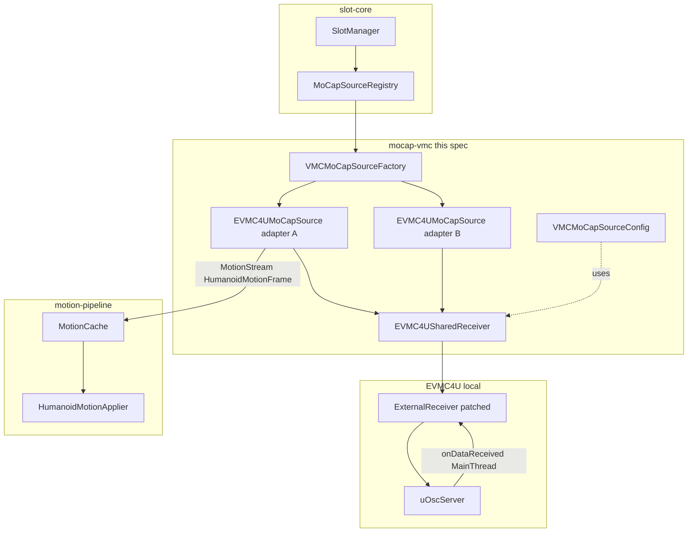
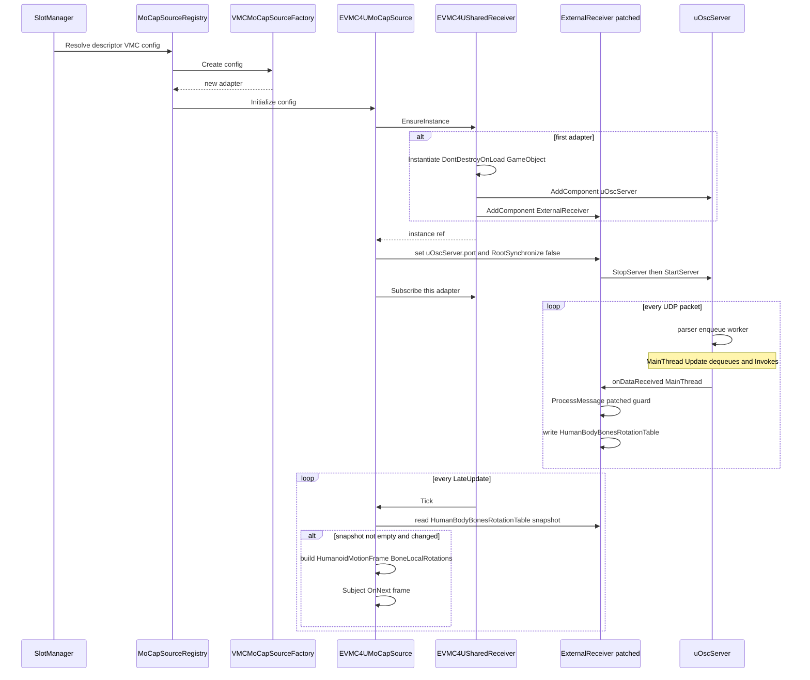
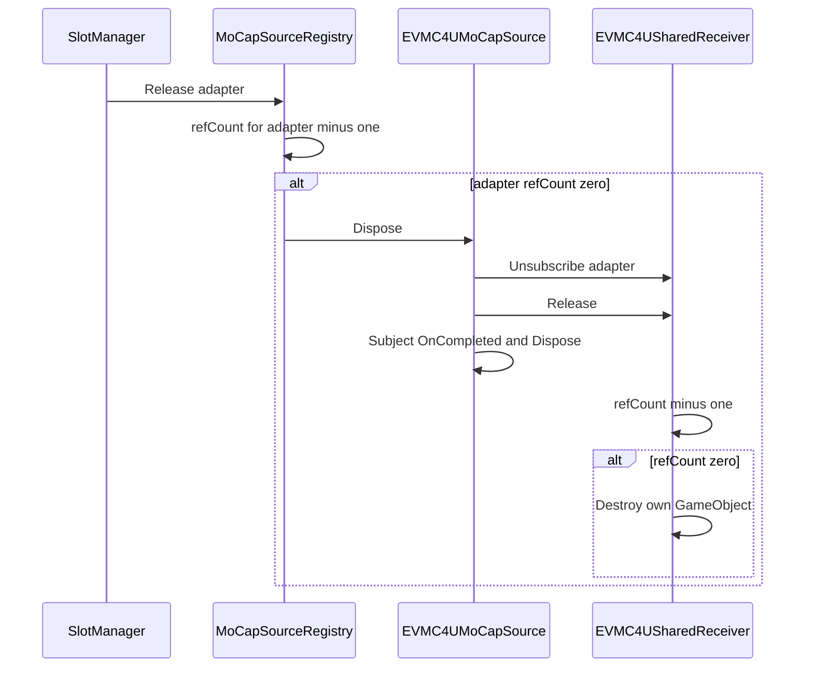
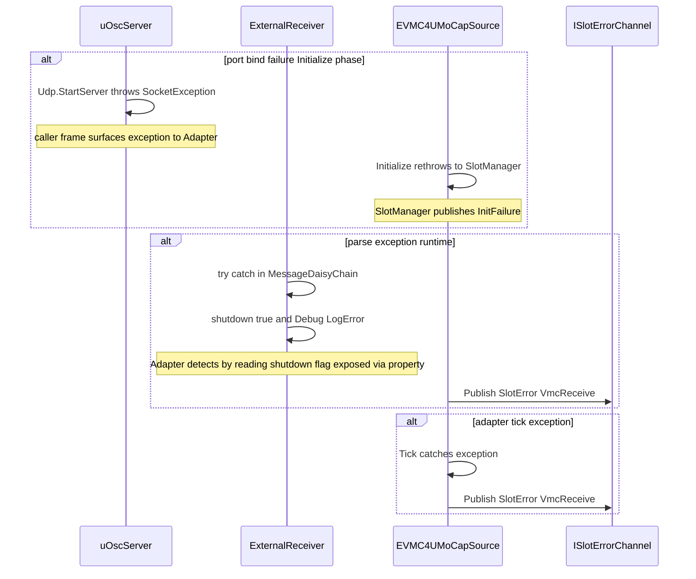
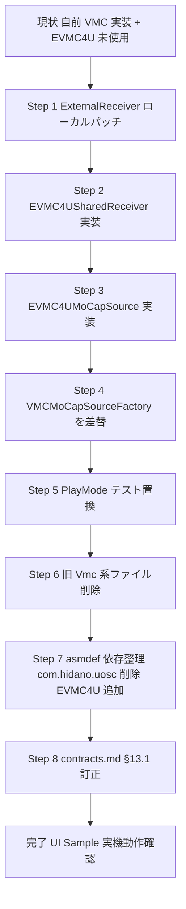

# mocap-vmc 設計ドキュメント

> **フェーズ**: design (regenerate)
> **言語**: ja
> **対象リビジョン**: requirements.md `updated_at=2026-04-22` (EVMC4U 全面置換版)
> **前版との関係**: 前版 (`2026-04-22` より前) は自前 VMC パーサ実装を前提としていたため全面書換。インターフェース (`IMoCapSource` / `HumanoidMotionFrame` / `MoCapSourceRegistry`) は維持する。

---

## 1. 概要

`mocap-vmc` は VMC プロトコル (OSC) 受信のための `IMoCapSource` 具象実装を提供する。
実装主体は準公式ライブラリ **EVMC4U** (`gpsnmeajp/EasyVirtualMotionCaptureForUnity`, MIT, `Assets/EVMC4U/` に取込済み) に委譲し、本 Spec は EVMC4U が内部 Dictionary に蓄積したボーン回転を `HumanoidMotionFrame` へ変換して `IObservable<MotionFrame>` として発行する薄い Adapter を定義する。

**利用者**: `SlotManager` (`slot-core`) を経由したランタイム統合者。UI Sample や動的 Slot 追加フロー。
**影響**: 旧自前実装 (`VmcMoCapSource` / `VmcOscAdapter` / `VmcFrameBuilder` / `VmcMessageRouter` / `VmcBoneMapper` / `VmcTickDriver`) は削除される。上位コード (typeId `"VMC"` / `VMCMoCapSourceConfig` / UI Sample シーン) は変更なしで動作する。

### Goals

- G1. EVMC4U を実装主体としつつ、既存 `IMoCapSource` / `HumanoidMotionFrame` (`BoneLocalRotations` 経路) 契約を不変に保つ
- G2. 共有 1 個の EVMC4U 受信コンポーネント + Slot 毎 Adapter により、`MoCapSourceRegistry` の参照共有モデルと互換
- G3. 旧自前実装を撤去し、VMC 座標系・ボーンマッピング・bundle 境界検出に関する実装責任を完全に EVMC4U へ移譲する
- G4. VSeeFace / VMagicMirror / VirtualMotionCapture 等の主要送信アプリで `HumanoidMotionApplier` を介してアバターが動くことを確認可能なテスト構造を提供する

### Non-Goals

- VMC Sender (送信) 実装
- VRM 1.x 固有互換検証 (EVMC4U の対応状況に従う)
- BlendShape / 表情 / リップシンクの `HumanoidMotionFrame` 経由受け渡し (EVMC4U 側が独自に BlendShape を適用するため本 Spec では触らない)
- 受信タイムアウト検知・再接続ロジック (初期版未実装)
- EVMC4U のアップストリーム fork / PR

---

## 2. Boundary Commitments

### This Spec Owns

- EVMC4U をラップする Adapter クラス `EVMC4UMoCapSource` (`IMoCapSource` 具象) の定義と実装
- 共有 EVMC4U 受信コンポーネントのライフサイクル管理 (`EVMC4USharedReceiver` MonoBehaviour、DontDestroyOnLoad 上に単一生成)
- `VMCMoCapSourceConfig` (既存 ScriptableObject) を保持し Adapter 初期化時に EVMC4U 受信ポートへ反映する責務
- `VMCMoCapSourceFactory` (`typeId="VMC"`) と属性ベース自己登録 (Runtime / Editor)
- `Assets/EVMC4U/ExternalReceiver.cs` に対するローカル最小改変 (§6 参照)
- `_shared/contracts.md` §13.1 の文言訂正 (§9.2 参照)
- 旧自前実装ファイル一式の削除 (§7 参照)

### Out of Boundary

- `IMoCapSource` / `IMoCapSourceFactory` / `IMoCapSourceRegistry` / `MoCapSourceConfigBase` / `ISlotErrorChannel` / `RegistryLocator` の定義 → `slot-core`
- `MotionFrame` / `HumanoidMotionFrame` / `BoneLocalRotations` の型形状 → `motion-pipeline`
- `HumanoidMotionApplier` (Transform 直接書込) の実装 → `motion-pipeline`
- MotionCache の具象・購読制御 → `motion-pipeline`
- Slot の生成/解放フロー・Fallback 動作 → `slot-core`
- VMC プロトコル (OSC) パース・座標変換・ボーン名解決 → **EVMC4U**

### Allowed Dependencies

- `RealtimeAvatarController.Core` (slot-core)
- `RealtimeAvatarController.Motion` (motion-pipeline)
- `EVMC4U` asmdef (Assets/EVMC4U/ 配下)
- `com.hidano.uosc` (EVMC4U が GUID 参照で使用。Adapter は直接参照しないのが望ましい)
- `UniRx` (Subject / Publish / RefCount のために必要)

### Revalidation Triggers

- `HumanoidMotionFrame.BoneLocalRotations` の形状変更 → 下流 Applier / 本 Adapter の再検証
- EVMC4U のローカル改変箇所 (§6) への変更 → Adapter の読取経路の再検証
- `MoCapSourceRegistry` の参照共有モデル (Descriptor 等価性) の変更 → 共有 Receiver ライフサイクル再検証
- uOSC の `onDataReceived` 実行スレッドが変わった場合 → スレッドモデル全面見直し

---

## 3. Architecture

### 3.1 既存アーキテクチャ分析

- `IMoCapSource` は Push 型 (`IObservable<MotionFrame>`) + `Publish().RefCount()` マルチキャスト + Subject Synchronize 経由の契約。現行は MainThread で `OnNext` が走ることが合意済み (contracts.md §2.2 M-3 追補)
- `MoCapSourceRegistry` は `(SourceTypeId, Config 参照)` を key とする参照カウント共有。同一 Config を指す複数 Slot が同一 `IMoCapSource` インスタンスを共有する
- `HumanoidMotionApplier` は `BoneLocalRotations` を `Animator.GetBoneTransform(bone).localRotation` で直接書込 (motion-pipeline 側で実装済み)。Muscles は `Array.Empty<float>()` 経路
- EVMC4U の `ExternalReceiver` は GameObject に貼る MonoBehaviour で、`uOSC.uOscServer` を兄弟コンポーネントとして持ち、`onDataReceived` は `uOscServer.Update` (MainThread) から Invoke される
- EVMC4U は受信時に `HumanBodyBonesRotationTable` / `HumanBodyBonesPositionTable` の 2 つの private Dictionary にキャッシュし、`Process()` (Update または LateUpdate) で `Animator.GetBoneTransform(bone).localRotation = rot` を書込む

### 3.2 アーキテクチャパターン

選定: **Adapter + Shared Singleton**。EVMC4U の ExternalReceiver を 1 個のプロセスワイド共有コンポーネントとして立ち上げ、Slot 毎の Adapter がその内部状態を pull read して `HumanoidMotionFrame` を emit する。EVMC4U の Model 適用ループは**無効化** (Model=null にする) し、ボーン Transform 書込は `HumanoidMotionApplier` に一本化する。



### 3.3 Technology Stack

| Layer | Choice / Version | Role in Feature | Notes |
|-------|------------------|-----------------|-------|
| OSC 受信 / VMC パース / 座標変換 | EVMC4U v5.0a (Assets/EVMC4U/) + com.hidano.uosc 1.0.0 | VMC 互換性検証済み実装主体 | MIT。アップストリーム fork はしない。ローカル改変は §6 のみ |
| Reactive | UniRx (com.neuecc.unirx 7.x) | `Subject<MotionFrame>` + `Publish().RefCount()` | slot-core / motion-pipeline と共通 |
| Runtime / PlayerLoop | Unity 6000.3.10f1 | `MonoBehaviour.LateUpdate` で Adapter Tick 駆動 | project-foundation が pin |

### 3.4 Dependency Direction

Adapter → (slot-core, motion-pipeline, EVMC4U) の一方向。EVMC4U → mocap-vmc の逆方向参照は存在しない。EVMC4U は mocap-vmc の型を知らない。

---

## 4. Components and Interfaces

### 4.1 Summary

| Component | Layer | Intent | Req Coverage | Key Dependencies | Contracts |
|-----------|-------|--------|--------------|------------------|-----------|
| `EVMC4UMoCapSource` (Adapter) | mocap-vmc Runtime | EVMC4U 内部状態を読み、`HumanoidMotionFrame` を発行する `IMoCapSource` 具象 | 1.1–1.9, 2.4, 3.1–3.7, 4.1–4.7, 7.5, 8.1–8.4 | `EVMC4USharedReceiver` (P0), `ExternalReceiver` (P0), UniRx (P0), `HumanoidMotionFrame` (P0) | Service, State |
| `EVMC4USharedReceiver` (MonoBehaviour) | mocap-vmc Runtime | プロセスワイド単一の ExternalReceiver GameObject を保持・生成・解体する | 2.1–2.3 | `ExternalReceiver` (P0), `uOscServer` (P0) | State |
| `VMCMoCapSourceConfig` | mocap-vmc Runtime | port / bindAddress を保持する ScriptableObject (既存継続) | 5.1–5.3 | `MoCapSourceConfigBase` (P0) | State |
| `VMCMoCapSourceFactory` | mocap-vmc Runtime | `IMoCapSourceFactory` 実装。Adapter 生成と属性ベース自己登録 | 5.4–5.6, 6.1–6.4 | `RegistryLocator` (P0) | Service |
| `VmcMoCapSourceFactoryEditorRegistrar` | mocap-vmc Editor | Editor 起動時の Registry 登録 (InitializeOnLoadMethod) | 6.2 | `RegistryLocator` (P0) | Service |
| `ExternalReceiver` (EVMC4U, patched) | EVMC4U local fork | 受信 + 内部 Dictionary 蓄積。本 Spec ではボーン Transform 書込を抑止し読取 API を公開 | 1.8, 2.5, 3.1, 4.1, 4.2 | `uOscServer` (P0), UniVRM / UniGLTF (P2, 受信専用ではロードしない) | Service, State |

### 4.2 `EVMC4UMoCapSource` (Adapter)

| Field | Detail |
|-------|--------|
| Intent | EVMC4U に受信・蓄積させた状態を LateUpdate で snapshot し `HumanoidMotionFrame` を emit する |
| Requirements | 1.1, 1.2, 1.3, 1.4, 1.5, 1.6, 1.7, 1.8, 1.9, 2.4, 3.1, 3.2, 3.3, 3.4, 3.5, 3.6, 3.7, 4.1, 4.2, 4.3, 4.4, 4.5, 4.6, 4.7, 7.5, 8.1, 8.2, 8.3, 8.4 |
| Namespace / asmdef | `RealtimeAvatarController.MoCap.VMC` / `RealtimeAvatarController.MoCap.VMC` |

**命名の根拠 (Q1 解決)**: 旧 `VmcMoCapSource` は削除対象 (要件 11.1) であり、実装主体が自前 OSC パーサから EVMC4U に本質的に変わるため、名称でこれを明示する方が将来の保守に資する。typeId `"VMC"` は VMC プロトコルそのものを指すため `VMCMoCapSourceFactory.VmcSourceTypeId` として維持し、内部クラス名だけを `EVMC4UMoCapSource` とする。UI Sample やシーン参照にはクラス名は直接現れない (typeId 経由) ため互換性は保たれる。

**Responsibilities & Constraints**

- `SourceType` は文字列 `"VMC"` を返す (要件 1.3)
- `MotionStream` は `Subject<MotionFrame>.Synchronize().Publish().RefCount()` 経由の Hot Observable (既存パターン踏襲、要件 1.4 / 4.6 / 4.7)
- `Initialize()` は MainThread からのみ呼ぶ。以下の順:
  1. 状態チェック (`Uninitialized` 以外なら `InvalidOperationException`、要件 7.5)
  2. `config as VMCMoCapSourceConfig`、失敗時 `ArgumentException` with 実型名 (要件 1.5 / 5.4)
  3. `port` 範囲 (1025–65535) 外なら `ArgumentOutOfRangeException` (要件 5.3)
  4. `EVMC4USharedReceiver.EnsureInstance()` を呼び、共有 Receiver を取得 (要件 1.6, 2.1, 2.2)
  5. 取得した `ExternalReceiver` の `uOscServer.port` を Config.port で更新し再起動 (§5.2 参照、要件 1.7)
  6. `ExternalReceiver` へ subscribe 登録 (§5.3 参照)
  7. 状態 `Running` 遷移
- `Dispose()` / `Shutdown()` は冪等 (要件 1.2)。subscribe 解除 → `Subject.OnCompleted()` → `Subject.Dispose()` → `EVMC4USharedReceiver.Release()` の順
- MotionStream への `OnError` を発行しない (要件 8.1)
- `Initialize()` 未完了時の購読は **空 Observable として振舞う** (Q4 採用案 a): `Subject<MotionFrame>` を先行生成しておき `Publish().RefCount()` ストリームを返す。OnNext は Running 遷移後に限る。理由: 既存自前実装と挙動が一致し、UI Sample の早期購読パスを壊さないため (要件 1.9)
- `BoneLocalRotations` は Adapter が Tick 毎に新規 `Dictionary<HumanBodyBones, Quaternion>` を allocate し、EVMC4U の内部 Dictionary から値をコピーする (要件 3.6 / contracts.md §2.2 イミュータブル要求)
- Root は `/VMC/Ext/Root/Pos` 相当のデータを EVMC4U 経由で取得できる範囲で `RootPosition` / `RootRotation` に格納可能 (要件 3.4)。ただし EVMC4U の `RootPositionSynchronize` / `RootRotationSynchronize` フラグは `false` に強制する (§5.2)
- 診断カウンタは構造的な拡張余地を残すが初期版では未公開 (要件 8.7)

**Dependencies**

- Outbound: `EVMC4USharedReceiver` — 共有 Receiver の参照取得・解放 (P0)
- Outbound: `ExternalReceiver` (EVMC4U, patched) — 内部 Dictionary 読取 (P0)
- Outbound: `RegistryLocator.ErrorChannel` — エラー発行 (P0)
- Outbound: UniRx `Subject<T>` / `Publish().RefCount()` — マルチキャスト (P0)
- External: UnityEngine (LateUpdate 駆動用 MonoBehaviour は Shared 側で代行)

**Contracts**: Service [x] / State [x]

##### Service Interface

```csharp
namespace RealtimeAvatarController.MoCap.VMC
{
    public sealed class EVMC4UMoCapSource : IMoCapSource
    {
        public string SourceType => "VMC";
        public IObservable<MotionFrame> MotionStream { get; } // Subject.Synchronize().Publish().RefCount()

        // Factory 専用 internal ctor
        internal EVMC4UMoCapSource(string slotId, ISlotErrorChannel errorChannel);

        public void Initialize(MoCapSourceConfigBase config); // MainThread only
        public void Shutdown();                               // 冪等
        public void Dispose();                                // == Shutdown

        // 内部: LateUpdate Tick (EVMC4USharedReceiver から呼ばれる)
        internal void Tick();
    }
}
```

- Preconditions: `Initialize` は `MonoBehaviour` 駆動ライフサイクル内 (PlayMode / Editor 起動後) の MainThread から
- Postconditions: `Running` 状態では LateUpdate 毎に最大 1 回の OnNext (変化がなければ emit しない、要件 3.5)
- Invariants: `MotionStream.OnError` は決して発行されない (要件 8.1)

##### State Management

- State: `Uninitialized → Running → Disposed` (要件 7.5 / 既存 VmcMoCapSource と同一)
- 受信状態そのものは EVMC4U の `ExternalReceiver` が保持し、Adapter は stateless に近い snapshot 変換器である
- 複数 Slot が同一 Config を参照する場合、`MoCapSourceRegistry` が同一 Adapter インスタンスを共有する (要件 2.1 / 5.6)

**Implementation Notes**

- Integration: EVMC4U への依存は `ExternalReceiver.HumanBodyBonesRotationTable` (§6 で内部フィールドを public/internal read API として公開) に集中させる
- Validation: PlayMode テストから Dictionary を直接書き換えて Adapter が期待フレームを発行することを観察 (§10 参照)
- Risks: EVMC4U が将来アップデートされると公開した read API が壊れる可能性 → 本 Spec はローカル fork なので意図せぬ追随更新は発生しない。明示的に更新する際に本 Spec の改変を再適用する手順を `research.md` か本 design の §6 末尾に記録しておく

### 4.3 `EVMC4USharedReceiver` (MonoBehaviour)

| Field | Detail |
|-------|--------|
| Intent | プロセスワイド単一の `ExternalReceiver` GameObject を生存させ、参照カウントで破棄する |
| Requirements | 2.1, 2.2, 2.3 |
| Namespace / asmdef | `RealtimeAvatarController.MoCap.VMC` / `RealtimeAvatarController.MoCap.VMC` |

**Q2 解決 (Lifecycle 責務の所在)**: 選択肢 c (専用 MonoBehaviour ヘルパー) を採用する。理由:

- a (最初の Adapter が lazy 生成) は「Adapter は MonoBehaviour でない POCO」かつ「GameObject 生成は MainThread 限定」の制約で、生成順序の仕様が `Initialize` の暗黙副作用に埋もれて読みにくくなる
- b (`MoCapSourceRegistry` 側で singleton) は `slot-core` の Registry 契約を汚す (MoCap 一般ではなく VMC 固有の都合)。Registry 汎用性を保つため不採用
- c は lifetime を 1 つの MonoBehaviour に集約でき、Editor→Play 遷移 / Domain Reload / PlayMode テスト間での Reset ポイントを明示化できる

**Responsibilities & Constraints**

- シーン非依存 (DontDestroyOnLoad) の単一 GameObject `[EVMC4U Shared Receiver]` をプロセス内で 1 個だけ生存させる
- `public static EVMC4USharedReceiver EnsureInstance()` で Adapter からの要求毎に refcount++。未生成なら `GameObject` + `uOscServer` + `ExternalReceiver` を新規生成
- `public void Release()` で refcount--。0 到達時に自 GameObject を `Destroy()` する
- `LateUpdate()` で現在登録されている全 Adapter の `Tick()` を呼び出す (要件 4.3 / 4.4)
  - Adapter 登録・解除は `Subscribe(EVMC4UMoCapSource adapter)` / `Unsubscribe(...)` で行う (`HashSet` ベース)
- `ExternalReceiver.Model` は常に `null` に保つ (要件 2.4: Adapter が `Model` を書き換えない)
  - これにより EVMC4U 側 `Process()` 内の `Animator.GetBoneTransform(...).localRotation = rot` パスを発火させない。ボーン Transform 書込は下流 `HumanoidMotionApplier` が担うため二重適用を避ける
- `ExternalReceiver.RootPositionSynchronize = false` / `RootRotationSynchronize = false` を初期化時に設定 (HANDOVER §5 / 要件採用方針)
- ポート変更: Config に合わせて `uOscServer.port` を書き換え、`StopServer()` / `StartServer()` を呼んで再バインド (`uOscServer` の `UpdateChangePort` 経路は Update で拾うため、明示再起動するほうが決定的)

**Editor PlayMode 遷移ルール**:

- Play 開始時: `EnsureInstance` が呼ばれた時点で生成
- Play 停止時: Unity がシーン上のすべての GameObject (DontDestroyOnLoad 含む) を破棄するため、本コンポーネントの `OnDestroy` で内部 static 参照を null クリアする (PlayMode 再実行時の二重参照防止)
- Domain Reload OFF: Unity は static フィールドをリセットしないため、`RuntimeInitializeOnLoadMethod(SubsystemRegistration)` で `s_instance = null` と `s_refCount = 0` を強制クリア (`RegistryLocator.ResetForTest` と同じ生存期間制御)

**Dependencies**

- Outbound: `ExternalReceiver` (P0, patched)
- Outbound: `uOscServer` (P0, EVMC4U 依存)

**Contracts**: State [x]

##### State Management

- State model: `(Instance: GameObject?, RefCount: int, Subscribers: HashSet<EVMC4UMoCapSource>)`
- Persistence: なし (ランタイム揮発)
- Concurrency: MainThread 専用。`EnsureInstance` / `Release` / `Subscribe` / `Unsubscribe` はすべて MainThread (Adapter の `Initialize` / `Shutdown` から呼ばれる)

### 4.4 `VMCMoCapSourceConfig` (既存継続)

| Field | Detail |
|-------|--------|
| Intent | 受信ポート番号とバインドアドレスを保持する ScriptableObject |
| Requirements | 5.1, 5.2, 5.3 |

**Responsibilities & Constraints**

- public フィールド `int port` (既定 `39539`) / `string bindAddress` (既定 `"0.0.0.0"`) を維持 (要件 5.1)
- `[CreateAssetMenu(..., menuName = "RealtimeAvatarController/MoCap/VMC Config")]` を維持
- 範囲 1025–65535 の `[Range]` 属性を維持 (要件 5.3)
- **`bindAddress` の扱い (仕様の明示)**: uOSC の `uOscServer` は bindAddress を公開していない (§5.2 参照)。本 Adapter は `bindAddress` を情報フィールドとして読み取るが、現行の `uOscServer` 実装上は全インターフェース bind になる。将来 uOSC 側が bindAddress に対応した場合に反映できるよう Config 形状は維持する

**Contracts**: State [x]

### 4.5 `VMCMoCapSourceFactory` (既存継続 + Adapter 差替)

| Field | Detail |
|-------|--------|
| Intent | `EVMC4UMoCapSource` を生成する Factory。`typeId="VMC"` で `MoCapSourceRegistry` に自己登録する |
| Requirements | 5.4, 5.5, 5.6, 6.1, 6.2, 6.3, 6.4 |

**Responsibilities & Constraints**

- `public const string VmcSourceTypeId = "VMC"` を維持
- `Create(MoCapSourceConfigBase)` で `config as VMCMoCapSourceConfig` をキャスト、失敗時 `ArgumentException` with 実型名 (要件 5.4)
- キャスト成功時は `new EVMC4UMoCapSource(slotId: string.Empty, errorChannel: RegistryLocator.ErrorChannel)` を返す (要件 5.5)
- `[RuntimeInitializeOnLoadMethod(BeforeSceneLoad)]` で Runtime 自己登録、`RegistryConflictException` は ErrorChannel へ `RegistryConflict` として発行し握り潰さない (要件 6.1 / 6.3)
- Editor 自己登録は `Editor/MoCap/VMC/VmcMoCapSourceFactoryEditorRegistrar.cs` (`RealtimeAvatarController.MoCap.VMC.Editor` asmdef) で `[InitializeOnLoadMethod]` メソッドを保持 (要件 6.2)
- Domain Reload OFF 時の二重登録回避は `RegistryLocator.ResetForTest` が `SubsystemRegistration` 段で先行実行されることに委ねる (要件 6.4)

**Contracts**: Service [x]

### 4.6 `ExternalReceiver` (EVMC4U, local patch)

| Field | Detail |
|-------|--------|
| Intent | 受信処理と Bone 内部 Dictionary 蓄積。本 Spec では Transform 書込パスは使わない |
| Requirements | 1.8, 2.5, 3.1, 4.1, 4.2 |

改変方針は §6 で詳細化する。要点は「Model=null でも例外なく受信処理を完了する」「`HumanBodyBonesRotationTable` / `HumanBodyBonesPositionTable` を外部から読み取れるようにする」の 2 点に限る。

---

## 5. System Flows

### 5.1 Initialize → 受信 → Tick → OnNext



### 5.2 Slot 解放 → Shared 破棄



### 5.3 エラー経路



---

## 6. EVMC4U ローカル改変 (最小スコープ)

**Q3 解決 (改変スコープの最小化)**: 以下 3 点に限定する。いずれも `Assets/EVMC4U/ExternalReceiver.cs` への局所改変。アップストリーム PR は行わない。

### 6.1 Model=null 時のガード (受信のみ動作可)

**対象**: `ProcessMessage` (Phase 2 適用前の旧位置: 812–816 行付近 / 適用後: 848–853 行のマーカーコメントブロック):

```csharp
// 旧挙動: Model または RootTransform が null なら以降全て無視
if (Model == null || Model.transform == null || RootPositionTransform == null || RootRotationTransform == null)
{
    return;
}
```

**改変**: Root 系メッセージ (`/VMC/Ext/Root/Pos`) と Bone 系メッセージ (`/VMC/Ext/Bone/Pos`) で挙動を分ける。Bone 蓄積 (`HumanBodyBonesRotationTable` / `HumanBodyBonesPositionTable` への書込) は `Model == null` でも継続できるようにガードを外す。Transform 書込 (`animator.GetBoneTransform(bone).localRotation = rot` 系、`BoneSynchronize` / `BoneSynchronizeByTable` 経由) は既に `animator != null` / `Model != null` でガード済みなので変更不要。具体的には:

- 上記 early-return ブロックは削除し、ProcessMessage 内 848–853 行にローカルパッチ意図を示すマーカーコメントを配置する。`/VMC/Ext/Root/Pos` (現 855–905 行付近) の Transform 書込ブロック内部に Model / RootTransform null ガードを個別に埋め戻す。`/VMC/Ext/Bone/Pos` 分岐 (現 955–975 行付近) は Dictionary 書込のみでガード不要。
- `Update()` / `LateUpdate()` → `Process()` 内の `StatusMessage = "Model not found."` + `return` (現 577–583 行) は維持するが、`BoneSynchronizeByTable()` を呼ばずに return する形を保つ (Model null の場合は Transform 書込をしない)

結果: Adapter が使うユースケース (`Model=null` 固定、受信のみ、Transform 書込なし) が成立する。既存の Model 有モード (EVMC4U 単独利用) の挙動は変えない。

### 6.2 内部 Dictionary / shutdown フラグの読取 API 公開

**対象** (Phase 2 適用後の現行行番号):

- `Dictionary<HumanBodyBones, Vector3> HumanBodyBonesPositionTable` (375)
- `Dictionary<HumanBodyBones, Quaternion> HumanBodyBonesRotationTable` (376)
- `bool shutdown` (389)

**改変**: 読取専用アクセサを追加する (代入は内部のみ、データ構造は既存のままインスタンスを再利用する):

```csharp
// 追加 API (ExternalReceiver.cs に挿入)
public IReadOnlyDictionary<HumanBodyBones, Quaternion> GetBoneRotationsView()
    => HumanBodyBonesRotationTable;

public IReadOnlyDictionary<HumanBodyBones, Vector3> GetBonePositionsView()
    => HumanBodyBonesPositionTable;

public bool IsShutdown => shutdown;

// Root 位置・回転の最新値を Adapter に渡すためのアクセサ
// 現行コードは RootPositionTransform.localPosition に直書きしているため、
// RootPositionSynchronize/RotationSynchronize=false 時は何も書き込まれない。
// その場合に備え、/VMC/Ext/Root/Pos 受信時の pos/rot を別途フィールドにキャッシュする。
public Vector3 LatestRootLocalPosition { get; private set; }
public Quaternion LatestRootLocalRotation { get; private set; } = Quaternion.identity;
```

`/VMC/Ext/Root/Pos` 処理部 (現 855–905 行付近、代入箇所は 877–878 行) で `LatestRootLocalPosition` / `LatestRootLocalRotation` に代入する 1 行を追加する (既存の `pos` / `rot` ローカル変数を利用)。これにより `RootPositionSynchronize=false` でも Adapter 側から Root 情報を取得できる。

### 6.3 フィールドアクセス修飾子

`public GameObject Model` 等は既に public。`RootPositionSynchronize` / `RootRotationSynchronize` も既に public。追加の可視性変更は不要。

### 6.4 改変の適用先

`Assets/EVMC4U/ExternalReceiver.cs` (プロジェクトのアセット配下にインポート済み、**EVMC4U asmdef に属する**)。改変は EVMC4U アップストリームに送らない。`EVMC4U.asmdef` の API (namespace / 既存 public メンバ名) は破壊的変更しない (要件 10.5)。

### 6.5 改変箇所の記録

本 design §6 と、EVMC4U 各改変ファイル先頭に `// [RealtimeAvatarController mocap-vmc local patch] - see .kiro/specs/mocap-vmc/design.md §6` コメントを配置し、次回 EVMC4U を更新する際に追跡できるようにする。

---

## 7. File Structure Plan

### 7.1 新規 / 改変ファイル

| 種別 | パス | 役割 |
|------|------|------|
| 新規 | `Packages/com.hidano.realtimeavatarcontroller/Runtime/MoCap/VMC/EVMC4UMoCapSource.cs` | Adapter 実装 |
| 新規 | `Packages/com.hidano.realtimeavatarcontroller/Runtime/MoCap/VMC/EVMC4USharedReceiver.cs` | 共有 MonoBehaviour |
| 維持 | `Packages/com.hidano.realtimeavatarcontroller/Runtime/MoCap/VMC/VMCMoCapSourceConfig.cs` | 既存 (要件 5.1) |
| 改変 | `Packages/com.hidano.realtimeavatarcontroller/Runtime/MoCap/VMC/VMCMoCapSourceFactory.cs` | `Create` を `EVMC4UMoCapSource` 生成に差替 |
| 維持 | `Packages/com.hidano.realtimeavatarcontroller/Editor/MoCap/VMC/VmcMoCapSourceFactoryEditorRegistrar.cs` | 既存 (要件 6.2) |
| 改変 | `Packages/com.hidano.realtimeavatarcontroller/Runtime/MoCap/VMC/RealtimeAvatarController.MoCap.VMC.asmdef` | `com.hidano.uosc` 直接参照を撤去 (EVMC4U 経由に集約)。`EVMC4U` asmdef 参照を追加 |
| 改変 | `Assets/EVMC4U/ExternalReceiver.cs` | §6 の最小パッチ |

### 7.2 削除対象 (要件 11.1 / 11.2)

- `Packages/com.hidano.realtimeavatarcontroller/Runtime/MoCap/VMC/VmcMoCapSource.cs`
- `Packages/com.hidano.realtimeavatarcontroller/Runtime/MoCap/VMC/AssemblyInfo.cs` (InternalsVisibleTo — Internal クラスが消えるため不要)
- `Packages/com.hidano.realtimeavatarcontroller/Runtime/MoCap/VMC/Internal/VmcOscAdapter.cs`
- `Packages/com.hidano.realtimeavatarcontroller/Runtime/MoCap/VMC/Internal/VmcFrameBuilder.cs`
- `Packages/com.hidano.realtimeavatarcontroller/Runtime/MoCap/VMC/Internal/VmcMessageRouter.cs`
- `Packages/com.hidano.realtimeavatarcontroller/Runtime/MoCap/VMC/Internal/VmcBoneMapper.cs`
- `Packages/com.hidano.realtimeavatarcontroller/Runtime/MoCap/VMC/Internal/VmcTickDriver.cs`
- `Internal/` ディレクトリごと削除可
- 付随する EditMode テスト: `VmcOscParserTests.cs` / `VmcMessageRouterTests.cs` / `VmcFrameBuilderTests.cs` / `VmcBoneMapperTests.cs` 等 (置換ポリシーは §10)
- 付随する PlayMode テスト: `VmcMoCapSourceIntegrationTests.cs` (UDP 送信テストダブル利用版) は廃止または大幅再構築

### 7.3 Dependency Direction

```
VMCMoCapSourceConfig  (POCO on ScriptableObject)
     ↓
EVMC4UMoCapSource  (Adapter POCO)
     ↓ uses
EVMC4USharedReceiver  (MonoBehaviour)
     ↓ owns / reads
ExternalReceiver (EVMC4U, patched)
     ↓ hosts
uOscServer (uOSC)
```

mocap-vmc → EVMC4U / motion-pipeline / slot-core の一方向のみ。

---

## 8. Requirements Traceability

| Requirement | Summary | Components | Flows |
|-------------|---------|------------|-------|
| 1.1 | Adapter クラスを 1 つ定義 | `EVMC4UMoCapSource` | §5.1 |
| 1.2 | IDisposable 冪等 | `EVMC4UMoCapSource.Dispose/Shutdown` | §5.2 |
| 1.3 | `SourceType = "VMC"` | `EVMC4UMoCapSource.SourceType` | — |
| 1.4 | `MotionStream` は `IObservable<MotionFrame>` | `EVMC4UMoCapSource.MotionStream` | §5.1 |
| 1.5 | 型キャスト例外 | `EVMC4UMoCapSource.Initialize` / `VMCMoCapSourceFactory.Create` | — |
| 1.6 | Shared Receiver を確保 | `EVMC4USharedReceiver.EnsureInstance` | §5.1 |
| 1.7 | Config を Receiver へ反映 | `EVMC4USharedReceiver` port 反映 | §5.1 |
| 1.8 | OSC パース自前実装禁止 | Adapter は `ExternalReceiver` 読み取りのみ | — |
| 1.9 | Init 前購読時は空ストリーム | Subject 生成 + Publish/RefCount 先行、Initialize 後に OnNext | §5.1 |
| 2.1 | シーン全体で Receiver 1 個 | `EVMC4USharedReceiver` static singleton | §4.3 |
| 2.2 | 既存 Receiver の再利用 | `EnsureInstance` refCount++ | §5.1 |
| 2.3 | 最終参照解放で GameObject 破棄 | `EVMC4USharedReceiver.Release` | §5.2 |
| 2.4 | Model の書換禁止 | `EVMC4USharedReceiver` は Model=null 固定 | §6.1 |
| 2.5 | Model=null 受信可のローカルパッチ | §6.1 ExternalReceiver 改変 | §5.1 |
| 3.1 | Dictionary 読取 → BoneLocalRotations | `EVMC4UMoCapSource.Tick` | §5.1 |
| 3.2 | Muscles は `Array.Empty<float>()` | `EVMC4UMoCapSource` frame 構築 | — |
| 3.3 | Timestamp は Stopwatch | `EVMC4UMoCapSource` frame 構築 | — |
| 3.4 | Root は optional 格納 | `EVMC4UMoCapSource.Tick` (`LatestRoot*` 経由) | §5.1 |
| 3.5 | 空フレーム抑制 | `Tick` で `_dirty` フラグ判定 | §5.1 |
| 3.6 | snapshot コピー | Tick で新規 `Dictionary` allocate | §5.1 |
| 3.7 | BlendShape は含めない | `EVMC4UMoCapSource` は Blend Dictionary を参照しない | — |
| 4.1 | MainThread 受信 | `uOscServer.Update` 前提 | §5.1 |
| 4.2 | 受信コールバックで `OnNext` しない | Dictionary 蓄積のみ (EVMC4U 実装済挙動) | §5.1 |
| 4.3 | LateUpdate Tick で発行 | `EVMC4USharedReceiver.LateUpdate` → `Adapter.Tick` | §5.1 |
| 4.4 | Tick 駆動は MonoBehaviour | `EVMC4USharedReceiver` | §5.1 |
| 4.5 | Shutdown で Tick 停止・完了 | `EVMC4UMoCapSource.Shutdown` | §5.2 |
| 4.6 | `OnNext` は全て MainThread | `LateUpdate` 駆動 | §5.1 |
| 4.7 | マルチキャスト | `Subject.Synchronize().Publish().RefCount()` | §5.1 |
| 5.1 | Config 継承維持 | `VMCMoCapSourceConfig` | — |
| 5.2 | SO アセット + 動的生成両対応 | 既存継続 | — |
| 5.3 | Port 範囲バリデーション | `EVMC4UMoCapSource.Initialize` | — |
| 5.4 | Factory キャスト失敗で例外 | `VMCMoCapSourceFactory.Create` | — |
| 5.5 | Factory は Adapter 生成 | `VMCMoCapSourceFactory.Create` | — |
| 5.6 | 同一 Config 共有 | `MoCapSourceRegistry` 参照カウント | §5.2 |
| 6.1 | Runtime 自己登録 | `VMCMoCapSourceFactory.RegisterRuntime` | — |
| 6.2 | Editor 自己登録 | `VmcMoCapSourceFactoryEditorRegistrar` | — |
| 6.3 | 二重登録は RegistryConflict | 既存 Factory パターン踏襲 | §5.3 |
| 6.4 | Domain Reload OFF 対応 | `RegistryLocator.ResetForTest` 依存 | — |
| 7.1 | Resolve で Adapter 取得 | `MoCapSourceRegistry.Resolve` | §5.1 |
| 7.2 | `Release()` 経由で解放 | `MoCapSourceRegistry.Release` | §5.2 |
| 7.3 | 差替時は旧 Release → 新 Resolve | SlotManager 側 (slot-core) | §5.2 |
| 7.4 | 差替中の例外耐性 | `Applier` がフレーム欠落を許容 (motion-pipeline 側) | — |
| 7.5 | 状態遷移管理 | `EVMC4UMoCapSource` State enum | §5.1 |
| 7.6 | SlotSettings 無改修で動作 | typeId / Config 形状維持 | — |
| 8.1 | `MotionStream.OnError` 非発行 | `EVMC4UMoCapSource` 内で Subject OnError を呼ばない | §5.3 |
| 8.2 | EVMC4U 内部エラーは Adapter 不介入 | Adapter は EVMC4U の `Debug.LogError` に任せる | §5.3 |
| 8.3 | Adapter 例外を ErrorChannel へ | `PublishError(VmcReceive)` | §5.3 |
| 8.4 | Port bind 失敗は Init 例外 | `uOscServer.StartServer` → `SocketException` 伝播 | §5.3 |
| 8.5 | LogError 抑制は Channel 担当 | 現行 `DefaultSlotErrorChannel` | — |
| 8.6 | 受信タイムアウト未実装 | 設計上非スコープ | — |
| 8.7 | 診断カウンタは拡張余地のみ | 未公開 | — |
| 9.1 | 主要 VMC 送信アプリ互換 | EVMC4U に委譲 | — |
| 9.2 | VRM 0.x で動作 | `HumanoidMotionApplier` 側互換 | — |
| 9.3 | VRM 1.x は EVMC4U 準拠 | — | — |
| 9.4 | OSC アドレス範囲は EVMC4U 準拠 | — | — |
| 10.1 | asmdef 配置 | §7.1 | — |
| 10.2 | asmdef 依存構成 | §7.3 | — |
| 10.3 | UniRx 参照は Core 経由 | `RealtimeAvatarController.MoCap.VMC.asmdef` | — |
| 10.4 | Editor asmdef 構成 | 既存 `.Editor.asmdef` | — |
| 10.5 | EVMC4U asmdef API 破壊禁止 | §6 の改変は追加のみ | — |
| 11.1 | 旧自前実装を削除 | §7.2 | — |
| 11.2 | 旧テストを新テストへ置換 | §10 | — |
| 11.3 | 上位コードは無改修で動作 | typeId 維持 / Config 維持 | — |
| 11.4 | `HumanoidMotionFrame` 形状不変 | motion-pipeline 契約維持 | — |
| 11.5 | contracts.md §13.1 訂正 | §9.2 | — |
| 12.1 | EditMode/PlayMode 2 系統 | §10 | — |
| 12.2 | EditMode カバレッジ項目 | §10.1 | — |
| 12.3 | PlayMode Dictionary 注入 | §10.2 | — |
| 12.4 | 参照共有テスト | §10.1 | — |
| 12.5 | SetUp/TearDown で ResetForTest | §10 共通方針 | — |
| 12.6 | カバレッジ数値未設定 | — | — |
| 12.7 | public state を使ってテスト | §10.2 | — |

---

## 9. Error Handling

### 9.1 エラー戦略

| エラー種別 | 発生スレッド | 対応 | MotionStream | ISlotErrorChannel |
|-----------|-------------|------|:------------:|:-----------------:|
| Port bind 失敗 | MainThread (`uOscServer.StartServer` 内 `Udp.StartServer`) | `Initialize` から `SocketException` を呼び出し元 (`SlotManager`) へ伝播 | — | `InitFailure` (SlotManager が発行) |
| Port 範囲外 | MainThread (`Initialize`) | `ArgumentOutOfRangeException` | — | `InitFailure` (SlotManager) |
| Config 型不一致 | MainThread (`Initialize` / `Factory.Create`) | `ArgumentException` | — | `InitFailure` |
| EVMC4U パースエラー | MainThread (`onDataReceived`) | EVMC4U 側で catch + `Debug.LogError` + `shutdown=true` 遷移。Adapter は検知不可のまま | 継続 (OnError なし) | 次 Tick で Adapter が `IsShutdown==true` を検知したら 1 度だけ `VmcReceive` 発行 |
| Adapter 側 `Tick` 内例外 (snapshot 構築失敗等) | MainThread | try/catch で捕捉し `Tick` 継続 | 継続 | `VmcReceive` |
| Registry 二重登録 | MainThread (起動時) | `RegistryConflictException` catch | — | `RegistryConflict` |

### 9.2 contracts.md §13.1 の訂正 (要件 11.5)

**Q5 解決 (訂正の実施タイミング)**: 本 mocap-vmc Spec のタスクフェーズで同時に実施する。旧記述の「`VmcMessageRouter` / `VmcFrameBuilder` / `Subject.OnNext` はワーカースレッド」は自前実装前提の誤認であり、EVMC4U 採用により削除される対象。訂正の内容:

- 「uOSC の `onDataReceived` は Unity MainThread で発火する」旨を明記
- ソース: `uOscServer.Update` が `parser_.messageCount > 0` の間 `Dequeue` → `onDataReceived.Invoke` を行う実装 (Library/PackageCache/com.hidano.uosc@.../Runtime/uOscServer.cs 81–97 行)
- 本 Spec の LateUpdate Tick モデルも §13.1 に追記し、自前ワーカースレッド前提の記述を段落単位で整理する

本 Adapter は BoneLocalRotations を 1 つのフレームとして Tick で emit するため、contracts.md §2.2 の `BoneLocalRotations` 契約と整合する。§2.2 本体には変更を加えない (要件 11.4)。

### 9.3 Monitoring

- 診断カウンタの公開 (パケット受信数、Tick 発行数) は構造的余地を残すが初期版未実装 (要件 8.7)
- 既存 `DefaultSlotErrorChannel` の抑制ポリシー (同一 SlotId + Category で 1 フレーム 1 回) に従う (要件 8.5)

---

## 10. Testing Strategy

### 10.1 EditMode (`RealtimeAvatarController.MoCap.VMC.Tests.EditMode`)

- **Config キャスト** (要件 12.2):
  - `VMCMoCapSourceConfig` を `MoCapSourceConfigBase` として `Factory.Create` に渡し Adapter が生成される
  - 別 MoCapSourceConfigBase 派生型を渡した場合に `ArgumentException` + 実型名メッセージ
  - `ScriptableObject.CreateInstance<VMCMoCapSourceConfig>()` 動的生成 Config での生成成功
- **Factory 自己登録** (要件 12.2):
  - `RegistryLocator.MoCapSourceRegistry.GetRegisteredTypeIds()` に `"VMC"` が含まれる
  - 同一 typeId 二重登録で `RegistryConflictException`
  - `RegistryLocator.ResetForTest()` 後の再登録が成功
- **Adapter 状態遷移** (要件 7.5):
  - `Initialize` 2 回目で `InvalidOperationException`
  - `Dispose` 後の `Shutdown` は no-op
- **port 範囲バリデーション** (要件 5.3): port=0, 1024, 65536 で `ArgumentOutOfRangeException`

### 10.2 PlayMode (`RealtimeAvatarController.MoCap.VMC.Tests.PlayMode`)

主戦場。EVMC4U の Model=null モードで受信→発行の End-to-End を検証する。

**ハーネス**:

- テスト側で `EVMC4USharedReceiver.EnsureInstance()` を呼び、返ってきた `ExternalReceiver` の `HumanBodyBonesRotationTable` (§6.2 で追加した public 読取アクセサ経由) を Reflection ではなく新規 public Setter で直接書き換える
  - 補助のため §6.2 に以下の追加 API を提案:
    ```csharp
    // テスト専用: EditMode/PlayMode テストから Dictionary を注入するための Setter
    public void InjectBoneRotationForTest(HumanBodyBones bone, Quaternion rot)
    { HumanBodyBonesRotationTable[bone] = rot; }
    ```
  - この API は `#if UNITY_INCLUDE_TESTS || DEVELOPMENT_BUILD` ガードで出荷ビルドから除外する (要件 12.7)

**テストケース**:

- 単一 bone 注入 → 次 LateUpdate で `EVMC4UMoCapSource.MotionStream` が `HumanoidMotionFrame` を emit する。`BoneLocalRotations[HumanBodyBones.LeftHand]` が注入値と一致する (要件 3.1 / 3.6 / 12.3)
- 全身 (55 bone) 注入 → 1 フレームに全ボーンが格納される
- 再注入なしで 2 回目の LateUpdate が走っても emit されない (要件 3.5 / `_dirty` フラグ)
- `Muscles.Length == 0` / `IsValid == true` の検証 (要件 3.2)
- 複数 Adapter (同一 Config) が同一 Adapter インスタンスを共有することを `MoCapSourceRegistry.Resolve` で確認 (要件 12.4 / 5.6)
- 複数 Adapter (別 Config インスタンス) は別 Adapter だが、`EVMC4USharedReceiver` が 1 つしか存在しないことを確認
- `Shutdown` 後に `MotionStream` が `OnCompleted` を発行 (要件 4.5)
- `MotionStream.OnError` が一度も発行されない (要件 8.1): `DoOnError` で観測カウント 0 を確認

**テスト共通方針**:

- `[SetUp]` / `[TearDown]` で `RegistryLocator.ResetForTest()` を呼ぶ (要件 12.5)
- port は `50000 + NUnit.Framework.TestContext.CurrentContext.Random.NextShort()` で動的割当
- 実 UDP 送信テストは optional (要件 12.3)。初期版では Dictionary 注入で代替

### 10.3 破棄されるテスト

- 自前 OSC パーサ前提のテスト (`VmcOscParserTests`, `VmcMessageRouterTests`, `VmcFrameBuilderTests`, `VmcBoneMapperTests`) は削除。これらは EVMC4U 側責務のため不要 (要件 11.2)
- `VmcMoCapSourceIntegrationTests` (UDP 送信ダブル使用版) は上記 PlayMode テスト群に置き換え

---

## 11. Migration Strategy

### 11.1 Delta from Prior Design

| 領域 | 旧設計 (自前実装) | 新設計 (EVMC4U 採用) | 継続 |
|------|------------------|----------------------|------|
| OSC 受信 | `com.hidano.uosc` 直接 + `VmcOscAdapter` | EVMC4U `ExternalReceiver` + `uOscServer` | uOSC パッケージ自体は EVMC4U 経由で継続利用 |
| OSC アドレスルーティング | `VmcMessageRouter` (自作 switch/case) | EVMC4U `ProcessMessage` | — |
| Bone 名 → HumanBodyBones | `VmcBoneMapper` (自作 Dictionary) | EVMC4U `HumanBodyBonesTryParse` | — |
| Frame 組み立て | `VmcFrameBuilder` (自作 Dictionary 蓄積) | Adapter が EVMC4U の `HumanBodyBonesRotationTable` を snapshot | — |
| Tick 駆動 | `VmcTickDriver` (単一 MonoBehaviour) | `EVMC4USharedReceiver` (単一 MonoBehaviour) | MonoBehaviour.LateUpdate パターン |
| Subject / Publish | `VmcMoCapSource` (内包) | `EVMC4UMoCapSource` (内包) | `Subject.Synchronize().Publish().RefCount()` |
| Config | `VMCMoCapSourceConfig` | `VMCMoCapSourceConfig` (変更なし) | 継続 |
| Factory | `VMCMoCapSourceFactory` (Create 内で VmcMoCapSource を new) | `VMCMoCapSourceFactory` (Create 内で EVMC4UMoCapSource を new) | typeId `"VMC"` / 自己登録の枠組み |
| `HumanoidMotionFrame` | `BoneLocalRotations` (M-3) | 同上 | 契約変更なし |
| エラー | `VmcReceive` / `InitFailure` | 同上 | Channel 経路継続 |

### 11.2 実装移行フロー



### 11.3 ロールバックトリガ

- EVMC4U が Unity 6000.3.10f1 上で起動時例外を出す場合 → ローカルパッチで `Start` を防衛
- EVMC4U の `onDataReceived` が MainThread 以外で Invoke される挙動へ変わった場合 → スレッドモデル全面再設計
- 上位 Sample でパフォーマンス退行 (LateUpdate 毎 Dictionary コピーのコスト) が顕在化した場合 → snapshot を `pool` 化する最適化 (tasks で検討可)

---

## 12. 補足: 5 つの Open Questions の解決記録

| Q | 採用案 | 根拠 |
|---|--------|------|
| Q1 Adapter クラス名 | `EVMC4UMoCapSource` | 実装基盤が本質的に変わり保守時の検索性が上がる。typeId `"VMC"` は維持するため互換性影響なし |
| Q2 ExternalReceiver Lifetime 責務 | 専用 `EVMC4USharedReceiver` MonoBehaviour (選択肢 c) | 生成順・破棄・Domain Reload リセットを 1 箇所に集約。slot-core の汎用契約を汚さない |
| Q3 EVMC4U 改変範囲 | Model=null ガード + 3 つの読取 API + テスト用 Setter 追加のみ (§6) | 最小改変で動作。既存挙動を壊さない |
| Q4 MotionStream 初期化前購読 | 空 Observable (選択肢 a) | 既存 Sample の購読タイミング互換性保持 |
| Q5 contracts.md §13.1 訂正 | 本 Spec タスク内で同時実施 | EVMC4U 採用の波で `VmcMessageRouter` 等を消すのと同時なので境界を切らないほうが一貫する |

---

## 13. 既知リスクと留意事項

- **EVMC4U に UniVRM / UniGLTF 依存がある**: `ExternalReceiver.cs` の LoadVRM 系コード (1102–1207 行) は本 Spec では使わないが、同一アセンブリがこれらを参照するため `Assets/EVMC4U/` 配下の既存状態を維持する必要がある (UniVRM 等のパッケージが package manifest 上に存在し続ける前提)
- **uOSC の IPv4/IPv6 選択**: HANDOVER で言及されている Windows 環境の IPv6 dual-stack 問題は EVMC4U 側ではなく `com.hidano.uosc` の `Udp.cs` 側の課題。本 Spec ではこれを uOSC の将来更新に委ね、初期版では PackageCache への一時修正を行わない
- **port 再バインドコスト**: Config port を変更する度に `StopServer`/`StartServer` でソケット再作成が起きる。UI Sample 上でのポート変更操作は想定頻度が低いため受容
- **Domain Reload OFF + PlayMode 停止**: `EVMC4USharedReceiver` の static フィールドが残存する懸念に対して `RuntimeInitializeOnLoadMethod(SubsystemRegistration)` で明示クリアする
- **EVMC4U Inspector のパフォーマンス**: `ExternalReceiver` は大量の SerializeField を持つため Inspector 描画コストは高いが、`EVMC4USharedReceiver` は DontDestroyOnLoad GameObject に貼るだけでユーザー操作対象ではないため影響は限定的

### 13.1 `EVMC4USharedReceiver` 静的クリアと `RegistryLocator.ResetForTest()` の実行順 (task 3.4 結論)

**結論**: 両者は互いに独立 (相互依存なし) なため、`SubsystemRegistration` タイミングでの実行順に依存しない。

- `EVMC4USharedReceiver.ResetStaticsOnSubsystemRegistration()` は `s_instance = null` / `s_refCount = 0` のみ行い、他の型の static を参照しない。また GameObject への参照は触らない (旧シーン上の GameObject は既に Unity が破棄済み前提)
- `RegistryLocator.ResetForTest()` も自身が保持する Registry / ErrorChannel / `s_suppressedErrors` のみリセットし、`EVMC4USharedReceiver` を参照しない
- Unity 仕様上、同一 `RuntimeInitializeLoadType.SubsystemRegistration` に属する複数の `[RuntimeInitializeOnLoadMethod]` の実行順は保証されないが、上記の独立性によりどちらが先でも安全

**観測ポイント**: PlayMode テスト (Task 4.7 / 7.1 系統) で「`RegistryLocator.ResetForTest()` → `EVMC4USharedReceiver.EnsureInstance()` → `Resolve` → `Release`」の一連フローが green であることで、同一フレーム内の両 static クリアに不整合が無いことを確認する。初期実装時点でこれは EditMode テスト (`EVMC4USharedReceiverTests.ResetForTest_AfterRelease_SupportsFreshEnsureInstance`) で軽く確認済み。
