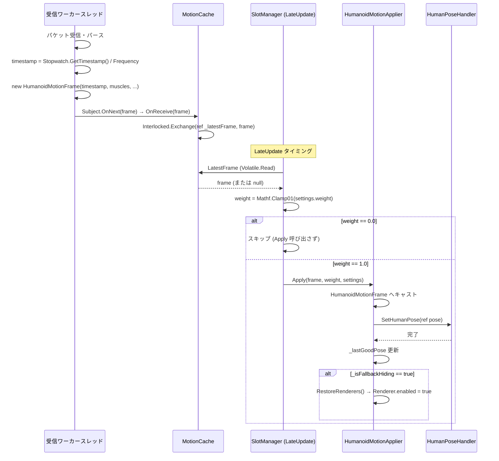
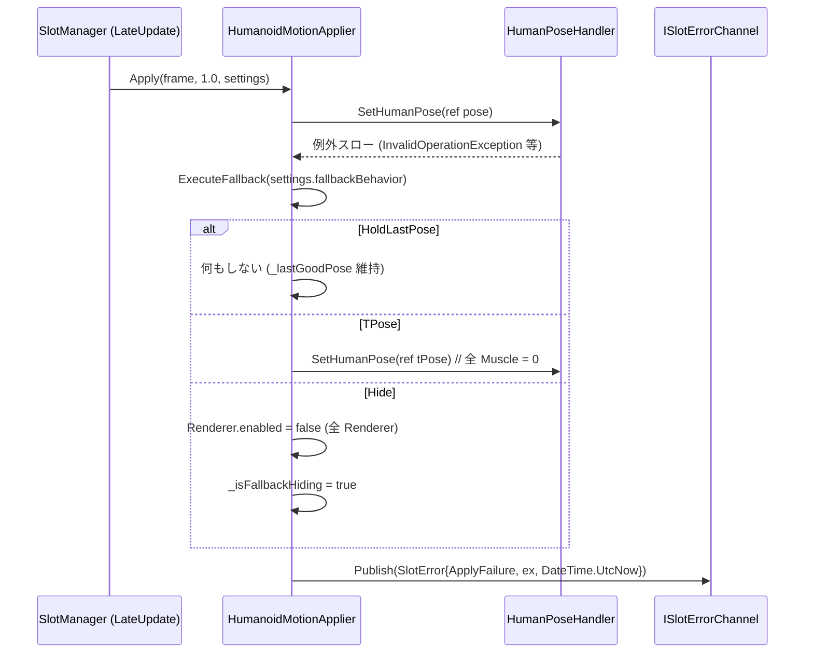
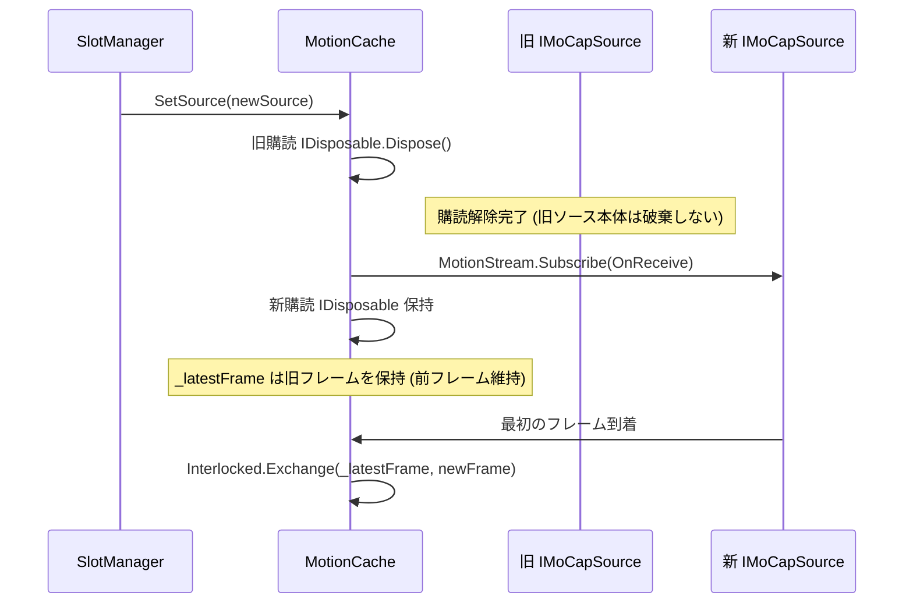

# motion-pipeline 設計ドキュメント

> **フェーズ**: design
> **言語**: ja
> **Wave**: Wave B (並列波) — slot-core (Wave A) の公開 API を起点として設計する

---

## 1. 概要

### 責務範囲

`motion-pipeline` は Realtime Avatar Controller において、MoCap ソースから Push 型ストリームで受信したモーションデータをアバターへ適用するパイプライン全体を担う。

| 責務 | 内容 |
|------|------|
| **中立表現定義** | `MotionFrame` 抽象基底型・`HumanoidMotionFrame` 具象型・`GenericMotionFrame` 抽象プレースホルダーの定義 |
| **内部キャッシュ** | Slot 単位の `MotionCache` による最新フレーム保持。受信スレッドとメインスレッドの分離 |
| **Weight 適用** | `SlotSettings.weight` を参照した二値 (0.0/1.0) 制御 |
| **Humanoid 適用層** | `HumanoidMotionApplier` / `HumanPoseHandler` を使ったアバター骨格制御 |
| **Fallback 挙動** | `FallbackBehavior` 参照によるエラー時挙動分岐 |
| **エラー通知** | Applier 例外時の `ISlotErrorChannel` への `ApplyFailure` 発行 |
| **ランタイム切替** | MoCap ソース切替・アバター切替のシームレス対応 |

### slot-core との境界

| 項目 | slot-core が提供 | motion-pipeline が担う |
|------|-----------------|----------------------|
| `IMoCapSource` シグネチャ | ○ | 参照のみ |
| `SlotSettings` / `FallbackBehavior` | ○ | 参照のみ |
| `ISlotErrorChannel` / `SlotError` | ○ | 参照のみ (push のみ行う) |
| `MotionFrame` 型階層 | × | 本 Spec が定義する |
| `IMotionApplier` / `MotionCache` | × | 本 Spec が定義する |

---

## 2. アーキテクチャ

### 2.1 Push 型購読パイプライン全体像

```
[受信ワーカースレッド]
   IMoCapSource
   ├─ MotionStream (IObservable<MotionFrame>)
   │    │ Subject<MotionFrame>.OnNext()
   │    │ (Publish().RefCount() によりマルチキャスト化)
   │    ▼
   MotionCache (Slot A)           MotionCache (Slot B)
   └─ 最新フレーム保持              └─ 最新フレーム保持
        │                                │
        │ [Interlocked.Exchange]         │ [Interlocked.Exchange]
        ▼                                ▼
[Unity メインスレッド / LateUpdate]
   IMotionApplier.Apply()         IMotionApplier.Apply()
   └─ HumanoidMotionApplier        └─ HumanoidMotionApplier
        └─ HumanPoseHandler              └─ HumanPoseHandler
             └─ Avatar (Slot A)               └─ Avatar (Slot B)
```

### 2.2 Slot との関係

- 各 Slot は独立した `MotionCache` インスタンスを保持する
- 同一 `IMoCapSource` を複数 Slot が共有参照する場合、`MotionStream` は `Publish().RefCount()` によるマルチキャスト化済み (slot-core / mocap-vmc 側で保証) のため、各 `MotionCache` は独立した購読を持つ
- `MotionCache` は `IMoCapSource` のライフサイクルを制御しない。購読解除 (`IDisposable.Dispose()`) のみが責務

### 2.3 複数 Slot での独立 MotionCache

```
同一 IMoCapSource
     │ MotionStream (マルチキャスト)
     ├──────────────────────────────┐
     ▼                              ▼
MotionCache (Slot A)         MotionCache (Slot B)
  _latestFrame (独立)           _latestFrame (独立)
  Subscribe (独立)              Subscribe (独立)
```

---

## 3. 公開 API 仕様 (最終 C# シグネチャ)

### 3.1 アセンブリ情報

| 項目 | 値 |
|------|-----|
| アセンブリ名 | `RealtimeAvatarController.Motion` |
| asmdef 配置パス | `Runtime/Motion/RealtimeAvatarController.Motion.asmdef` |
| 名前空間 | `RealtimeAvatarController.Motion` |
| 依存アセンブリ | `RealtimeAvatarController.Core` (UniRx / UniTask は Core 経由で間接依存) |

### 3.2 SkeletonType 列挙体

```csharp
namespace RealtimeAvatarController.Motion
{
    /// <summary>
    /// モーションフレームが表す骨格種別。
    /// </summary>
    public enum SkeletonType
    {
        /// <summary>Unity Humanoid 骨格 (Mecanim / HumanPose 相当)。</summary>
        Humanoid,

        /// <summary>Generic 骨格 (将来実装向けプレースホルダー)。</summary>
        Generic,
    }
}
```

### 3.3 MotionFrame (抽象基底クラス)

```csharp
namespace RealtimeAvatarController.Motion
{
    /// <summary>
    /// 全骨格形式 (Humanoid / Generic 等) 共通の抽象基底型。
    /// IMoCapSource.MotionStream が流すフレーム型として使用する。
    /// </summary>
    public abstract class MotionFrame
    {
        /// <summary>
        /// 受信タイムスタンプ (秒単位、App 起動基準の相対値)。
        /// 値: Stopwatch.GetTimestamp() / (double)Stopwatch.Frequency で算出。
        /// 打刻タイミング: 受信ワーカースレッド上でフレーム構築時。
        /// 注意: プロセス間比較不可。
        /// </summary>
        public double Timestamp { get; }

        /// <summary>このフレームが表す骨格種別。</summary>
        public abstract SkeletonType SkeletonType { get; }

        /// <summary>
        /// コンストラクタ (派生クラスから呼び出す)。
        /// timestamp は受信スレッド上で取得した Stopwatch ベース値を渡すこと。
        /// </summary>
        protected MotionFrame(double timestamp)
        {
            Timestamp = timestamp;
        }

        // 将来拡張フィールド (初期版では未実装):
        // public DateTime? WallClock { get; }  // ログ用途の wall clock (初期版では定義しない)
    }
}
```

### 3.4 HumanoidMotionFrame

```csharp
namespace RealtimeAvatarController.Motion
{
    /// <summary>
    /// Humanoid 骨格向けモーションフレーム。
    /// Unity HumanPose 相当の Muscle 配列と Root 位置・回転を保持するイミュータブルクラス。
    /// </summary>
    public sealed class HumanoidMotionFrame : MotionFrame
    {
        /// <inheritdoc/>
        public override SkeletonType SkeletonType => SkeletonType.Humanoid;

        /// <summary>
        /// Humanoid 骨格の Muscle 値配列。
        /// 要素数は HumanTrait.MuscleCount (= 95) に準拠する。
        /// 要素数が 0 の場合は「データなし / 初期化前」を示す無効フレームとして扱う。
        /// </summary>
        public float[] Muscles { get; }

        /// <summary>Root の位置 (Human Pose のボディ Position に相当)。</summary>
        public Vector3 RootPosition { get; }

        /// <summary>Root の回転 (Human Pose のボディ Rotation に相当)。</summary>
        public Quaternion RootRotation { get; }

        /// <summary>
        /// 有効フレームを生成するコンストラクタ。
        /// muscles の要素数は HumanTrait.MuscleCount (95) と一致していること。
        /// </summary>
        /// <param name="timestamp">受信スレッドで打刻した Stopwatch ベース秒数。</param>
        /// <param name="muscles">Muscle 値配列。呼び出し元から所有権を移譲する (内部コピー不要)。</param>
        /// <param name="rootPosition">Root 位置。</param>
        /// <param name="rootRotation">Root 回転。</param>
        public HumanoidMotionFrame(
            double timestamp,
            float[] muscles,
            Vector3 rootPosition,
            Quaternion rootRotation)
            : base(timestamp)
        {
            Muscles = muscles ?? Array.Empty<float>();
            RootPosition = rootPosition;
            RootRotation = rootRotation;
        }

        /// <summary>
        /// 無効フレーム (Muscles.Length == 0) を生成するファクトリメソッド。
        /// </summary>
        public static HumanoidMotionFrame CreateInvalid(double timestamp)
            => new HumanoidMotionFrame(timestamp, Array.Empty<float>(), Vector3.zero, Quaternion.identity);

        /// <summary>このフレームが有効データを持つかどうか。</summary>
        public bool IsValid => Muscles.Length > 0;
    }
}
```

### 3.5 GenericMotionFrame (抽象プレースホルダー)

```csharp
namespace RealtimeAvatarController.Motion
{
    /// <summary>
    /// Generic 骨格向けモーションフレームの将来実装向けプレースホルダー。
    /// 初期段階では具象フィールドを定義しない。
    /// 具象実装は本 Spec のスコープ外であり、将来の Generic Spec が担う。
    /// </summary>
    public abstract class GenericMotionFrame : MotionFrame
    {
        /// <inheritdoc/>
        public override SkeletonType SkeletonType => SkeletonType.Generic;

        protected GenericMotionFrame(double timestamp) : base(timestamp) { }

        // 将来実装予定:
        // public TransformData[] Bones { get; }  // 各ボーンの位置・回転・スケール
    }
}
```

### 3.6 IMotionApplier

```csharp
namespace RealtimeAvatarController.Motion
{
    /// <summary>
    /// モーションフレームをアバターに適用するアプライヤーの抽象インターフェース。
    /// Humanoid / Generic など骨格形式ごとに具象クラスを実装する。
    /// </summary>
    public interface IMotionApplier : IDisposable
    {
        /// <summary>
        /// アバターにモーションを適用する。
        /// Unity メインスレッド (LateUpdate タイミング) からのみ呼び出すこと。
        /// </summary>
        /// <param name="frame">適用するフレーム。null または無効フレームの場合はスキップ。</param>
        /// <param name="weight">適用ウェイト (0.0〜1.0、範囲外はクランプ)。初期版有効値: 0.0 / 1.0。</param>
        /// <param name="settings">対象 Slot の設定 (fallbackBehavior 等の参照に使用)。</param>
        void Apply(MotionFrame frame, float weight, SlotSettings settings);

        /// <summary>
        /// アバター GameObject を設定 / 変更する。
        /// null を渡すとアバターを切り離し、次の Apply 呼び出しをスキップする。
        /// Unity メインスレッドからのみ呼び出すこと。
        /// </summary>
        void SetAvatar(GameObject avatarRoot);
    }
}
```

### 3.7 HumanoidMotionApplier

```csharp
namespace RealtimeAvatarController.Motion
{
    /// <summary>
    /// Humanoid アバター向けモーション適用具象クラス。
    /// HumanPoseHandler を使用して HumanoidMotionFrame をアバターに適用する。
    /// </summary>
    public sealed class HumanoidMotionApplier : IMotionApplier
    {
        /// <summary>
        /// コンストラクタ。
        /// </summary>
        /// <param name="errorChannel">
        /// ApplyFailure 発生時の通知先。
        /// RegistryLocator.ErrorChannel または DI 経由で渡す。
        /// </param>
        /// <param name="slotId">このアプライヤーが属する Slot の識別子。エラー発行時に使用。</param>
        public HumanoidMotionApplier(ISlotErrorChannel errorChannel, string slotId);

        /// <inheritdoc/>
        /// <remarks>
        /// frame が HumanoidMotionFrame 以外の場合は適用をスキップし、エラーも発行しない。
        /// Apply 処理中に例外が発生した場合は FallbackBehavior を実行し ISlotErrorChannel に発行する。
        /// </remarks>
        public void Apply(MotionFrame frame, float weight, SlotSettings settings);

        /// <inheritdoc/>
        /// <remarks>
        /// null を渡した場合は内部の HumanPoseHandler を破棄する。
        /// 非 Humanoid アバターを渡した場合は InvalidOperationException をスローする。
        /// </remarks>
        public void SetAvatar(GameObject avatarRoot);

        /// <summary>
        /// HumanPoseHandler を破棄する。IDisposable.Dispose() で呼び出す。
        /// </summary>
        public void Dispose();
    }
}
```

### 3.8 MotionCache

```csharp
namespace RealtimeAvatarController.Motion
{
    /// <summary>
    /// Slot 単位の最新モーションフレームキャッシュ。
    /// IMoCapSource.MotionStream を購読し、受信スレッドで最新フレームをアトミックに書き込む。
    /// Unity メインスレッドからの読み出しはロックフリーで行える。
    /// </summary>
    public sealed class MotionCache : IDisposable
    {
        /// <summary>
        /// コンストラクタ。生成直後は購読を開始しない。
        /// SetSource() 呼び出しで購読を開始する。
        /// </summary>
        public MotionCache();

        /// <summary>
        /// 購読する MoCap ソースを設定 / 切り替える。
        /// 旧ソースへの購読を解除してから新ソースを購読する。
        /// null を渡すと購読を解除する。
        /// メインスレッドからのみ呼び出すこと。
        /// </summary>
        public void SetSource(IMoCapSource source);

        /// <summary>
        /// 最新のモーションフレームを返す。
        /// フレームが未到着の場合は null を返す。
        /// メインスレッドから呼び出すことを前提とするが、Interlocked による参照読み出しはスレッドセーフ。
        /// </summary>
        public MotionFrame LatestFrame { get; }

        /// <summary>
        /// 購読を解除し内部リソースを解放する。
        /// IMoCapSource 本体の Dispose() は呼び出さない。
        /// </summary>
        public void Dispose();
    }
}
```

---

## 4. MotionFrame 中立表現の完全仕様

### 4.1 MotionFrame の全フィールド / プロパティ

| メンバー | 種別 | 型 | 説明 |
|---------|------|-----|------|
| `Timestamp` | プロパティ (読み取り専用) | `double` | Stopwatch ベース秒単位タイムスタンプ |
| `SkeletonType` | 抽象プロパティ | `SkeletonType` | 骨格種別識別子 |

`HumanoidMotionFrame` の追加フィールド:

| メンバー | 種別 | 型 | 説明 |
|---------|------|-----|------|
| `Muscles` | プロパティ (読み取り専用) | `float[]` | Muscle 値配列 (長さ 95 or 0) |
| `RootPosition` | プロパティ (読み取り専用) | `Vector3` | Root 位置 |
| `RootRotation` | プロパティ (読み取り専用) | `Quaternion` | Root 回転 |
| `IsValid` | プロパティ (読み取り専用) | `bool` | `Muscles.Length > 0` |

### 4.2 Timestamp 取得式

```csharp
// 受信ワーカースレッド上でフレーム構築直前に打刻する
double timestamp = Stopwatch.GetTimestamp() / (double)Stopwatch.Frequency;
var frame = new HumanoidMotionFrame(timestamp, muscles, rootPos, rootRot);
```

| 項目 | 内容 |
|------|------|
| 型 | `double` (秒単位) |
| 基準 | App 起動時 (Stopwatch 起動基準の相対値) |
| 取得式 | `Stopwatch.GetTimestamp() / (double)Stopwatch.Frequency` |
| 打刻タイミング | 受信ワーカースレッド上、フレーム構築時 |
| Unity API 使用 | 不使用 (スレッドセーフ) |
| プロセス間比較 | **不可** (相対値) |

### 4.3 受信ワーカースレッドでの打刻タイミング

MoCap ソース (mocap-vmc 等) の内部受信ループにてパケットを受信・パースした直後、`HumanoidMotionFrame` のコンストラクタに渡すタイムスタンプを取得する。Unity メインスレッド API は使用しないため、受信スレッドから安全に呼び出せる。

### 4.4 WallClock フィールド設計

- `WallClock: DateTime?` は初期版では**実装しない**
- 将来ログ用途で wall clock が必要になった場合に `MotionFrame` 基底クラスに追加する設計余地を確保する
- 追加時点で `HumanoidMotionFrame` のコンストラクタに `DateTime? wallClock = null` パラメータを追加するだけで対応可能

### 4.5 イミュータブル設計の選定

**`MotionFrame` は `sealed class` ではなく抽象クラス (`abstract class`) を採用する。`HumanoidMotionFrame` は `sealed class` とする。**

struct 採用を検討したが、以下の理由により class を選定した:

| 検討項目 | struct | class (採用) |
|---------|--------|-------------|
| 継承 (Humanoid / Generic 統一処理) | 不可 | 可 |
| IObservable ストリームでのボックス化 | 毎フレーム発生 | なし |
| Muscles 配列保持 | struct 内 ref 型フィールドが参照型になる | 自然 |
| null チェック (未到着判定) | 別途 Optional 型が必要 | null で表現可能 |

全プロパティは readonly であり、コンストラクタで完全初期化する。外部からの書き換えは不可能。

### 4.6 Muscles 配列長と無効フレーム規約

| 状態 | `Muscles.Length` | `IsValid` | 動作 |
|------|:---------------:|:---------:|------|
| 通常フレーム | 95 (`HumanTrait.MuscleCount`) | `true` | 通常適用 |
| 無効フレーム | 0 | `false` | 適用スキップ (前フレーム維持) |
| 未到着 (MotionCache) | — | — | `LatestFrame == null` → 適用スキップ |

> **無効フレームはエラーではない**: `ISlotErrorChannel` への `ApplyFailure` 発行は行わない。

---

## 5. MotionCache 設計

### 5.1 スレッドモデル選定

**方式 B (受信スレッド直接書込 / `Interlocked.Exchange`) を採用する。**

| 方式 | 説明 | 採用理由 / 否定理由 |
|------|------|------------------|
| **方式 A** | `.ObserveOnMainThread()` でメインスレッドに切り替えてから書込 | UniRx キュー経由のため、高頻度フレームでキューが積み重なる可能性がある。LateUpdate タイミングで最新フレームのみを使用する本設計では不必要なキュー処理が発生する |
| **方式 B** (採用) | 受信スレッドで `Interlocked.Exchange` によりアトミックに参照を更新し、メインスレッドで読み出す | ロックフリーで最新フレームのみを保持できる。キューの蓄積なし。フレームドロップを許容する設計と整合する |

### 5.2 実装方式: 単一最新フレーム保持 (Interlocked)

ダブルバッファではなく「常に最新フレームのみ保持」方式を採用する。

```csharp
// MotionCache 内部実装イメージ
private volatile MotionFrame _latestFrame;  // volatile + Interlocked で保護

// 受信スレッドから (OnNext コールバック内)
private void OnReceive(MotionFrame frame)
{
    Interlocked.Exchange(ref _latestFrame, frame);
}

// メインスレッドから (LateUpdate で呼び出す側)
public MotionFrame LatestFrame => Volatile.Read(ref _latestFrame);
```

**選定理由**: リアルタイム MoCap 制御において「フレームの順序保証」より「最新フレームへの低レイテンシアクセス」を優先する。フレームドロップは許容する。

### 5.3 Slot ごとの独立インスタンス

```
SlotA
  ├─ MotionCache (独立インスタンス)
  │    └─ _latestFrame (独立フィールド)
  └─ IMotionApplier

SlotB
  ├─ MotionCache (独立インスタンス)
  │    └─ _latestFrame (独立フィールド)
  └─ IMotionApplier
```

同一 `IMoCapSource` を参照共有している場合でも、`MotionCache` は Slot ごとに独立した参照を保持する。UniRx のマルチキャスト (`Publish().RefCount()`) により、同一ストリームから独立した購読が可能。

### 5.4 購読ライフサイクル

| イベント | `MotionCache` の動作 |
|---------|---------------------|
| `SetSource(source)` 呼び出し (初回) | `source.MotionStream.Subscribe(OnReceive)` を実行し、IDisposable を保持 |
| `SetSource(newSource)` 呼び出し (切替) | 旧購読の `Dispose()` を呼んでから新ソースを購読 |
| `SetSource(null)` 呼び出し | 旧購読の `Dispose()` のみ実行。`_latestFrame` は保持 (前フレーム維持) |
| `MotionCache.Dispose()` | 購読の `Dispose()` を実行。`IMoCapSource` 本体の `Dispose()` は**呼び出さない** |

### 5.5 IMoCapSource Dispose 禁止

`MotionCache` は `IMoCapSource` のライフサイクルを所有しない。`IMoCapSource.Dispose()` は `MoCapSourceRegistry` が参照カウントをもとに管理する (slot-core 設計)。`MotionCache.Dispose()` / `SetSource(null)` では購読解除 (`IDisposable.Dispose()`) のみを行う。

---

## 6. Weight 適用仕様 (初期版)

### 6.1 有効値と動作

| Weight 値 | 動作 | 備考 |
|-----------|------|------|
| `1.0` | **完全適用 (full apply)**: `MotionFrame` をそのままアバターへ適用する | デフォルト動作 |
| `0.0` | **スキップ (skip)**: `IMotionApplier.Apply()` を呼び出さず前フレームポーズを維持する | `FallbackBehavior` に従い HoldLastPose / TPose / Hide |
| 範囲外 (`< 0.0` or `> 1.0`) | クランプして `0.0` または `1.0` として扱う | |
| `0.0 < w < 1.0` | **未定義** (将来の複数ソース混合シナリオで定義する) | 初期版では実装しない |

### 6.2 IMotionApplier シグネチャでの Weight 扱い

```csharp
// SlotManager (または上位コンポーネント) での呼び出しイメージ
float clampedWeight = Mathf.Clamp01(settings.weight);
if (clampedWeight == 0f)
{
    // skip: Apply を呼び出さない → 前フレームポーズ維持
    return;
}
// weight == 1.0 の場合のみ Apply を呼び出す (初期版)
applier.Apply(cache.LatestFrame, clampedWeight, settings);
```

### 6.3 将来拡張

`0.0 < weight < 1.0` の中間値セマンティクス (複数ソースのブレンド / フェードイン・アウト) は、複数ソース混合シナリオを導入する際に `IMotionApplier` のインターフェース変更なしに実装を変更することで対応する。

---

## 7. Humanoid 適用層

### 7.1 HumanoidMotionApplier 内部設計

```
HumanoidMotionApplier
  ├─ _poseHandler: HumanPoseHandler       // アバター骨格操作
  ├─ _lastGoodPose: HumanPose             // HoldLastPose 用の直前正常ポーズ
  ├─ _renderers: Renderer[]              // Hide/復帰用 Renderer キャッシュ
  ├─ _isFallbackHiding: bool             // Hide 状態フラグ
  ├─ _errorChannel: ISlotErrorChannel    // エラー発行先 (コンストラクタ注入)
  └─ _slotId: string                     // エラー発行時の Slot 識別子
```

### 7.2 HumanPoseHandler の初期化・破棄

```csharp
// SetAvatar(avatarRoot) 呼び出し時
private void InitializePoseHandler(GameObject avatarRoot)
{
    // 旧 PoseHandler を破棄
    _poseHandler?.Dispose();
    _poseHandler = null;
    _renderers = null;

    if (avatarRoot == null) return;

    var animator = avatarRoot.GetComponent<Animator>();
    if (animator == null || !animator.isHuman)
        throw new InvalidOperationException(
            $"[HumanoidMotionApplier] GameObject '{avatarRoot.name}' は Humanoid アバターではありません。");

    _poseHandler = new HumanPoseHandler(animator.avatar, avatarRoot.transform);
    _renderers = avatarRoot.GetComponentsInChildren<Renderer>(includeInactive: true);
    _lastGoodPose = new HumanPose();
    _poseHandler.GetHumanPose(ref _lastGoodPose);  // 現ポーズを初期値として保持
}
```

### 7.3 アバター切替時の HumanPoseHandler 再初期化フロー

```
SetAvatar(newAvatar) 呼び出し (メインスレッド)
  │
  ├─ 1. _poseHandler?.Dispose()   // 旧 PoseHandler 破棄
  ├─ 2. _renderers = null         // Renderer キャッシュクリア
  ├─ 3. _isFallbackHiding = false // Hide フラグリセット
  │
  ├─ [newAvatar == null の場合]
  │     └─ return (次の Apply() は frame null 扱いでスキップ)
  │
  └─ [newAvatar != null の場合]
        ├─ Animator コンポーネント取得
        ├─ isHuman チェック → false → InvalidOperationException
        ├─ HumanPoseHandler 生成 (新アバター用)
        ├─ Renderer[] キャッシュ取得
        └─ 初期ポーズ (_lastGoodPose) 取得
```

切替完了後、次の `Apply()` 呼び出しから新アバターへの適用が開始される。切替中 (`_poseHandler == null` の状態) に到達したフレームは適用をスキップし、前フレームポーズを維持する。

### 7.4 非 Humanoid アバターへの適用時の例外仕様

| 発生箇所 | 例外型 | メッセージ例 |
|---------|--------|------------|
| `SetAvatar()` 時 (Animator なし) | `InvalidOperationException` | `"GameObject 'xxx' に Animator コンポーネントがありません。"` |
| `SetAvatar()` 時 (Humanoid でない) | `InvalidOperationException` | `"GameObject 'xxx' は Humanoid アバターではありません。"` |
| `Apply()` 時 (PoseHandler 未初期化) | スキップ (例外なし) | — (null/invalid frame と同様に処理) |

---

## 8. FallbackBehavior 分岐実装

### 8.1 概要

`HumanoidMotionApplier.Apply()` 内でモーション適用処理が例外をスローした場合、`SlotSettings.fallbackBehavior` を参照して以下のいずれかの処理を実行する。

```csharp
// Apply() 内の例外処理イメージ
try
{
    ApplyInternal(humanoidFrame);
    // 正常完了
    _lastGoodPose 更新
    if (_isFallbackHiding) RestoreRenderers(); // Hide からの復帰
}
catch (Exception ex)
{
    ExecuteFallback(settings.fallbackBehavior);
    _errorChannel.Publish(new SlotError(_slotId, SlotErrorCategory.ApplyFailure, ex, DateTime.UtcNow));
}
```

### 8.2 HoldLastPose

**動作**: Applier 内部に保持している直前の正常ポーズ (`_lastGoodPose: HumanPose`) をそのまま維持し続ける。`HumanPoseHandler` への再書き込みは行わない。

```csharp
case FallbackBehavior.HoldLastPose:
    // _lastGoodPose は正常 Apply 完了時のみ更新済み
    // 何もしない (前フレームのポーズが維持されている)
    break;
```

- デフォルト挙動
- 視覚的変化なし (最後の正常ポーズで静止)
- `_lastGoodPose` は正常 Apply 時のみ更新し、エラー時は更新しない

### 8.3 TPose

**動作**: `HumanPoseHandler` を通じてアバターを T ポーズ (全 Muscle 値 0、Root を初期値) にリセットする。

```csharp
case FallbackBehavior.TPose:
    var tPose = new HumanPose();
    // HumanPose のデフォルト値 (muscles は全て 0、bodyPosition = Vector3.up * 1.0f)
    tPose.bodyPosition = Vector3.up;
    tPose.bodyRotation = Quaternion.identity;
    // muscles は new HumanPose() でゼロ初期化済み
    _poseHandler.SetHumanPose(ref tPose);
    break;
```

- デバッグ用途向け (問題発生を視覚的に認識できる)
- `_lastGoodPose` は更新しない (エラー継続中は T ポーズを維持)

### 8.4 Hide

**動作**: アバター GameObject に付属するすべての `Renderer` コンポーネントを無効化 (`enabled = false`) する。GameObject 自体は破棄せず生存させる。

```csharp
case FallbackBehavior.Hide:
    if (_renderers != null)
    {
        foreach (var r in _renderers)
            if (r != null) r.enabled = false;
    }
    _isFallbackHiding = true;
    break;
```

**Hide からの復帰**: 次フレームの `Apply()` が例外なく正常完了した場合に `Renderer` を再有効化する。

```csharp
private void RestoreRenderers()
{
    if (_renderers != null)
    {
        foreach (var r in _renderers)
            if (r != null) r.enabled = true;
    }
    _isFallbackHiding = false;
}
```

> **注記**: slot-core design.md の 11.2 章では `Hide` の実装として `GameObject.SetActive(false)` が言及されているが、motion-pipeline 側の確定仕様は **`Renderer.enabled = false`** とする。GameObject 自体は生存させることで、Slot のライフサイクルや他コンポーネントへの影響を排除する (requirements Req 12 AC4 準拠)。

### 8.5 SlotSettings.fallbackBehavior への参照経路

```
HumanoidMotionApplier.Apply(frame, weight, settings)
                                              │
                                              └─ settings.fallbackBehavior
                                                   │ (RealtimeAvatarController.Core)
                                                   └─ FallbackBehavior enum 値を参照
```

`FallbackBehavior` enum の定義責務は `slot-core` (`RealtimeAvatarController.Core`) にある。`motion-pipeline` は `RealtimeAvatarController.Core` アセンブリ参照経由でこの enum を利用する。

---

## 9. ErrorChannel 連携

### 9.1 ApplyFailure 発行タイミング

```
Apply() 例外発生
  │
  ├─ 1. ExecuteFallback() 実行 (FallbackBehavior 分岐)
  │        └─ フォールバック処理が先に完了することを保証
  │
  └─ 2. _errorChannel.Publish() 実行
           └─ new SlotError(
                  slotId:    _slotId,
                  category:  SlotErrorCategory.ApplyFailure,
                  exception: ex,
                  timestamp: DateTime.UtcNow
              )
```

### 9.2 ISlotErrorChannel の取得方法

`HumanoidMotionApplier` は `ISlotErrorChannel` をコンストラクタで受け取る。

```csharp
// 生成例 (SlotManager や上位コンポーネントから)
var applier = new HumanoidMotionApplier(
    errorChannel: RegistryLocator.ErrorChannel,
    slotId: slot.SlotId
);
```

`RegistryLocator.ErrorChannel` 経由でデフォルト実装にアクセスできる。テスト時は `RegistryLocator.OverrideErrorChannel(mock)` でモックに差し替える。

### 9.3 発行対象外のケース

| ケース | ErrorChannel への発行 | 理由 |
|--------|:-------------------:|------|
| `MotionCache.LatestFrame == null` | **しない** | 未到着は通常動作 |
| `HumanoidMotionFrame.IsValid == false` (Muscles.Length == 0) | **しない** | 無効フレームは通常動作 |
| `frame` が `HumanoidMotionFrame` 以外の型 | **しない** | 骨格型不一致はスキップ (将来 Generic 対応時に仕様追加) |
| `Apply()` 内で実行時例外が発生した場合 | **する** | `ApplyFailure` として発行 |

### 9.4 連続例外の扱い

同一フレーム内の連続例外も含めて毎回発行する。重複抑制 (`Debug.LogError` の抑制) は `ISlotErrorChannel` 実装側 (`DefaultSlotErrorChannel`) が管理するため、`motion-pipeline` 側では抑制フィルタリングを行わない。

---

## 10. スレッドモデル

### 10.1 スレッド境界図

```
[受信ワーカースレッド]              [Unity メインスレッド]
    │                                      │
    │ IMoCapSource.MotionStream            │
    │ Subject<MotionFrame>.OnNext()        │
    │                                      │
    ▼                                      │
MotionCache._latestFrame                   │
    │ Interlocked.Exchange (write)         │
    │                                      │
    │                                      ▼ LateUpdate
    │                              MotionCache.LatestFrame
    │                                  Volatile.Read (read)
    │                                      │
    │                                      ▼
    │                              IMotionApplier.Apply()
    │                                      │
    │                                      ▼
    │                              HumanPoseHandler.SetHumanPose()
    │                              Renderer.enabled = ...
    │                              ISlotErrorChannel.Publish()
```

### 10.2 スレッド安全規約

| 操作 | 実行スレッド | 使用プリミティブ |
|------|------------|----------------|
| `MotionFrame` 構築・Timestamp 打刻 | 受信ワーカースレッド | `Stopwatch.GetTimestamp()` (スレッドセーフ) |
| `MotionCache._latestFrame` 書き込み | 受信ワーカースレッド | `Interlocked.Exchange` |
| `MotionCache.LatestFrame` 読み出し | メインスレッド | `Volatile.Read` |
| `MotionCache.SetSource()` | メインスレッドのみ | 単一スレッドのため不要 |
| `IMotionApplier.Apply()` | メインスレッドのみ | 単一スレッドのため不要 |
| `HumanPoseHandler` 全操作 | メインスレッドのみ | Unity API 制約 |
| `ISlotErrorChannel.Publish()` | メインスレッドのみ | — |

### 10.3 UniRx スレッドセーフ発行

`IMoCapSource` 具象実装 (mocap-vmc) 側で `Subject<MotionFrame>` を `Subject.Synchronize()` (または `SerialDisposable` + `lock`) によりスレッドセーフ化する (slot-core / mocap-vmc の責務)。`MotionCache` 購読側は `OnReceive` コールバックが受信スレッドから呼ばれることを前提とし、`Interlocked.Exchange` のみで保護する。

### 10.4 LateUpdate タイミング

モーション適用 (`IMotionApplier.Apply()`) は `LateUpdate` タイミングで実行することを**推奨**とする。これにより、同フレームの `Update()` でアニメーターやスクリプトが制御した後にモーションを上書き適用できる。上位コンポーネント (SlotManager 等) が `LateUpdate` でパイプラインを駆動する責務を持つ。

---

## 11. シーケンス図

### 11.1 Push 型受信 → MotionCache → LateUpdate → Applier → HumanPoseHandler



### 11.2 Fallback 発動フロー



### 11.3 MoCap ソース切替時のフロー



---

## 12. ファイル / ディレクトリ構成

```
RealtimeAvatarController/
└── Packages/
    └── com.hidano.realtime-avatar-controller/
        ├── Runtime/
        │   └── Motion/
        │       ├── RealtimeAvatarController.Motion.asmdef
        │       ├── Frame/
        │       │   ├── SkeletonType.cs
        │       │   ├── MotionFrame.cs
        │       │   ├── HumanoidMotionFrame.cs
        │       │   └── GenericMotionFrame.cs
        │       ├── Cache/
        │       │   └── MotionCache.cs
        │       └── Applier/
        │           ├── IMotionApplier.cs
        │           └── HumanoidMotionApplier.cs
        │
        └── Tests/
            ├── EditMode/
            │   └── Motion/
            │       ├── RealtimeAvatarController.Motion.Tests.EditMode.asmdef
            │       ├── Frame/
            │       │   ├── HumanoidMotionFrameTests.cs
            │       │   └── MotionFrameTimestampTests.cs
            │       ├── Cache/
            │       │   └── MotionCacheTests.cs
            │       └── Applier/
            │           ├── HumanoidMotionApplierFallbackTests.cs
            │           └── WeightTests.cs
            └── PlayMode/
                └── Motion/
                    ├── RealtimeAvatarController.Motion.Tests.PlayMode.asmdef
                    └── Applier/
                        ├── HumanoidMotionApplierIntegrationTests.cs
                        └── FallbackHideTests.cs
```

### 12.1 asmdef 設定

| asmdef 名 | 配置パス | 参照アセンブリ | テスト専用 |
|-----------|---------|-------------|:--------:|
| `RealtimeAvatarController.Motion` | `Runtime/Motion/` | `RealtimeAvatarController.Core`, `UniRx` | — |
| `RealtimeAvatarController.Motion.Tests.EditMode` | `Tests/EditMode/Motion/` | `RealtimeAvatarController.Motion`, `RealtimeAvatarController.Core`, `UniRx` | ○ (Editor Only) |
| `RealtimeAvatarController.Motion.Tests.PlayMode` | `Tests/PlayMode/Motion/` | `RealtimeAvatarController.Motion`, `RealtimeAvatarController.Core`, `UniRx` | ○ |

> **UniRx 直接参照について**: `MotionCache` が `IObservable<MotionFrame>.Subscribe()` を呼び出すため、`RealtimeAvatarController.Motion` の asmdef に `UniRx` を直接参照として追加する。

---

## 13. テスト設計

### 13.1 EditMode テスト (`RealtimeAvatarController.Motion.Tests.EditMode`)

Unity ランタイムを必要としない純粋なロジックテスト。

| テストクラス | 対象 | 検証内容 |
|------------|------|---------|
| `MotionFrameTimestampTests` | `HumanoidMotionFrame` | Timestamp が正値・単調増加であること、コンストラクタで正しく保持されること |
| `HumanoidMotionFrameTests` | `HumanoidMotionFrame` | `IsValid` (Muscles.Length 95 → true、0 → false)、null Muscles 時のデフォルト空配列化、イミュータブル確認 |
| `MotionCacheTests` | `MotionCache` | 購読開始 / 解除 / ソース切替時の動作 (Subject を使ったスタブ)、`LatestFrame` の更新確認、`Dispose()` 後の購読解除確認、`IMoCapSource.Dispose()` が呼ばれないことの確認 |
| `WeightTests` | 呼び出しロジック | weight == 0.0 → Apply スキップ確認、weight == 1.0 → Apply 呼び出し確認、範囲外クランプ確認 |
| `HumanoidMotionApplierFallbackTests` | `HumanoidMotionApplier` | HoldLastPose / TPose / Hide 各 enum 値での分岐確認 (モック `HumanPoseHandler` または テスト用スタブを使用)、ISlotErrorChannel への発行確認、無効フレームで発行しないことの確認 |

### 13.2 PlayMode テスト (`RealtimeAvatarController.Motion.Tests.PlayMode`)

実 Unity ランタイムを使用したインテグレーションテスト。

| テストクラス | 対象 | 検証内容 |
|------------|------|---------|
| `HumanoidMotionApplierIntegrationTests` | `HumanoidMotionApplier` + 実アバター | テスト用 Humanoid Prefab を生成し、実際の `HumanoidMotionFrame` を `Apply()` した後にアバターのポーズが変化していることを確認 |
| `FallbackHideTests` | `HumanoidMotionApplier` + 実アバター | `FallbackBehavior.Hide` 発動時に全 `Renderer.enabled == false` になること、次フレームの正常 Apply 後に `Renderer.enabled == true` に復帰することを確認 |

### 13.3 テスト用スタブ・モック方針

- `MotionCacheTests` では UniRx の `Subject<MotionFrame>` をスタブとして使用し、実 `IMoCapSource` を使わずに購読ライフサイクルを検証する
- `HumanoidMotionApplierFallbackTests` では `ISlotErrorChannel` モックを `RegistryLocator.OverrideErrorChannel()` 経由で差し込む。テスト終了時に `RegistryLocator.ResetForTest()` でリセットする
- PlayMode テスト用 Humanoid Prefab は `Tests/PlayMode/Motion/Fixtures/` に配置する

---

## 付録: contracts.md 2.2 章との整合確認

本 design.md で確定した型仕様は、contracts.md 2.2 章に記載された骨格と以下の点で整合・拡張している。

| 項目 | contracts.md 2.2 章 | 本 design.md での確定内容 |
|------|---------------------|------------------------|
| `MotionFrame` 型種別 | 抽象クラス (design フェーズで確定) | **抽象クラス** を採用 |
| `HumanoidMotionFrame` 型種別 | sealed class | sealed class を採用 |
| `Muscles` 型 | `float[]` | `float[]` (変更なし) |
| 無効フレーム表現 | `Muscles.Length == 0` | `Muscles.Length == 0` + `IsValid` プロパティ追加 |
| `WallClock` | 初期版未実装 | 初期版未実装 (確認) |
| スレッド安全実装方式 | design フェーズで選択 | **方式 B (Interlocked.Exchange)** を選定 |
