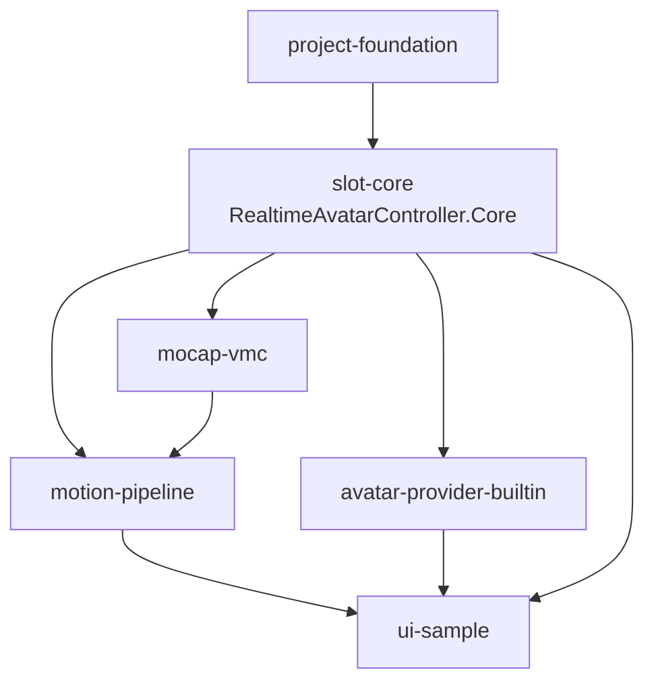
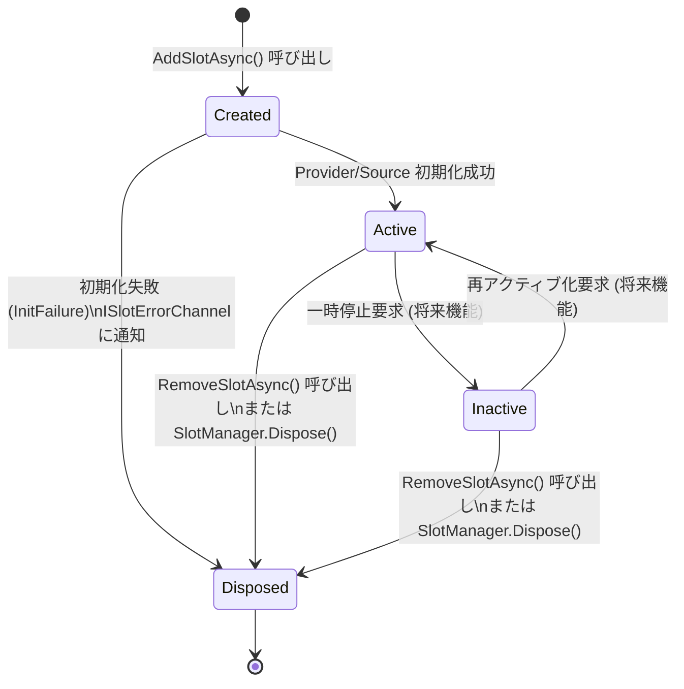
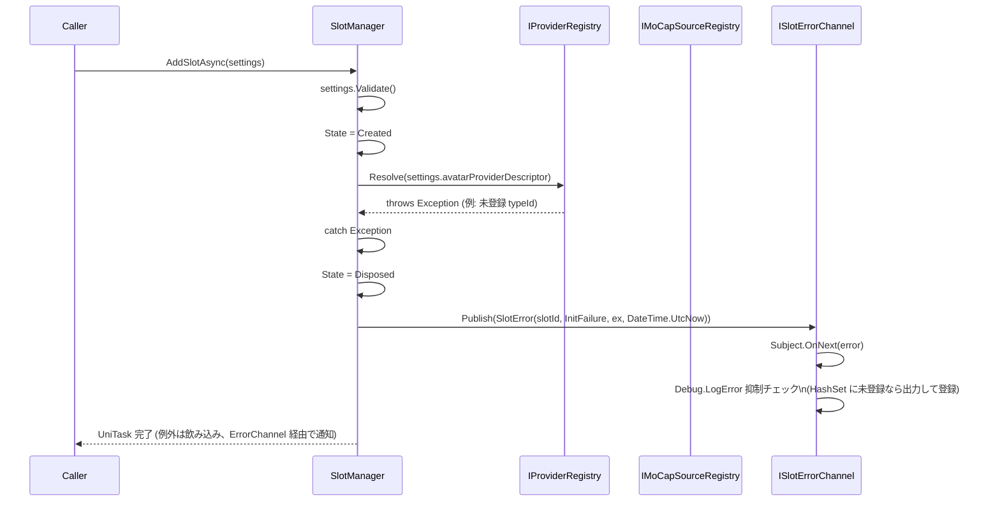
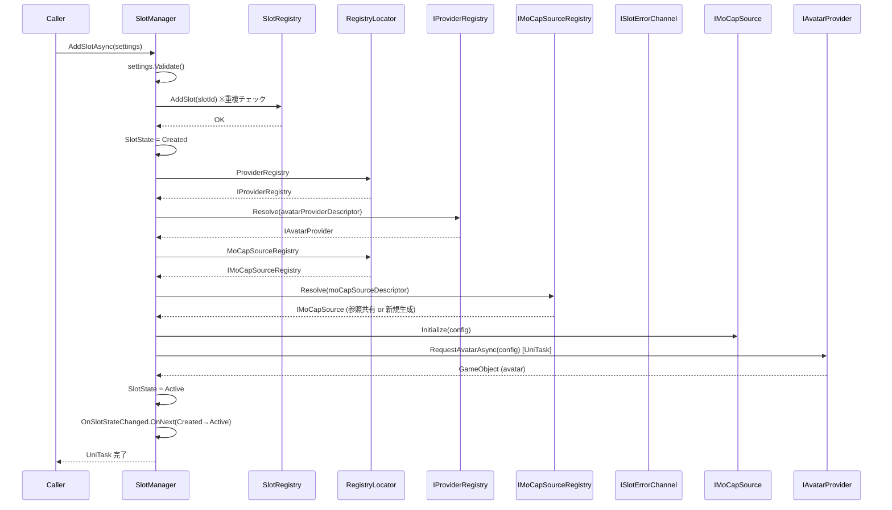
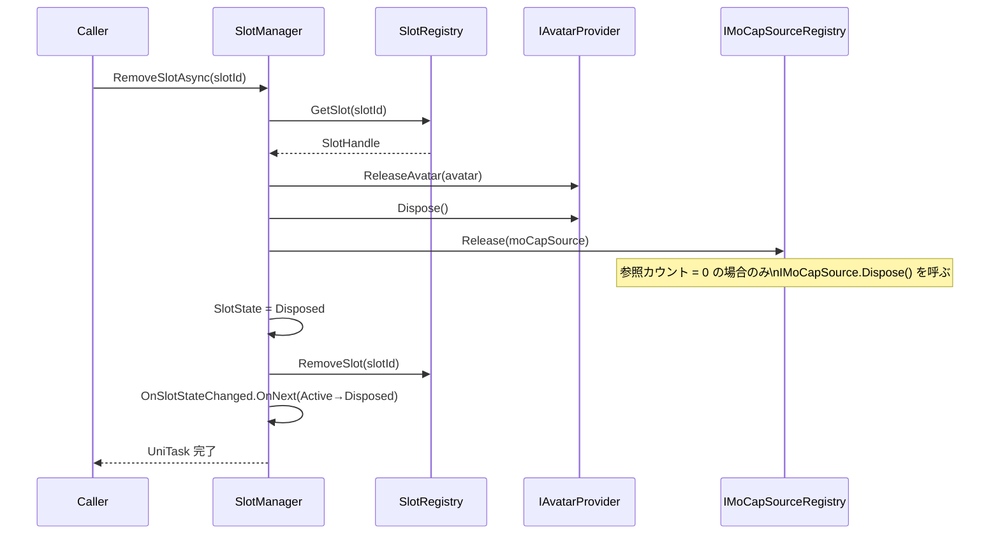
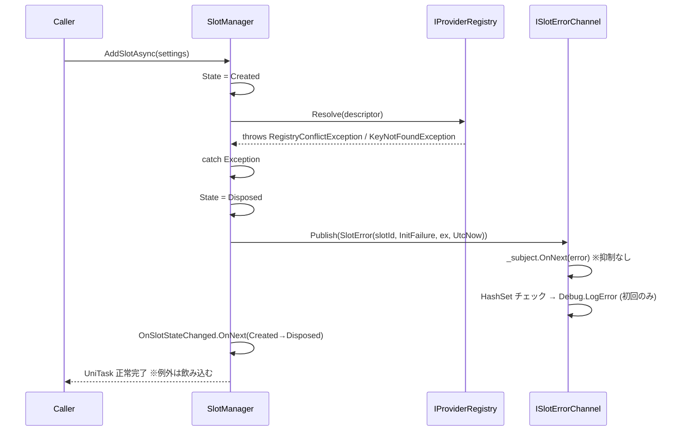
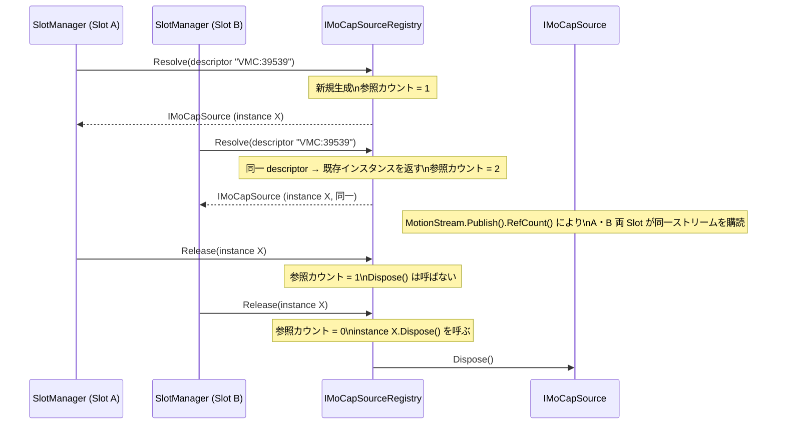

# slot-core 設計ドキュメント

> **フェーズ**: design  
> **言語**: ja  
> **Wave**: Wave A (先行波) — 本ドキュメントを Wave B (5 Spec 並列) の参照起点とする

---

## 1. 概要

### 責務範囲

`slot-core` は Realtime Avatar Controller の中核 Spec であり、以下を責務とする。

- **Slot データモデル**: `SlotSettings`・各 `Descriptor`・Config 基底型階層の定義
- **Slot ライフサイクル管理**: `SlotManager` / `SlotRegistry` による動的追加・削除・状態遷移
- **抽象インターフェース定義**: `IMoCapSource` / `IAvatarProvider` / `IFacialController` / `ILipSyncSource` の**最終シグネチャ確定**
- **Registry / Factory 基盤**: `IProviderRegistry` / `IMoCapSourceRegistry` / 各 Factory インターフェース
- **静的アクセスポイント**: `RegistryLocator` (テスト用 Reset / Override API 含む)
- **エラーハンドリング基盤**: `ISlotErrorChannel` / `SlotError` / `SlotErrorCategory`
- **フォールバック挙動**: `FallbackBehavior` 列挙体
- **属性ベース自動登録機構**: `[RuntimeInitializeOnLoadMethod]` / `[InitializeOnLoadMethod]` エントリポイント

### 他 Spec との境界

| 境界 | 内容 |
|------|------|
| `project-foundation` → `slot-core` | Unity 6000.3.10f1 プロジェクト・アセンブリ定義・UPM 雛形を前提とする |
| `slot-core` → `mocap-vmc` | `IMoCapSource` シグネチャ・`MoCapSourceConfigBase`・`IMoCapSourceFactory`・`IMoCapSourceRegistry` を提供する |
| `slot-core` → `avatar-provider-builtin` | `IAvatarProvider` シグネチャ・`ProviderConfigBase`・`IAvatarProviderFactory`・`IProviderRegistry` を提供する |
| `slot-core` → `motion-pipeline` | `SlotSettings`・`Slot` ライフサイクルデータモデルを提供する。`MotionFrame` 型は `motion-pipeline` が定義する |
| `slot-core` → `ui-sample` | `SlotManager` / `ISlotErrorChannel` / `RegistryLocator` の公開 API を提供する |

**本 Spec が定義しない事項**:
- `MotionFrame` の具体的フィールド (motion-pipeline 担当)
- `IMoCapSource` の具象実装 (mocap-vmc 担当)
- `IAvatarProvider` の具象実装 (avatar-provider-builtin 担当)
- `IFacialController` / `ILipSyncSource` の具象実装 (初期段階では対象外)
- モーション適用処理 (motion-pipeline 担当)

---

## 2. アーキテクチャ概観

### レイヤー構成

```
┌──────────────────────────────────────────────────────────────────────┐
│  ui-sample (RealtimeAvatarController.Samples.UI)                      │
│  SlotManager 公開 API / ISlotErrorChannel 購読                        │
└─────────────────────┬────────────────────────────────────────────────┘
                       │ depends on
┌──────────────────────▼────────────────────────────────────────────────┐
│  slot-core (RealtimeAvatarController.Core)  ← 本 Spec                 │
│                                                                        │
│  [データモデル]              [ライフサイクル管理]                        │
│  SlotSettings                SlotManager                               │
│  *Descriptor                 SlotRegistry                              │
│  *ConfigBase                 ISlotErrorChannel                         │
│                                                                        │
│  [Registry / Factory 基盤]   [静的アクセス]                             │
│  IProviderRegistry           RegistryLocator                           │
│  IMoCapSourceRegistry        OverrideXxx / ResetForTest                │
│  I*Factory                                                             │
│                                                                        │
│  [公開抽象 IF]                                                          │
│  IMoCapSource                IAvatarProvider                           │
│  IFacialController           ILipSyncSource                            │
└──────┬────────────────────────────┬────────────────────────────────────┘
       │ IMoCapSource 契約           │ IAvatarProvider 契約
┌──────▼──────────────┐  ┌──────────▼──────────────────────────────────┐
│ mocap-vmc           │  │ avatar-provider-builtin                       │
│ VMCMoCapSource      │  │ BuiltinAvatarProvider                         │
└─────────────────────┘  └───────────────────────────────────────────────┘
       │ MotionFrame 型
┌──────▼──────────────────────────────────────────────────────────────┐
│  motion-pipeline (RealtimeAvatarController.Motion)                   │
│  MotionFrame / HumanoidMotionFrame / Pipeline 処理                   │
└──────────────────────────────────────────────────────────────────────┘
```

### 依存グラフ (コンポーネント間)



---

## 3. 公開 API 仕様 (契約の最終確定)

### 3.0 UniTask vs Task の選択決定

**決定: UniTask (`com.cysharp.unitask`) を採用する。**

| 観点 | UniTask | Task |
|------|---------|------|
| Unity エコシステム整合 | `PlayerLoop` 統合・`UnityWebRequest` 等の Unity 非同期 API と自然に統合 | 要変換 |
| ゼロアロケーション | 構造体ベース実装によりヒープアロケーション最小 | GC 負荷あり |
| キャンセル | `CancellationToken` サポート完備 | 同等 |
| UPM 依存追加 | OpenUPM scoped registry 追加が必要 (UniRx と同様) | 不要 |
| デバッグ | UniTask Tracker ウィンドウで非同期処理を可視化可能 | 限定的 |

**採用理由**: `SlotManager.AddSlotAsync` は `IAvatarProvider` の初期化 (将来的に Addressable Provider が非同期 Asset ロードを行う) を含む。Unity の `PlayerLoop` と統合された UniTask を採用することで、メインスレッド復帰・キャンセル処理が簡潔に書ける。UPM 依存追加のコストは UniRx 導入時点で既に受容済みであり、新たなトレードオフとはならない。

**補足**: `IAvatarProvider.RequestAvatarAsync` の戻り値型も `UniTask<GameObject>` に確定する。

---

### 3.1 IMoCapSource

```csharp
namespace RealtimeAvatarController.Core
{
    /// <summary>
    /// MoCap データの Push 型ストリームを提供するソースインターフェース。
    /// MotionStream は受信スレッドから OnNext() で配信され、OnError は発行しない。
    /// インスタンスのライフサイクルは MoCapSourceRegistry が管理する。
    /// Slot 側から直接 Dispose() を呼び出してはならない。
    /// </summary>
    public interface IMoCapSource : IDisposable
    {
        /// <summary>ソース種別識別子 (例: "VMC", "Custom")</summary>
        string SourceType { get; }

        /// <summary>
        /// 初期化。通信パラメータを格納した Config を渡す。
        /// メインスレッドからの呼び出しを前提とする。
        /// </summary>
        void Initialize(MoCapSourceConfigBase config);

        /// <summary>
        /// Push 型モーションストリーム。
        /// 受信スレッドから Subject.OnNext() で配信される。
        /// 購読側は .ObserveOnMainThread() でメインスレッドに同期すること。
        /// OnError は発行しない。エラーは内部処理し、ストリームは継続する。
        /// マルチキャスト化 (Publish().RefCount()) は IMoCapSource 実装または MoCapSourceRegistry のラッパーで行う。
        /// </summary>
        IObservable<MotionFrame> MotionStream { get; }

        /// <summary>
        /// シャットダウン。ストリーム停止・リソース解放を行う。
        /// IDisposable.Dispose() と等価。メインスレッドからの呼び出しを前提とする。
        /// </summary>
        void Shutdown();
    }
}
```

---

### 3.2 IAvatarProvider

```csharp
namespace RealtimeAvatarController.Core
{
    /// <summary>
    /// アバター (GameObject) の供給・解放を担うプロバイダインターフェース。
    /// 同期・非同期のいずれの具象実装も許容する。
    /// ビルトイン Provider は同期版を実装し、Addressable Provider は非同期版を実装する。
    /// </summary>
    public interface IAvatarProvider : IDisposable
    {
        /// <summary>Provider 種別識別子 (例: "Builtin", "Addressable")</summary>
        string ProviderType { get; }

        /// <summary>
        /// アバターを同期的に要求する。
        /// 非同期 Provider では NotSupportedException をスローしてよい。
        /// </summary>
        GameObject RequestAvatar(ProviderConfigBase config);

        /// <summary>
        /// アバターを非同期に要求する。UniTask を採用。
        /// 同期 Provider は同期完了の UniTask を返してよい。
        /// </summary>
        UniTask<GameObject> RequestAvatarAsync(ProviderConfigBase config, CancellationToken cancellationToken = default);

        /// <summary>
        /// 供給したアバターを解放する。
        /// </summary>
        void ReleaseAvatar(GameObject avatar);
    }
}
```

---

### 3.3 IFacialController

```csharp
namespace RealtimeAvatarController.Core
{
    /// <summary>
    /// 表情制御の受け口インターフェース (受け口のみ。初期段階では具象実装なし)。
    /// SlotSettings.facialControllerDescriptor が null の場合、Slot に表情制御は割り当てられない。
    /// </summary>
    public interface IFacialController : IDisposable
    {
        /// <summary>
        /// 初期化。制御対象アバターの GameObject を渡す。
        /// </summary>
        void Initialize(GameObject avatarRoot);

        /// <summary>
        /// 表情データを適用する。
        /// 引数型 FacialData は将来の具象実装フェーズで確定する。
        /// 初期段階では object 型で受け取りキャストすることを許容する。
        /// </summary>
        void ApplyFacialData(object facialData);

        /// <summary>
        /// シャットダウン。IDisposable.Dispose() と等価。
        /// </summary>
        void Shutdown();
    }
}
```

---

### 3.4 ILipSyncSource

```csharp
namespace RealtimeAvatarController.Core
{
    /// <summary>
    /// リップシンクデータ供給の受け口インターフェース (受け口のみ。初期段階では具象実装なし)。
    /// SlotSettings.lipSyncSourceDescriptor が null の場合、Slot にリップシンクは割り当てられない。
    /// </summary>
    public interface ILipSyncSource : IDisposable
    {
        /// <summary>
        /// 初期化。
        /// </summary>
        void Initialize(LipSyncSourceConfigBase config);

        /// <summary>
        /// 最新のリップシンクデータを取得する (Pull 型)。
        /// 戻り値型は将来の具象実装フェーズで確定する (母音ブレンドシェイプ値配列等を想定)。
        /// 初期段階では object 型を使用する。
        /// </summary>
        object FetchLatestLipSync();

        /// <summary>
        /// シャットダウン。IDisposable.Dispose() と等価。
        /// </summary>
        void Shutdown();
    }
}
```

---

### 3.5 Factory インターフェース群

```csharp
namespace RealtimeAvatarController.Core
{
    /// <summary>
    /// IAvatarProvider の具象インスタンスを生成するファクトリ。
    /// 具象 Factory は IAvatarProviderFactory を実装し、属性ベース自動登録で IProviderRegistry に自己登録する。
    /// </summary>
    public interface IAvatarProviderFactory
    {
        /// <summary>
        /// config を元に IAvatarProvider インスタンスを生成する。
        /// config は ProviderConfigBase 派生型にキャストして使用すること。
        /// キャスト失敗時は ArgumentException をスローする。
        /// </summary>
        IAvatarProvider Create(ProviderConfigBase config);
    }

    /// <summary>
    /// IMoCapSource の具象インスタンスを生成するファクトリ。
    /// 具象 Factory は IMoCapSourceFactory を実装し、属性ベース自動登録で IMoCapSourceRegistry に自己登録する。
    /// </summary>
    public interface IMoCapSourceFactory
    {
        /// <summary>
        /// config を元に IMoCapSource インスタンスを生成する。
        /// config は MoCapSourceConfigBase 派生型にキャストして使用すること。
        /// </summary>
        IMoCapSource Create(MoCapSourceConfigBase config);
    }

    /// <summary>
    /// IFacialController の具象インスタンスを生成するファクトリ (将来用)。
    /// </summary>
    public interface IFacialControllerFactory
    {
        IFacialController Create(FacialControllerConfigBase config);
    }

    /// <summary>
    /// ILipSyncSource の具象インスタンスを生成するファクトリ (将来用)。
    /// </summary>
    public interface ILipSyncSourceFactory
    {
        ILipSyncSource Create(LipSyncSourceConfigBase config);
    }
}
```

---

### 3.6 Registry インターフェース群

```csharp
namespace RealtimeAvatarController.Core
{
    /// <summary>
    /// IAvatarProvider 具象型の登録・解決・候補列挙を担う Registry。
    /// 同一 typeId の二重登録は RegistryConflictException をスローする (上書き禁止)。
    /// </summary>
    public interface IProviderRegistry
    {
        void Register(string providerTypeId, IAvatarProviderFactory factory);
        IAvatarProvider Resolve(AvatarProviderDescriptor descriptor);
        IReadOnlyList<string> GetRegisteredTypeIds();
    }

    /// <summary>
    /// IMoCapSource 具象型の登録・解決・参照共有・候補列挙を担う Registry。
    /// 同一 Descriptor に対して複数の Resolve() が呼ばれた場合、同一インスタンスを返す (参照カウント管理)。
    /// 同一 typeId の二重登録は RegistryConflictException をスローする。
    /// </summary>
    public interface IMoCapSourceRegistry
    {
        void Register(string sourceTypeId, IMoCapSourceFactory factory);
        IMoCapSource Resolve(MoCapSourceDescriptor descriptor);
        void Release(IMoCapSource source);
        IReadOnlyList<string> GetRegisteredTypeIds();
    }

    /// <summary>
    /// IFacialController 具象型の登録・解決を担う Registry (将来用)。
    /// </summary>
    public interface IFacialControllerRegistry
    {
        void Register(string controllerTypeId, IFacialControllerFactory factory);
        IFacialController Resolve(FacialControllerDescriptor descriptor);
        IReadOnlyList<string> GetRegisteredTypeIds();
    }

    /// <summary>
    /// ILipSyncSource 具象型の登録・解決を担う Registry (将来用)。
    /// </summary>
    public interface ILipSyncSourceRegistry
    {
        void Register(string sourceTypeId, ILipSyncSourceFactory factory);
        ILipSyncSource Resolve(LipSyncSourceDescriptor descriptor);
        IReadOnlyList<string> GetRegisteredTypeIds();
    }
}
```

---

### 3.7 RegistryLocator

```csharp
namespace RealtimeAvatarController.Core
{
    /// <summary>
    /// IProviderRegistry / IMoCapSourceRegistry 等への静的アクセスポイント。
    /// Editor 起動時・ランタイム起動時に同一インスタンスを共有する。
    /// Domain Reload OFF 対応: SubsystemRegistration タイミングで自動リセットする。
    /// テスト時は ResetForTest() / Override*() を使用してインスタンスを差し替える。
    /// </summary>
    public static class RegistryLocator
    {
        // --- 公開プロパティ ---

        /// <summary>IProviderRegistry への静的アクセスポイント。遅延初期化 (Interlocked.CompareExchange によるスレッドセーフ)。</summary>
        public static IProviderRegistry ProviderRegistry
            => s_providerRegistry
               ?? Interlocked.CompareExchange(ref s_providerRegistry, new DefaultProviderRegistry(), null)
               ?? s_providerRegistry;

        /// <summary>IMoCapSourceRegistry への静的アクセスポイント。遅延初期化 (Interlocked.CompareExchange によるスレッドセーフ)。</summary>
        public static IMoCapSourceRegistry MoCapSourceRegistry
            => s_moCapSourceRegistry
               ?? Interlocked.CompareExchange(ref s_moCapSourceRegistry, new DefaultMoCapSourceRegistry(), null)
               ?? s_moCapSourceRegistry;

        /// <summary>IFacialControllerRegistry への静的アクセスポイント。遅延初期化 (将来用)。</summary>
        public static IFacialControllerRegistry FacialControllerRegistry
            => s_facialControllerRegistry
               ?? Interlocked.CompareExchange(ref s_facialControllerRegistry, new DefaultFacialControllerRegistry(), null)
               ?? s_facialControllerRegistry;

        /// <summary>ILipSyncSourceRegistry への静的アクセスポイント。遅延初期化 (将来用)。</summary>
        public static ILipSyncSourceRegistry LipSyncSourceRegistry
            => s_lipSyncSourceRegistry
               ?? Interlocked.CompareExchange(ref s_lipSyncSourceRegistry, new DefaultLipSyncSourceRegistry(), null)
               ?? s_lipSyncSourceRegistry;

        /// <summary>ISlotErrorChannel への静的アクセスポイント。遅延初期化 (Interlocked.CompareExchange によるスレッドセーフ)。</summary>
        public static ISlotErrorChannel ErrorChannel
            => s_errorChannel
               ?? Interlocked.CompareExchange(ref s_errorChannel, new DefaultSlotErrorChannel(), null)
               ?? s_errorChannel;

        // --- テスト・Domain Reload OFF 対応 API ---

        /// <summary>
        /// 全 Registry インスタンスをリセットする。
        /// Domain Reload OFF (Enter Play Mode 最適化) 設定下での二重登録防止に使用する。
        /// RuntimeInitializeLoadType.SubsystemRegistration タイミングで自動実行される。
        /// ユニットテストの [TearDown] でも明示的に呼び出すこと。
        /// </summary>
        [RuntimeInitializeOnLoadMethod(RuntimeInitializeLoadType.SubsystemRegistration)]
        public static void ResetForTest()
        {
            s_providerRegistry = null;
            s_moCapSourceRegistry = null;
            s_facialControllerRegistry = null;
            s_lipSyncSourceRegistry = null;
            s_errorChannel = null;
            // Debug.LogError 抑制 HashSet もクリアする (DefaultSlotErrorChannel 内部)
            s_suppressedErrors?.Clear();
        }

        public static void OverrideProviderRegistry(IProviderRegistry registry)
            => s_providerRegistry = registry;

        public static void OverrideMoCapSourceRegistry(IMoCapSourceRegistry registry)
            => s_moCapSourceRegistry = registry;

        public static void OverrideFacialControllerRegistry(IFacialControllerRegistry registry)
            => s_facialControllerRegistry = registry;

        public static void OverrideLipSyncSourceRegistry(ILipSyncSourceRegistry registry)
            => s_lipSyncSourceRegistry = registry;

        public static void OverrideErrorChannel(ISlotErrorChannel channel)
            => s_errorChannel = channel;

        // --- 内部フィールド ---
        private static IProviderRegistry s_providerRegistry;
        private static IMoCapSourceRegistry s_moCapSourceRegistry;
        private static IFacialControllerRegistry s_facialControllerRegistry;
        private static ILipSyncSourceRegistry s_lipSyncSourceRegistry;
        private static ISlotErrorChannel s_errorChannel;

        // Debug.LogError 抑制用 HashSet (DefaultSlotErrorChannel から参照)
        internal static HashSet<(string SlotId, SlotErrorCategory Category)> s_suppressedErrors
            = new HashSet<(string, SlotErrorCategory)>();
    }
}
```

---

### 3.8 ISlotErrorChannel / SlotError / SlotErrorCategory

```csharp
namespace RealtimeAvatarController.Core
{
    /// <summary>
    /// Slot エラー通知チャネル。
    /// UniRx Subject<SlotError> で実装する。
    /// 購読側は .ObserveOnMainThread() でメインスレッドにて受信すること。
    /// </summary>
    public interface ISlotErrorChannel
    {
        /// <summary>Slot エラーの通知ストリーム。発行は抑制なく毎回行う。</summary>
        IObservable<SlotError> Errors { get; }

        /// <summary>
        /// エラーを発行する内部 API。SlotManager から呼び出す。
        /// Debug.LogError の出力は同一 (SlotId, Category) 組合せにつき初回 1F のみ行い、以降は抑制する。
        /// </summary>
        void Publish(SlotError error);
    }

    /// <summary>
    /// Slot エラー情報。不変オブジェクト。
    /// </summary>
    public sealed class SlotError
    {
        /// <summary>エラーが発生した Slot の識別子。</summary>
        public string SlotId { get; }

        /// <summary>エラーのカテゴリ。</summary>
        public SlotErrorCategory Category { get; }

        /// <summary>エラーの原因となった例外 (存在しない場合は null)。</summary>
        public Exception Exception { get; }

        /// <summary>エラー発生タイムスタンプ (UTC)。</summary>
        public DateTime Timestamp { get; }

        public SlotError(string slotId, SlotErrorCategory category, Exception exception, DateTime timestamp)
        {
            SlotId    = slotId;
            Category  = category;
            Exception = exception;
            Timestamp = timestamp;
        }
    }

    /// <summary>
    /// Slot エラーのカテゴリ分類。
    /// </summary>
    public enum SlotErrorCategory
    {
        /// <summary>VMC / OSC 受信中のパースエラー・切断検知等。mocap-vmc 担当。</summary>
        VmcReceive,

        /// <summary>Slot 初期化失敗 (Provider/Source の Resolve 失敗、Factory キャスト失敗等)。</summary>
        InitFailure,

        /// <summary>Applier (モーション適用処理) でのエラー。motion-pipeline / slot-core 担当。</summary>
        ApplyFailure,

        /// <summary>Registry への同一 typeId 二重登録。</summary>
        RegistryConflict,
    }
}
```

---

### 3.9 Config 基底型階層

```csharp
namespace RealtimeAvatarController.Core
{
    /// <summary>
    /// IAvatarProvider 用 Config の抽象基底クラス。
    /// Inspector での SO アセット参照 (シナリオ X) と
    /// ScriptableObject.CreateInstance によるランタイム動的生成 (シナリオ Y) の両方を許容する。
    /// </summary>
    public abstract class ProviderConfigBase : ScriptableObject { }

    /// <summary>
    /// IMoCapSource 用 Config の抽象基底クラス。
    /// </summary>
    public abstract class MoCapSourceConfigBase : ScriptableObject { }

    /// <summary>
    /// IFacialController 用 Config の抽象基底クラス (将来用)。
    /// </summary>
    public abstract class FacialControllerConfigBase : ScriptableObject { }

    /// <summary>
    /// ILipSyncSource 用 Config の抽象基底クラス (将来用)。
    /// </summary>
    public abstract class LipSyncSourceConfigBase : ScriptableObject { }
}
```

---

### 3.10 Descriptor 型群

```csharp
namespace RealtimeAvatarController.Core
{
    /// <summary>
    /// アバター供給元の Descriptor。typeId + Config のペア。
    /// [Serializable] POCO として Inspector で編集可能。
    /// IEquatable&lt;T&gt; を実装し、Dictionary/HashSet のキーとして安全に使用できる。
    /// Config の等価判定は参照等価 (ReferenceEquals) を使用する。
    /// </summary>
    [Serializable]
    public sealed class AvatarProviderDescriptor : IEquatable<AvatarProviderDescriptor>
    {
        /// <summary>Registry に登録された具象型を識別するキー (例: "Builtin", "Addressable")。</summary>
        public string ProviderTypeId;

        /// <summary>
        /// 具象型ごとのコンフィグ。ProviderConfigBase (ScriptableObject 派生) を参照する。
        /// Inspector でドラッグ&ドロップ可能。Factory 側はキャストで具象 Config を取得する。
        /// 等価判定は参照等価 (ReferenceEquals) を使用する。
        /// </summary>
        public ProviderConfigBase Config;

        /// <summary>
        /// IEquatable&lt;T&gt; 実装。typeId の文字列等価 + Config の参照等価で判定する。
        /// IMoCapSourceRegistry の参照共有辞書キーとして使用するための前提条件。
        /// </summary>
        public bool Equals(AvatarProviderDescriptor other)
            => other != null
               && ProviderTypeId == other.ProviderTypeId
               && ReferenceEquals(Config, other.Config);

        public override bool Equals(object obj) => Equals(obj as AvatarProviderDescriptor);

        public override int GetHashCode()
        {
            unchecked
            {
                int hash = 17;
                hash = hash * 31 + (ProviderTypeId != null ? ProviderTypeId.GetHashCode() : 0);
                hash = hash * 31 + (Config != null ? System.Runtime.CompilerServices.RuntimeHelpers.GetHashCode(Config) : 0);
                return hash;
            }
        }

        public static bool operator ==(AvatarProviderDescriptor a, AvatarProviderDescriptor b)
            => a is null ? b is null : a.Equals(b);
        public static bool operator !=(AvatarProviderDescriptor a, AvatarProviderDescriptor b)
            => !(a == b);
    }

    /// <summary>
    /// MoCap ソースの Descriptor。
    /// IEquatable&lt;T&gt; を実装。IMoCapSourceRegistry が Dictionary キーとして使用する。
    /// Config の等価判定は参照等価 (ReferenceEquals) を使用する。
    /// </summary>
    [Serializable]
    public sealed class MoCapSourceDescriptor : IEquatable<MoCapSourceDescriptor>
    {
        /// <summary>Registry に登録された具象型を識別するキー (例: "VMC", "Custom")。</summary>
        public string SourceTypeId;

        /// <summary>具象型ごとのコンフィグ。MoCapSourceConfigBase 派生を参照する。</summary>
        public MoCapSourceConfigBase Config;

        public bool Equals(MoCapSourceDescriptor other)
            => other != null
               && SourceTypeId == other.SourceTypeId
               && ReferenceEquals(Config, other.Config);

        public override bool Equals(object obj) => Equals(obj as MoCapSourceDescriptor);

        public override int GetHashCode()
        {
            unchecked
            {
                int hash = 17;
                hash = hash * 31 + (SourceTypeId != null ? SourceTypeId.GetHashCode() : 0);
                hash = hash * 31 + (Config != null ? System.Runtime.CompilerServices.RuntimeHelpers.GetHashCode(Config) : 0);
                return hash;
            }
        }

        public static bool operator ==(MoCapSourceDescriptor a, MoCapSourceDescriptor b)
            => a is null ? b is null : a.Equals(b);
        public static bool operator !=(MoCapSourceDescriptor a, MoCapSourceDescriptor b)
            => !(a == b);
    }

    /// <summary>表情制御の Descriptor (null 許容)。IEquatable&lt;T&gt; 実装。</summary>
    [Serializable]
    public sealed class FacialControllerDescriptor : IEquatable<FacialControllerDescriptor>
    {
        public string ControllerTypeId;
        public FacialControllerConfigBase Config;

        public bool Equals(FacialControllerDescriptor other)
            => other != null
               && ControllerTypeId == other.ControllerTypeId
               && ReferenceEquals(Config, other.Config);

        public override bool Equals(object obj) => Equals(obj as FacialControllerDescriptor);

        public override int GetHashCode()
        {
            unchecked
            {
                int hash = 17;
                hash = hash * 31 + (ControllerTypeId != null ? ControllerTypeId.GetHashCode() : 0);
                hash = hash * 31 + (Config != null ? System.Runtime.CompilerServices.RuntimeHelpers.GetHashCode(Config) : 0);
                return hash;
            }
        }

        public static bool operator ==(FacialControllerDescriptor a, FacialControllerDescriptor b)
            => a is null ? b is null : a.Equals(b);
        public static bool operator !=(FacialControllerDescriptor a, FacialControllerDescriptor b)
            => !(a == b);
    }

    /// <summary>リップシンクソースの Descriptor (null 許容)。IEquatable&lt;T&gt; 実装。</summary>
    [Serializable]
    public sealed class LipSyncSourceDescriptor : IEquatable<LipSyncSourceDescriptor>
    {
        public string SourceTypeId;
        public LipSyncSourceConfigBase Config;

        public bool Equals(LipSyncSourceDescriptor other)
            => other != null
               && SourceTypeId == other.SourceTypeId
               && ReferenceEquals(Config, other.Config);

        public override bool Equals(object obj) => Equals(obj as LipSyncSourceDescriptor);

        public override int GetHashCode()
        {
            unchecked
            {
                int hash = 17;
                hash = hash * 31 + (SourceTypeId != null ? SourceTypeId.GetHashCode() : 0);
                hash = hash * 31 + (Config != null ? System.Runtime.CompilerServices.RuntimeHelpers.GetHashCode(Config) : 0);
                return hash;
            }
        }

        public static bool operator ==(LipSyncSourceDescriptor a, LipSyncSourceDescriptor b)
            => a is null ? b is null : a.Equals(b);
        public static bool operator !=(LipSyncSourceDescriptor a, LipSyncSourceDescriptor b)
            => !(a == b);
    }
}
```

> **Descriptor 等価判定方針 (design フェーズ確定)**: Config フィールドの等価判定は ScriptableObject の**参照等価** (`ReferenceEquals`) を採用する。`IMoCapSourceRegistry` の内部実装は `Dictionary<MoCapSourceDescriptor, (IMoCapSource source, int refCount)>` を使用するため、辞書キーとしての `GetHashCode()` / `Equals()` の正確な実装が参照共有の正しい動作に直結する。`RuntimeHelpers.GetHashCode(Config)` はオブジェクトの参照ベースのハッシュ値を返すため、同一 SO アセット参照に対して一貫したハッシュ値が得られる。

---

### 3.11 SlotSettings

```csharp
namespace RealtimeAvatarController.Core
{
    /// <summary>
    /// Slot の設定データモデル。
    /// ScriptableObject を継承しつつ [Serializable] POCO としても機能する。
    /// SO アセット編集 (シナリオ X) と ScriptableObject.CreateInstance ランタイム動的生成 (シナリオ Y) の両方を許容する。
    /// インターフェース型フィールドは保持しない。具象型解決は Registry/Factory が担う。
    /// </summary>
    [Serializable]
    public class SlotSettings : ScriptableObject
    {
        // --- 識別 ---

        /// <summary>Slot を一意に識別する主キー。必須。</summary>
        public string slotId;

        /// <summary>エディタ・UI 向け表示名。必須。</summary>
        public string displayName;

        // --- モーション合成ウェイト ---

        /// <summary>
        /// モーション合成ウェイト (0.0〜1.0)。初期版では常に 1.0 を使用する。
        /// 範囲外の値は SlotManager がクランプする。
        /// 将来の複数ソース混合シナリオのためのフックとして保持する。
        /// </summary>
        [Range(0f, 1f)]
        public float weight = 1.0f;

        // --- Descriptor 群 ---

        /// <summary>アバター供給元の Descriptor。必須。</summary>
        public AvatarProviderDescriptor avatarProviderDescriptor;

        /// <summary>MoCap ソースの Descriptor。必須。</summary>
        public MoCapSourceDescriptor moCapSourceDescriptor;

        /// <summary>表情制御の Descriptor。省略可 (null 許容)。</summary>
        public FacialControllerDescriptor facialControllerDescriptor;

        /// <summary>リップシンクソースの Descriptor。省略可 (null 許容)。</summary>
        public LipSyncSourceDescriptor lipSyncSourceDescriptor;

        // --- フォールバック挙動 ---

        /// <summary>
        /// Applier エラー発生時のフォールバック挙動。
        /// デフォルト: HoldLastPose。
        /// </summary>
        public FallbackBehavior fallbackBehavior = FallbackBehavior.HoldLastPose;

        // --- バリデーション ---

        /// <summary>
        /// 設定の最低限バリデーション。SlotManager.AddSlotAsync 前に呼ばれる。
        /// 不正な場合は InvalidOperationException をスローする。
        /// </summary>
        public void Validate()
        {
            if (string.IsNullOrEmpty(slotId))
                throw new InvalidOperationException("slotId は必須です。");
            if (string.IsNullOrEmpty(displayName))
                throw new InvalidOperationException("displayName は必須です。");
            if (avatarProviderDescriptor == null || string.IsNullOrEmpty(avatarProviderDescriptor.ProviderTypeId))
                throw new InvalidOperationException("avatarProviderDescriptor.ProviderTypeId は必須です。");
            if (moCapSourceDescriptor == null || string.IsNullOrEmpty(moCapSourceDescriptor.SourceTypeId))
                throw new InvalidOperationException("moCapSourceDescriptor.SourceTypeId は必須です。");
        }
    }
}
```

---

### 3.12 FallbackBehavior

```csharp
namespace RealtimeAvatarController.Core
{
    /// <summary>
    /// Applier (モーション適用処理) でエラーが発生した際の Slot フォールバック挙動。
    /// SlotSettings.fallbackBehavior フィールドで Slot ごとに設定する。
    /// </summary>
    public enum FallbackBehavior
    {
        /// <summary>エラー発生時、直前フレームのポーズを維持し続ける (デフォルト)。</summary>
        HoldLastPose,

        /// <summary>エラー発生時、アバターを T ポーズに戻す。デバッグ用途に適する。</summary>
        TPose,

        /// <summary>エラー発生時、アバターを非表示にする。破綻表示を防ぐ。</summary>
        Hide,
    }
}
```

---

### 3.13 RegistryConflictException

```csharp
namespace RealtimeAvatarController.Core
{
    /// <summary>
    /// Registry への同一 typeId 二重登録時にスローされる例外。
    /// 「最後登録勝ち」は採用しない。デバッグ容易性を最優先とする。
    /// </summary>
    public sealed class RegistryConflictException : Exception
    {
        /// <summary>競合した typeId。</summary>
        public string TypeId { get; }

        /// <summary>Registry の種別名 (例: "IProviderRegistry")。</summary>
        public string RegistryName { get; }

        public RegistryConflictException(string typeId, string registryName)
            : base($"[RegistryConflict] typeId '{typeId}' は {registryName} に既に登録されています。同一 typeId の二重登録は禁止されています。")
        {
            TypeId       = typeId;
            RegistryName = registryName;
        }

        public RegistryConflictException(string typeId, string registryName, Exception inner)
            : base($"[RegistryConflict] typeId '{typeId}' は {registryName} に既に登録されています。", inner)
        {
            TypeId       = typeId;
            RegistryName = registryName;
        }
    }
}
```

---

### 3.14 SlotManager (公開 API)

```csharp
namespace RealtimeAvatarController.Core
{
    /// <summary>
    /// Slot のライフサイクル管理オーケストレータ。
    /// 動的な Slot 追加・削除・状態遷移を担う。
    /// SlotRegistry を内包し、RegistryLocator 経由で IProviderRegistry / IMoCapSourceRegistry に依存する。
    /// </summary>
    public sealed class SlotManager : IDisposable
    {
        // --- 公開 API ---

        /// <summary>
        /// Slot を非同期で追加する。
        /// SlotSettings の Validate() を実行後、Provider / Source を初期化して Active 状態にする。
        /// 初期化失敗時は ISlotErrorChannel に InitFailure を発行し、Slot を Disposed に遷移させる。
        /// 同一 slotId が既に存在する場合は InvalidOperationException をスローする。
        /// SO アセット経由でも CreateInstance 動的生成経由でも区別なく受け付ける。
        /// </summary>
        public UniTask AddSlotAsync(SlotSettings settings, CancellationToken cancellationToken = default);

        /// <summary>
        /// 指定した slotId の Slot を削除する。
        /// IAvatarProvider を解放し、IMoCapSourceRegistry.Release() を呼び出す。
        /// 存在しない slotId の場合は InvalidOperationException をスローする。
        /// </summary>
        public UniTask RemoveSlotAsync(string slotId, CancellationToken cancellationToken = default);

        /// <summary>
        /// 登録済み Slot の一覧を返す。スレッドセーフな読み取りをサポートする。
        /// </summary>
        public IReadOnlyList<SlotHandle> GetSlots();

        /// <summary>
        /// 指定した slotId の SlotHandle を返す。存在しない場合は null を返す。
        /// </summary>
        public SlotHandle GetSlot(string slotId);

        /// <summary>
        /// Slot 状態変化通知ストリーム。
        /// UniRx Subject ベース。購読側は ObserveOnMainThread() で受信すること。
        /// </summary>
        public IObservable<SlotStateChangedEvent> OnSlotStateChanged { get; }

        /// <summary>
        /// 全 Slot を破棄して SlotManager 自身を解放する。
        /// IDisposable.Dispose() の実装。
        /// </summary>
        public void Dispose();
    }

    /// <summary>
    /// Slot への参照ハンドル。Slot の状態と設定を読み取る。
    /// </summary>
    public sealed class SlotHandle
    {
        public string SlotId { get; }
        public string DisplayName { get; }
        public SlotState State { get; }
        public SlotSettings Settings { get; }
    }

    /// <summary>
    /// Slot 状態変化イベント。
    /// </summary>
    public sealed class SlotStateChangedEvent
    {
        public string SlotId { get; }
        public SlotState PreviousState { get; }
        public SlotState NewState { get; }
    }

    /// <summary>
    /// Slot のライフサイクル状態。
    /// </summary>
    public enum SlotState
    {
        /// <summary>AddSlotAsync 呼び出し後、リソース未初期化。</summary>
        Created,

        /// <summary>Provider / Source の初期化完了後、動作中。</summary>
        Active,

        /// <summary>リソースを保持したまま一時停止中 (再アクティブ化可能)。</summary>
        Inactive,

        /// <summary>RemoveSlotAsync 呼び出し後、または初期化失敗後に全リソース解放済み。</summary>
        Disposed,
    }
}
```

---

### 3.15 属性ベース自動登録の型 (slot-core が提供するパターン)

```csharp
// slot-core が提供するのはパターン (規約) であり、具体的な属性クラスではない。
// 各 Factory 実装者は以下のパターンに従い自己登録メソッドを定義する。

// ランタイム登録エントリポイント (Player / Build)
[RuntimeInitializeOnLoadMethod(RuntimeInitializeLoadType.BeforeSceneLoad)]
private static void RegisterRuntime()
{
    RegistryLocator.ProviderRegistry.Register("TypeId", new ConcreteFactory());
}

// Editor 登録エントリポイント (Inspector / エディタ UI 候補列挙)
#if UNITY_EDITOR
[UnityEditor.InitializeOnLoadMethod]
private static void RegisterEditor()
{
    RegistryLocator.ProviderRegistry.Register("TypeId", new ConcreteFactory());
}
#endif

// Domain Reload OFF 時の二重登録防止:
// RegistryLocator.ResetForTest() が SubsystemRegistration タイミングで自動実行されるため、
// BeforeSceneLoad より前にクリアされる。これにより二重登録は発生しない。
```

---

## 4. 内部実装設計

### 4.1 SlotManager のライフサイクル状態遷移図



**遷移の詳細**:

| 遷移 | トリガー | 副作用 |
|------|---------|--------|
| `Created → Active` | Provider/Source 初期化成功 | `OnSlotStateChanged` 通知 |
| `Created → Disposed` | 初期化例外キャッチ | `ISlotErrorChannel.Publish(InitFailure)` → `OnSlotStateChanged` 通知 |
| `Active → Disposed` | `RemoveSlotAsync()` | `IAvatarProvider.Dispose()` + `MoCapSourceRegistry.Release()` → `OnSlotStateChanged` 通知 |
| `Active → Disposed` | `SlotManager.Dispose()` | 全 Slot を一括破棄 |

---

### 4.2 Slot 初期化失敗時の Disposed 遷移シーケンス



---

### 4.3 ISlotErrorChannel の内部実装

```csharp
namespace RealtimeAvatarController.Core
{
    /// <summary>
    /// ISlotErrorChannel のデフォルト実装。
    /// UniRx Subject&lt;SlotError&gt; ベース。Subject.Synchronize() によりスレッドセーフ発行を保証する。
    /// Debug.LogError は同一 (SlotId, Category) 組合せにつき初回 1F のみ出力し、以降は抑制する。
    /// </summary>
    internal sealed class DefaultSlotErrorChannel : ISlotErrorChannel
    {
        // Subject.Synchronize() でラップし、受信ワーカースレッドからの Publish() 呼び出しにも対応する。
        // これにより mocap-vmc の受信エラーが受信スレッドから直接 Publish() されても安全。
        private readonly ISubject<SlotError> _subject = new Subject<SlotError>().Synchronize();

        public IObservable<SlotError> Errors => _subject.AsObservable();

        public void Publish(SlotError error)
        {
            // ① ErrorChannel には抑制なく常に発行する
            _subject.OnNext(error);

            // ② Debug.LogError は同一 (SlotId, Category) の初回 1F のみ出力する
            var key = (error.SlotId, error.Category);
            if (RegistryLocator.s_suppressedErrors.Add(key))
            {
                // HashSet.Add() は新規追加時 true を返す = 初回のみ Debug.LogError を出力する
                Debug.LogError(
                    $"[SlotError] SlotId={error.SlotId} Category={error.Category}\n{error.Exception}");
            }
            // 2 回目以降は HashSet に既に存在するため Add() が false を返し、Debug.LogError は抑制される
        }

        public void Dispose() => _subject.Dispose();
    }
}
```

**HashSet の挙動まとめ**:

| 状態 | `HashSet.Add(key)` 戻り値 | Debug.LogError |
|------|--------------------------|----------------|
| 初回発行 | `true` (追加成功) | 出力する |
| 2 回目以降 | `false` (既存) | 抑制する |
| `ResetForTest()` 後 | `true` (追加成功) | 再度出力する |

---

### 4.4 RegistryLocator の Singleton 管理

**設計方針 (design フェーズ確定)**:
- 静的フィールドにインスタンスを保持する。遅延初期化は `Interlocked.CompareExchange` によりアトミックに行う。
- `lock` は使用しない。`volatile` キーワードも不要 (`Interlocked.CompareExchange` が適切なメモリバリアを発行するため)。
- 競合が発生した場合でも同一型の実装が二重に生成される可能性があるが、`CompareExchange` の勝者のみが保持されるため一貫性は保たれる。
- テスト環境では `[SetUp]` で `ResetForTest()` を呼び出し、各テストの独立性を確保する。

**Interlocked.CompareExchange パターン**:
```csharp
// フィールドが null の場合のみ新しいインスタンスを代入する
// 複数スレッドが同時にアクセスしても、最終的に1つのインスタンスが保持される
public static IProviderRegistry ProviderRegistry
    => s_providerRegistry
       ?? Interlocked.CompareExchange(ref s_providerRegistry, new DefaultProviderRegistry(), null)
       ?? s_providerRegistry;
```

**Domain Reload OFF 対応**:
```
[Domain Reload ON の場合]
  Editor 再コンパイル → 静的フィールドが自動クリア → 再起動時に再登録される

[Domain Reload OFF の場合 (Enter Play Mode 最適化)]
  Play モード突入 → RuntimeInitializeLoadType.SubsystemRegistration タイミングで ResetForTest() が自動実行
  → 静的フィールドがクリアされる
  → RuntimeInitializeLoadType.BeforeSceneLoad タイミングで各 Factory の RegisterRuntime() が実行
  → 二重登録が発生しない
```

---

### 4.5 Factory 自動登録の実装方針

`slot-core` が提供するのは **登録パターン (規約)** であり、各 Spec の具象 Factory が以下の構造に従う:

```csharp
public class ConcreteFactory : IXxxFactory
{
    // ① ランタイム登録: BeforeSceneLoad タイミング
    [RuntimeInitializeOnLoadMethod(RuntimeInitializeLoadType.BeforeSceneLoad)]
    private static void RegisterRuntime()
        => RegistryLocator.XxxRegistry.Register("TypeId", new ConcreteFactory());

    // ② Editor 登録: InitializeOnLoadMethod タイミング
#if UNITY_EDITOR
    [UnityEditor.InitializeOnLoadMethod]
    private static void RegisterEditor()
        => RegistryLocator.XxxRegistry.Register("TypeId", new ConcreteFactory());
#endif

    public IXxx Create(XxxConfigBase config) { ... }
}
```

**実行順序保証**:
- `SubsystemRegistration` (ResetForTest 自動実行) → `BeforeSceneLoad` (各 Factory 登録)
- この順序は Unity が保証するため、Domain Reload OFF でも二重登録は発生しない。

---

### 4.6 RegistryConflictException のスローポリシーと ErrorChannel 発行経路

| 状況 | スロータイミング | メッセージ形式 |
|------|----------------|--------------|
| `Register()` で同一 typeId が既存 | Register() 呼び出し時、即時 | `"[RegistryConflict] typeId '{typeId}' は {registryName} に既に登録されています。"` |
| Domain Reload OFF で二重登録 | 上記と同様 (ResetForTest が解決済みなら発生しない) | - |
| テストモックで意図的に上書きする場合 | `Override*()` を使用するため Register() 不要 | - |

**ErrorChannel 発行経路の確定方針 (design フェーズ確定)**:

- **Registry 自身は `ISlotErrorChannel` に発行しない**。`IProviderRegistry` / `IMoCapSourceRegistry` は `ISlotErrorChannel` への参照を持たない。
- `RegistryConflictException` を発行する責務は **呼び出し元 (Factory 自己登録コード)** が担う。
- 具体的には `RegisterRuntime()` / `RegisterEditor()` の実装で以下のパターンを使用する:

```csharp
[RuntimeInitializeOnLoadMethod(RuntimeInitializeLoadType.BeforeSceneLoad)]
private static void RegisterRuntime()
{
    try
    {
        RegistryLocator.ProviderRegistry.Register("Builtin", new BuiltinAvatarProviderFactory());
    }
    catch (RegistryConflictException ex)
    {
        // Registry 競合を ErrorChannel に通知する (slotId は空文字列でよい)
        RegistryLocator.ErrorChannel.Publish(
            new SlotError("", SlotErrorCategory.RegistryConflict, ex, DateTime.UtcNow));
    }
}
```

**ApplyFailure 発行責務の確定方針 (design フェーズ確定)**:

- `Applier` (motion-pipeline の `IMotionApplier.Apply()`) は例外を throw するだけ。`ISlotErrorChannel` への参照を持たない。
- `SlotManager` が Applier を呼び出す側であり、例外を catch して FallbackBehavior を実行後に `ISlotErrorChannel.Publish(SlotError(slotId, ApplyFailure, ex, UtcNow))` を呼ぶ。
- これにより slot-core の `SlotManager` が ApplyFailure の唯一の発行主体となる。

---

## 5. データモデル

### 5.1 SlotSettings フィールド一覧

| フィールド名 | 型 | 必須/省略可 | デフォルト値 | 備考 |
|------------|---|:----------:|------------|------|
| `slotId` | `string` | 必須 | - | Slot の一意主キー |
| `displayName` | `string` | 必須 | - | エディタ・UI 表示名 |
| `weight` | `float` | 必須 | `1.0f` | 0.0〜1.0。初期版は常に 1.0 使用。`[Range(0f, 1f)]` 属性付与 |
| `avatarProviderDescriptor` | `AvatarProviderDescriptor` | 必須 | - | アバター供給元 |
| `moCapSourceDescriptor` | `MoCapSourceDescriptor` | 必須 | - | MoCap ソース |
| `facialControllerDescriptor` | `FacialControllerDescriptor?` | 省略可 | `null` | 表情制御 |
| `lipSyncSourceDescriptor` | `LipSyncSourceDescriptor?` | 省略可 | `null` | リップシンク |
| `fallbackBehavior` | `FallbackBehavior` | 必須 | `HoldLastPose` | Applier エラー時挙動 |

**シリアライズ属性**:
- `SlotSettings` クラス: `[Serializable]` + `ScriptableObject` 継承
- Descriptor フィールド: `[Serializable]` POCO

---

### 5.2 Descriptor 型のフィールド一覧

| 型名 | フィールド名 | 型 | 備考 |
|-----|-----------|----|------|
| `AvatarProviderDescriptor` | `ProviderTypeId` | `string` | Registry の登録キー |
| | `Config` | `ProviderConfigBase` | SO 派生基底 |
| `MoCapSourceDescriptor` | `SourceTypeId` | `string` | Registry の登録キー |
| | `Config` | `MoCapSourceConfigBase` | SO 派生基底 |
| `FacialControllerDescriptor` | `ControllerTypeId` | `string` | Registry の登録キー |
| | `Config` | `FacialControllerConfigBase` | SO 派生基底 |
| `LipSyncSourceDescriptor` | `SourceTypeId` | `string` | Registry の登録キー |
| | `Config` | `LipSyncSourceConfigBase` | SO 派生基底 |

---

### 5.3 SlotError / SlotErrorCategory の定義

| フィールド名 | 型 | 備考 |
|------------|---|------|
| `SlotId` | `string` | エラー発生 Slot の識別子 |
| `Category` | `SlotErrorCategory` | エラーカテゴリ |
| `Exception` | `System.Exception?` | 原因例外 (null 許容) |
| `Timestamp` | `DateTime` | UTC タイムスタンプ |

`SlotErrorCategory` 値:
- `VmcReceive`: VMC/OSC 受信エラー (mocap-vmc 側から通知)
- `InitFailure`: Slot 初期化失敗
- `ApplyFailure`: Applier エラー
- `RegistryConflict`: Registry 二重登録

---

### 5.4 シリアライズ形式

| 形式 | 対応状況 | 備考 |
|------|---------|------|
| Unity ScriptableObject アセット (.asset) | ✅ 対応 | エディタで編集可能 (シナリオ X) |
| ScriptableObject.CreateInstance ランタイム動的生成 | ✅ 対応 | ランタイムコードから構築 (シナリオ Y) |
| POCO (ScriptableObject 継承なし) | ✅ 対応 (ユニットテスト用) | `new SlotSettings()` で生成可 |
| JSON 永続化 | 🔲 将来要件 | 受け口のみ確保。初期版では未実装 |

---

## 6. シーケンス図 / フロー

### 6.1 Slot 追加フロー



---

### 6.2 Slot 破棄フロー



---

### 6.3 Slot 初期化失敗時のエラー伝播



---

### 6.4 複数 Slot が同一 MoCapSource を参照共有するフロー



---

## 7. スレッドモデル

### 7.1 スレッド境界概観

```
[受信ワーカースレッド]                    [Unity メインスレッド]
  IMoCapSource 内部実装                   SlotManager
    ↓ Subject.OnNext(frame)              IAvatarProvider
  Subject<MotionFrame>                   ISlotErrorChannel
    ↓ (UniRx Subject, スレッドセーフラッパー推奨)
    ↓ .ObserveOnMainThread()
    ↓ (UniRx PlayerLoopScheduler で次フレームへ)
  motion-pipeline (LateUpdate 等)
```

### 7.2 各コンポーネントのスレッド安全性要求

| コンポーネント | メインスレッド | 受信ワーカースレッド | 備考 |
|-------------|:----------:|:--------------:|------|
| `RegistryLocator` プロパティアクセス | ✅ | ⚠️ 起動時のみ | 起動完了後は読み取り専用のため許容 |
| `IProviderRegistry.Register()` | ✅ (BeforeSceneLoad) | ❌ | 起動時のみ呼ばれる |
| `IMoCapSourceRegistry.Resolve()` | ✅ | ❌ | メインスレッドのみ |
| `IMoCapSourceRegistry.Release()` | ✅ | ❌ | メインスレッドのみ |
| `IMoCapSource.MotionStream OnNext()` | ❌ | ✅ | 受信スレッドから発行 |
| `IMoCapSource.Initialize() / Shutdown()` | ✅ | ❌ | メインスレッドのみ |
| `SlotManager.AddSlotAsync()` | ✅ (UniTask) | ❌ | メインスレッドのみ |
| `ISlotErrorChannel.Publish()` | ✅ | ⚠️ | Subject.Synchronize() でスレッドセーフ化推奨 |

### 7.3 IMoCapSource のスレッドセーフ実装指針

- `Subject<MotionFrame>` は UniRx 既定ではスレッドセーフではない。
- 具象実装 (`VMCMoCapSource` 等) は `Subject.Synchronize()` または `lock` を使用すること。
- `ObserveOnMainThread()` は UniRx の PlayerLoopScheduler を使用し、次の Unity メインスレッドフレームで購読者コールバックを実行する。

### 7.4 ErrorChannel のスレッド境界

- `ISlotErrorChannel.Publish()` はメインスレッドからの呼び出しを基本とする。
- `IMoCapSource` の受信エラー通知が受信スレッドから発行される場合があるため、`DefaultSlotErrorChannel` の内部 Subject は `Subject.Synchronize()` でラップする (**確定実装**)。
- `Subject.Synchronize()` により、受信ワーカースレッドから直接 `Publish()` を呼び出しても安全。
- **実装コード (§4.3 と一致)**:
  ```csharp
  // Subject.Synchronize() でラップ — 推奨ではなく確定実装
  private readonly ISubject<SlotError> _subject = new Subject<SlotError>().Synchronize();
  ```

---

## 8. エラーハンドリング

### 8.1 各 SlotErrorCategory の発生箇所と処理

| Category | 発生箇所 | 発行責任 | 処理方針 |
|----------|---------|---------|---------|
| `InitFailure` | `SlotManager.AddSlotAsync()` 内の Resolve / Factory / 初期化例外 | `SlotManager` | Slot を Disposed に遷移。ErrorChannel に発行。例外は飲み込む |
| `ApplyFailure` | モーション適用処理。Applier (motion-pipeline) が例外を throw し、`SlotManager` が catch する | `SlotManager` | Applier は例外を throw するだけ。`SlotManager` が catch して FallbackBehavior 実行後に `ISlotErrorChannel.Publish(SlotError(slotId, ApplyFailure, ex, UtcNow))` を呼ぶ |
| `VmcReceive` | `IMoCapSource` 具象実装 (mocap-vmc) | `IMoCapSource` 具象実装 | MotionStream は OnError を発行しない。受信エラーはメインスレッドに移行後 `RegistryLocator.ErrorChannel.Publish(...)` を呼ぶ |
| `RegistryConflict` | `IProviderRegistry.Register()` / `IMoCapSourceRegistry.Register()` | **Registry 自身は ErrorChannel に発行しない**。呼び出し元 (Factory 自己登録コード) が try-catch で捕捉し発行する | Registry は `RegistryConflictException` を throw するだけ。Factory の `RegisterRuntime()` / `RegisterEditor()` が必要に応じて `RegistryLocator.ErrorChannel.Publish(...)` を呼ぶ |

### 8.2 Debug.LogError 抑制ポリシーの具体実装

```csharp
// DefaultSlotErrorChannel.Publish() の抑制ロジック
public void Publish(SlotError error)
{
    _subject.OnNext(error); // 常に発行

    // 同一 (SlotId, Category) の初回のみ Debug.LogError を出力する
    var key = (error.SlotId, error.Category);
    if (RegistryLocator.s_suppressedErrors.Add(key))
    {
        // HashSet.Add() が true = 新規追加 = 初回
        Debug.LogError($"[SlotError] {error.Category} at Slot '{error.SlotId}': {error.Exception?.Message}");
    }
    // Add() が false = 既存 = 2 回目以降 → 抑制
}
```

**HashSet のクリアタイミング**:
- `RegistryLocator.ResetForTest()` 呼び出し時 (テストの `[TearDown]`)
- `RuntimeInitializeLoadType.SubsystemRegistration` 自動実行時 (Domain Reload OFF 対応)
- `SlotManager.Dispose()` 時は HashSet をクリアしない (意図的: Manager ごとではなく RegistryLocator 単位で管理)

### 8.3 例外階層設計

```
System.Exception
└── System.InvalidOperationException
│   ├── 同一 slotId の重複追加 (SlotManager)
│   └── 存在しない slotId の削除 (SlotManager)
│
└── RealtimeAvatarController.Core.RegistryConflictException
    └── 同一 typeId の二重登録 (Registry)
```

---

## 9. ファイル / ディレクトリ構成

### 9.1 Runtime/Core/ 配下

```
RealtimeAvatarController/
└── Runtime/
    └── Core/
        ├── RealtimeAvatarController.Core.asmdef          // アセンブリ定義 (UniRx / UniTask 参照)
        │
        ├── Slot/
        │   ├── SlotSettings.cs                           // SlotSettings : ScriptableObject
        │   ├── SlotState.cs                              // SlotState enum
        │   ├── SlotHandle.cs                             // SlotHandle (参照ハンドル)
        │   ├── SlotStateChangedEvent.cs                  // SlotStateChangedEvent
        │   ├── SlotManager.cs                            // SlotManager (公開 API)
        │   └── SlotRegistry.cs                          // SlotRegistry (内部実装)
        │
        ├── Descriptors/
        │   ├── AvatarProviderDescriptor.cs
        │   ├── MoCapSourceDescriptor.cs
        │   ├── FacialControllerDescriptor.cs
        │   └── LipSyncSourceDescriptor.cs
        │
        ├── Configs/
        │   ├── ProviderConfigBase.cs
        │   ├── MoCapSourceConfigBase.cs
        │   ├── FacialControllerConfigBase.cs
        │   └── LipSyncSourceConfigBase.cs
        │
        ├── Interfaces/
        │   ├── IAvatarProvider.cs
        │   ├── IMoCapSource.cs
        │   ├── IFacialController.cs
        │   └── ILipSyncSource.cs
        │
        ├── Registry/
        │   ├── IProviderRegistry.cs
        │   ├── IMoCapSourceRegistry.cs
        │   ├── IFacialControllerRegistry.cs
        │   ├── ILipSyncSourceRegistry.cs
        │   ├── DefaultProviderRegistry.cs                // IProviderRegistry の内部実装
        │   ├── DefaultMoCapSourceRegistry.cs             // IMoCapSourceRegistry の内部実装 (参照カウント)
        │   ├── DefaultFacialControllerRegistry.cs
        │   └── DefaultLipSyncSourceRegistry.cs
        │
        ├── Factory/
        │   ├── IAvatarProviderFactory.cs
        │   ├── IMoCapSourceFactory.cs
        │   ├── IFacialControllerFactory.cs
        │   └── ILipSyncSourceFactory.cs
        │
        ├── Locator/
        │   └── RegistryLocator.cs                        // 静的アクセスポイント
        │
        ├── Error/
        │   ├── ISlotErrorChannel.cs
        │   ├── SlotError.cs
        │   ├── SlotErrorCategory.cs
        │   ├── DefaultSlotErrorChannel.cs                // UniRx Subject ベース実装
        │   └── RegistryConflictException.cs
        │
        └── Fallback/
            └── FallbackBehavior.cs
```

### 9.2 Editor/Core/ 配下

```
RealtimeAvatarController/
└── Editor/
    └── Core/
        ├── RealtimeAvatarController.Core.Editor.asmdef   // Editor 専用 asmdef (includePlatforms: [Editor])
        │
        └── Inspector/
            └── SlotSettingsEditor.cs                     // SlotSettings カスタムインスペクタ (将来実装)
```

**補足**: `[UnityEditor.InitializeOnLoadMethod]` を使用する Factory の Editor 登録は、各担当 Spec の Editor asmdef 内に配置する。`slot-core` の Editor asmdef は SlotSettings のカスタムインスペクタを担当する。

### 9.3 Tests/EditMode/Core/ 配下

```
RealtimeAvatarController/
└── Tests/
    └── EditMode/
        └── Core/
            ├── RealtimeAvatarController.Core.Tests.EditMode.asmdef
            ├── Mocks/
            │   ├── MockAvatarProvider.cs
            │   ├── MockMoCapSource.cs
            │   ├── MockAvatarProviderFactory.cs
            │   └── MockMoCapSourceFactory.cs
            │
            ├── SlotSettingsTests.cs                     // SlotSettings バリデーション / CreateInstance
            ├── SlotManagerTests.cs                      // 追加・削除・重複エラー
            ├── ProviderRegistryTests.cs                 // Register / Resolve / Conflict
            ├── MoCapSourceRegistryTests.cs              // 参照共有 / Release / 参照カウント
            ├── RegistryLocatorTests.cs                  // ResetForTest / Override* / 遅延初期化
            ├── SlotErrorChannelTests.cs                 // Errors ストリーム / Debug.LogError 抑制
            └── DescriptorTests.cs                       // Descriptor 等価判定
```

### 9.4 Tests/PlayMode/Core/ 配下

```
RealtimeAvatarController/
└── Tests/
    └── PlayMode/
        └── Core/
            ├── RealtimeAvatarController.Core.Tests.PlayMode.asmdef
            ├── SlotLifecyclePlayModeTests.cs            // Slot 動的追加・削除の統合検証
            └── MoCapSourceSharingPlayModeTests.cs       // 参照共有の統合検証 (最小限)
```

---

## 10. テスト設計方針

### 10.1 EditMode テスト項目 (クラス単位)

| テストクラス | 検証内容 |
|------------|---------|
| `SlotSettingsTests` | `Validate()` 成功・失敗。`CreateInstance<SlotSettings>()` ランタイム動的生成。`weight` クランプ。 |
| `SlotManagerTests` | `AddSlotAsync()` 成功・重複失敗。`RemoveSlotAsync()` 成功・未登録失敗。`GetSlots()` / `GetSlot()`。状態遷移通知。 |
| `ProviderRegistryTests` | `Register()` 成功・同一 typeId 競合 (`RegistryConflictException`)。`Resolve()` 成功・未登録 typeId 失敗。`GetRegisteredTypeIds()` 。 |
| `MoCapSourceRegistryTests` | `Resolve()` での参照共有 (同一 Descriptor → 同一インスタンス)。`Release()` での参照カウントデクリメント。参照カウント 0 での `Dispose()` 呼び出し確認。 |
| `RegistryLocatorTests` | 遅延初期化 (最初のアクセスでインスタンス生成)。`ResetForTest()` 後に新インスタンスが生成されること。`Override*()` でのモック差し替え。 |
| `SlotErrorChannelTests` | `Publish()` で `Errors` ストリームにイベントが流れること。同一 `(SlotId, Category)` での `Debug.LogError` 抑制 (2 回目以降は出力なし)。`ResetForTest()` 後に抑制リセット。 |
| `DescriptorTests` | `AvatarProviderDescriptor` / `MoCapSourceDescriptor` の等価判定 (`Equals()`)。 |

### 10.2 PlayMode テスト項目

| テストクラス | 検証内容 |
|------------|---------|
| `SlotLifecyclePlayModeTests` | `SlotManager` を介した Slot 動的追加・Active 遷移・削除の一連ライフサイクル (MonoBehaviour / Unity エンジン起動を伴う環境)。 |
| `MoCapSourceSharingPlayModeTests` | 同一 `MoCapSourceDescriptor` で複数 Slot に同一インスタンスが返ること。最後の Slot 削除で `Dispose()` が呼ばれること。 |

### 10.3 RegistryLocator をテスト間で Isolate する具体手順

```csharp
// NUnit の場合
[SetUp]
public void SetUp()
{
    // 各テストの前に必ず ResetForTest() を呼び出して Registry をクリアする
    RegistryLocator.ResetForTest();

    // 必要に応じてモックを注入する
    RegistryLocator.OverrideProviderRegistry(new MockProviderRegistry());
    RegistryLocator.OverrideMoCapSourceRegistry(new MockMoCapSourceRegistry());
}

[TearDown]
public void TearDown()
{
    // テスト後にも明示的にリセットして、次のテストへの汚染を防ぐ
    RegistryLocator.ResetForTest();
}
```

**注意点**:
- EditMode テストでは `[RuntimeInitializeOnLoadMethod]` が実行されないため、`Override*()` でモックを手動注入する。
- テスト用 MockFactory は `Tests/EditMode/Core/Mocks/` に定義し、具象実装 Spec への依存を持たない。
- `HashSet<(string, SlotErrorCategory)> s_suppressedErrors` も `ResetForTest()` でクリアされる。

---

## 11. 他 Spec への公開契約サマリ

Wave B エージェントが最優先で参照すべき情報をここにまとめる。

### 11.1 最終確定した公開 API 一覧

| 型名 | 名前空間 | 責務 |
|-----|---------|------|
| `IMoCapSource` | `RealtimeAvatarController.Core` | MoCap Push 型ストリーム提供。`IObservable<MotionFrame> MotionStream` を持つ |
| `IAvatarProvider` | `RealtimeAvatarController.Core` | アバター (GameObject) の供給・解放。同期 + UniTask 非同期両対応 |
| `IFacialController` | `RealtimeAvatarController.Core` | 表情制御受け口 (初期段階は具象なし) |
| `ILipSyncSource` | `RealtimeAvatarController.Core` | リップシンク Pull 型受け口 (初期段階は具象なし) |
| `IAvatarProviderFactory` | `RealtimeAvatarController.Core` | `IAvatarProvider` 生成。`Create(ProviderConfigBase)` |
| `IMoCapSourceFactory` | `RealtimeAvatarController.Core` | `IMoCapSource` 生成。`Create(MoCapSourceConfigBase)` |
| `IFacialControllerFactory` | `RealtimeAvatarController.Core` | `IFacialController` 生成 (将来用) |
| `ILipSyncSourceFactory` | `RealtimeAvatarController.Core` | `ILipSyncSource` 生成 (将来用) |
| `IProviderRegistry` | `RealtimeAvatarController.Core` | `IAvatarProviderFactory` の登録・解決・列挙 |
| `IMoCapSourceRegistry` | `RealtimeAvatarController.Core` | `IMoCapSourceFactory` の登録・解決・参照共有・解放 |
| `IFacialControllerRegistry` | `RealtimeAvatarController.Core` | `IFacialControllerFactory` の登録・解決 (将来用) |
| `ILipSyncSourceRegistry` | `RealtimeAvatarController.Core` | `ILipSyncSourceFactory` の登録・解決 (将来用) |
| `RegistryLocator` | `RealtimeAvatarController.Core` | 全 Registry への静的アクセスポイント。`ResetForTest()` / `Override*()` |
| `ISlotErrorChannel` | `RealtimeAvatarController.Core` | `IObservable<SlotError> Errors` / `Publish(SlotError)` |
| `SlotError` | `RealtimeAvatarController.Core` | エラー情報 (SlotId / Category / Exception / Timestamp) |
| `SlotErrorCategory` | `RealtimeAvatarController.Core` | `VmcReceive` / `InitFailure` / `ApplyFailure` / `RegistryConflict` |
| `ProviderConfigBase` | `RealtimeAvatarController.Core` | `IAvatarProvider` Config 抽象基底 (`ScriptableObject` 派生) |
| `MoCapSourceConfigBase` | `RealtimeAvatarController.Core` | `IMoCapSource` Config 抽象基底 (`ScriptableObject` 派生) |
| `FacialControllerConfigBase` | `RealtimeAvatarController.Core` | `IFacialController` Config 抽象基底 |
| `LipSyncSourceConfigBase` | `RealtimeAvatarController.Core` | `ILipSyncSource` Config 抽象基底 |
| `AvatarProviderDescriptor` | `RealtimeAvatarController.Core` | `ProviderTypeId` + `Config` の POCO |
| `MoCapSourceDescriptor` | `RealtimeAvatarController.Core` | `SourceTypeId` + `Config` の POCO |
| `FacialControllerDescriptor` | `RealtimeAvatarController.Core` | `ControllerTypeId` + `Config` の POCO |
| `LipSyncSourceDescriptor` | `RealtimeAvatarController.Core` | `SourceTypeId` + `Config` の POCO |
| `SlotSettings` | `RealtimeAvatarController.Core` | Slot 設定 POCO/SO。`Validate()` 付き |
| `SlotManager` | `RealtimeAvatarController.Core` | Slot ライフサイクル管理。`AddSlotAsync` / `RemoveSlotAsync` |
| `SlotState` | `RealtimeAvatarController.Core` | `Created` / `Active` / `Inactive` / `Disposed` |
| `FallbackBehavior` | `RealtimeAvatarController.Core` | `HoldLastPose` / `TPose` / `Hide` |
| `RegistryConflictException` | `RealtimeAvatarController.Core` | Registry 二重登録例外 |

---

### 11.2 重要な実装制約

**スレッド境界**:
- `IMoCapSource.MotionStream` の `OnNext()` は受信ワーカースレッドから発行される。購読側は必ず `.ObserveOnMainThread()` を使用すること。
- `Initialize()` / `Shutdown()` / `SlotManager.AddSlotAsync()` / `RemoveSlotAsync()` はメインスレッドのみ。
- `Subject<MotionFrame>` は `Subject.Synchronize()` 等でスレッドセーフ化すること。

**Fallback 挙動**:
- `HoldLastPose`: Applier エラー時に直前フレームのポーズを維持する (デフォルト)。
- `TPose`: T ポーズへ遷移。
- `Hide`: アバターに紐付く全 `Renderer` コンポーネントの `enabled = false` にする。**`GameObject.SetActive(false)` は使用しない** (motion-pipeline の確定実装と統一)。GameObject は生存させる。エラー解消後の次フレームの正常 Apply 時に `Renderer.enabled = true` に復元する。
- フォールバック後は `SlotManager` が `ISlotErrorChannel.Publish(SlotError(slotId, ApplyFailure, ex, UtcNow))` を呼ぶ。

**UniRx 採用確定** (`com.neuecc.unirx`):
- `IObservable<T>` は `System.IObservable<T>` を実装する UniRx Subject で実現。
- `ObserveOnMainThread()` は UniRx の拡張メソッド (`using UniRx;` が必要)。
- R3 は採用しない。

**UniTask 採用確定** (`com.cysharp.unitask`):
- `SlotManager.AddSlotAsync` / `RemoveSlotAsync` の戻り値は `UniTask`。
- `IAvatarProvider.RequestAvatarAsync` の戻り値は `UniTask<GameObject>`。

**MoCapSource 参照共有**:
- 同一 `MoCapSourceDescriptor` (SourceTypeId + Config) に対して `IMoCapSourceRegistry.Resolve()` が複数回呼ばれた場合、同一インスタンスを返す。
- `Slot 側から IMoCapSource.Dispose()` を直接呼び出すことは禁止。必ず `IMoCapSourceRegistry.Release()` を使用する。
- `MotionStream` は `Publish().RefCount()` でマルチキャスト化すること。

**Registry 競合**:
- 同一 typeId の二重登録は `RegistryConflictException` をスロー (上書き禁止)。
- Domain Reload OFF 環境では `SubsystemRegistration` タイミングの自動 `ResetForTest()` で二重登録を防ぐ。

---

### 11.3 未確定で Wave B との合意が必要な事項

| 事項 | 現状 | 合意先 Spec |
|------|------|-----------|
| `MotionFrame` の具体フィールド定義 (Timestamp 型・精度等) | contracts.md 2.2 章に骨格あり | motion-pipeline |
| `IMoCapSource.MotionStream` のマルチキャスト化の実装箇所 (IMoCapSource 実装内 vs MoCapSourceRegistry ラッパー) | 「どちらか」を設計段階で選択してよい | mocap-vmc |
| `IAvatarProvider.RequestAvatar()` の `ProviderConfigBase config` 引数の要否 (Descriptor から Config を渡すべきか、Provider が保持すべきか) | 本設計では config を都度渡す方式を採用。変更要望があれば合意する | avatar-provider-builtin |
| `IFacialController.ApplyFacialData()` / `ILipSyncSource.FetchLatestLipSync()` の引数・戻り値型 | 初期段階は `object` で仮置き | 将来担当 Spec |
| フォールバック状態からの回復挙動 (ApplyFailure が解消した場合の自動回復) | 本 design では未定義 | motion-pipeline / slot-core tasks フェーズ |

---

*本ドキュメントは `.kiro/specs/slot-core/design.md` として Wave A 先行波で生成された。Wave B の各 Spec エージェントは第 11 章を起点として必要な章を参照すること。*
